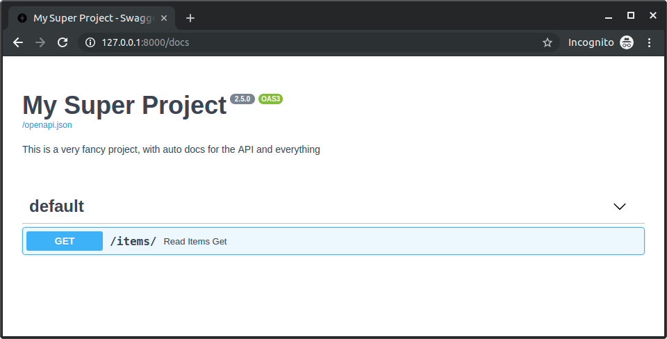

# Fastapi-Metadata-and-Docs-URLs

```python
from fastapi import FastAPI

app = FastAPI(
    title="My Super Project",
    description="This is a very fancy project, with auto docs for the API and everything",
    version="2.5.0",
)

@app.get("/items/")
async def read_items():
    return [{"name": "Foo"}]
```



Строки документации так-же выводятся в [[swagger]]

[Metadata and Docs URLs](https://fastapi.tiangolo.com/tutorial/metadata/). Так же описывается присваивание тегов и урлы для документации.

[[fastapi]]

[//begin]: # "Autogenerated link references for markdown compatibility"
[swagger]: swagger "Swagger"
[fastapi]: ../lists/fastapi "Fastapi"
[//end]: # "Autogenerated link references"