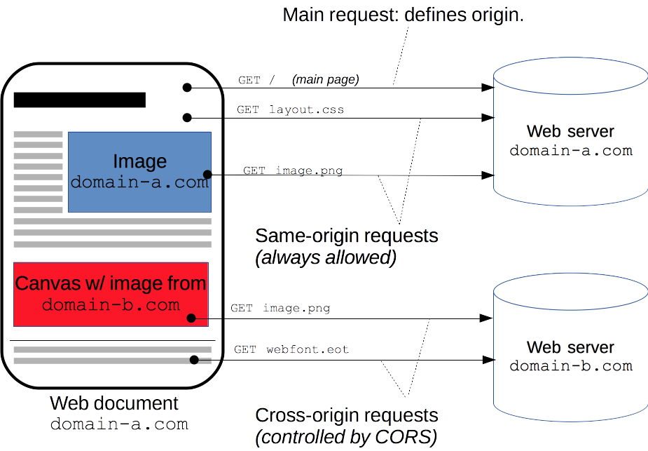

# Http-cors

Cross-Origin Resource Sharing (CORS) — механизм, использующий дополнительные HTTP-заголовки, чтобы дать возможность агенту пользователя получать разрешения на доступ к выбранным ресурсам с сервера на источнике (домене), отличном от того, что сайт использует в данный момент. Говорят, что агент пользователя делает запрос с другого источника (cross-origin HTTP request), если источник текущего документа отличается от запрашиваемого ресурса доменом, протоколом или портом.

Пример cross-origin запроса: HTML страница, обслуживаемая сервером с http://domain-a.com, запрашивает img src по адресу http://domain-b.com/image.jpg. Сегодня многие страницы загружают ресурсы вроде CSS-стилей, изображений и скриптов с разных доменов, соответствующих разным сетям доставки контента (Content delivery networks, CDNs).

В целях безопасности браузеры ограничивают cross-origin запросы, инициируемые скриптами. Например, XMLHttpRequest и Fetch API следуют политике одного источника (same-origin policy). Это значит, что web-приложения, использующие такие API, могут запрашивать HTTP-ресурсы только с того домена, с которого были загружены, пока не будут использованы CORS-заголовки.

Механизм CORS поддерживает кросс-доменные запросы и передачу данных между браузером и web-серверами по защищённому соединению. Современные браузеры используют CORS в API-контейнерах, таких как XMLHttpRequest или Fetch, чтобы снизить риски, присущие запросам с других источников.

CORS используется дляЖ

- Вызова [XMLHttpRequest](https://developer.mozilla.org/ru/docs/Web/API/XMLHttpRequest) или [Fetch](https://developer.mozilla.org/en-US/docs/Web/API/Fetch_API) APIs в кросс-сайт манере, как описано выше.
- [Web Fonts](https://www.w3.org/TR/css-fonts-3/#font-fetching-requirements) (для кросс-доменного использования шрифтов в @font-face в рамках CSS), чтобы серверы могли разворачивать TrueType шрифты, которые могут быть загружены только кросс-сайт и использованы web-сайтами, которым это разрешено.
- [WebGL текстуры](https://developer.mozilla.org/en-US/docs/Web/API/WebGL_API/Tutorial/Using_textures_in_WebGL).
- Фреймы с изображениями/видео, добавленными в канвас с помощью [drawImage](https://developer.mozilla.org/en-US/docs/Web/API/CanvasRenderingContext2D/drawImage).
- Стили (для [CSSOM](https://developer.mozilla.org/en-US/docs/Web/CSS/CSSOM_View) доступа).
- Скрипты (для  отключённых исключений).

Стандарт Cross-Origin Resource Sharing работает с помощью добавления новых HTTP-заголовков, которые позволяют серверам описывать набор источников, которым разрешено читать информацию, запрашиваемую web-браузером. В частности, для методов HTTP-запросов, которые могут привести к побочным эффектам над данными сервера (в частности, для HTTP методов, отличных от GET или для POST запросов, использующих определённые MIME-типы), спецификация требует, чтобы браузеры "предпроверяли" запрос, запрашивая поддерживающие методы с сервера с помощью метода HTTP-запроса OPTIONS и затем, поверх "подтверждения" с сервера, отсылали фактический запрос с фактическим методом HTTP-запроса. Сервера также могут оповещать клиентов должны ли "полномочия" (включая Cookies и HTTP Authentication данные) быть отправлены с запросом.

## Примеры сценариев

### [Простые запросы](https://developer.mozilla.org/ru/docs/Web/HTTP/CORS#%D0%BF%D1%80%D0%BE%D1%81%D1%82%D1%8B%D0%B5_%D0%B7%D0%B0%D0%BF%D1%80%D0%BE%D1%81%D1%8B)

Запрос, для которого не срабатывает CORS preflight— так называемый “простой запросы”—это запрос, удовлетворяющий следующим условиям:

- Допустимые [[http-methods]] для запроса: GET, HEAD, POST
- Кроме [[http-заголовки]], которые автоматические проставляются user-agent'ом (например, Connection, User-Agent (en-US), или любой другой заголовок с именем, определённым в спецификации метода Fetch в секции “Запрещённые имена заголовков (которые нельзя изменить программно)”), допустимыми заголовками, которые могут быть проставлены вручную, являются те заголовки, которые определены спецификацией метода Fetch как “CORS-безопасные заголовки запроса”, такие как:

Accept
Accept-Language
Content-Language
Content-Type (но учитывайте примечание ниже)
Last-Event-ID
DPR
Save-Data
Viewport-Width
Width
Допустимыми значениями заголовка Content-Type являются:
application/x-www-form-urlencoded
multipart/form-data
text/plain

- Не должны быть зарегистрированы обработчики событий на любой объект XMLHttpRequestUpload используемый в запросе; это достигается использованием свойства XMLHttpRequest.upload.
- В запросе не должен использоваться объект типа ReadableStream (en-US).

### [Предварительные запросы](https://developer.mozilla.org/ru/docs/Web/HTTP/CORS#%D0%BF%D1%80%D0%B5%D0%B4%D0%B2%D0%B0%D1%80%D0%B8%D1%82%D0%B5%D0%BB%D1%8C%D0%BD%D1%8B%D0%B5_%D0%B7%D0%B0%D0%BF%D1%80%D0%BE%D1%81%D1%8B)

"Предварительные" запросы сначала отправляют HTTP-запрос методом OPTIONS к ресурсу на другом домене, чтобы определить, является ли фактический запрос безопасным для отправки. Кросс-сайтовые запросы предварительно просматриваются таким образом, так как они могут быть причастны к пользовательским данным.

В частности, запрос предварительно просматривается, если выполняется **любое из следующих условий**:

- Если в запросе используется любой из следующих [[http-methods]]:
  
PUT
DELETE
CONNECT
OPTIONS
TRACE
PATCH

- Или если, кроме заголовков, автоматически устанавливаемых пользовательским агентом (например, Connection, User-Agent (en-US), или любым другим заголовком с именем, определённым в спецификации Fetch как "имя запрещённого заголовка"), запрос включает любые заголовки, отличные от тех, которые спецификация Fetch определяет как "заголовок запроса CORS-безопасный заголовок запроса", а именно:
  
Accept
Accept-Language
Content-Language
Content-Type (но учтите дополнительные требования ниже)
Last-Event-ID
DPR
Save-Data
Viewport-Width
Width
Или если заголовок Content-Type содержит значение, отличное от следующих:
application/x-www-form-urlencoded
multipart/form-data
text/plain

- Или если один или больше обработчиков событий зарегистрированы на объекте XMLHttpRequestUpload, который используется в запросе.
- Или если объект ReadableStream (en-US) используется в запросе.

#### Предварительные запросы и  переадресации

Большинство браузеров в настоящее время не поддерживают следующие переадресации для предварительных запросов. Если переадресация происходит для предварительного запроса, большинство современных браузеров сообщат об ошибке, такой как следующее.

> Запрос был перенаправлен на 'https://example.com/foo', который запрещён для запросов из разных источников, требующих предварительной проверки

> Запрос требует предварительной проверки, которая запрещена для перенаправления между источниками

Протокол CORS изначально требовал такого поведения, но впоследствии был изменён, чтобы больше не требовать его. Однако большинство браузеров ещё не реализовали это изменение и все ещё демонстрируют поведение, которое требовалось изначально.

Поэтому, пока браузеры не догонят спецификацию, вы можете обойти это ограничение, выполнив одно или оба из следующих действий:

- изменить поведение на стороне сервера, чтобы избежать предварительной проверки и/или избежать переадресации — если у вас есть контроль над сервером, к которому делается запрос
- изменить запрос так, чтобы это был простой запрос, который не вызывает предварительную проверку
  
Но если невозможно внести эти изменения, то возможен другой способ:

- Сделайте простой запрос для определения (используя Response.url для Fetch API, или XHR.responseURL, чтобы определить, на каком URL завершится настоящий предварительный запрос).
- Сделайте другой запрос (“настоящий” запрос), используя URL адрес, полученный вами из Response.url или XMLHttpRequest.responseURL на первом этапе.

Однако, если запрос инициирует предварительную проверку из-за наличия в запросе заголовка `Authorization`, вы не сможете обойти ограничение, используя описанные выше шаги. И вы вообще не сможете обойти это, если у вас нет контроля над сервером, на который делается запрос.

### [Запросы с учётными данными](https://developer.mozilla.org/ru/docs/Web/HTTP/CORS#%D0%B7%D0%B0%D0%BF%D1%80%D0%BE%D1%81%D1%8B_%D1%81_%D1%83%D1%87%D1%91%D1%82%D0%BD%D1%8B%D0%BC%D0%B8_%D0%B4%D0%B0%D0%BD%D0%BD%D1%8B%D0%BC%D0%B8)

Наиболее интересная возможность, предоставляемая как XMLHttpRequest, так и Fetch и CORS - это возможность делать "проверенные" запросы, которые осведомлены о файлах HTTP cookie и информации HTTP аутентификации. По умолчанию, в кросс-сайтовых XMLHttpRequest или Fetch вызовах, браузеры не отправляют учётные данные. Конкретный флаг должен быть установлен для объекта XMLHttpRequest или конструктора Request при его вызове.

## [Заголовки HTTP ответов](https://developer.mozilla.org/ru/docs/Web/HTTP/CORS#%D0%B7%D0%B0%D0%B3%D0%BE%D0%BB%D0%BE%D0%B2%D0%BA%D0%B8_http_%D0%BE%D1%82%D0%B2%D0%B5%D1%82%D0%BE%D0%B2)

- `Access-Control-Allow-Origin` определяет либо один источник, что указывает браузеру разрешить этому источнику доступ к ресурсу; либо — для запросов без учётных данных — значение "*", которое говорит браузеру разрешить запросы из любых источников.
- `Access-Control-Expose-Headers`
- `Access-Control-Max-Age`
- `Access-Control-Allow-Credentials`
- `Access-Control-Allow-Methods`
- `Access-Control-Allow-Headers`

## [The HTTP request headers](https://developer.mozilla.org/ru/docs/Web/HTTP/CORS#the_http_request_headers)

- `Origin`
- `Access-Control-Request-Method`
- `Access-Control-Request-Headers`

[Ссылка на статью](https://developer.mozilla.org/ru/docs/Web/HTTP/CORS)

[[http]]

[//begin]: # "Autogenerated link references for markdown compatibility"
[http-methods]: http-methods "Http-methods"
[http-заголовки]: http-заголовки "Http-заголовки"
[http-methods]: http-methods "Http-methods"
[http]: ../lists/http "Http"
[//end]: # "Autogenerated link references"