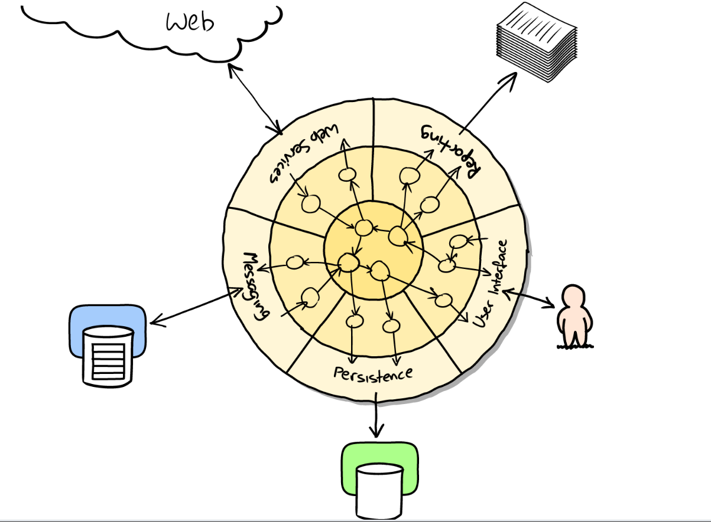

# Интеграционные тесты

Интеграционные или комплексные тесты проверяют, что программный код, которым вы управляете, правильно интегрирован в некую внешнюю систему, которой вы не управляете. Это их отличие от [[изолированные-тесты]]

Интеграционный тест проверяет интеграцию в одну внешнюю систему. [[системные-тесты]] интеграцию с нескольикими.

Интеграционные тесты часто реализуются на уровне [[приемочные-тесты]]. Такие тесты медленные, их стараются выполнять реже, что может приводить к возникновению неожиданных дефектов.

Интеграционные тесты проявляют полезность на гарницах системы. Основная идея - сократить взаимодействие между несвязанными компонентами приложения. Ситема называется [[порты-и-адаптеры]] или чистая или шестиуголная система.

[//begin]: # "Autogenerated link references for markdown compatibility"
[изолированные-тесты]: изолированные-тесты "Изолированные тесты"
[системные-тесты]: системные-тесты "Системные-тесты"
[приемочные-тесты]: приемочные-тесты "Приемочные тесты"
[//end]: # "Autogenerated link references"