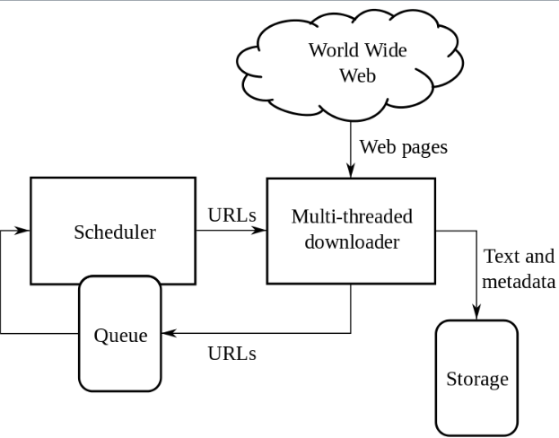
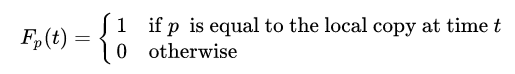
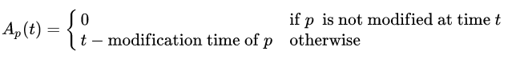
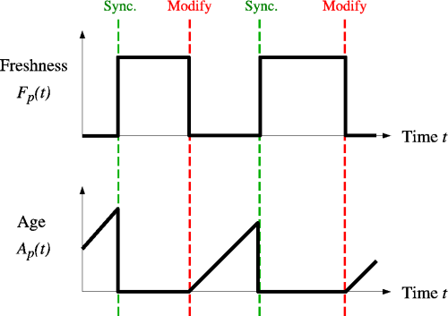

# Crawlers

## Что такое веб-краулеры

Веб-краулер - интернет интернет-бот, который систематически просматривает web и обычно используется поисковыми системами для веб-индексации.

Сканеры могут проверять гиперссылки и HTML - код. Их также можно использовать для парсинга веб - страниц и программирования на основе данных.

Поисковый робот начинает со списка URL-адресов для посещения. Эти первые URL-адреса называются "посевными". Когда сканер посещает эти URL-адреса, он идентифицирует все гиперссылки на извлеченных веб-страницах и добавляет их в список URL-адресов для посещения, называемый "границей сканирования". URL-адреса рекурсивно посещаются в соответствии с набором политик. Если сканер выполняет архивирование веб-сайтов, он копирует и сохраняет информацию по мере ее поступления. Архивы обычно хранятся таким образом, чтобы их можно было просматривать, читать и перемещаться по ним, как если бы они находились в реальном времени в интернете. Страницы сохраняются в виде снапшотов.

Архив известен как репозиторий и предназначен для хранения и управления коллекцией веб-страниц. В репозитории хранятся только HTML-страницы обычно в виде отдельных файлов. Репозиторий похож на любую другую систему хранения данных, например, на современную базу данных. Единственное отличие состоит в том, что репозиторию не нужны все функции, предлагаемые системой баз данных.

Большой объем подразумевает, что сканер может сохранять только ограниченное количество веб-страниц за заданное время, поэтому ему необходимо расставить приоритеты при загрузке.

Количество возможных просканированных URL-адресов, генерируемых серверным программным обеспечением, также затрудняет поиск дублирующегося контента для поисковых роботов. Существуют бесконечные комбинации параметров на основе URL-адреса, из которых только небольшой выбор действительно возвращает уникальный контент. Например, простая онлайн-галерея фотографий может существовавть четыре способа сортировки изображений, три варианта размера эскизов, два формата файлов и возможность отключить пользовательский контент, поэтому к одному и тому же набору контента можно получить доступ с 48 различных URL-адресов. Эта математическая комбинация создает проблему для поисковых роботов, поскольку они должны сортировать бесконечные комбинации относительно незначительных изменений, чтобы получить уникальный контент. Поисковый робот должен тщательно выбирать на каждом шагу, какие страницы посещать дальше.

## Политики

Поведение поискового робота является результатом комбинации политик:

- политика выбора, в которой указаны страницы для загрузки
- политика повторного посещения, в которой указано, когда следует проверять наличие изменений на страницах
- политика вежливости, указывающая, как избежать перегрузки веб-сайтов
- политика параллелизма, в которой указано, как координировать распределенные поисковые роботы.

### Политика отбора

Необходима метрика важоности страницы, зависящая от внутреннего качества, популярности с точки зрения ссылок и посещения, а так-же url-адреса. Политика должна работать с частисной информацией, так-как полный набор веб-страниц во время обхода неизщвестен.

К методам формирования политики относится:

- ограничение перехода по ссылкам (игнорирование определенных тоипов MIME или адресов с определенным содержанием)
- нормализация url
- сканирвоание по восходящему пути
- [целенаправленное сканирование](https://en.wikipedia.org/wiki/Focused_crawler)

### Политика повторного посещения

Определяет посещение страниц с учетом вероятности их измененеия. Рассматривают два критерия, определяющих политики провторного посещения:

- Freshness - это мера, которая указывает, является ли локальная копия точной или нет
- Age - это мера, показывающая, насколько устарела локальная копия

Свежесть страницы p в репозитории в момент времени t определяется как:

Возраст страницы p в репозитории в момент времени t определяется как:

Аналогом "свежести" явлется другая цель - минимизация доли времени, в течение которого страницы остаются устаревшими. Проблему веб-сканирования можно смоделировать как систему опроса с несколькими очередями и одним сервером, в которой веб-сканер является сервером, а веб-сайты — очередями. [Подробнее](https://onlinelibrary.wiley.com/doi/10.1002/(SICI)1099-1425(199806)1:1%3C15::AID-JOS3%3E3.0.CO;2-K)

Задача краулера — поддерживать как можно более высокую среднюю свежесть страниц в своей коллекции или поддерживать как можно более низкий средний возраст страниц. Эти цели не равнозначны: в первом случае краулера просто интересует, сколько страниц устарело, а во втором случае краулер интересует, какой возраст у локальных копий страниц.

Наиболее простые стратегии выглядят так:

- Единая политика предполагает повторное посещение всех страниц в коллекции с одинаковой частотой, независимо от скорости их изменения
- Gропорциональная политика - предполагает более частое повторное посещение страниц, которые меняются чаще. Частота посещений прямо пропорциональна (оценочной) частоте изменений

В обоих случаях повторный порядок сканирования страниц может выполняться либо в случайном, либо в фиксированном порядке. C точки зрения средней свежести единая политика превосходит пропорциональную политику как в симуляции, так и в реальном веб-сканировании. Интуитивно причина заключается в том, что, поскольку у поисковых роботов есть ограничение на количество страниц, которые они могут просканировать за заданный период времени, они будут выделять слишком много новых обходов для быстро меняющихся страниц за счет менее часто обновляемых страниц, и свежесть быстро меняющихся страниц сохраняется в течение более короткого периода, чем свежесть менее часто меняющихся страниц.

Требуется взвешенный подход - краулер должен "наказывать" слишком быстро обновляемые страницы. Оптимальный метод поддержания высокой средней свежести включает игнорирование страниц, которые меняются слишком часто, а оптимальный способ поддержания низкого среднего возраста — использование частот доступа, которые монотонно (и сублинейно) увеличиваются со скоростью изменения каждой страницы. В обоих случаях оптимум ближе к единообразной политике, чем к пропорциональной.

### Политика вежливости

Работа крайлера оказывает негативное влияние на производительность ресурса из-за потенциальной загрузки цП и диска. Использование протокла `robots.txt` устанавливает лимиты для "добропорядочных" пауков.

Неофициальные данные из журналов доступа показывают, что интервалы доступа от известных поисковых роботов варьируются от 20 секунд до 3–4 минут. Стандартом считается выбор интервала в 10-15с после ответа на последний запрос.

### Политика параллелизма

[Распараллеливание процессов](https://en.wikipedia.org/wiki/Distributed_web_crawling) - обычная практика при обходе страниц в сети, так как общее время обхода в рамках одного процесса может создавать неприемлемый горизонт.

## Идентификация сканера

Веб-сканеры обычно идентифицируют себя для веб-сервера, используя поле `User-agent` в HTTP - запросе. Администраторы веб-сайтов обычно просматривают журнал своих веб-серверов и используют поле пользовательского агента, чтобы определить, какие поисковые роботы посещали веб-сервер и как часто. Поле пользовательского агента может включать URL-адрес, по которому администратор веб-сайта может найти дополнительную информацию об искателе. Изучение журнала веб-сервера — утомительная задача, поэтому некоторые администраторы используют инструменты для идентификации, отслеживания и проверки поисковых роботов. Спам-боты и другие вредоносные поисковые роботы вряд ли помещают идентифицирующую информацию в поле пользовательского агента или могут маскировать свою личность под браузер или другой известный поисковый робот.

Администраторы веб-сайтов предпочитают, чтобы поисковые роботы идентифицировали себя, чтобы при необходимости они могли связаться с владельцем. В некоторых случаях сканеры могут случайно попасть в ловушку для сканеров или могут перегружать веб-сервер запросами, и владельцу необходимо остановить сканер. Идентификация также полезна для администраторов, которым интересно знать, когда их веб-страницы могут быть проиндексированы той или иной поисковой системой .

### Sitemaps.xml

Используется для предоставлению доступа к страницам, к которым сложно добраться в результате обхода.

[Оригинал статьи в вики](https://en.wikipedia.org/wiki/Web_crawler)

## Все заметки в этой тематике

- [[scrapy]]
- [[playwright]]
- [[splash]]
- [[selenium]]
- [[xpath]]
- [[css-selectors]]
- [[BeautifulSoup]]
- [[urllibparse]]

Дополнительно:

- [[2022-01-04-daily-note]] использование proxy в selenium
- [[2022-02-04-daily-note]] про вебдрайверы в [[selenium]]
- [Web Scraping with Selenium in Python](https://www.zenrows.com/blog/web-scraping-with-selenium-in-python#getting-started)
- [про обход блокировок при скрапинге](https://www.zenrows.com/blog/stealth-web-scraping-in-python-avoid-blocking-like-a-ninja#behavioral-patterns)

Пакеты и либы:

- [ultimate-sitemap-parser](https://github.com/mediacloud/ultimate-sitemap-parser)

- [Scrapyd - an application for deploying and running Scrapy spiders](https://scrapyd.readthedocs.io/en/stable/index.html)
- [Gerapy](https://docs.gerapy.com/en/latest/) - деплоер для [[scrapy]], реализует деплой пауков, таскменеджмент и админку
- [scrapy-silenium](https://github.com/clemfromspace/scrapy-selenium) [[selenium]] в качестве мидлвейра для [[scrapy]]
- [scrapy-playwright](https://github.com/scrapy-plugins/scrapy-playwright) Playwright integration for Scrapy
- [scrapy-rotating-proxies](https://github.com/TeamHG-Memex/scrapy-rotating-proxies) This package provides a Scrapy middleware to use rotating proxies, check that they are alive and adjust crawling speed.
- [Scrapy Cluster](https://scrapy-cluster.readthedocs.io/en/latest/index.html) Scrapy based distributed crawling project, Scrapy Cluster.

- [selenium-wire](https://github.com/wkeeling/selenium-wire) extends Selenium's Python bindings to give you access to the underlying requests made by the browser. You author your code in the same way as you do with Selenium, but you get extra APIs for inspecting requests and responses and making changes to them on the fly
- [docker-selenium](https://github.com/SeleniumHQ/docker-selenium) Docker images for the Selenium Grid Server

- [detectem](https://github.com/alertot/detectem) specialized software web detector (command line tool)
- [builtwith](https://github.com/richardpenman/builtwith) info about web-source engines [look at solution of problem with long waiting](https://github.com/varnitsingh/builtwith/commit/aa23671d968f5ad0e64a059a30b5ebb9bdbaa56f)

- [playwright](https://playwright.dev/python/docs/intro) enables reliable end-to-end testing for modern web apps

- [grequests](https://github.com/spyoungtech/grequests) GRequests allows you to use Requests with Gevent to make asynchronous HTTP Requests easily.
- [requests-futures](https://github.com/ross/requests-futures) Asynchronous Python HTTP Requests for Human
- [requests-threads](https://github.com/requests/requests-threads) This repo contains a Requests session that returns the amazing Twisted's awaitable Deferreds instead of Response objects

- [autoscraper](https://github.com/alirezamika/autoscraper) A Smart, Automatic, Fast and Lightweight Web Scraper for Python
- [dude](https://github.com/roniemartinez/dude) Dude is a very simple framework for writing a web scraper using Python decorators. The design, inspired by Flask, was to easily build a web scraper in just a few lines of code. Dude has an easy-to-learn syntax.
- [Splash - A javascript rendering service](https://splash.readthedocs.io/en/stable/)
- [portia](https://github.com/scrapinghub/portia) crawler with ui interface
- [requests-html](https://github.com/psf/requests-html) This library intends to make parsing HTML (e.g. scraping the web) as simple and intuitive as possible

- [Robot Framework](https://robotframework.org/) is a generic open source automation framework. It can be used for test automation and robotic process automation (RPA).

Небольшая проблема с requests-html



[//begin]: # "Autogenerated link references for markdown compatibility"
[scrapy]: ../notes/scrapy "Scrapy"
[playwright]: ../notes/playwright "Playwright"
[splash]: ../notes/splash "Splash"
[selenium]: ../notes/selenium "Selenium"
[xpath]: ../notes/xpath "XPath в scrapy"
[css-selectors]: ../notes/css-selectors "Css-selectors"
[BeautifulSoup]: ../notes/beautifulsoup "BeautifulSoup"
[urllibparse]: ../notes/urllibparse "Urllib.parse - парсинг урлов в компоненты"
[2022-01-04-daily-note]: ../posts/2022-01-04-daily-note "Proxy в selenium, запуск локального smtp и несколько вопросов про pandas"
[2022-02-04-daily-note]: ../posts/2022-02-04-daily-note "Работа в selenium с firefox"
[selenium]: ../notes/selenium "Selenium"
[scrapy]: ../notes/scrapy "Scrapy"
[selenium]: ../notes/selenium "Selenium"
[scrapy]: ../notes/scrapy "Scrapy"
[//end]: # "Autogenerated link references"
[//begin]: # "Autogenerated link references for markdown compatibility"
[scrapy]: ../notes/scrapy "Scrapy"
[playwright]: ../notes/playwright "Playwright"
[splash]: ../notes/splash "Splash"
[selenium]: ../notes/selenium "Selenium"
[xpath]: ../notes/xpath "XPath в scrapy"
[css-selectors]: ../notes/css-selectors "Css-selectors"
[BeautifulSoup]: ../notes/beautifulsoup "BeautifulSoup"
[urllibparse]: ../notes/urllibparse "Urllib.parse - парсинг урлов в компоненты"
[2022-01-04-daily-note]: ../posts/2022-01-04-daily-note "Proxy в selenium, запуск локального smtp и несколько вопросов про pandas"
[2022-02-04-daily-note]: ../posts/2022-02-04-daily-note "Работа в selenium с firefox"
[selenium]: ../notes/selenium "Selenium"
[scrapy]: ../notes/scrapy "Scrapy"
[selenium]: ../notes/selenium "Selenium"
[scrapy]: ../notes/scrapy "Scrapy"
[//end]: # "Autogenerated link references"