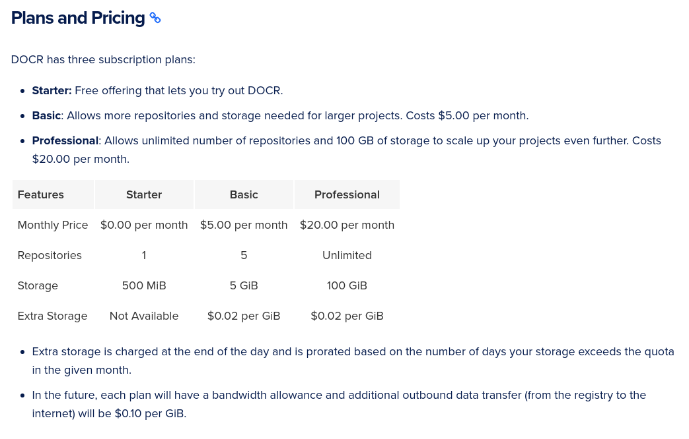
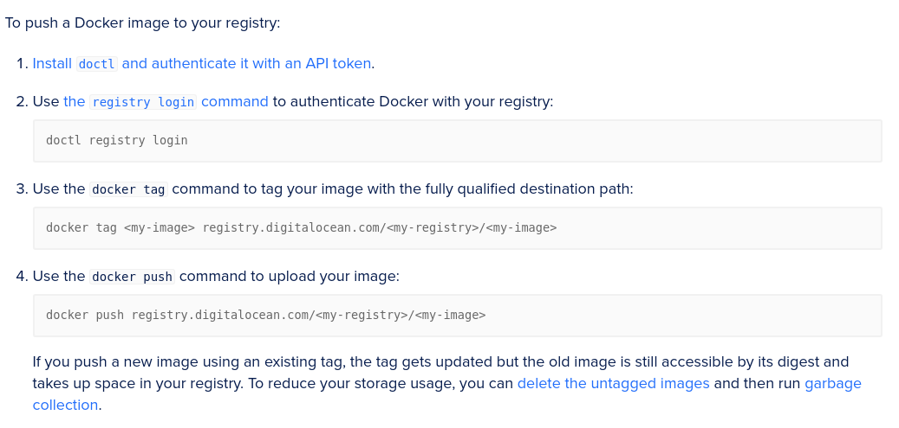

# Digital-ocean

[Установка node.js и npm на digital ocean](https://www.digitalocean.com/community/tutorials/how-to-install-node-js-on-ubuntu-20-04-ru)

[Прайсы](https://www.digitalocean.com/pricing)

## Digital-ocean container registry

Для регистра [[docker]] контейнеров. [Страница на DG](https://www.digitalocean.com/products/container-registry/)

[Прайс](https://docs.digitalocean.com/products/container-registry/#plans-and-pricing)



**Лимиты:**

- Each DigitalOcean account can only create one registry, although a registry may contain multiple repositories.
- Registry names must be globally unique and not collide with the registry names of other users.
- Untagged images are not displayed in the control panel. However, you can delete untagged manifests using doctl and free up space in your registry.
- Manifest lists (for example, multi-arch images) are supported but may not display correctly in the control panel.

The name of a registry must:

- Be unique across all DigitalOcean container registries
- Be no more than 63 characters in length
- Contain only lowercase letters, numbers, and/or hyphens
- Begin with a letter
- End with a letter or number

Чтобы работать с регистром, надо поставить [[digital-ocean-doctl]]

[DigitalOcean Container Registry Quickstart](https://docs.digitalocean.com/products/container-registry/quickstart/)

 1. Create a Registry
 2. Push to Your Registry



3. [Use Images in Your Registry with Docker or Kubernetes](https://docs.digitalocean.com/products/container-registry/how-to/use-registry-docker-kubernetes/)
4. Use Images in Your Registry with [App Platform](https://cloud.digitalocean.com/apps)
5. Manage Images
6. Delete Your Registry

[How to Use Garbage Collection to Free Up Space in Your Container Registry](https://docs.digitalocean.com/products/container-registry/how-to/clean-up-container-registry/)

[How to Use CI/CD Systems with Your Container Registry](https://docs.digitalocean.com/products/container-registry/how-to/set-up-ci-cd/)

Можно [деплоить из контейнера](https://docs.digitalocean.com/products/app-platform/how-to/deploy-from-registry/) с помощью UI AppPlatform.

## Как пушить контейнер через [[github-action]] в digital-ocean containeer registry

[статья](https://wttech.blog/blog/2021/how-to-push-docker-image-to-digitalocean-container-registry-using-github-actions/)

Вкратце:

- собираем [[docker]] image
- собираем Workflow в [[github-action]]
- реализуем интеграцию github-DG

Пример workflow

```yml
name: Build and publish manually

on:
  workflow_dispatch:
    inputs:
      version:
        description: 'Image version'
        required: true

jobs:
  build_and_push:
    runs-on: ubuntu-latest
    steps:
      - name: Checkout the repo 
        uses: actions/checkout@v2
      - name: Build image 
        run: docker build -t sample/my-page .
      - name: Install doctl 
        uses: digitalocean/action-doctl@v2
        with:
          token: ${{ secrets.DIGITALOCEAN_ACCESS_TOKEN }}
      - name: Log in to DO Container Registry 
        run: doctl registry login --expiry-seconds 600
      - name: Tag image 
        run:
          docker tag sample/my-page \
          registry.digitalocean.com/my-sample-registry/my-sample-page:${{github.event.inputs.version }}
      - name: Push image to DO Container Registry 
        run: docker push registry.digitalocean.com/my-sample-registry/my-sample-page:${{ github.event.inputs.version }}
```

- Checkout the repo - nothing more nothing less than cloning repository to a worker that will execute the job.
- Build image - you guessed again, just a simple docker build.
- Install doctl - things are finally getting interesting. In order to push an image to the DigitalOcean registry, you will need a CLI for the DigitalOcean API - and there is one called doctl. The same is true for the workflow you are building here. Fortunately, we have a nice action for that - digitalocean/action-doctl@v2. Notice that the token used in this step comes from the GitHub Secrets (we will talk about it in a moment).
- Now, our job needs to log in to the DigitalOcean container registry to be able to push the image in the following steps.
- You need to tag the image with the proper registry, repository, and image name. In this example, we use the input parameter to tag a freshly built image with a version number (the command is split into 2 lines for better readability).
- Finally, the image is pushed to the repository.

Установка [[docker]] описана в [[digital-ocean-docker-install]]

Работа с базами данных описана в [[digital-ocean-databases]]

[//begin]: # "Autogenerated link references for markdown compatibility"
[docker]: ../notes/docker "Docker"
[digital-ocean-doctl]: ../notes/digital-ocean-doctl "Digital ocean doctl"
[github-action]: ../notes/github-action "Githunb action"
[docker]: ../notes/docker "Docker"
[github-action]: ../notes/github-action "Githunb action"
[docker]: ../notes/docker "Docker"
[digital-ocean-docker-install]: ../notes/digital-ocean-docker-install "Digital ocean docker install"
[digital-ocean-databases]: ../notes/digital-ocean-databases "Digital ocean databases"
[//end]: # "Autogenerated link references"