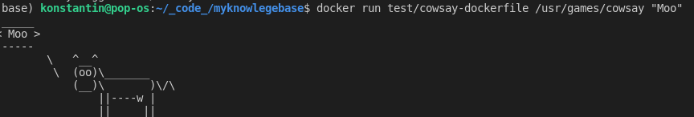
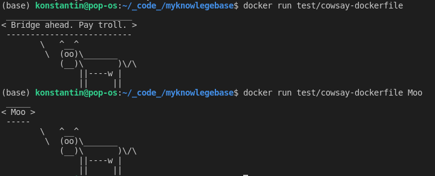

## Начало работы

`docker version`

`docker run debian echo 'hello world'`

В данном случае запускается образ debian (если его нет, он будет загружен с докерхаба) - упрощенный дестрибутив линукс. После загрузки и проверки образа он помещается в контейнер. Затем выполняется echo.

Запуск баша внутри контейнера: `docker run -i -t debian /bin/bash` (не заработал ui в vscode - видимо надо погуглить баг)

Зададим имя хоста: `docker run -h CONTAINER -i -t debian /bin/bash` а вот так заработал

Инфа по конкретному контейнеру: `docker inspect short_pseudonime`

Более короткий вывод через grep, например ip: `docker inspect short_pseudonime | grep IPAddress`

Или через `--format`: docker inspect --format `{``{`.NetworkSettings.IPAddress`}``}` short_pseudonime

Список файлов, которые были измсененеы в работающем контейнере: `docker diff short_pseudonime`

Список всех событий, произошедших внутри контейнера: `docker logs short_pseudonime`

Остановить контейнера: `exit`

Удаление всех остановленных контейнеров: `docker rm -v $(docker ps -aq -f status=exited)`

Удалить отдельный контейнер очень просто `docker rm short_pseudonime`

Проще всего вести раборту с докером через Dockerfile - это простой текстовый файл, в котором прописан скрипт, который будет выполнен при создании нового образа. Т.е. вначале мы создаем контейнер, а затем из него новый образ. Например такой докерфайл:

```Dockerfile
FROM debian
RUN apt-get update && apt-get install -y cowsay fortune
```

Инструкция FROM определяет базовый образ ОС - эта инструкция строго обязательна. RUN определяет команды, выполняемые в оболочке.

Теперь можно создавать образ с помощью `docker build` с помощью Dockerfile: `docker build -t test/cowsay-dockerfile`. Аналогично эту процедуру можно реализовать через run, команды в шеле внутри контейнера и docker commit.

Теперь можно запускать образ так-же, как и любой другой образ.

`docker run test/cowsay-dockerfile /usr/games/cowsay "Moo"`



Все доп.команды, которые мы используем для запуска контейнера можно добавить в докерфайл - тогда они станут исполняться при запуске контейнера. При изменеении докерфайла требуется пересоздание образа.

```Dockerfile
FROM debian
RUN apt-get update && apt-get install -y cowsay fortune

ENTRYPOINT ["/usr/games/cowsay"]
```

`docker build -t test/cowsay-dockerfile`

Теперь входим так:

`docker run test/cowsay-dockerfile "Moo"`

Если создать рядом с докерфайлом entrypoint.sh, то можно получить некие исполняемые скрипты, в данном случае - доступ к потоку ввода/вывода. Теперь мы можем заменить и ентрипоинт (не забудь выдать права файлу entrypoint.sh. как исполняемому)

```Dockerfile
FROM debian
RUN apt-get update && apt-get install -y cowsay fortune
COPY entrypoint.sh /

ENTRYPOINT ["/entrypoint.sh"]
```

```sh
#!/bin/bash
if [ $# -eq 0 ]; then
        /usr/games/fortune | /usr/games/cowsay
    else
        /usr/games/cowsay "$@"
fi
```

Инструкция COPY прост окопирует файл из файловой системы хоста в файловую систему образа. Первый аргумент - файл хоста, второй - путь в образе.



Работа с репозиториями образов ведется с помощью build, pull, push

## Архитектура docker

- Docker daemon - создание, запуск и контроль контейнеров, создание и хранение образов
  клиет docker используется для диалога с демоном по протоколу http. По умолчанию соединение устанавливается через сокет домена unix, но овзможны и другие. С демоном можно взаимодействовать напрямую, без использования клиента docker
- реестры docker используются для хранения и распространения образов

Сопровождающие технологии:

- docker swarm - решение задачи кластеризации, позволяет сгруппировать несколько docker-хостов
- docker compose - создание и выполнение приложений, скомпонованных из нескольких контейнеров. В основном нужно для теста и разработки, реже на проде.
- docker machine - устанавливает и конфигурирует хосты на локальных и удаленных машинах
- kinematic - гиу ждя маков и win
- docker trusted registry - локальное хранилище образов (локальный docker hub)

## Создание образов

Для создания образа требуется Dockerfile и контекст создания образа (build context). Контекст - это набор локальных папок и файлов, к которым можно обращаться из инструкции ADD и COPY Dockerfile и который обвчно определяется как путь к нужному каталогу. К примеру `docker bild -t test/cowsay=dockerfile .` определят контекст как `.`, т.е. текущий рабочий каталог. Все файлы и каталоги в этом пути формируют контекст создания образа и передаются в демон Docker как часть процесса создания. В случаях, когда контекст не определен, он считается пустым.

`/` не следует использовать в качестве контекста, т.к. все будет включено в образ :)

В качестве контекста допускается использовать git-репозиторий. В этом случае делается клон репоизитория и всех подчиненных репозиториев во временный каталог, который затем передается в демон как контекст.

Кроме того, контекст можно получить из стандартного потока ввода STDN

Для удаления ненужных файлов используется `.dockerignore`

При создании образа используются уровни - каждая инструкция в Dockerfile приводит к появлению такого уровня, который так же может участвовать в запуске контейнера. Новый уровень создается по время запуска контейнера с использованием образа предыдущего уровня, с сохранением нового образа. После успешного выполнения инструкции Dockerfile, вспомогательный контейнер удаляется, все активные процессы завершаются. Если необходим сервис или процесс, который юудет жить дольше, его необходимо инициализировать с помощью ENTRYPOINT или CMD. Весь набор уровней можно увидеть через `docker history`. При неудачном создании образа полезно запустить уровень, предыдущий ошибке.

Кроме того, используется кэширование для оптимизации производительности. Кэширование можно запрещать, так как не гарантируется получение одинакового результата для ряда команд.

При создании собственного образа необходимо использовать один из базовых образов.

`docker build` собирает образ, вызывая базовый сначала локально. Если его нет - удаленно. Это означает, что самая новая версия не гарантируется - необходимо явно выполнить `docker pull` для родительских образов или удалить их.

## Инструкции Dockerfile

Допускается использование формата командной оболочики или exec в инструкциях RUN, CMD, ENTRYPOINT

- ADD - копирует файлы из контекста или по удаленным урлам в образ. Если архивный файл добавляется из локального пути, то он распаковывается.
- CMD - запускает заданную инструкцию во время инициализации контейнера. Если определен ENTRYPOINT, то инструкция будет интерпретирована как аргумент для entrypoint. Инструкция заменяется тем, что введено в командной строке... если указано несколько инструкций, будет выполнена только самая последняя.
- COPY - копирует файлы из контекста в образ
- ENTRYPOINT - определяет выполняемый файл. запускаемый при инициализации контейнера
- ENV - определяет переменныесреды внутри образа. На них можно ссылаться в инструкциях
- EXPOSE - задает прослшивание портов в контейнере - это нужно для установления соединения между контейнерами
- FROM - определяет основной(базовый) образ. Все последующие инструцкции выполняются поверх. Задается в формате IMAGE:TAG, если нет тега, ставится latest. **Рекомендуется явно указывать тег**.
- ONBUILD - определяет инструкцию, которая будет выполняться, если этот образ будет использоваться как основной уровень для другого образа
- RUN - запускает инструкцию внутри контейнера и сохраняет результата
- USER - юзер
- VOLUME - объявляет файл или какталог как том
- WORKDIR  - рабочий каталог для всех последующих инструкций Dockerfile

## Открытие портов контейнера

Чтобы докер-контейнер мог связаться с внешним миром, надо открыть нужные порты с помощью аргументов `-p` или `-P`

`docker run -d -p 8000:80 nginx`

В данном случае, мы сообщили демону, что нужно перенаправить порт 8000 хоста на порт 80 в контейнере. Когда используется `-P` порт будет выбран автоматически для перенаправления с хостав контейнер

`ID=$(docker run -d -P nginx)`
`docker port $ID 80`

Полученный порт будет выглядеть к примеру так: `0.0.0.0.32771`.

Вариант `-P` предпочтителен, т.к. таким образом устанавливается дополнительный уровень ответственности за корректное назначение портов.

## Соединение между контейнерами

Для связи между контейнерами можно использовать:

- внутреннюю сеть docker-а
- «связи» (links) между контейнерами
- начиная с версии 1.9 — docker networks

### внутренняя сеть

Наименее гибкое решение. При каждом перезапуске/пересоздании контейнер может получить другой внутренний адрес, соответственно, каждый раз может требоваться ручная корректировка связи имён и ip-адресов.

### docker links

При создании (create) или запуске (run) контейнера можно указывать имя другого контейнера и имя, под которым тот будет доступен в новом контейнере:

`docker run --link другой_контейнер:имя ...`

благодаря этому в /etc/hosts создаваемого контейнера будет добавлена строчка примерно такого содержания:

`ip-адрес-другого-контейнера имя` что позволит по данному имени обращаться к слинкованному контейнеру.

### docker networks

Наиболее гибкое решение, но доступно только начианая с версии 1.9.

Сначала с помощью команды `network create` надо описать сеть:

`docker network create имя-сети` а затем при создании/запуске контейнеров указывать, что они должны быть «подключены» к этой сети под указанным именем. пример:

`docker run --net=имя-сети --name=имя-контейнера ...` все контейнеры, подключенные к одной сети, будут «видеть» друг друга по присвоенным им именам.

### dns

ip-адреса nameserver-ов можно устанавливать для контейнера при его создании/запуске с помощью опции --dns:

`docker run --dns ip-адрес ...`

## Тома и контейненры данных

Тома (volumes) - это каталоги и файцлы, которые не являются части файловой системы UnionFS конкретного контейнера, а представляют собой обычные каталоги в файловой системе хоста, но могут быть смонтированы как отдкльные файловые системы (bind mounting) внутри контейнера.

Тома можно:

- объявить флагом `-v` при запуске контейнера
- объявить том инструкцией VOLUME (результат аналогичен предыдущему)
- расширить аргумент `-v` явным указанием связываемого каталога хоста в формате `-v HOST_DIR:CONTAINER_DIR`. Этот способ нельзя заюзать в Dockerfile т.к. это нарушает принцип переносимости и создает угрозу безопасности
Контейнер данных - это контейнер, единственная цель которого заключается в совместном использовании данных другими контейнерами. Обычно для контейнера данных нет необходимости в использовании минималистичных образов - просто используйте тот же образ, что и для контейнеров, работающих с данными.

Удаление томов происходит только если:

- контейнер удален командой `docker rm -v`
- в команду `docker rm` вклчюен флаг `--rm`

А так-же если соблюдены условия:

- отсутствуют контейнеры, установившие связь с удаляемым томом
- удаляемому тому не соответствует какой-либо каталог файловой системы хоста

Это значит, что особенно внимательно надо создавать контейнеры со связанными томами, т.к. с большой вероятностью рабочий каталог Docker будет содержать потерянные файлы и каталоги (сироты) и что именно они из себя представляют - определить сложно.

## Часто используемые команды Docker

- `docker run` запуск контейнера
- `docker create` создание контейнера из образа без запуска
- `docker kill` немедленное завершение работы контейнера
- `docker pause` приостановка процессов контейнера. Процессы не получают никаких сигналов, поэтому не могут быть удалены, приостановлены или возобновлены
- `docker pause` перезапуска запаузеного контейнера
- `docker reatart` перезапускает один или несколько контейнеров
- `docker rm` удаляет один или несколько контейнеров
- `docker start` запускает застопленные контейнеры
- `docker stop` останавливает, но не удаляет контейнеры

- `docker info` Инфа о системе и хосте
- `docker help` выводлит справку
- `docker version`
- `docker logs --help` выводит значение флагов по умолчанию для команды

- `docker diff` - измененеия в файловой системе контейнера по сравнению с образом
- `docker events` события в реальном времени от демона к демону
- `docker inspect` подробная инфа о контейнерах или образах
- `docker logs` журнал для контейнера
- `docker port` список отображений открытых портов для контейнера
- `docker ps` общая инфа о работающих контейнерах
- `docker top` инфа о процессах внутри контейнера

- `docker build` создать образ из Dockerfile
- `docker commit` создает образ из заданного контейнера. Контейнеры приостанавливаются перед созданием образа (по умолчанию)
- `docker export` экспортирует содержимое файловой системы контейнера в виде tar-архива. Метаданные не экспортируются
- `docker history` инфа о каждом уровне в образе.
- `docker images` список локальных образов
- `docker rmi $(docker images -q -f dangling=true)` удалит все "висячие образы"
- `docker import` создание образа из архивного файла без метаданных
- `docker load` создание из архива с метаданными
- `docker rmi` Удаление
- `docker save` сохранение образа в архив с метаданными
- `docker tag` связывает имя репозитория и образа с выбранным тегом

- `docker login` регистрация и вход на заданный сервер реестра
- `docker logout`
- `docker pull` загрузка образа из реестра
- `docker push`
- `docker search`

Смотри еще:

- [[docker-solutions]] вопросы и решеиня по докеру
- [[traefik]]
- [[docker-bind-mound]]
- [[docker-compose]]
- [[docker-compose-file-reference]]
- [[dockerfile-learn]]
- [[docker-compose-with-gcloud-authentication]]
- [[docker-swarm-rocks]]
- [[docker-swarm]]
- [[terraform]]
- [[2021-08-27-daily-note]] Как добавить контейнеры на Digital Ocean registry с помощью docker-compose
- [[docker-tags]]
- [[docker-shutdown-services]]
- [[docker-swarm-restart-containeers]]
- [[docker-networks]]
- [[clean-docker-restart-instance]]
- [[jina]]


[docker-solutions]: ../notes/docker-solutions "docker solutions"
[traefik]: ../notes/traefik "Traefik"
[docker-bind-mound]: ../notes/docker-bind-mound "Docker bind mount"
[docker-compose]: ../notes/docker-compose "Docker compose"
[docker-compose-file-reference]: ../notes/docker-compose-file-reference "Docker compose file reference"
[dockerfile-learn]: ../notes/dockerfile-learn "Dockerfile"
[docker-compose-with-gcloud-authentication]: ../notes/docker-compose-with-gcloud-authentication "Docker compose with gcloud authentication"
[docker-swarm-rocks]: ../notes/docker-swarm-rocks "Docker swarm rocks"
[docker-swarm]: ../notes/docker-swarm "Docker swarm"
[terraform]: ../notes/terraform "Terraform"
[2021-08-27-daily-note]: ../posts/2021-08-27-daily-note "Как добавить контейнеры на Digital Ocean registry с помощью docker-compose"
[docker-tags]: ../notes/docker-tags "Теги в docker"
[docker-shutdown-services]: ../notes/docker-shutdown-services "Docker shutdown services"
[docker-swarm-restart-containeers]: ../notes/docker-swarm-restart-containeers "Docker swarm restart services"
[docker-networks]: ../notes/docker-networks "Docker networks"
[clean-docker-restart-instance]: ../notes/clean-docker-restart-instance "How to do clean docker restsrt instance"
[jina]: ../notes/jina "Jina"
