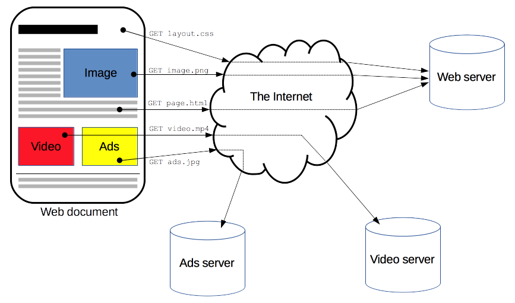
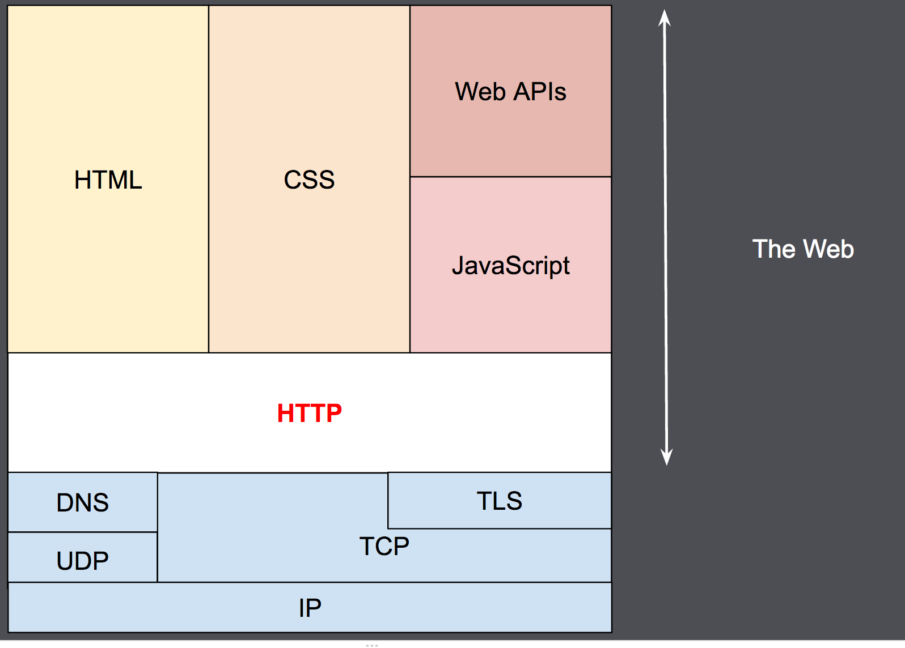
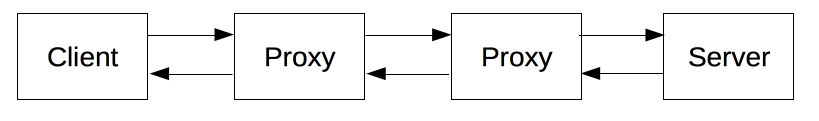
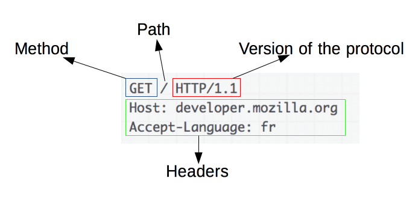
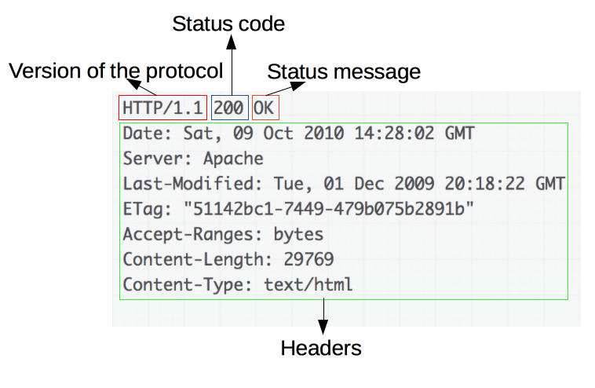

[Основной материал](https://developer.mozilla.org/ru/docs/Web/HTTP)

Протокол передачи гипертекста (Hypertext Transfer Protocol - HTTP) - это прикладной протокол для передачи гипертекстовых документов, таких как HTML. Он создан для связи между веб-браузерами и веб-серверами, хотя в принципе HTTP может использоваться и для других целей. Протокол следует классической клиент-серверной модели, когда клиент открывает соединение для создания запроса, а затем ждёт ответа. HTTP - это протокол без сохранения состояния, то есть сервер не сохраняет никаких данных (состояние) между двумя парами "запрос-ответ". Несмотря на то, что HTTP основан на TCP/IP, он также может использовать любой другой протокол транспортного уровня с гарантированной доставкой.

**HTTP не зависит от соединения** Клиент HTTP (чаще всего, браузер), отправляет HTTP запрос и, после отправки запроса, отсоединяется от сервера и ждёт ответа. Сервер обрабатывает запрос и создаёт новое соединение с клиентом для отправки ответа.

**HTTP не привязан к конкретному типу данных**Это означает, что с помощью HTTP мы можем передавать любой тип данных, при условии, что и клиент и сервер “умеют” работать с данным типом данных. Сервер и клиент должны определить тип контента с помощью определённого типа MIME.

**HTTP взаимодействует только через соединение** Клиент и сервер могут взаимодействовать друг с другом только с помощью запроса. После этого они “забывают” друг о друге. Из-за этой особенности протокола ни клиент, ни сервер не могут получить информацию “за пределами” запроса.

HTTP/1.0 использует соединение для каждого цикла “запрос/ответ”.

HTTP/1.1 может использовать один или несколько циклов “запрос-ответ” внутри одного соединения.

HTTP является протоколом клиент-серверного взаимодействия, что означает инициирование запросов к серверу самим получателем, обычно веб-браузером (web-browser). Полученный итоговый документ будет (может) состоять из различных поддокументов являющихся частью итогового документа: например, из отдельно полученного текста, описания структуры документа, изображений, видео-файлов, скриптов и многого другого.



Клиенты и серверы взаимодействуют, обмениваясь одиночными сообщениями (а не потоком данных). Сообщения, отправленные клиентом, обычно веб-браузером, называются запросами, а сообщения, отправленные сервером, называются ответами.



HTTP является протоколом прикладного уровня, который чаще всего использует возможности другого протокола - TCP (или TLS - защищённый TCP) - для пересылки своих сообщений, однако любой другой надёжный транспортный протокол теоретически может быть использован для доставки таких сообщений. Благодаря своей расширяемости, он используется не только для получения клиентом гипертекстовых документов, изображений и видео, но и для передачи содержимого серверам, например, с помощью HTML-форм. HTTP также может быть использован для получения только частей документа с целью обновления веб-страницы по запросу (например посредством AJAX запроса).

HTTP — это клиент-серверный протокол, то есть запросы отправляются какой-то одной стороной — участником обмена (user-agent) (либо прокси вместо него). Каждый запрос (англ. request) отправляется серверу, который обрабатывает его и возвращает ответ (англ. response). Между этими запросами и ответами как правило существуют многочисленные посредники, называемые прокси, которые выполняют различные операции и работают как шлюзы или кеш, например.



Обычно между браузером и сервером гораздо больше различных устройств-посредников, которые играют какую-либо роль в обработке запроса: маршрутизаторы, модемы и так далее. Благодаря тому, что Сеть построена на основе системы уровней (слоёв) взаимодействия, эти посредники "спрятаны" на сетевом и транспортном уровнях. В этой системе уровней HTTP занимает самый верхний уровень, который называется "прикладным" (или "уровнем приложений"). Знания об уровнях сети, таких как представительский, сеансовый, транспортный, сетевой, канальный и физический, имеют важное значение для понимания работы сети и диагностики возможных проблем, но не требуются для описания и понимания HTTP.

## User agent

Участник обмена (user agent) — это любой инструмент или устройство, действующие от лица пользователя. Эту задачу преимущественно выполняет веб-браузер; в некоторых случаях участниками выступают программы, которые используются инженерами и веб-разработчиками для отладки своих приложений.

Браузер всегда является той сущностью, которая создаёт запрос. Сервер обычно этого не делает, хотя за многие годы существования сети были придуманы способы, которые могут позволить выполнить запросы со стороны сервера.

Чтобы отобразить веб страницу, браузер отправляет начальный запрос для получения HTML-документа этой страницы. После этого браузер изучает этот документ, и запрашивает дополнительные файлы, необходимые для отображения содержания веб-страницы (исполняемые скрипты, информацию о макете страницы - CSS таблицы стилей, дополнительные ресурсы в виде изображений и видео-файлов), которые непосредственно являются частью исходного документа, но расположены в других местах сети. Далее браузер соединяет все эти ресурсы для отображения их пользователю в виде единого документа — веб-страницы. Скрипты, выполняемые самим браузером, могут получать по сети дополнительные ресурсы на последующих этапах обработки веб-страницы, и браузер соответствующим образом обновляет отображение этой страницы для пользователя.

Веб-страница является гипертекстовым документом. Это означает, что некоторые части отображаемого текста являются ссылками, которые могут быть активированы (обычно нажатием кнопки мыши) с целью получения и соответственно отображения новой веб-страницы (переход по ссылке). Это позволяет пользователю "перемещаться" по страницам сети (Internet). Браузер преобразует эти гиперссылки в HTTP-запросы и в дальнейшем полученные HTTP-ответы отображает в понятном для пользователя виде.

## Веб-сервер

На другой стороне коммуникационного канала расположен сервер, который обслуживает (англ. serve) пользователя, предоставляя ему документы по запросу. С точки зрения конечного пользователя, сервер всегда является некой одной виртуальной машиной, полностью или частично генерирующей документ, хотя фактически он может быть группой серверов, между которыми балансируется нагрузка, то есть перераспределяются запросы различных пользователей, либо сложным программным обеспечением, опрашивающим другие компьютеры (такие как кеширующие серверы, серверы баз данных, серверы приложений электронной коммерции и другие).

Сервер не обязательно расположен на одной машине, и наоборот - несколько серверов могут быть расположены (поститься) на одной и той же машине. В соответствии с версией HTTP/1.1 и имея Host заголовок, они даже могут делить тот же самый IP-адрес.

## Прокси

Между веб-браузером и сервером находятся большое количество сетевых узлов передающих HTTP сообщения. Из за слоистой структуры, большинство из них оперируют также на транспортном сетевом  или физическом уровнях, становясь прозрачным на HTTP слое и потенциально снижая производительность. Эти операции на уровне приложений называются прокси. Они могут быть прозрачными, или нет, (изменяющие запросы не пройдут через них), и способны исполнять множество функций:

- caching (кеш может быть публичным или приватными, как кеш браузера)
- фильтрация (как сканирование антивируса, родительский контроль, …)
- выравнивание нагрузки (позволить нескольким серверам обслуживать разные запросы)
- аутентификация (контролировать доступом к разным ресурсам)
- протоколирование (разрешение на хранение истории операций)

## Преимущества https

- простой, может быть понят человеком (в HTTP/1.1)
- расширяемый (заголовки)
- не имеет состояние, но имеет сессию
- [http-соединения](https://developer.mozilla.org/ru/docs/Web/HTTP/Overview#http_%D0%B8_%D1%81%D0%BE%D0%B5%D0%B4%D0%B8%D0%BD%D0%B5%D0%BD%D0%B8%D1%8F)

Через http можно управлять:

- кешем
- Ослабление ограничений источника
- Аутентификация
- Прокси и туннелирование
- Сессии

## Шаги клиента при http-протоколирование

1. Открытие TCP соединения: TCP-соединение будет использоваться для отправки запроса или запросов, и получения ответа. Клиент может открыть новое соединение, переиспользовать существующее, или открыть несколько TCP-соединений к серверу.
2. Отправка HTTP-сообщения: HTTP-сообщения (до HTTP/2) -- человеко-читаемо. Начиная с HTTP/2, простые сообщения инкапсулируются во фреймы, делая невозможным их чтения напрямую, но принципиально остаются такими же.

```http
GET / HTTP/1.1
Host: developer.mozilla.org
Accept-Language: fr
```

3. Читает ответ от сервера

```http
HTTP/1.1 200 OK
Date: Sat, 09 Oct 2010 14:28:02 GMT
Server: Apache
Last-Modified: Tue, 01 Dec 2009 20:18:22 GMT
ETag: "51142bc1-7449-479b075b2891b"
Accept-Ranges: bytes
Content-Length: 29769
Content-Type: text/html

<!DOCTYPE html... (here comes the 29769 bytes of the requested web page)
```

4. Закрывает или переиспользует соединение для дальнейших запросов. Если активирован HTTP-конвейер, несколько запросов могут быть отправлены без ожидания получения первого ответа целиком. HTTP-конвейер тяжело внедряется в существующие сети, где старые куски ПО сосуществуют с современными версиями.  HTTP-конвейер был заменён в HTTP/2 на более надёжные мультиплексные запросы во фрейме.

## [http-сообщений](https://developer.mozilla.org/ru/docs/Web/HTTP/Overview#http_%D1%81%D0%BE%D0%BE%D0%B1%D1%89%D0%B5%D0%BD%D0%B8%D1%8F)

### Requests



Элементы запросов:

- HTTP-метод, обычно глагол подобно GET, POST или существительное, как OPTIONS или HEAD, определяющее операцию, которую клиент хочет выполнить. Обычно, клиент хочет получить ресурс (используя GET) или передать значения HTML-формы (используя POST), хотя другие операция могут быть необходимы в других случаях.
- Путь к ресурсу: URL ресурсы лишены элементов, которые очевидны из контекста, например без protocol (http://), domain (здесь developer.mozilla.org), или TCP port (здесь 80).
- Версия HTTP-протокола.
- Заголовки  (опционально), предоставляющие дополнительную информацию для сервера.
- Или тело, для некоторых методов, таких как POST, которое содержит отправленный ресурс.

### Response



- Версия HTTP-протокола.
- HTTP код состояния, сообщающий об успешности запроса или причине неудачи. [[http-requests-errors]]
- Сообщение состояния -- краткое описание кода состояния.
- HTTP заголовки, подобно заголовкам в запросах.
- Опционально: тело, содержащее пересылаемый ресурс.

## Параметры http-запроса

- HTTP-Version
- URL (Uniform Resource Identifiers) имеют простой формат строки, который включает в себя имя, расположение, порт и т.д. для определения ресурса (веб-сайт, веб-сервис и т.д.) По умолчанию используется порт 80, по он может быть изменён.
- Формат времени и даты
- Наборы символов. По умолчанию используется набор US-ACSII.
- Кодировка контента. В HTTP/1.1 кодировка указывается в полях Accept-Encoding и Content-Encoding.
- Типы медиа файлов. Тип медиа файлов обеспечивает типизацию данных и указывается в полях элемента header: Content-Type и Accept. Все значения типов медиа файлов зарегистрированы в IANA (Internet Assigned Number Authority).
- Метка языка. В HTTP метки языка указываются в полях Accept-Language и Content-Language элемента header. Метка состоит из одной или нескольких частей.

## HTTP-сообщения

HTTP запрос и HTTP ответ использует для передачи необходимой информации общий формат сообщения RFC822. Это сообщение состоит из следующих четырёх элементов:

- Стартовая строка (обязательный элемент)
- Header (опциональный элемент)
- Пустая строка, которая определят конец полей элемента header (обязательный элемент)
- Тело сообщения (опциональный элемент)

Сатртовая стркоа имеет следующий формат:

стартовая-строка = Строка-Запроса | Строка-Статуса

В ней используются коды [[http-requests-errors]]

Поля заголовков обеспечивает необходимую информацию о запросе, ответе или об отправленном объекте в теле сообщения. Существует четыре типа HTTP сообщений header’a (смотри [[http-заголовки]])

Тело сообщения - это опциональный (не обязательный) элемент HTTP сообщения, который содержит объект, связанный с запросом, либо с ответом. Если объект тела связан с обычным Content-Type и Content-Length, то строки элемента header определяют тип конкретного объекта.

Тело сообщения содержит данные  HTTP запроса (тип данных и т.д.), а HTTP ответ содержит данные, полученные от сервера (файлы, изображения и т.д.).

## HTTP-запросы

HTTP клиент посылает запрос на сервер в форме cсообщения-запроса, которое имеет следующий формат:

- Строка запроса (обязательный элемент)
- Заголовок (опциональный элемент)
- Пустая строка (обязательный элемент)
- Тело сообщения (опциональный элемент)

Строка запроса начинается с токена метода, после которого следует URI запроса и версия протокола. Элементы отделяются друг от друга пробелами:

Строка-запроса = Метод (пробел) URI запроса (пробел) версия-HTTP (следующая строка)

Метод запроса указывает метод, который должен быть вызван на стороне сервера по указанному идентификатору URI. Их восемь:

**HEAD** Используется для получения строки статуса и заголовка от сервера по URI. Не изменяет данные.
**GET** Используется для получения данных от сервера по указанному URI. Не изменяет данные.
**POST** Используется для отправки данных на сервер (например информации о разработчике и т.д.)
**PUT** Замещает все предыдущие данные на ресурсе новыми загруженными данными.
**DELETE** Удаляет все текущие данные на ресурсе, определённом URI.
**CONNECT** Устанавливает туннельное соединение с сервером по указанному URI.
**OPTIONS** Описывает свойства соединения для указанного ресурса.
**TRACE** Предоставляет сообщение, содержащее обратный трейс расположения указанного в URI ресурса.

Кроме того, используется PATCH. Смотри [[http-methods]]

URI (Uniform Resource Identifier) – это идентификатор ресурса на который отправляется запрос. Ниже приведён наиболее часто встречающийся формат URI:

URI-запроса = "*" | абсолютныйURI | абсолютный_путь | источник

‘*’ используется когда HTTP запрос не относится к конкретному ресурсу, но к серверу. Используется только в случае, когда метод необязательно применять к ресурсу. Например:

```http
OPTIONS \* HTTP/1.1
```

абсолютный URI используется, когда HTTP запрос выполняется на прокси. Прокси запрашивается для передачи запроса из доступного кэша и возвращает ответ. Например:

```http
GET https://www.proselyte.net/tutorials HTTP/1.1
```

Абсолютный_путь | источник используется наиболее часто. Запрашивается конкретный ресурс определённого сервера. Например, клиент хочет получить ресурс с сервера через 80-й порт. Адрес ресурса “www.proselyte.net” и отправляет следующий запрос:

```http
GET /tutorials HTTP/1.1

Host: www.proselyte.net
```

Поля заголовка позволяют клиенту передать дополнительную информацию о запросе и о себе самом серверу. Эти поля действуют как модификаторы запроса. [[http-заголовки]]

Если мы захотим реализовать своего собственного клиента и свой собственный веб-сервер, то мы можем создавать собственные поля заголовка.

## HTTP-ответы

После получения и обработки запроса от клиента, сервер посылает ответ в виде HTTP сообщения, которое имеет вид:

- Строка статуса (обязательный элемент)
- Заголовок (опциональный элемент)
- Пустая строка (указывает на окончание заголовка – обязательный элемент)
- Тело сообщения (опциональный элемент)

Строка статуса содержит версию протокола, код статуса и текстовое сообщение, связанное с этим статусом

Строка-статуса = Версия-HTTP (пробел) Код-статуса (пробел) Текстовое-сообщение

Если сервер поддерживает версию протокола HTTP 1.1, то мы получим следующий элемент Версия-HTTP:

```http
Версия-HTTP = HTTP/1.1
```

Код статуса – это число, состоящее из трёх цифр, первая из которых определяет тип ответа, а две последующие цифры указывают конкретную ошибку. [[http-requests-errors]]

Поля заголовка ответа позволяют серверу предать дополнительную информацию об ответе, которая не может быть помещена в строке состояния. Эти поля дают информацию о сервере и последующем доступе к ресурсам по указанному URI запроса

- Accept-Ranges
- Age
- ETag
- Location
- Proxy-Authenticate
- Retry-After
- Server
- Vary
- WWW-Authenticate

Если мы хотим написать свои собственные веб-сервер и веб-клиент, мы можем создавать собственные поля.

## Кеширование

Главная цель кэширования в HTTP/1.1 – оценить необходимость отправки запроса и оценить необходимость отправки полного ответа во многих случаях.

Базовый механизм кэширования – неявные команды кэшам, в которых сервер определяет время истекания и валидность. Для этих целей мы используем заголовок Cache-Control.

Заголовок Cache-Control позволяет клиенту или серверу передавать различные команды в запросы или ответы. Обычно, эти команды переопределяют алгоритмы кэширования, определённые по умолчанию. Команды кэширования указывают списком и отделяются запятыми.

[Подробнее](https://proselyte.net/tutorials/http-tutorial/caching/)

## Безопасность

HTTP широко используется для передачи данных по сети Интернет, поэтому разработчики, провайдеры и пользователи должны быть знакомы с ограничениями HTTP/1.1, которые связаны с безопасностью.

### Утечка личной информации

Часто, клиенты HTTP хотят скрыть различные личные данные, такие как имя, местоположение, пароль, кодировку, email и т.д. Поэтому мы должны быть крайне осторожны с целью предотвращения утечки данной информации при работе с протоколом HTTP.

- Вся секретная информация должна храниться на сервере в закодированной форме.
- Прокси, которые используются как портал, через защитную систему сети, должны принимать меры предосторожности, касающиеся передачи заголовков, определяющих хосты за защитной системой.
- Раскрытие версий специфичного ПО сервера может сделать сервер подверженным атакам.
- Информация, которая передаётся через поле “From” может конфликтовать с личными интересами пользователей или их политикой безопасности. Она не должна передаваться без возможности активации или деактивации пользователем.
- Клиент не должен включать поле заголовка “Referer” в небезопасные запросы HTTP, в случае, если страница, на которую ссылаются, была передана через безопасный протокол.
- Авторы сервисов, которые используют протокол HTTP не должны использовать формы, основанные на GET для подтверждения важных данных, так как это может стать причиной кодирования данных в Request-URI.

### Атаки, основанные на именах файлов и путях

Документирование должно быть ограничено документами, которые возвращаются HTTP запросами и должны быть доступны только администраторам.

Например, такие операционные системы, как Windows или UNIX используют “..” как компонент, указывающий уровень директории над текущим положением. На таких системах протокол HTTP должен запретить такие конструкции в запросах Request-URI. Но позволять доступ к ресурсам, которые должны быть доступны через HTTP сервер.

## Аутентификация

Обычно, существующие HTTP клиенты и агенты пользователей сохраняют информацию об аутентификации на неопределённый срок. HTTP не предоставляет средств для того, чтобы удалить эти данные, что является большим риском для безопасности.

Существует ряд проблем, связанных с этим аспектом, поэтому настоятельно рекомендуется использовать защиту паролей в screen savers, устанавливать время тайм-аута на ноль и т.д.

## Прокси и Кэширование

HTTP прокси дают возможность для атаки на сервер, так как они имеют доступ к информации, касающейся безопасности, личным данным и т.д.

Операции с прокси должны защищать систему  на которой они выполняются.

Прокси кэширования являются причиной дополнительной подверженности атакам. Так как содержимое кэша является привлекательной целью для заинтересованных лиц. Именно поэтому кэш должен быть надёжно защищён.

- [[http-заголовки]]
- [[http-methods]]
- [[http-requests-errors]]
- [[get-not_support_body]]
- [[http-cors]]
- [[notes/apache-banchmark]]
- [http status code definition](https://www.w3.org/Protocols/rfc2616/rfc2616-sec10.html)
- [[jina]]
- [[starlit]] Starlite is a light, opinionated and flexible ASGI API framework built on top of [[pydantic]] and [[starlette]].
- [[fastapi]]
- [[requests]]
- [[httpx]]
- [[aiohttp]]
- [[tornado]]


[http-requests-errors]: ../notes/http-requests-errors "Http requests"
[http-заголовки]: ../notes/http-%D0%B7%D0%B0%D0%B3%D0%BE%D0%BB%D0%BE%D0%B2%D0%BA%D0%B8 "Http заголовки"
[http-methods]: ../notes/http-methods "Http methods"
[get-not_support_body]: ../notes/get-not_support_body "GET not support body"
[http-cors]: ../notes/http-cors "Http cors"
[notes/apache-banchmark]: ../notes/apache-banchmark "Apache banchmark"
[jina]: ../notes/jina "Jina"
[starlit]: ../notes/starlit "Starlit"
[pydantic]: ../notes/pydantic "Pydantic"
[starlette]: ../notes/starlette "Starlette"
[fastapi]: ../notes/fastapi "Fastapi"
[requests]: ../notes/requests "Requests"
[httpx]: ../notes/httpx "httpx cинхронный и асинхронный http-клиент"
[aiohttp]: ../notes/aiohttp "Aiohttp асинхронный клиент-свервер на python."
[tornado]: ../notes/tornado "Tornado - http web-фреймворк и асинхронная библиотека"


[http-requests-errors]: ../notes/http-requests-errors "Http requests"
[http-requests-errors]: ../notes/http-requests-errors "Http requests"
[http-заголовки]: ../notes/http-заголовки "Http заголовки"
[http-methods]: ../notes/http-methods "Http methods"
[http-заголовки]: ../notes/http-заголовки "Http заголовки"
[http-requests-errors]: ../notes/http-requests-errors "Http requests"
[http-заголовки]: ../notes/http-заголовки "Http заголовки"
[http-methods]: ../notes/http-methods "Http methods"
[http-requests-errors]: ../notes/http-requests-errors "Http requests"
[get-not_support_body]: ../notes/get-not_support_body "GET not support body"
[http-cors]: ../notes/http-cors "Http cors"
[notes/apache-banchmark]: ../notes/apache-banchmark "Apache banchmark"
[jina]: ../notes/jina "Jina"
[starlit]: ../notes/starlit "Starlit"
[pydantic]: ../notes/pydantic "Pydantic"
[starlette]: ../notes/starlette "Starlette"
[fastapi]: ../notes/fastapi "Fastapi"
[requests]: ../notes/requests "Requests"
[httpx]: ../notes/httpx "httpx cинхронный и асинхронный http-клиент"
[aiohttp]: ../notes/aiohttp "Aiohttp асинхронный клиент-свервер на python."
[tornado]: ../notes/tornado "Tornado - http web-фреймворк и асинхронная библиотека"
