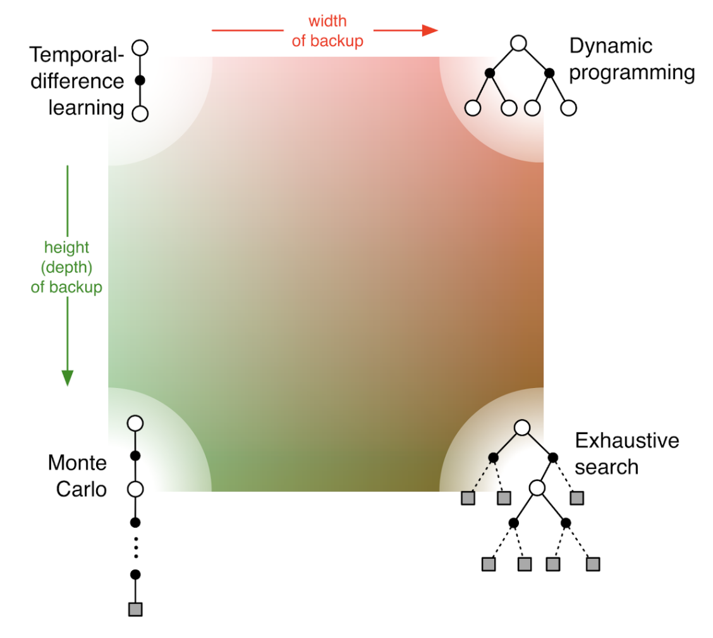

Обучение с подкреплением - это обучение тому, как отображать ситуации на действия, чтобы максимизировать численный сигнал - вознаграждение.

Элементы обучения с подкреплением:

- **стратегия** (или иногда называется еще "политикой") определяет то, как обучаемый агент поведет себя в конкретный момент времени. Стратегия отображает множество воспринимаемых состояний среды на действия, предпринимаемые в этих состояниях.
- **сигнал вознаграждения** определяет цель обучения. На каждом временном шаге (если задача дискретная) среда посылает агенту число, которое называется сигналом вознаграждения. Единственная задача агента - максимизировать полное вознаграждение, полученное в теченеии определенного длительного времени.
- **функция ценности** определяет полное вознаграждение, которое агент может ожидать в будущем, если начнет действия в текущем состоянии. Вознограждение определяет текущую желательное состояниес среды, а функция ценности - долговременное желательное состояние, с учетом всех вероятных состояний, которые могут встретиться позже. Вознограждение первично, а функция ценности вторична, однако мы ищем такие состояния, которые приносят наибольшую ценность, а не наибольшее вознаграждение в текущий момент, т.к. маленькие вознаграждения могут открыть более ценные состояния в будущем.
- **модель** имитирует поведение окружающей среды. Модели используются для **планирования**, подразумевающее любой способ ввода порядка действий путем рассмотрения будущих ситуаций, до того как они фактически произошли. Методы использующие планирование, называются **основанными на моделях**. Не использующие планирование - **безмодельными**. Методы на основе модели опираются на планирование, а безмодельные методы - на обучение.

В простейшем случае (игра крестики-нолики) мы подготавливаем таблицу чисел, по одному для каждого возможного состояния игры. Каждое число - это оценка вероятности выиграть, начав с этого состояния. Это ценность состояния, а вся таблица  - обученная функция ценности. Мы играем много игр с противником. Для выбора хода мы рассматриваем состояния, которые получаются в результате каждого возможного хода и оцениваем их ценности по таблице. В основном мы выбираем ход жадно (с наивысшей ценностью), но иногда мы делаем случайный ход (разведочный ход). В процессе игры мы изменяем ценность состояний, в которых оказались. Для этого мы переносим ценность состояний после каждого жадного хода в состояние до этого хода - текущая ценность предыдущего состояния обновляется, так чтобы стать ближе к ценности следующего состояния. Если обозначить $$S_t$$ состояние до жадного хода, $$S_{t+1}$$ после, то обновление оценки $$V(S_t)$$ будет выглядеть так:

$$V(S_t) \leftarrow (S_t) + \alpha[V(S_{t+1}) - V(S_t)]$$

где $$\alpha$$ - небольшой положительный коэффициент, называемый параметром размера шага, который влияет на скорость обучения. Это правило обучения - пример обучения на оснвое [[temporal-difference]].

Применение [[evolution-methods]] к данной задаче означало бы, что мы должны провести прямой поиск в пространстве стратегий, чтобы найти стратегию с высокой вероятностью выигрыша. Для каждой стратегии необходимо было бы получить оценку вероятности выигрыша, сыг рав несколько партий с противником, что указывало бы на то, какую стратегию использовать в следующем шаге. Типичный эволюционный метод - "восхождение на гору" в пространстве стратегий, последовательно генерируя и оценивая стратегии, пытаясь добиться улучшения. Если бы мы использовали генетический алгоритм #genetic, то хранили бы и оценивали популяцию стратегий.

Пример демонстрирует различие между эволюционными методами и методами обучения с подкреплением. Для вычисления стратегии эволюционный метод фиксирует стратегию и играет много игр с противником или имитирует много игр с его моделью. Любое измененеие стратегии производится только после статистически значимого числа сыгранных игр, кроме того используется лишь конечный результат - то, что происходит в процессе игры, полностью игнорируется. Методы на основе функции ценности оценивают отдельные состояния, что позволяет задействовать информацию, доступную в процессе самой игры.

## Методы

Методы обучения с подкреплением можно разделить на табличные и приближенные. Табличные методы применимы, когда пространство состояний и действий настолько мало, что его можно описать с помощью таблицы или массива. Приближенные методы обобщают табличные на сколь угодно большое пространство состояний.

### Табличные методы

К табличным методам можно отнести:

- [[multi-armed-bandit]] многорукие бандиты
- [[mppr]] конечные марковские процессы принятия решения
- [[dynamic-programming]] динамическое программирование
- [[monte-carlo]] методы Монте-Карло
- [[temporal-difference]] методы, основанные на временных различиях

В общем случае методы распределены так:

Кроме того, методы делятся на методы с единой и разделенной стратегией. Кроме того имеют значение следующие аспекты обучения:

- определение дохода - эпизодическая задача или непрерывная, с обесцениванием или без
- ценность действий, ценность состояний и ценность послесостояний - какие именно ценности следует оценивать
- выбор действия или исследование - требуется соблюсти компромисс между исследованием и использованием
- синхронность/асинхронность
- обучение на реальном опыте, имитации или их соотношении
- обновление пар состояние-действие. В безмодельных возможно обновить только те, которые встречались, в обучении на оснвое модели - произвольные
- обновлять в процессе выбора действий или после выбора
- как долго следует хранить обновленные ценности

### Приближенные методы

В приближенных методах используется аппроксимирующая функция, применяемая к оцениванию ценности. Можно выделить следующие подходы:

- аппроксимация функции ценности при заданной стратегии
- аппроксимация задачи предсказания при заданной стратегии
- аппроксимация функции ценности обучения с раздельной стратегией
- методы следов приемлемости и методы градиента стратегии - в этих методах оптимальная стратегия аппроксимируется непосредственно, а приближенная функция ценности вовсе не используется.

К приближенным методам относятся:

- [[deep-Q-learning]] глубокое Q-обучение
- [[policy-gradient-methods]] методы градиента стратегии

Способы аппроксимации:

- стохастические градиентные и полуградиентные методы
- линейные методы (требуется выбор базиса и метода кодирования признаков)
- неелинейные аппроксимации (нейроныне сети)
- метод наименьших квадратов, функции с запоминанием и ядерные функции

[[another-and-nonstandart-methods-of-reinforcement-learning]]

## Другие методы и расширения

- иерархическое обучение с подкреплением (hierarchical reinforcement learning, HRL) декомпозирует задачу обучение на ряд подзадач, которые обучаются независимо
- мультиагентное обучение с подкреплением (multy-agent reinforcement learning, MARL) решает задачу последовательности принятия решений несколькими автономными агентами, которые работают в общей среде. Есть три подхода - кооперативныый (агенты сотрудничают для достижения общей цели), конкурентный (агенты соперничают, чт осводит глобальное вознаграждение к нулю, т.к. агенты пытаются улучшить свою политику друг за счет друга) и смешанный. Различают несколько подходов моделирования - стандартный, марковская игра MG (где несколько агентов имеют независимые действия и вознаграждения), expensive form game EFG (шанс, состояние и действия представлены в виде дерева, что сосответствует развернотому [[mppr]]). имеет так-же значение как обучаются агенты - централизованно или децентрализованно. Основная проблема примененеия обычных алгоритмов типа [[deep-q-learning]] или [[policy-gradient-methods]] упирается в то, что нарушается предположение о стационарности среды (агенты своими действиями изменяют состояние), поэтому одноагентное обучение на таких алгоритмах (когда каждый агент независим) работает плохо.

## Библиотеки

[A Comparison of Reinforcement Learning Frameworks: Dopamine, RLLib, Keras-RL, Coach, TRFL, Tensorforce, Coach and More](https://winder.ai/a-comparison-of-reinforcement-learning-frameworks-dopamine-rllib-keras-rl-coach-trfl-tensorforce-coach-and-more/#google-dopamine-https-github-com-google-dopamine)

- [openai gym](https://github.com/openai/gym) A toolkit for developing and comparing reinforcement learning algorithms.
- Now is gym is a [[gymnasium]] - is forked, and gym project not supported yet.
- [PettingZoo](https://github.com/Farama-Foundation/PettingZoo) A standard API for multi-agent reinforcement learning environments, with popular reference environments and related utilities
- [[stable-baseline-3]] PyTorch version of Stable Baselines, reliable implementations of reinforcement learning algorithms.
- [SuperSuit](https://github.com/Farama-Foundation/SuperSuit) A collection of wrappers for Gymnasium and PettingZoo environments - being merged into gymnasium.wrappers and pettingzoo.wrappers
- Arcade-Learning-Environment(ALE) is a simple framework that allows researchers and hobbyists to develop AI agents for Atari 2600 games
- Other:
  - Google [dopamine](https://github.com/google/dopamine). Dopamine is a research framework for fast prototyping of reinforcement learning algorithms.
  - [RLib](https://docs.ray.io/en/latest/rllib/index.html). Industry-Grade Reinforcement Learning. [github](https://github.com/ray-project/ray)
  - [keras-rl](https://github.com/keras-rl/keras-rl). Deep Reinforcement Learning for Keras.
  - [TRFL](https://github.com/deepmind/trfl). TensorFlow Reinforcement Learning
  - [tensorforce](https://github.com/tensorforce/tensorforce). A TensorFlow library for applied reinforcement learning.
  - Facebook [ReAgent](https://github.com/facebookresearch/ReAgent). A platform for Reasoning systems (Reinforcement Learning, Contextual Bandits, etc.).
  - Intel [coach](https://github.com/IntelLabs/coach). Reinforcement Learning Coach by Intel AI Lab enables easy experimentation with state of the art Reinforcement Learning algorithms.
  - [MAgent](https://github.com/geek-ai/MAgent). A Platform for Many-agent Reinforcement Learning
  - [MAgent2](https://github.com/Farama-Foundation/MAgent2) is a library for the creation of environments where large numbers of pixel agents in a gridworld interact in battles or other competitive scenarios.
  - [TF-Agents](https://github.com/tensorflow/agents). A reliable, scalable and easy to use TensorFlow library for Contextual Bandits and Reinforcement Learning.
  - [SLM-Lab](https://github.com/kengz/SLM-Lab). Modular Deep Reinforcement Learning framework in [[pytorch]]. Companion library of the book "Foundations of Deep Reinforcement Learning".
  - [DeeR](https://github.com/VinF/deer). DeeR is a python library for Deep Reinforcement. It is build with modularity in mind so that it can easily be adapted to any need. It provides many possibilities out of the box such as Double Q-learning, prioritized Experience Replay, Deep deterministic policy gradient (DDPG), Combined Reinforcement via Abstract Representations (CRAR). Many different environment examples are also provided (some of them using OpenAI gym).
  - [garage](https://github.com/rlworkgroup/garage). A toolkit for reproducible reinforcement learning research.
  - [surreal](https://github.com/SurrealAI/surreal). Open-Source Distributed Reinforcement Learning Framework by Stanford Vision and Learning Lab
  - [RLgraph](https://github.com/rlgraph/rlgraph). RLgraph is a framework to quickly prototype, define and execute reinforcement learning algorithms both in research and practice. RLgraph is different from most other libraries as it can support TensorFlow (or static graphs in general) or eager/define-by run execution (PyTorch) through a single component interface.
  - [simple_rl](https://github.com/david-abel/simple_rl). A simple framework for experimenting with Reinforcement Learning in Python.
  - [godot_rl_agents](https://github.com/edbeeching/godot_rl_agents) An Open Source package that allows video game creators, AI researchers and hobbyists the opportunity to learn complex behaviors for their Non Player Characters or agents in [[godot]]
  - [Arcade-Learning-Environment(ALE)](https://github.com/Farama-Foundation/Arcade-Learning-Environment) is a simple framework that allows researchers and hobbyists to develop AI agents for Atari 2600 games

## Другие ресурсы

- [Reinforcement Learning Resources](https://stable-baselines3.readthedocs.io/en/master/guide/rl.html)
  - [UCL Course on RL](https://www.davidsilver.uk/teaching/)
  - [Policy Gradient Algorithms](https://lilianweng.github.io/posts/2018-04-08-policy-gradient/)
  - [Deep RL Bootcamp](https://sites.google.com/view/deep-rl-bootcamp/lectures?pli=1) lectures
  - [cs285 Deep Reinforcement Learning UC Berkeley](http://rail.eecs.berkeley.edu/deeprlcourse/)
  - [Implementation of Reinforcement Learning Algorithms](https://github.com/dennybritz/reinforcement-learning). Python, OpenAI Gym, Tensorflow. Exercises and Solutions to accompany Sutton's Book and David Silver's course.
  - [OpenAI to Spinning Up](https://spinningup.openai.com/en/latest/) An educational resource to help anyone learn deep reinforcement learning.
- [GYM environments](https://github.com/openai/gym/wiki/Environments)

## Книги

Dr. Phil. [Winder Reinforcement Learning](https://rl-book.com/). Industrial Applications with Intelligent Agents

## Статьи и исследования

- [DeepRL-for-Graph Based State Representation](https://github.com/WVik/DeepRL-for-Graphs). [Paper](https://arxiv.org/abs/2004.13965)
- [Applying Graph Neural Networks to Kaggle Competition Kore-2022](https://astralord.github.io/posts/applying-graph-neural-networks-to-kaggle-competition/). [Inference code](https://www.kaggle.com/code/alexandersamarin/kore-graph-neural-network)
- [Why use Reinforcement Learning with Graph Neural Networks](https://www.linkedin.com/posts/nikita-iserson_graph-graphneuralnetworks-reinforcementlearning-activity-7035590423574151168-O7On) (some links)

Читай еще:

- [The four main subelements of a reinforcement learning system](https://towardsdatascience.com/introduction-to-reinforcement-learning-rl-part-1-introduction-c0d55c1240a3)
- [[evolution-methods]]
- [[machine-learning]]

[//begin]: # "Autogenerated link references for markdown compatibility"
[temporal-difference]: ../notes/temporal-difference "Temporal difference methods and n-steps methods"
[evolution-methods]: evolution-methods "Evolution methods"
[multi-armed-bandit]: ../notes/multi-armed-bandit "Multy armed bandits"
[mppr]: ../notes/mppr "MPPR"
[dynamic-programming]: ../notes/dynamic-programming "Dynamic programming for reinforcement-learning"
[monte-carlo]: ../notes/monte-carlo "Monte-Carlo methods"
[deep-Q-learning]: ../notes/deep-q-learning "Deep Q-learning"
[policy-gradient-methods]: ../notes/policy-gradient-methods "Policy Gradient Methods"
[another-and-nonstandart-methods-of-reinforcement-learning]: ../notes/another-and-nonstandart-methods-of-reinforcement-learning "Another and nonstandart methods of reinforcemebt learning"
[deep-q-learning]: ../notes/deep-q-learning "Deep Q-learning"
[gymnasium]: ../notes/gymnasium "Gymnasium"
[stable-baseline-3]: ../notes/stable-baseline-3 "Stable baseline 3"
[pytorch]: ../notes/pytorch "Machine learning framework pytorch"
[godot]: ../notes/godot "godot engine"
[machine-learning]: machine-learning "Алгоритмы машинного обучения"
[//end]: # "Autogenerated link references"
[//begin]: # "Autogenerated link references for markdown compatibility"
[temporal-difference]: ../notes/temporal-difference "Temporal difference methods and n-steps methods"
[evolution-methods]: evolution-methods "Evolution methods"
[multi-armed-bandit]: ../notes/multi-armed-bandit "Multy armed bandits"
[mppr]: ../notes/mppr "MPPR"
[dynamic-programming]: ../notes/dynamic-programming "Dynamic programming for reinforcement-learning"
[monte-carlo]: ../notes/monte-carlo "Monte-Carlo methods"
[temporal-difference]: ../notes/temporal-difference "Temporal difference methods and n-steps methods"
[deep-Q-learning]: ../notes/deep-q-learning "Deep Q-learning"
[policy-gradient-methods]: ../notes/policy-gradient-methods "Policy Gradient Methods"
[another-and-nonstandart-methods-of-reinforcement-learning]: ../notes/another-and-nonstandart-methods-of-reinforcement-learning "Another and nonstandart methods of reinforcemebt learning"
[mppr]: ../notes/mppr "MPPR"
[deep-q-learning]: ../notes/deep-q-learning "Deep Q-learning"
[policy-gradient-methods]: ../notes/policy-gradient-methods "Policy Gradient Methods"
[stable-baseline-3]: ../notes/stable-baseline-3 "Stable baseline 3"
[pytorch]: ../notes/pytorch "Machine learning framework pytorch"
[godot]: ../notes/godot "godot engine"
[evolution-methods]: evolution-methods "Evolution methods"
[machine-learning]: machine-learning "Алгоритмы машинного обучения"
[//end]: # "Autogenerated link references"