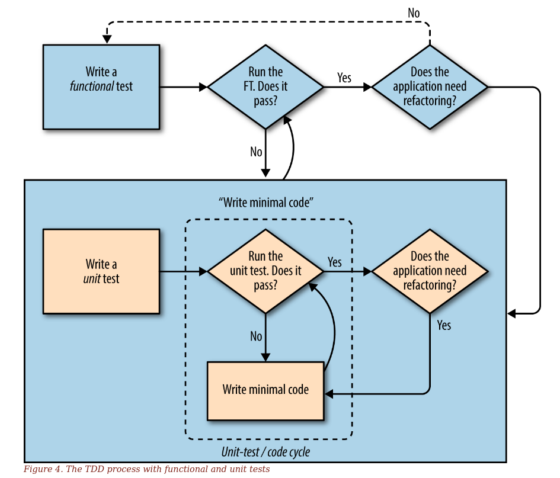

# Основные принципы тестровния

## Три основных принципа тестирования

### Правильность

- достаточно ли у меня [[системные-тесты]] м(или функциональных тестов), чтобы убедиться, что мое приложение работает правильно с точки зрения пользователя?
- тестирую ли я все критичные случаи полностью
- есть ли у меня тесты, которые проверяют всю цепочку интеграции

### Чистый, удобный в сопровождении код

- позволяют лои мои тесты рефакторить код без боязни и часто
- помогают ли тесты фычленять рациональную структуру кода
- есди у меня много [[интеграционные-тесты]] и мало [[изолированные-тесты]], есть ли у приложение части, где написание изолированных тестов дадут более оптимальную обратную связь о структуре кода

### Продуктивный поток операций

- достаточно ли быстр цикл тестирования
- можно ли ускорить тестирование
- можно ли выполнять лишь часть тестов, когда это необходимо
- отнимает ли ожидание тестов время у написание рабочего кода

Написание [[изолированные-тесты]] способствует выталкиванию программного кода из главного приложения, т.е. разделению приложения на сервисы. Развитием этой идеи является [[функциональное-ядро]] - написание такого ядра приложения, которое тестируется миниально или не тестируется вовсе и которое написано в парадигме [[функциональное-программирование]], поощряющее #модульные_тесты . Все остальне вынесено в сервисы.

[Вики-справочник test double](https://en.wikipedia.org/wiki/Test_double)

Вся эта концепция подробно в [TDD книге](https://www.obeythetestinggoat.com/book/chapter_hot_lava.html)

## Виды и термины тестов

- [[тесты-с-имитацией]]
- [[системные-тесты]]
- [[приемочные-тесты]]
- [[изолированные-тесты]]
- [[интеграционные-тесты]]
- [[регрессия(тесты)]]
- [[дымовые-тесты]]

## Концепции тестирующего программного продукта

- **test fixture** - код представляет из себя некуий препроцессинг, необходимый для выполнения одного или нескольких тестов и любых связанных действий по очистке после тестирования. Это может включать, например, создание временных или прокси-баз данных, каталогов или запуск серверного процесса.
- **test case** - индивидуальный (юнит) тест или [[изолированные-тесты]]
- **test suite** - коллекция тест-кейсов
- **test runner** - некий пользовательский UI для тестов, например граф.интерфейс

## Некоторые определения

**История пользователя** - описание того, как приложение будет работать с точки зрения юзера. Используется [[приемочные-тесты]]

**Ожидаемая неполадка** - когда тест не срабатывает и ошибка, которую он выдает ожидаема.

**Неожиданная неполадка** - ситуация, когда тест не выдает ожидаемую неполадку. Это означет, что мы либо допустили ошибку в коде текста либо нашли [[регрессия(тесты)]]

**Правило** красный/зеленый/рефакторизируй

- красный уровень: начать с написания [[изолированные-тесты]], который не срабатывает
- зеленый уровень: написать успешный код, который заставляет пройти его успешно
- выполнить [[рефакторизация]], чтобы получить более хороший программный код

Если фрагмент кода повторяется больше двух раз (клюнуло трижды) - нужна [[рефакторизация]]

**todo** - место для фиксации рабочих моментов, которые происходят во время программирования и требуют завершения в будущем

Разные тесты не должны влиять друг на друга.. Для этого любое потенциальное состояние обнуляется в конце теста. Это называется **обеспечением изоляции и управлением глобальным состоянием**

Лучше не допускать методов `time.sleep`, так как неизветсно сколько придется ждать. Лучше установить время и прогнать повторно. Тест должен ждать ровно столько, сколько нужно. Не стоит опираться на неявные ожидания [[selenium]]

Нельзя писать новые тесты, пока мы не добились работоспособности на текущем уровне. Т.е. пока не заработал текущий уровень [[интеграционные-тесты]], нельзя переходить на следующий. Следует разбивать работу на маленькие достижения и маленькие задачи.

Необходимо **избегать написания программного кода, кторый, как кажется, будет полезен в будущем** - велик шанс, что код не понадобится, будет много раз переписан, будет давить на дальнейшую реализации или вовсе вы неправильно оценили свои будущие потребности.

Не следует писать тесты дизайна и макета страниц, т.к. это похоже на тестирование константы. Значение имеет минимальная проверка на токсичность, которая проверяет что отображение контента работает, но не проверяет корректность отображения дизайна.

## Начальная настройка проекта

- написать историю пользователя и отобразить ее на первый [[приемочные-тесты]], можно реализовать стразу на [[разработка-на-основе-поведения(BDD)]]
- выбрать тестовую платформу, к примеру [[unittest]] или [[pytest]]
- выполнить ФТ и посмотреть на первую ожидаемую ошибку
- выбрать программную инфраструктуру (фреймворк) и выяснить как для нее реализовать #модульные_тесты
- создать [[изолированные-тесты]] чтобы решить текущую неполадку ФТ
- зафиксироваться
- do again

## Основной поток операций TDD

- двойной цикл на основе тестирования - ФТ/модульные
- красный/зеленый/рефакторизируй
- триангуляция
- ведение блокнота todo
- клюнуло трижды - красный/зеленый/рефакторизируй
- двигаться от рабочего состояния к рабочему состоянию
- не писать код на будущее (вам это не понадобится)

## Выход за пределы тестирования только на сервере разработки

- начать раннее тестирование системы
- создать [[staging-промежуточная-среда]] и выполнять ФТ относительно нее
- автоматизировать [[staging-промежуточная-среда]]

## Обшие приемы тестирования

- каждый тест тестирует только один компонент
- один тестовый файл на один файл приложения
- думать о тесте-заготовке для каждой функции и класса, даже самых простых
- не тестировать константы
- тестировать поведение, а не реализацию
- выходить за пределы неудачных тестов с помощью программного кода и обдумывать пограничные случаи

## Плюсы тестирования

- быстрая обратная связь об ошибке
- уверенность в том, что известные или простые ошибки не допущены
- помогают в отладке
- помогают в проектировании (#TDD)
- помогают создать спецификацию продукта

## Минусы тестов

- требуют дополнительных усилий
- это дополнительный код, который надо поддерживать
- хрупкость (ложноотрицательные и ложноположительные результаты), что подрывает доверие к тестам
- некоторые тесты сложно сделать надежными, например тесты графического пользовательского интерфейса
- внушают ложное чувство безопаснсоти

[[фикстуры]]
[[unittest]]
[[pytest]]
[[behave]]
