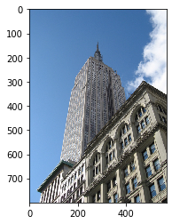
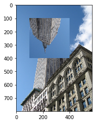
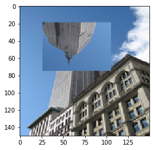
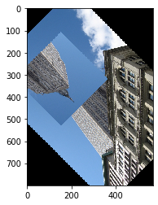
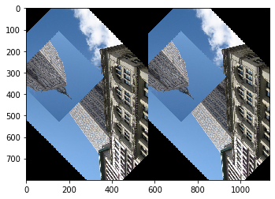
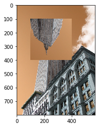
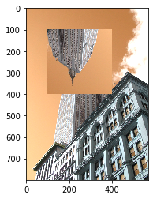
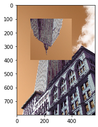

## Image class

```python
>>> from PIL import Image
>>> im = Image.open("empire.jpg")

>>> print(im.format, im.size, im.mode)
PPM (512, 512) RGB

>>> import matplotlib.pyplot as pl
>>> pl.figure()
>>> pl.imshow(im)
```



```python
>>> # copy and insert boxes
>>> im = Image.open('data/empire.jpg')
>>> box = (100, 100, 400, 400) # order - left, top, right, bottom coordinates
>>> region = im.crop(box)

>>> # operations with box and insertion
>>> region = region.transpose(Image.ROTATE_180)
>>> # sinse 10.0.0 is deprecated - use Image.Transpose.ROTATE_180
>>> im.paste(region, box)
>>> pl.figure()
>>> pl.imshow(im)
```



```python
>>> out = im.resize((150, 150))
>>> pl.figure()
>>> pl.imshow(out)
```



```python
>>> out = im.rotate(45)
>>> pl.figure()
>>> pl.imshow(out)
```



```python
# merging
def merge(im1, im2):
    w = im1.size[0] + im2.size[0]
    h = max(im1.size[1], im2.size[1])
    im = Image.new("RGBA", (w, h))

    im.paste(im1)
    im.paste(im2, (im1.size[0], 0))

    return im

n = merge(out, out)
pl.figure()
pl.imshow(n)
```



```python
# spliting and merging bands
r, g, b = im.split()
im = Image.merge("RGB", (b, g, r))
pl.figure()
pl.imshow(im)
```



```python
# point transforms
out = im.point(lambda i: i * 1.2)
pl.figure()
pl.imshow(out)
```



```python
# Processing individual bands (with paste() method)

# split the image into individual bands
source = im.split()

R, G, B = 0, 1, 2

# select regions where red is less than 100
mask = source[R].point(lambda i: i < 100 and 255)

# process the green band
out = source[G].point(lambda i: i * 0.7)

# paste the processed band back, but only where red was < 100
source[G].paste(out, None, mask)

# build a new multiband image
out = Image.merge(im.mode, source)

pl.figure()
pl.imshow(out)
```



- [using Image class](https://pillow.readthedocs.io/en/stable/handbook/tutorial.html#using-the-image-class)
- [more about Image module](https://pillow.readthedocs.io/en/stable/reference/Image.html)

## Concepts

Изображение может состоять из одного или нескольких каналов данных. Библиотека pillow позволяет хранить несколько каналов в одном изображении при условии, что все они имеют одинаковые ширину и высоту. Например, изображение PNG может иметь каналы «R», «G», «B» и «A» для значений прозрачности красного, зеленого, синего и альфа-канала. Многие операции воздействуют на каждый канал отдельно, например, гистограммы. Часто полезно думать, что каждый пиксель имеет одно значение для каждго канала. Чтобы получить количество и названия каналов на изображении, используйте метод `getbands()`.

`mode` — это строка, определяющая тип и глубину пикселя изображения. Каждый пиксель использует полный диапазон битовой глубины. Таким образом, 1-битный пиксель имеет диапазон от 0 до 1, 8-битный пиксель имеет диапазон от 0 до 255 и так далее. Текущая версия поддерживает следующие стандартные режимы:

- `1` (1-bit pixels, black and white, stored with one pixel per byte)
- `L` (8-bit pixels, black and white)
- `P` (8-bit pixels, mapped to any other mode using a color palette)
- `RGB` (3x8-bit pixels, true color)
- `RGBA` (4x8-bit pixels, true color with transparency mask)
- `CMYK` (4x8-bit pixels, color separation)
- `YCbCr` (3x8-bit pixels, color video format) Note that this refers to the JPEG, and not the ITU-R BT.2020, standard
- `LAB` (3x8-bit pixels, the L*a*b color space)
- `HSV` (3x8-bit pixels, Hue, Saturation, Value color space)
- `I` (32-bit signed integer pixels)
- `F` (32-bit floating point pixels)

Pillow also provides limited support for a few additional modes, including:

- `LA` (L with alpha)
- `PA` (P with alpha)
- `RGBX` (true color with padding)
- `RGBa` (true color with premultiplied alpha)
- `La` (L with premultiplied alpha)
- `I;16` (16-bit unsigned integer pixels)
- `I;16L` (16-bit little endian unsigned integer pixels)
- `I;16B` (16-bit big endian unsigned integer pixels)
- `I;16N` (16-bit native endian unsigned integer pixels)
- `BGR;15` (15-bit reversed true colour)
- `BGR;16` (16-bit reversed true colour)
- `BGR;24` (24-bit reversed true colour)
- `BGR;32` (32-bit reversed true colour)

pillow не поддерживает юзер-дефайнед модели

Атрибут `size` позволяет указать размер изображения в виде кортежа из двух целых чисел. Координаты-  в виде кортежа из четырех чисел - левый, верхний, правый и нижний.

Атрибут `info` позволяет добавить вспомогательную инфу [в виде словаря](https://pillow.readthedocs.io/en/stable/reference/Image.html#PIL.Image.Image.info). Наиболее частый вариант использования - передача информации об ориентации изображения.

Для геометрических операций, которые могут отображать несколько входных пикселей в один выходной пиксель, PIL предоставляет различные [фильтры передискретизации](https://pillow.readthedocs.io/en/stable/handbook/concepts.html#filters).

[Подробнее](https://pillow.readthedocs.io/en/stable/handbook/concepts.html#)

## More

- [Поддерживаемые форматы](https://pillow.readthedocs.io/en/stable/handbook/image-file-formats.html)
- [параметр привязки и выравнивания текста](https://pillow.readthedocs.io/en/stable/handbook/text-anchors.html)
- [создание собственных плагинов](https://pillow.readthedocs.io/en/stable/handbook/writing-your-own-image-plugin.html)
- [декодеры](https://pillow.readthedocs.io/en/stable/handbook/writing-your-own-image-plugin.html#decoders)
- [список классов и функций](https://pillow.readthedocs.io/en/stable/reference/index.html)

Смотри еще:

- [docks](https://pillow.readthedocs.io/en/stable/index.html)
- [[python-standart-library]]
- [[computer-visions]]
- [[scikit-image]]
- [[scipy]]

[//begin]: # "Autogenerated link references for markdown compatibility"
[python-standart-library]: ../lists/python-standart-library "Стандартная библиотека python и полезные ресурсы"
[computer-visions]: ../lists/computer-visions "Computer visions"
[scikit-image]: scikit-image "Scikit-image"
[scipy]: scipy "Scipy"
[//end]: # "Autogenerated link references"
[//begin]: # "Autogenerated link references for markdown compatibility"
[python-standart-library]: ../lists/python-standart-library "Стандартная библиотека python и полезные ресурсы"
[computer-visions]: ../lists/computer-visions "Computer visions"
[scikit-image]: scikit-image "Scikit-image"
[scipy]: scipy "Scipy"
[//end]: # "Autogenerated link references"