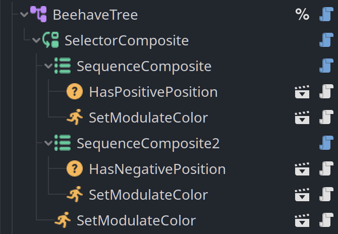

Beehave — минималистичный аддон behaviour tree для игрового движка [[godot]]. Проект начат как форк простого примера и доработан автором для удобства использования: добавлен отладочный вид в редакторе, исправлены и расширены ноды, а также организован отдельный репозиторий с поддержкой веток для Godot 3.x и 4.x.

Статья написана с помощью gpt-5 mini.

Ключевая идея Beehave — дать простой и расширяемый набор нод для построения логики NPC через поведенческие деревья (Behaviour Trees), не перегружая пользователем лишним функционалом.

## Что умеет Beehave

- Минималистичная реализация behaviour tree, удобная для интеграции в проекты.
- Поддержка Godot 3.x и Godot 4.x (отдельные ветки и сборки).
- Отладочный режим/вид в редакторе для визуализации выполнения дерева.
- Набор базовых нод: Conditions, Actions (leaf nodes), Composites (Selector, Sequence и их "Star" варианты) и Decorators (Failer, Succeeder, Inverter, Limiter).



### Leaf nodes

- Conditions (`ConditionLeaf`) — простые проверочные ноды, возвращают `SUCCESS` или `FAILURE` (например, проверка видимости, дистанции и т.д.).
- Actions (`ActionLeaf`) — ноды действий, могут быть длительными и возвращать `RUNNING` до завершения.

Пример Condition (GDScript):

```gdscript
class_name IsVisibleCondition
extends ConditionLeaf

func tick(actor, blackboard):
  if actor.visible:
    return SUCCESS
  return FAILURE
```

Пример Action (GDScript):

```gdscript
class_name MakeVisibleAction
extends ActionLeaf

func tick(actor, blackboard):
  if actor.visible:
    return FAILURE
  actor.visible = true
  return SUCCESS
```

`blackboard` используется для обмена данными между нодами дерева.

### Composites

- Selector — возвращает `SUCCESS`, если хотя бы один ребёнок вернул `SUCCESS`; в противном случае `FAILURE`.
- Selector Star — похож на Selector, но при наличии `RUNNING` ребенка пропускает ранее выполненные дети (полезно, если нужно, чтобы выполнялось только одно действие одновременно).
- Sequence — возвращает `SUCCESS`, если все дети вернули `SUCCESS`; если хоть один вернул `FAILURE` — возвращает `FAILURE`.
- Sequence Star — похож на Sequence, но при `RUNNING` ребёнка пропускает ранее успешные дети.

### Decorators

- Failer — всегда возвращает `FAILURE`.
- Succeeder — всегда возвращает `SUCCESS`.
- Inverter — инвертирует статус дочерней ноды (`SUCCESS`↔`FAILURE`).
- Limiter — ограничивает число запусков дочерней ноды.

## Смотри еще

Полную лицензию и исходный код смотрите в репозитории:

- Репозиторий: [bitbrain/beehave](https://github.com/bitbrain/beehave)
- [[godot]]
- [[gamedev]]

[godot]: godot "godot engine"
[gamedev]: ../lists/gamedev "Gamedev"