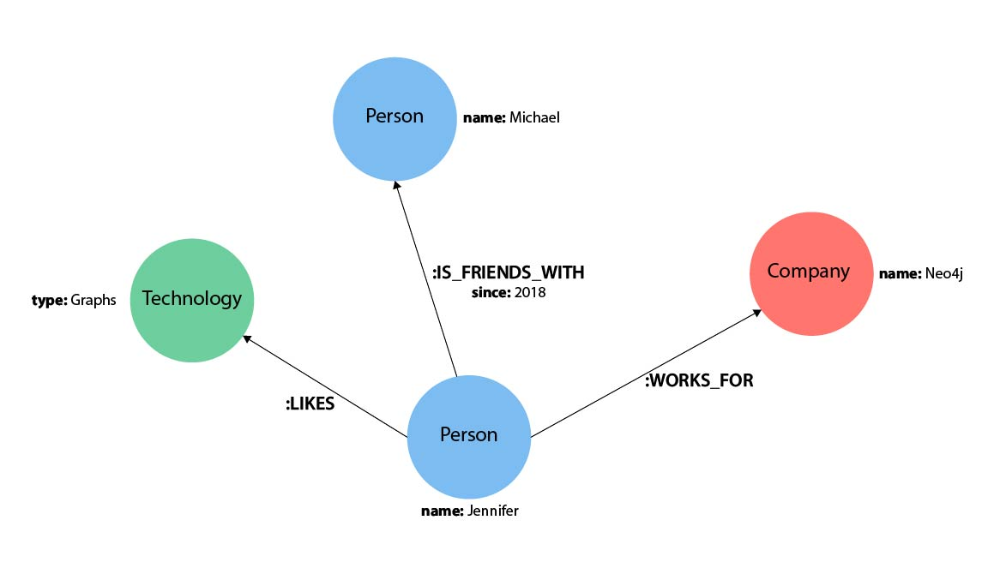
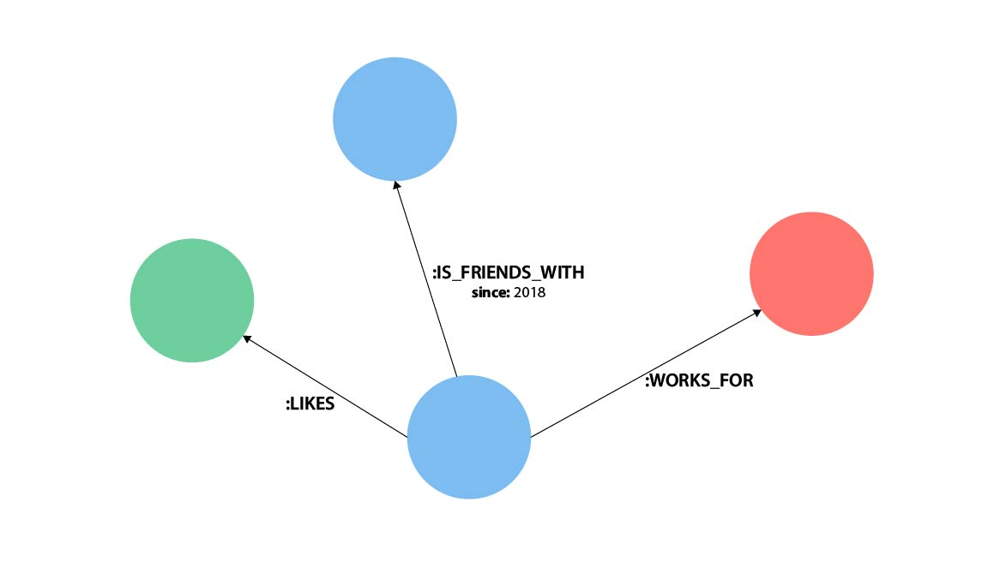
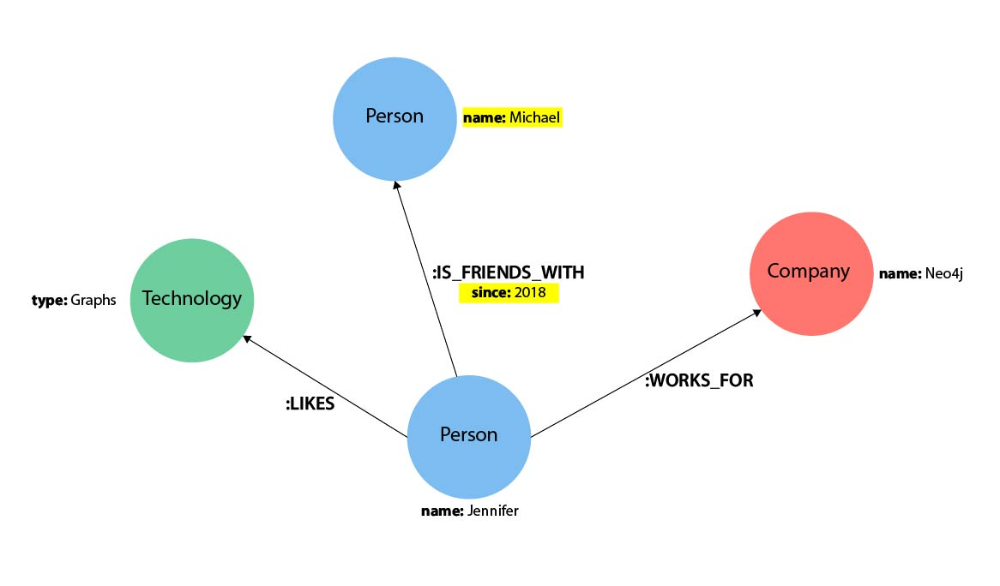
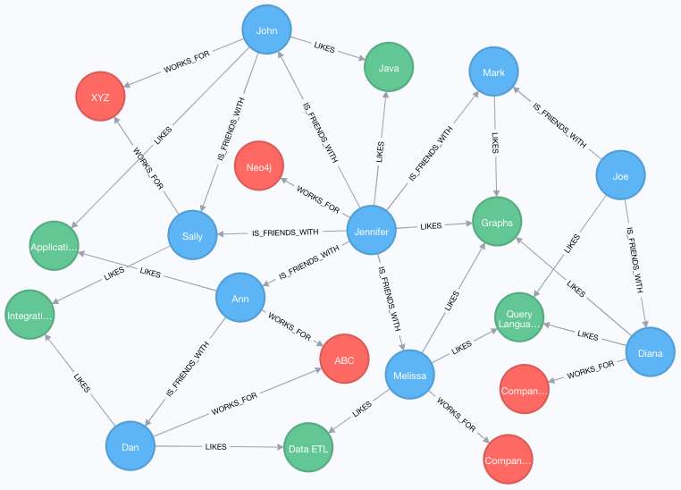
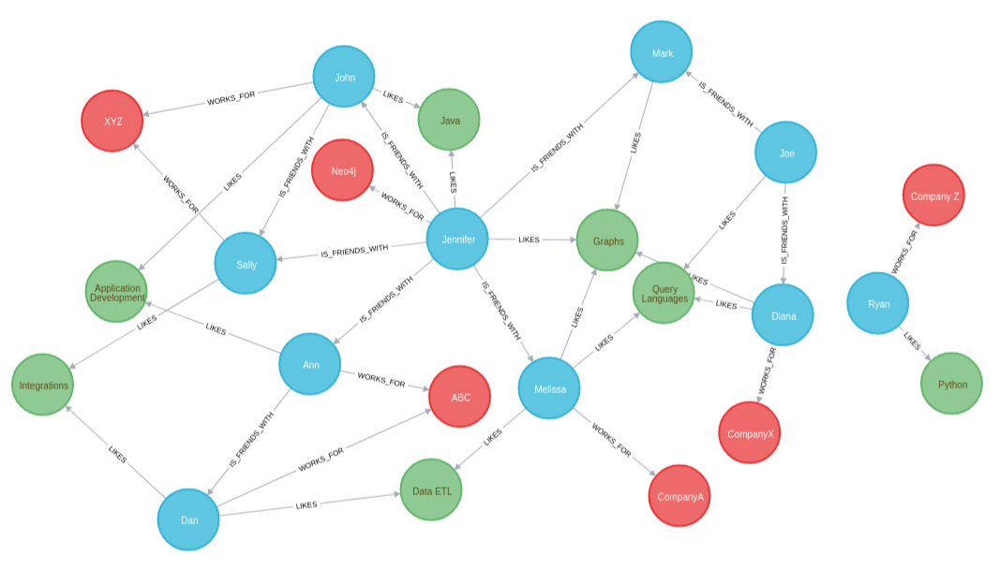
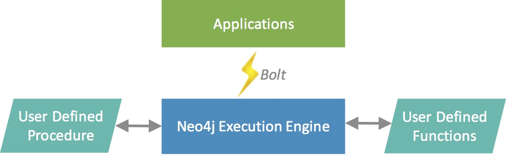

Cypher — это язык графовых запросов [[neo4j]], который позволяет извлекать данные из графа. Это похоже на SQL для графов, и он был вдохновлен SQL, поэтому он позволяет вам сосредоточиться на том, какие данные вы хотите получить из графа (а не на том, как их получить). Это самый простой язык графов для изучения из-за его сходства с другими языками и интуитивности.


Поскольку Cypher предназначен для чтения человеком, его конструкция основан на английской лексике, чтобы сделать синтаксис наглядным и понятным.



Узлы в cypher могут быть анонимными (результат будет отброшен в конце вычисленийц) или поименованными меткой. Результат можно присваивать переменной.

```cypher
()                  //anonymous node (no label or variable)
                    //can refer to any node in the database
(p:Person)          //using variable p and label Person
(:Technology)       //no variable, label Technology
(work:Company)      //using variable work and label Company
```

Отношения представлены в Cypher с помощью стрелки `-->` или `<--` между двумя узлами. Ненаправленные отношения представлены без стрелки и только с двумя тире `--`. Это означает, что связь может быть пройдена в любом направлении. Хотя направление должно быть указано для связи в бд, его можно сопоставить с ненаправленным отношением, когда Cypher игнорирует любое конкретное направление и извлекает отношение и подключенные узлы, независимо от физического направления. Это позволяет запросам быть гибкими и не заставлять пользователя знать физическое направление отношений, хранящихся в базе данных.

Если данные хранятся с одним направлением связи, а в запросе указано неправильное направление, Cypher не вернет никаких результатов. В тех случаях, когда вы не уверены в направлении, лучше использовать ненаправленную связь и получить некоторые результаты.

```cypher
//data stored with this direction
CREATE (p:Person)-[:LIKES]->(t:Technology)

//query relationship backwards will not return results
MATCH (p:Person)<-[:LIKES]-(t:Technology)

//better to query with undirected relationship unless sure of direction
MATCH (p:Person)-[:LIKES]-(t:Technology)
```

Типы отношений классифицируют отношения и придают им значение, аналогично тому, как метки группируют узлы. Обычно вы можете идентифицировать отношения в своей модели данных, найдя действия или глаголы. Вы можете указать любой тип отношений между узлами, который вы хотите, но мы рекомендуем использовать хорошие соглашения об именах, используя глаголы и действия. Плохие имена типов отношений затрудняют чтение и запись Cypher (помните, это должно звучать как английский!).



Как и в случае с узлами, если мы хотим позже обратиться к связи в запросе, мы можем указать для нее переменную типа `[r]`или `[rel]`. Мы также можем использовать более длинные и выразительные имена переменных, такие как `[likes]` или `[knows]`. Если вам не нужно ссылаться на связь позже, вы можете указать анонимную связь с помощью двух дефисов `--`, `-->`, `<--`.

Например, вы можете использовать или `-[rel]->` или `-[rel:LIKES]->` и вызвать `rel` переменную позже в своем запросе, чтобы сослаться на связь и ее детали.

Если вы забудете поставить двоеточие перед таким типом отношения `-[LIKES]->`, оно представляет собой переменную (а не тип отношения). Поскольку тип отношений не объявлен, Cypher будет искать все типы отношений.

Свойства в cypher представляют собой пары «имя-значение», которые предоставляют дополнительную информацию для наших узлов и отношений. Чтобы представить их в Cypher, мы можем использовать фигурные скобки внутри круглых скобок узла или скобок отношения. Затем имя и значение свойства заключаются в фигурные скобки: `-[rel:IS_FRIENDS_WITH {since: 2018}]->`



[Доступные типы данных свойств](https://neo4j.com/docs/cypher-manual/current/syntax/values/)

Основой всех запросов в cypher являются паттерны. Пример:

```cypher
(p:Person {name: "Jennifer"})-[rel:LIKES]->(g:Technology {type: "Graphs"})
```

## [querues](https://neo4j.com/developer/cypher/querying/)

Как и в большинстве языков программирования, в Cypher есть несколько слов, зарезервированных для определенных действий в частях запроса. Нам нужна возможность создавать, читать, обновлять или удалять данные в Neo4j, и ключевые слова помогают нам выполнять эту функцию.

**MATCH**. Ключевое слово `MATCH` в Cypher — это то, что ищет существующий узел, отношение, метку, свойство или шаблон в базе данных. Если вы знакомы с SQL, `MATCH` работает почти так же, как SELECT в SQL.

Вы можете найти все метки узлов в базе данных, выполнить поиск определенного узла, найти все узлы с определенной взаимосвязью, найти закономерности узлов и взаимосвязей и многое другое с помощью `MATCH`.

**RETURN**. Ключевое слово `RETURN` в Cypher указывает, какие значения или результаты вы хотите вернуть из запроса Cypher. Вы можете указать Cypher возвращать узлы, отношения, свойства узлов и отношений или шаблоны в результатах вашего запроса. `RETURN` не требуется при выполнении процедур записи, но необходим для чтения.

Переменные узла и отношения, которые мы обсуждали ранее, становятся важными при использовании `RETURN`. Чтобы вернуть узлы, отношения, свойства или шаблоны, вам необходимо указать переменные в вашем `MATCH` предложении для данных, которые вы хотите вернуть.

Все узлы с меткой Person

```cypher
MATCH (p:Person)
RETURN p
LIMIT 1
```

С определенным значением свойства на узле (имя режисера)

```cypher
MATCH (tom:Person {name: 'Tom Hanks'})
RETURN tom
```

Фильмы данного режиссера

```cypher
MATCH (:Person {name: 'Tom Hanks'})-[:DIRECTED]->(movie:Movie)
RETURN movie
```

Как и в случае с cypher, вы можете переименовать возвращаемые результаты, используя AS и псевдоним свойства с более понятным именем.

```cypher
//cleaner printed results with aliasing
MATCH (tom:Person {name:'Tom Hanks'})-[rel:DIRECTED]-(movie:Movie)
RETURN tom.name AS name,
tom.born AS `Year Born`,
movie.title AS title,
movie.released AS `Year Released`
```

## [Create, Update, and Delete Operations](https://neo4j.com/developer/cypher/updating/)

CRUD в графе работаtт немного иначе, чем в других типах баз данных.

Добавление данных в Cypher работает очень похоже на оператор вставки любого другого языка доступа к данным. Однако вместо INSERT, как в SQL, Cypher использует `CREATE`. Вы можете использовать `CREATE` для вставки узлов, отношений и шаблонов в Neo4j.

```cypher
CREATE (friend:Person {name: 'Mark'})
RETURN friend

MATCH (jennifer:Person {name: 'Jennifer'})
MATCH (mark:Person {name: 'Mark'})
CREATE (jennifer)-[rel:IS_FRIENDS_WITH]->(mark)
```

Обратите внимание, что мы запускаем два `MATCH` запроса, прежде чем создать связь между узлами. Почему это? Причина, по которой мы сначала выполняем сопоставление для узла Дженнифер и сопоставления для узла Марка, заключается в том, что `CREATE` ключевое слово выполняет слепую вставку и создает весь шаблон, независимо от того, существует ли он уже в базе данных. Это означает, что при выполнении приведенного ниже оператора Cypher будут вставлены дубликаты узлов Jennifer и Mark. Чтобы этого избежать, наш предыдущий запрос сначала нашел существующие узлы, а затем создал между ними новую связь.

```cypher
//this query will create duplicate nodes for Mark and Jennifer
CREATE (j:Person {name: 'Jennifer'})-[rel:IS_FRIENDS_WITH]->(m:Person {name: 'Mark'})
```

Возможно, у вас уже есть узел или связь в данных, но вы хотите изменить их свойства. Это можно сделать, сопоставив шаблон, который вы хотите найти, и используя `SET` для добавления, удаления или обновления свойств.

```cypher
MATCH (p:Person {name: 'Jennifer'})
SET p.birthdate = date('1980-01-01')
RETURN p
```

Если бы мы теперь хотели изменить ее день рождения, мы могли бы использовать тот же запрос выше, чтобы снова найти узел Дженнифер и указать другую дату в `SET`.

Мы также можем обновить информацию об WORKS_FOR отношениях Дженнифер с ее компанией, указав год, когда она начала там работать. Для этого вы можете использовать синтаксис, аналогичный приведенному выше, для обновления узлов.

```cypher
MATCH (:Person {name: 'Jennifer'})-[rel:WORKS_FOR]-(:Company {name: 'Neo4j'})
SET rel.startYear = date({year: 2018})
RETURN rel
```

Еще одна операция, которую мы рассмотрим, — это удаление данных в Cypher. Для этой операции Cypher использует `DELETE` - ключевое слово для удаления узлов и связей. Это очень похоже на удаление данных в других языках, таких как SQL, за одним исключением. Поскольку Neo4j совместим с ACID, вы не можете удалить узел, если он все еще имеет связи. Если бы вы могли это сделать, вы могли бы получить связь, не указывающую на узел, и неполный граф. Мы рассмотрим, как удалить отключенный узел, связь, а также узел, у которого все еще есть связи.

Чтобы удалить связь, нужно найти начальный и конечный узлы для связи, которое вы хотите удалить, а затем использовать `DELETE`.

```cypher
MATCH (j:Person {name: 'Jennifer'})-[r:IS_FRIENDS_WITH]->(m:Person {name: 'Mark'})
DELETE r
```

Чтобы удалить узел, который не имеет никаких связей, нужно найти узел, который вы хотите удалить, а затем использовать `DELETE`.

```cypher
MATCH (m:Person {name: 'Mark'})
DELETE m
```

Вместо выполнения двух последних запросов для удаления IS_FRIENDS_WITH связи и Person узла для Марка мы можем выполнить один оператор для одновременного удаления узла и связи. Как мы упоминали выше, Neo4j совместим с ACID, поэтому он не позволяет нам удалять узел, если он все еще имеет связи. Использование `DETACH DELETE` синтаксиса говорит Cypher удалить любые связи, которые есть у узла, а также удалить сам узел.

```cypher
MATCH (m:Person {name: 'Mark'})
DETACH DELETE m
```

Вы также можете удалить свойства, но вместо использования `DELETE` мы можем использовать несколько других подходов. Первый вариант заключается в использовании REMOVE. Это сообщает Neo4j, что вы хотите полностью удалить свойство из узла и больше не хранить его.

Второй вариант — использовать `SET`, чтобы установить значение свойства в `null`. В отличие от других моделей баз данных, Neo4j не хранит нулевые значения. Вместо этого он хранит только те свойства и значения, которые имеют смысл для ваших данных. Это означает, что у вас могут быть разные типы и количество свойств на различных узлах и отношениях в вашем графе.

```cypher
//delete property using REMOVE keyword
MATCH (n:Person {name: 'Jennifer'})
REMOVE n.birthdate

//delete property with SET to null value
MATCH (n:Person {name: 'Jennifer'})
SET n.birthdate = null
```

### Как избежать дублирования данных с помощью MERGE

`MERGE` выполняет операцию «выбрать или вставить», которая сначала проверяет, существуют ли данные в базе данных. Если он существует, то Cypher возвращает его как есть или делает любые обновления, которые вы укажете для существующего узла или отношения. Если данных не существует, то Cypher создаст их с указанной вами информацией.

**Использование слияния на узле:**

Мы используем `MERGE`, чтобы убедиться, что Cypher проверяет базу данных на наличие существующего узла для Mark. Поскольку мы удалили узел Марка в предыдущих примерах, Cypher не найдет существующее совпадение и создаст новый узел со войством name.

Если мы снова запустим тот же оператор, Cypher на этот раз найдет существующий узел с именем Mark, поэтому он вернет соответствующий узел без каких-либо изменений.

```cypher
MERGE (mark:Person {name: 'Mark'})
RETURN mark
```

**Использование слияния в связи:**

Точно так же, как мы использовали `MERGE` для поиска или создания узла в Cypher, мы можем сделать то же самое, чтобы найти или создать связь.

```cypher
MATCH (j:Person {name: 'Jennifer'})
MATCH (m:Person {name: 'Mark'})
MERGE (j)-[r:IS_FRIENDS_WITH]->(m)
RETURN j, r, m
```

Обратите внимание, что мы использовали `MATCH` здесь, чтобы найти узел Марка и узел Дженнифер, прежде чем мы использовали `MERGE` для поиска или создания мвязи. Почему мы не использовали ни одного утверждения? `MERGE` ищет весь шаблон, указанный вами, чтобы увидеть, следует ли вернуть существующий или создать новый. Если шаблон целиком (узлы, связи и любые заданные свойства) не существует, Cypher создаст его.

**Cypher никогда не производит частичное сочетание сопоставления и создания в шаблоне. Чтобы избежать сочетания сопоставления и создания, вам необходимо сначала сопоставить любые существующие элементы вашего шаблона, прежде чем выполнять слияние любых элементов, которые вы, возможно, захотите создать, как мы сделали в инструкции выше.** Оператор ниже приведет к дублированию

```cypher
//this statement will create duplicate nodes for Mark and Jennifer
MERGE (j:Person {name: 'Jennifer'})-[r:IS_FRIENDS_WITH]->(m:Person {name: 'Mark'})
RETURN j, r, m
```

**Обработка критериев MERGE:**

Возможно, вы хотите использовать `MERGE`, чтобы гарантировать, что вы не создаете дубликаты, но вы хотите инициализировать определенные свойства, если шаблон создан, и обновить другие свойства, если он только соответствует. В этом случае вы можете использовать `ON CREATE` или `ON MATCH` с `SET` для обработки таких ситуаций.

```cypher
MERGE (m:Person {name: 'Mark'})-[r:IS_FRIENDS_WITH]-(j:Person {name:'Jennifer'})
  ON CREATE SET r.since = date('2018-03-01')
  ON MATCH SET r.updated = date()
RETURN m, r, j
```

## [Filtering Query Results](https://neo4j.com/developer/cypher/filtering-query-results/)

В большинстве случаев разработчики не запрашивают точное значение и нуждаются в большей гибкости при получении данных для диапазонов, частичных значений или других критериев. Cypher предоставляет эту возможность через WHERE. Далее на данном примере:



Cypher спроектирован так, чтобы быть гибким и простым в освоении, поэтому часто существует более одного способа написания синтаксиса. Это относится и к WHERE. Вы можете написать запрос, который ищет определенные значения, как мы это делали в последних нескольких руководствах, но вы также можете использовать WHERE таким же образом. Оба запроса выполняются с одинаковой производительностью, поэтому способ их написания полностью зависит от ваших предпочтений и удобства.

Ниже приведено сравнение синтаксиса на нашем примере из предыдущих руководств. Оба запроса будут делать одно и то же и возвращать одинаковые результаты.

```cypher
//query using equality check in the MATCH clause
MATCH (j:Person {name: 'Jennifer'})
RETURN j;

//query using equality check in the WHERE clause
MATCH (j:Person)
WHERE j.name = 'Jennifer'
RETURN j;
```

Иногда вам может понадобиться вернуть результаты, которые не соответствуют значению свойства. В этом случае вам нужно искать, где значение не является чем-то, используя `WHERE NOT`. Есть несколько типов таких сравнений, которые вы можете запустить в Cypher со стандартными булевыми операторами `AND`, `OR`, `XOR` и `NOT`.

```cypher
//query using inequality check in the WHERE clause
MATCH (j:Person)
WHERE NOT j.name = 'Jennifer'
RETURN j
```

Часто возникают запросы, в которых вы хотите искать данные в определенном диапазоне. Диапазоны дат или чисел можно использовать для проверки событий в пределах определенной временной шкалы, возрастных значений или других целей. Синтаксис этого критерия очень похож на логические структуры SQL и других языков программирования для проверки диапазонов значений.

```cypher
MATCH (p:Person)
WHERE 3 <= p.yearsExp <= 7
RETURN p
```

Вас может заинтересовать, только если свойство существует в узле или связи. Помните: в Neo4j свойство существует (сохраняется), только если оно имеет значение. Нулевое свойство не будет сохранено. Это гарантирует, что для ваших узлов и отношений будет сохранена только ценная и необходимая информация. Чтобы написать этот тип проверки существования, вам просто нужно использовать WHEREп и `exists()` метод для этого свойства.

```cypher
//Query1: find all users who have a birthdate property
MATCH (p:Person)
WHERE exists(p.birthdate)
RETURN p.name;

//Query2: find all WORKS_FOR relationships that have a startYear property
MATCH (p:Person)-[rel:WORKS_FOR]->(c:Company)
WHERE exists(rel.startYear)
RETURN p, rel, c;
```

В некоторых сценариях требуется синтаксис запроса, который соответствует частичным значениям или широким категориям в строке. Чтобы выполнить такой запрос, вам потребуется некоторая гибкость и опции для сопоставления строк и поиска. Независимо от того, ищете ли вы строку, которая начинается, заканчивается или включает определенное значение, Cypher предлагает возможность быстро и легко обрабатывать ее.

В Cypher есть несколько ключевых слов, используемых с WHERE для проверки значений строковых свойств. `STARTS WITH` позволяет вам проверить значение свойства, которое начинается с указанной вами строки. С помощью `CONTAINS` вы можете проверить, является ли указанная строка частью значения свойства. Ключевое `ENDS WITH` проверяет конец строки свойства на наличие указанного вами значения.

```cypher
//check if a property starts with 'M'
MATCH (p:Person)
WHERE p.name STARTS WITH 'M'
RETURN p.name;

//check if a property contains 'a'
MATCH (p:Person)
WHERE p.name CONTAINS 'a'
RETURN p.name;

//check if a property ends with 'n'
MATCH (p:Person)
WHERE p.name ENDS WITH 'n'
RETURN p.name;
```

Вы также можете использовать регулярные выражения для проверки значения строк.

```cypher
MATCH (p:Person)
WHERE p.name =~ 'Jo.*'
RETURN p.name
```

Как и в SQL и других языках, вы можете проверить, является ли значение свойства значением в списке. `IN` позволяет указать массив значений и проверить содержимое свойства по каждому из них в списке.

```cypher
MATCH (p:Person)
WHERE p.yearsExp IN [1, 5, 6]
RETURN p.name, p.yearsExp
```

Уникальность графа заключается в том, что он фокусируется на связях. Точно так же, как вы можете фильтровать запросы на основе меток или свойств узлов, вы также можете фильтровать результаты на основе связей или шаблонов. Это позволяет вам проверить, имеет ли шаблон определенную связь или нет, или существует ли другой шаблон.

```cypher
//Query1: find which people are friends of someone who works for Neo4j
MATCH (p:Person)-[r:IS_FRIENDS_WITH]->(friend:Person)
WHERE exists((p)-[:WORKS_FOR]->(:Company {name: 'Neo4j'}))
RETURN p, r, friend;

//Query2: find Jennifers friends who do not work for a company
MATCH (p:Person)-[r:IS_FRIENDS_WITH]->(friend:Person)
WHERE p.name = 'Jennifer'
AND NOT exists((friend)-[:WORKS_FOR]->(:Company))
RETURN friend.name;
```

В некоторых случаях вам может потребоваться получить результаты из шаблонов, даже если они не соответствуют шаблону целиком или всем критериям. Это как работает внешнее соединение в SQL. В Cypher вы можете использовать OPTIONAL `MATCH` шаблон, чтобы попытаться сопоставить его, но если он не найдет результатов, эти строки вернутся `null` для этих значений.

```cypher
//find all people whose name starts with J and who may work for a company.
MATCH (p:Person)
WHERE p.name STARTS WITH 'J'
OPTIONAL MATCH (p)-[:WORKS_FOR]-(other:Company)
RETURN p.name, other.name;
```

Мы можем обрабатывать множество простых графовых запросов даже на этом этапе, но что происходит, когда мы хотим расширить наши шаблоны за пределы одного отношения? Что, если бы мы захотели узнать, кому еще нравятся графы, кроме Дженнифер? Мы реализуем эту и многие другие функции, просто добавляя это к нашему первому шаблону или сопоставляя дополнительные шаблоны.

```cypher
//Query1: find who likes graphs besides Jennifer
MATCH (j:Person {name: 'Jennifer'})-[r:LIKES]-(graph:Technology {type: 'Graphs'})-[r2:LIKES]-(p:Person)
RETURN p.name;

//Query2: find who likes graphs besides Jennifer that she is also friends with
MATCH (j:Person {name: 'Jennifer'})-[:LIKES]->(:Technology {type: 'Graphs'})<-[:LIKES]-(p:Person),
      (j)-[:IS_FRIENDS_WITH]-(p)
RETURN p.name;
```

Обратите внимание, что во втором запросе мы поставили запятую после первого `MATCH` и добавили еще один шаблон для соответствия на следующей строке. Это позволяет нам объединять шаблоны в цепочку, подобно тому, как мы использовали `WHERE exists(<pattern>)` синтаксис выше. Однако с помощью этой структуры мы можем добавлять несколько разных шаблонов и связывать их вместе, что позволяет нам проходить различные части графа с определенными шаблонами.

### [Controlling Query Processing](https://neo4j.com/developer/cypher/controlling-query-processing/)

#### Агрегация

В Cypher доступны полезные операции агрегирования, такие как вычисление средних значений, сумм, процентилей, минимума/максимума и подсчета. В Cypher не нужно указывать ключ группировки. Он неявно группируется по неагрегированному полю в `RETURN`.

Иногда вам нужно только вернуть количество результатов, найденных в базе данных, а не возвращать сами объекты. Функция `count()` в Cypher позволяет подсчитывать количество возвращенных сущностей, отношений или результатов.

Существует два разных способа подсчета возвращаемых результатов вашего запроса. Первый `count(n)` для подсчета количества вхождений n и не включает `null` значения. Вы можете указать узлы, связи или свойства в круглых скобках для подсчета Cypher. Второй способ подсчета результатов — с помощью `count(*)`, который подсчитывает количество возвращенных строк результатов (включая строки с `null` значениями).

```cypher
//Query1: see the list of Twitter handle values for Person nodes
MATCH (p:Person)
RETURN p.twitter;

//Query2: count of the non-null `twitter` property of the Person nodes
MATCH (p:Person)
RETURN count(p.twitter);

//Query3: count on the Person nodes
MATCH (p:Person)
RETURN count(*);
```

Функция `collect()` в Cypher дает вам возможность объединять значения в список. Вы можете использовать это, чтобы сгруппировать набор значений на основе определенного начального узла, связи, свойства.

Чтобы объединить всех друзей человека по начальному человеку, вы можете использовать `collect()`. Это сгруппирует значения друзей по неагрегированному полю (в нашем случае p.name).

```cypher
MATCH (p:Person)-[:IS_FRIENDS_WITH]->(friend:Person)
RETURN p.name, collect(friend.name) AS friend
```

Если у вас есть список значений, вы также можете найти количество элементов в этом списке или вычислить размер выражения с помощью `size()` функции.

```cypher
//Query5: find number of items in collected list
MATCH (p:Person)-[:IS_FRIENDS_WITH]->(friend:Person)
RETURN p.name, size(collect(friend.name)) AS numberOfFriends;

//Query6: find number of friends who have other friends
MATCH (p:Person)-[:IS_FRIENDS_WITH]->(friend:Person)
WHERE size((friend)-[:IS_FRIENDS_WITH]-(:Person)) > 1
RETURN p.name, collect(friend.name) AS friends,
  size((friend)-[:IS_FRIENDS_WITH]-(:Person)) AS numberOfFoFs;
```

#### Управление результатами и выводом

Результаты запроса могут отображать только часть ответа, который вы искали в данных, или могут быть не в лучшем формате для удобного просмотра и понимания. Именно здесь возможности связывания нескольких запросов или сортировки или ограничения вывода могут помочь вам избежать фильтрации результатов вручную.

**Объединение запросов вместе:**

Синтаксис приведенных выше запросов может показаться немного пугающим, но есть и лучшие способы его написания. Один из таких способов — использовать `WITH` для передачи значений из одного раздела запроса в другой. Это позволяет вам выполнять некоторые промежуточные вычисления или операции в вашем запросе, чтобы использовать их позже.

Вы должны указать переменные в `WITH`, которые вы хотите использовать позже. Только эти переменные будут переданы в следующую часть запроса. Существует множество способов использования этой функции (например, подсчет, сбор, фильтрация, ограничение результатов).

```cypher
//Query7: find and list the technologies people like
MATCH (a:Person)-[r:LIKES]-(t:Technology)
WITH a.name AS name, collect(t.type) AS technologies
RETURN name, technologies;

//Query8: find number of friends who have other friends - cleaner Query6
MATCH (p:Person)-[:IS_FRIENDS_WITH]->(friend:Person)
WITH p, collect(friend.name) AS friendsList,
  size((friend)-[:IS_FRIENDS_WITH]-(:Person)) AS numberOfFoFs
WHERE numberOfFoFs > 1
RETURN p.name, friendsList, numberOfFoFs;
```

В первом запросе мы передаем Person и собранный список Technologyтипов. Только эти элементы могут быть указаны в RETURN предложении. Мы не можем использовать связь (r) или даже дату рождения, потому что мы не передали эти значения.

Во втором запросе мы можем указать только p и любое его свойство (имя, дата рождения, yrsExperience, twitter), коллекцию друзей (в целом, а не каждое значение) и количество друзей-из-друзей. Поскольку мы передали эти значения в `WITH`, мы можем использовать их в наших `WHERE` или `RETURN`.

`WITH` требует, чтобы все переданные значения имели переменную (если у них ее еще нет). Нашим Person узлам была дана переменная (p) в `MATCH`, поэтому нам не нужно назначать переменную.

`WITH` также очень полезен для настройки параметров перед запросом. Часто полезно для ключей параметров, строк URL и других переменных запроса при импорте данных.

```cypher
//find people with 2-6 years of experience
WITH 2 AS experienceMin, 6 AS experienceMax
MATCH (p:Person)
WHERE experienceMin <= p.yrsExperience <= experienceMax
RETURN p
```

Если у вас есть список, который вы хотите проверить или разделить значения, Cypher предлагает `UNWIND`, который делает противоположное `collect()` и разделяет список на отдельные значения в отдельных строках. `UNWIND` часто используется для циклического просмотра объектов JSON и XML при импорте данных, а также массивов и других типов списков.

```cypher
//Query9: for a list of techRequirements, look for people who have each skill
WITH ['Graphs','Query Languages'] AS techRequirements
UNWIND techRequirements AS technology
MATCH (p:Person)-[r:LIKES]-(t:Technology {type: technology})
RETURN t.type, collect(p.name) AS potentialCandidates;

//Query10: for numbers in a list, find candidates who have that many years of experience
WITH [4, 5, 6, 7] AS experienceRange
UNWIND experienceRange AS number
MATCH (p:Person)
WHERE p.yearsExp = number
RETURN p.name, p.yearsExp;
```

Наш список потенциальных кандидатов для найма из нашего последнего примера мог бы быть более полезным, если бы мы могли расположить кандидатов по наибольшему или наименьшему опыту. Или, возможно, мы хотим ранжировать всех наших людей по возрасту.

Ключевое `ORDER BY` будет сортировать результаты на основе указанного вами значения и в порядке возрастания или убывания (по умолчанию используется восходящий порядок).

```cypher
//Query11: for a list of techRequirements, look
//for people who have each skill - ordered Query9
WITH ['Graphs','Query Languages'] AS techRequirements
UNWIND techRequirements AS technology
MATCH (p:Person)-[r:LIKES]-(t:Technology {type: technology})
WITH t.type AS technology, p.name AS personName
ORDER BY technology, personName
RETURN technology, collect(personName) AS potentialCandidates;

//Query12: for numbers in a list, find candidates who have
//that many years of experience - ordered Query10
WITH [4, 5, 6, 7] AS experienceRange
UNWIND experienceRange AS number
MATCH (p:Person)
WHERE p.yearsExp = number
RETURN p.name, p.yearsExp ORDER BY p.yearsExp DESC;
```

Обратите внимание, что наш первый запрос должен упорядочиваться по PersonName, прежде чем собирать значения в список. Если вы не сортируете сначала (поставьте ORDER BY после RETURN), вы будете сортировать по размеру списка, а не по первой букве значений в списке. Так же сортируем по двум значениям - технология, потом человек. Это позволяет нам сортировать наши технологии так, чтобы все люди, которым нравится технология, были перечислены вместе.

Запросы возвращают повторяющиеся результаты из-за нескольких путей к узлу или узла, отвечающего нескольким критериям. Эта избыточность может загромождать результаты и затруднять просмотр длинного списка, чтобы найти то, что вам нужно. Чтобы удалить повторяющиеся объекты, мы можем использовать `DISTINCT`.

```cypher
//Query13: find people who have a twitter or like graphs or query languages
MATCH (user:Person)
WHERE user.twitter IS NOT null
WITH user
MATCH (user)-[:LIKES]-(t:Technology)
WHERE t.type IN ['Graphs','Query Languages']
RETURN DISTINCT user.name
```

Бывают случаи, когда вам нужен ограниченынй набор данных или мы получаем очень много результатов для обновления или обработки за раз. `LIMIT` берет выходные данные запроса и ограничивает возвращаемый объем на основе указанного вами числа. Например, мы можем найти количество друзей каждого человека на нашем графике. Если бы наш граф состоял из тысяч или миллионов узлов и взаимосвязей, количество возвращаемых результатов было бы огромным.

```cypher
//Query14: find the top 3 people who have the most friends
MATCH (p:Person)-[r:IS_FRIENDS_WITH]-(other:Person)
RETURN p.name, count(other.name) AS numberOfFriends
ORDER BY numberOfFriends DESC
LIMIT 3
```

Наш запрос извлекает людей и друзей, с которыми они связаны, и возвращает имя человека и количество его друзей. Мы могли бы выполнить только эту большую часть запроса и вернуть беспорядочный список имен и количества друзей, но мы, вероятно, хотим упорядочить список на основе количества друзей, которые есть у каждого человека, начиная с самого большого числа вверху (`DESC`). Вы также можете выполнить большую часть запроса, чтобы увидеть друзей и подсчитать всех по порядку, но мы хотим выбрать только трех лучших людей с наибольшим количеством друзей.

#### [Date processing](https://neo4j.com/developer/cypher/dates-datetimes-durations/)

#### [Subqueries](https://neo4j.com/developer/cypher/subqueries/)



В Neo4j 4.0 появилась поддержка двух разных типов подзапросов:

- "экзистенциальные подзапросы" в WHERE
- подзапросы с использованием `CALL {}` синтаксиса (с возвратом результата)

Вместо использования exists функции в нашем WHERE мы используем EXISTS {} - это будет "подзапрос с проверкой существования"

```cypher
MATCH (p:Person)-[r:IS_FRIENDS_WITH]->(friend:Person)
WHERE EXISTS {
  MATCH (p)-[:WORKS_FOR]->(:Company {name: 'Neo4j'})
}
RETURN p, r, friend

//version with exist()
MATCH (p:Person)-[r:IS_FRIENDS_WITH]->(friend:Person)
WHERE exists((p)-[:WORKS_FOR]->(:Company {name: 'Neo4j'}))
RETURN p, r, friend
```

Это позволяет реализовывать значительно более сложные конструкции подзапросов

```cypher
MATCH (person:Person)-[:WORKS_FOR]->(company)
WHERE company.name STARTS WITH "Company"
AND EXISTS {
  MATCH (person)-[:LIKES]->(t:Technology)
  WHERE size((t)<-[:LIKES]-()) >= 3
}
RETURN person.name as person, company.name AS company;
```

**Подзапросы с возвратом результата:**

Допустим, мы хотим написать запрос, который находит людей, которым нравится Java или у которых больше одного друга. И мы хотим вернуть результаты, упорядоченные по дате рождения в порядке убывания. Мы можем получить часть пути, используя `UNION`

```cypher
MATCH (p:Person)-[:LIKES]->(:Technology {type: "Java"})
RETURN p.name AS person, p.birthdate AS dob
ORDER BY dob DESC

UNION

MATCH (p:Person)
WHERE size((p)-[:IS_FRIENDS_WITH]->()) > 1
RETURN p.name AS person, p.birthdate AS dob
ORDER BY dob DESC;
```

`UNION` подход позволяет нам сортировать результаты только для каждого `UNION`, а не для всех строк. Мы можем попробовать другой подход, когда мы выполняем каждый из наших подзапросов отдельно и собираем людей из каждой части с помощью `COLLECT` функции.

```cypher
// Find people who like Java
MATCH (p:Person)-[:LIKES]->(:Technology {type: "Java"})
WITH collect(p) AS peopleWhoLikeJava

// Find people with more than one friend
MATCH (p:Person)
WHERE size((p)-[:IS_FRIENDS_WITH]->()) > 1
WITH collect(p) AS popularPeople, peopleWhoLikeJava

// Filter duplicate people
WITH apoc.coll.toSet(popularPeople + peopleWhoLikeJava) AS people

// Unpack the collection of people and order by birthdate
UNWIND people AS p
RETURN p.name AS person, p.birthdate AS dob
ORDER BY dob DESC
```

Этот подход работает, но его сложнее написать, и мы должны продолжать передавать части состояния к следующей части запроса.

Предложение `CALL {}` дает нам лучшее из обоих миров:

- Мы можем использовать подход `UNION` для запуска отдельных запросов и удаления дубликатов
- Мы можем отсортировать результаты позже

```cypher
CALL {
    MATCH (p:Person)-[:LIKES]->(:Technology {type: "Java"})
    RETURN p

    UNION

    MATCH (p:Person)
    WHERE size((p)-[:IS_FRIENDS_WITH]->()) > 1
    RETURN p
}
RETURN p.name AS person, p.birthdate AS dob
ORDER BY dob DESC;
```

## [Comparing SQL with Cypher](https://neo4j.com/developer/cypher/guide-sql-to-cypher/)

## [User Defined Procedures and Functions](https://neo4j.com/developer/cypher/procedures-functions/)

Что такое процедуры и функции?

- Функции представляют собой простые вычисления/преобразования и возвращают одно значение.
- Функции могут использоваться в любом выражении или предикате.
- Процедуры являются более сложными операциями и генерируют потоки результатов.
- Процедуры должны использоваться в `CALL` и возвращать столбцы результатов.
- Они могут генерировать, извлекать или вычислять данные, чтобы сделать их доступными для последующих этапов обработки вашего запроса Cypher.



[Built-in procedures](https://neo4j.com/docs/operations-manual/current/reference/procedures/)

## [Filtering SHOW results](https://neo4j.com/developer/cypher/filtering-show/)

## [Cypher Style Guide](https://neo4j.com/developer/cypher/style-guide/)

Форматирование узлов, отношений, меток и свойств помогает сделать запросы более понятными. Если каждый из этих компонентов имеет разный стиль, то легко выделить эти элементы в запросе и визуально разделить каждый из них, чтобы лучше понять синтаксис.

Метки узлов имеют стиль `CamelCase`, где первая буква каждого слова начинается с заглавной буквы. Они также чувствительны к регистру. Это означает, что, как бы вы ни создавали их в графе, они должны соответствовать запросам, которые вы планируете выполнять позже.

```cypher
(:Person)
(:NetworkAddress)
(:VeryDescriptiveLabel)
```

Типы связей оформляются в верхнем регистре и используют подчеркивание между словами. Они чувствительны к регистру, поэтому синтаксис запросов должен соответствовать формату, в котором они были созданы в базе данных.

```cypher
[:FOLLOWS]
[:ACTED_IN]
[:IS_IN_LOVE_WITH]
```

Ключи свойств, переменные, параметры, псевдонимы и функции оформлены в стиле `camelCase`, где первая буква компонента начинается со строчной буквы, а первая буква каждого последующего слова — с заглавной. Все они также чувствительны к регистру, поэтому использование заглавных букв должно соответствовать тому, что находится в базе данных (свойства), тому, что уже определено в запросе (переменные, параметры, псевдонимы), или определениям Cypher (функциям).

```cypher
title
size()
businessAddress
firstName
customerAccountNumber
allShortestPaths()
```

Выражения оформляются заглавными буквами, помещаются в начале новой строки и не чувствительны к регистру. Можно изменить регистр (`mAtCh`), поместить несколько ключевых слов в строку или ошибиться в типах. Cypher все равно выполнит запрос. Тем не менее, для удобочитаемости и удобства запросов мы рекомендуем все предложения писать заглавными буквами и размещать в начале новой строки.

```cypher
MATCH (n:Person)
WHERE n.name = 'Bob'
RETURN n;

WITH "1980-01-01" AS birthdate
MATCH (person:Person)
WHERE person.birthdate > birthdate
RETURN person.name;
```

Ключевые слова, как и выражения, должны быть написаны заглавными буквами и не чувствительны к регистру, но их не нужно размещать на отдельной строке. Сюда входят такие слова, как `DISTINCT`, `IN`, `STARTS WITH`, `CONTAINS`, `NOT`, `AS`, `AND`, и другие.

```cypher
MATCH (p:Person)-[:VISITED]-(place:City)
RETURN collect(DISTINCT place.name);

MATCH (a:Airport)
RETURN a.airportIdentifier AS AirportCode;

MATCH (c:Company)
WHERE c.name CONTAINS 'Inc.' AND c.startYear IN [1990, 1998, 2007, 2010]
RETURN c;
```

Разделение предложений на новые строки помогает улучшить читаемость запросов и разбить логику на визуальные блоки. Мы также можем сделать запросы более удобными для чтения, добавив отступы `ON CREATE` или `ON MATCH` и любые подзапросы. Каждый из этих блоков имеет отступ в 2 пробела на новой строке.

```cypher
//indent 2 spaces on lines with ON CREATE or ON MATCH
MATCH (p:Person {name: 'Alice'})
MERGE (c:Company {name: 'Wayne Enterprises'})
MERGE (p)-[rel:WORKS_FOR]-(c)
  ON CREATE SET rel.startYear = date({year: 2018})
  ON MATCH SET rel.updated = date()
RETURN p, rel, c;

//indent 2 spaces with braces for subqueries
MATCH (p:Person)
WHERE EXISTS {
  MATCH (p)-->(c:Company)
  WHERE c.name = 'Neo4j'
}
RETURN p.name;
```

Обратите внимание, что в запросе с подзапросом мы используем фигурные скобки для группировки блока подзапроса (аналогично методам или функциям в других языках программирования). Начальная фигурная скобка находится на той же строке, что и начало подзапроса (`WHERE EXISTS`). Две строки подзапроса (`MATCH`…`​WHERE`) имеют отступ в 2 пробела, а затем закрывающая фигурная скобка находится на следующей строке без отступа.

Если подзапрос состоит только из одной строки, вам не нужно размещать его на отдельной строке или делать отступ.

```cypher
//indent 2 spaces without braces for 1-line subqueries
MATCH (p:Person)
WHERE EXISTS { MATCH (p)-->(c:Company) }
RETURN p.name
```

Метасимволы включают в себя такие вещи, как одинарные или двойные кавычки, обратные кавычки и точки с запятой. В Cypher есть особые случаи использования и рекомендуемые случаи использования этих символов. Ими легко злоупотреблять, поэтому мы покажем, чего следует избегать, а также правильно их использовать.

Рекомендуется использовать одинарные кавычки для литеральных строковых значений. Однако из этого правила есть исключения, когда одинарные кавычки являются частью строки. Если в строке есть как двойные, так и одинарные кавычки, используйте форму, которая создает наименьшее количество экранированных символов.

```cypher
RETURN 'Cypher\'s a nice language', "Mats\' quote: "statement"'

RETURN "Cypher's a nice language", 'Mats\' quote: "statement"'
```

Следует избегать использования обратных кавычек для экранирования символов и ключевых слов. В приведенных ниже примерах обратные кавычки используются для игнорирования специальных символов и пробелов в свойствах и метках.

Если мы будем следовать рекомендуемым рекомендациям по стилю для тех компонентов, которые мы обсуждали выше с верблюжьим регистром и присоединенными словами, то мы никогда не увидим необходимости в этих типах обратных кавычек. Обратите внимание, что в некоторых случаях с определенными строковыми значениями или другим необычным синтаксисом уместны обратные кавычки.

```cypher
//wrong
MATCH (`odd-ch@racter$`:`Spaced Label` {`&property`: 42})
RETURN labels(`odd-ch@racter$`)

//nice
MATCH (node:NonSpacedLabel {property: 42})
RETURN labels(node)
```

В большинстве случаев нет необходимости использовать точку с запятой в конце запроса Cypher. Добавление точки с запятой в конец запроса Cypher является избыточным символом, поскольку Cypher выполняет блок как единое целое.

Исключением является случай, когда у вас есть скрипт Cypher или блок с несколькими отдельными операторами Cypher. В этом случае вам понадобится точка с запятой, чтобы указать Cypher, где находится конец одного запроса и начало следующего запроса. Это позволяет Cypher выполнять каждую инструкцию отдельно.

Если вы не поставите точку с запятой между блоком с несколькими операторами, Cypher попытается выполнить их как один оператор, что приведет к ошибке.

```cypher
//wrong
MATCH (c:Company {name: 'Neo4j'})
RETURN c;

//nise
MATCH (c:Company {name: 'Neo4j'})
RETURN c

//for block
MATCH (c:Company {name: 'Neo4j'})
RETURN c;

MATCH (p:Person)
WHERE p.name = 'Jennifer'
RETURN p;

MATCH (t:Technology)-[:LIKES]-(a:Person {name: 'Jennifer'})
RETURN t.type;
```

Значение `null` и логические литералы в запросе должны быть написаны строчными буквами.

```cypher
//null and boolean values are lower case
MATCH (p:Person)
WHERE p.birthdate = null
  SET missingBirthdate = true
RETURN p
```

Существует несколько рекомендуемых методов стилизации для различных сценариев с использованием шаблонов.

Если у вас есть шаблоны, которые оборачивают линии, рекомендуется разрывать их после стрелок, а не перед ними.

```cypher
MATCH (:Person)-->(vehicle:Car)-->(:Company)<--
      (:Country)
RETURN count(vehicle)
```

Используйте анонимные узлы и связи, если переменная не будет использоваться в дальнейшем в запросе.

```cypher
MATCH (:Person {name: 'Kate'})-[:LIKES]-(c:Car)
RETURN c.type
```

Сцепляйте шаблоны вместе, чтобы избежать повторения переменных.

```cypher
//wrong
MATCH (:Person)-->(vehicle:Car), (vehicle:Car)-->(:Company)
RETURN count(vehicle)

//nice
MATCH (:Person)-->(vehicle:Car)-->(:Company)
RETURN count(vehicle)
```

По возможности размещайте именованные узлы (которые используют переменные) перед анонимными узлами и отношениями и ставьте узловую привязку (начальную точку или центральный фокус) в начале `MATCH`.

```cypher
MATCH (manufacturer:Company)<--(vehicle:Car)<--()
WHERE manufacturer.foundedYear < 2000
RETURN vehicle.mileage
```

Отдавайте предпочтение исходящим (слева направо) связям шаблонов входящим связям шаблонов.

```cypher
MATCH (:Person)-->(vehicle:Car)-->(:Company)<--(:Country)
RETURN vehicle.mileage
```

При постановке пробелов следует следовать этим правыилам:

Один пробел между предикатами метки или типа и предикатами свойств в шаблонах

```cypher
MATCH (p:Person {name: 'Bob'})-[:KNOWS {since: 2016}]->(other:Person)
RETURN other.name
```

Нет пробела в предикатах меток

```cypher
MATCH (person:Person:Owner)
RETURN person.name
```

Нет пробела в шаблонах

```cypher
MATCH (:Person)-->(:Vehicle)
RETURN count(*)
```

Один пробел по обе стороны от операторов

```cypher
MATCH (p:Person)-->(other:Person)
WHERE p.name <> other.name
RETURN length(p)
```

Один пробел после каждой запятой в списках и перечислениях

```cypher
WITH ['Sally', 'Mark', 'Alice'] as list
MATCH (c:Customer), (e:Employee)
WHERE c.name IN list
AND (c)-[:IS_ASSIGNED_TO]-(e)
RETURN c.name, e.name as customerContact
```

Нет пробела в круглых скобках вызова функции.

```cypher
RETURN split('test', 'e')
```

Используйте пробел в простых выражениях подзапроса.

```cypher
MATCH (a:Person)
WHERE EXISTS { (a)-->(b:Person) }
RETURN a.name, collect(b.name) as friends
```

Для маппингов:

- Нет пробела между открывающей фигурной скобкой и первым ключом или между ключом и двоеточием
- Один пробел между двоеточием и значением
- Нет пробела между значением и запятой, но один пробел между запятой и следующей клавишей
- Нет пробела между последним значением и закрывающей скобкой

```cypher
WITH {key1: 'value', key2: 10} AS map
RETURN map
```

Смотир еще:

- [документация для neo4j](https://neo4j.com/developer/cypher/)
- [openCypher](http://opencypher.org/)
- [[neo4j]]
- [[neosematics]]
- [[neo4j-apoc]]
- [[neo4j-ml]]
- [[pytoneo]]
- [[python-api-neo4j]]
- [[trinity]] A VSCode extension for cypher and [[neo4j]]
- [[graphs]]

[//begin]: # "Autogenerated link references for markdown compatibility"
[neo4j]: neo4j "Neo4j graph data base"
[pytoneo]: pytoneo "pytoneo client library and toolkit for working with neo4j"
[python-api-neo4j]: python-api-neo4j "Python api for neo4j"
[trinity]: trinity "Trinity"
[graphs]: ../lists/graphs "Machine learning with graphs"
[//end]: # "Autogenerated link references"