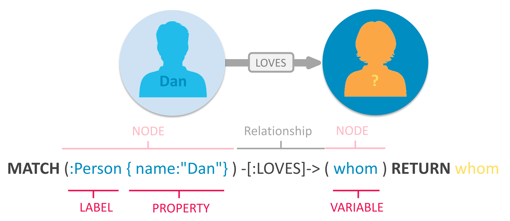

Смотир еще:

- [документация](https://neo4j.com/developer/cypher/)
- [[graphs]]
- [[neo4j]]
- [[python-api-neo4j]]

[//begin]: # "Autogenerated link references for markdown compatibility"
[graphs]: ../lists/graphs "Machine learning with graphs"
[neo4j]: neo4j "Neo4j graph data base"
[python-api-neo4j]: python-api-neo4j "Python api for neo4j"
[//end]: # "Autogenerated link references"