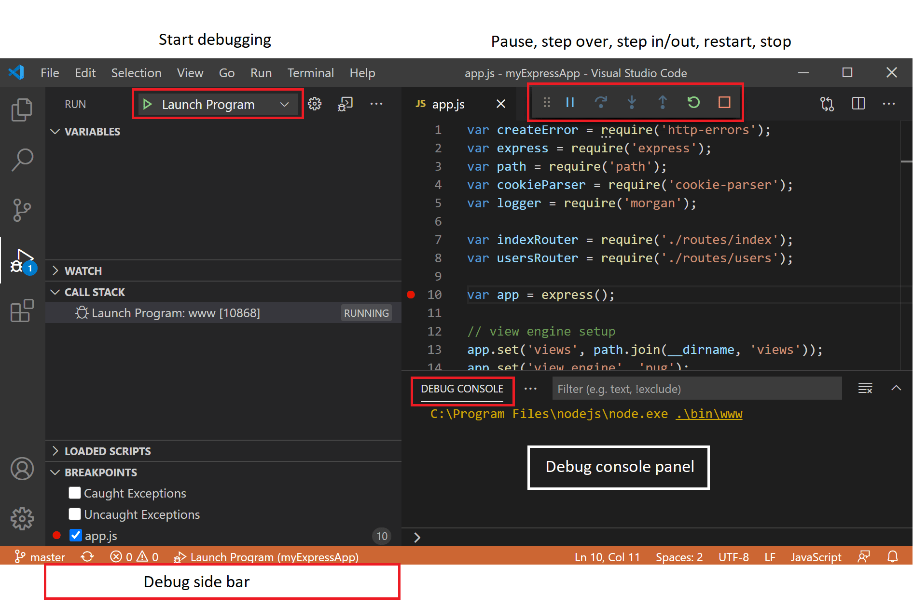

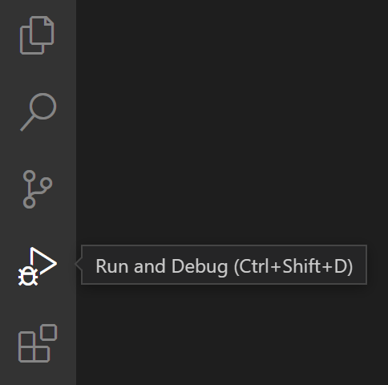

Если запуск и отладка еще не настроены (не создан `launch.js`), VSCode выдаст запрос на создание представления.

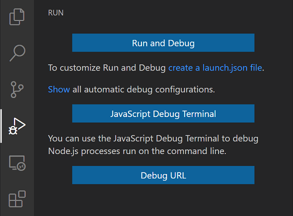

Выполнять можно через меню

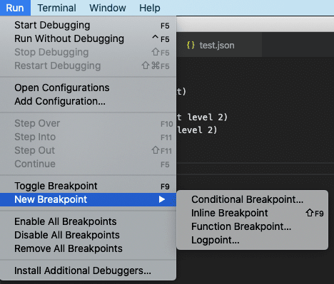

Для большинства сценариев отладки полезно создать файл конфигурации запуска, поскольку он позволяет настраивать и сохранять детали настройки отладки. VSCode сохраняет отладочную информацию о конфигурации в `launch.json` файле, расположенном в `.vscode` папке в вашей рабочей области (корневая папка проекта) или в ваших пользовательских настройках или настройках рабочей области .

VSCode попытается автоматически определить вашу среду отладки, но если это не удастся, вам придется выбрать ее вручную:

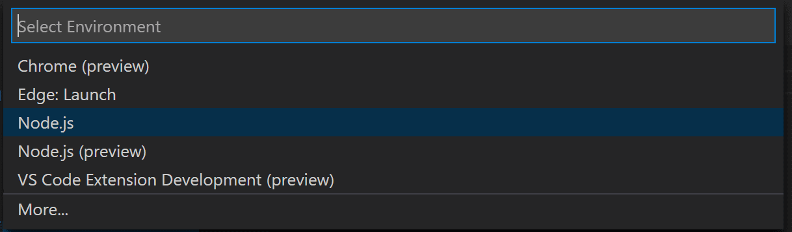

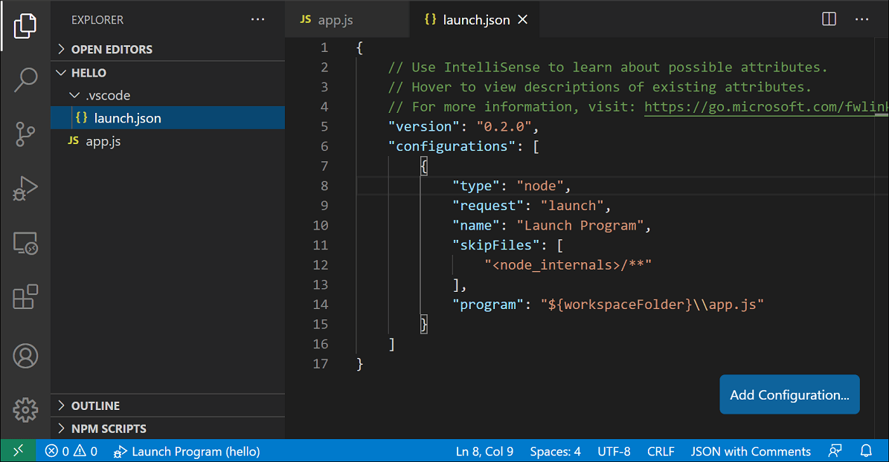

Обратите внимание, что атрибуты, доступные в конфигурациях запуска, различаются от отладчика к отладчику. Вы можете использовать предложения IntelliSense ( `Ctrl+Space` ), чтобы узнать, какие атрибуты существуют для определенного отладчика. Помощь при наведении также доступна для всех атрибутов.

Не думайте, что атрибут, доступный для одного отладчика, автоматически работает и для других отладчиков. Если вы видите зеленые волнистые линии в конфигурации запуска, наведите на них курсор, чтобы узнать, в чем проблема, и попытайтесь исправить ее перед запуском сеанса отладки.

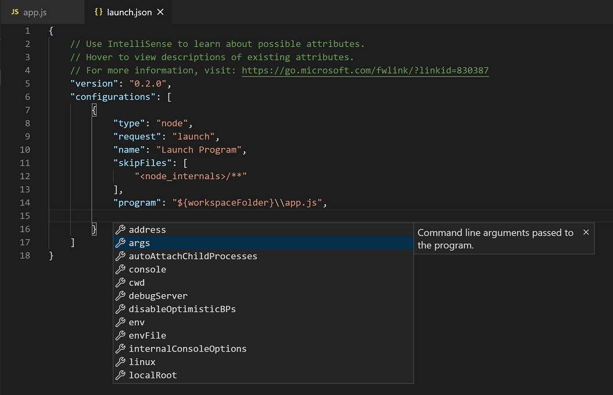

Просмотрите все автоматически сгенерированные значения и убедитесь, что они подходят для вашего проекта и среды отладки.

## Два вида конфигов

В VSCode есть два основных режима отладки, Launch и Attach, которые обрабатывают два разных рабочих процесса.

Если вы работаете с инструментами разработчика в браузере, возможно, вы не привыкли к «запуску из своего инструмента», поскольку экземпляр вашего браузера уже открыт. Когда вы открываете DevTools, вы просто прикрепляете DevTools к открытой вкладке браузера. С другой стороны, если вы пришли с сервера или рабочего стола, вполне нормально, что ваш редактор запускает ваш процесс за вас, и ваш редактор автоматически подключает свой отладчик к только что запущенному процессу.

Лучший способ объяснить разницу между Launch и Attach — представить Launch как способ запустить приложение в режиме отладки до того, как к нему подключится VSCode, в то время как Attach — это способ подключить VSCode, отладчик для приложения или процесса, которого уже запущен.

Отладчики VSCode обычно поддерживают запуск программы в режиме отладки или присоединение к уже запущенной программе в режиме отладки. В зависимости от запроса (attach или launch) требуются разные атрибуты, и launch.json помоагет в этом.

## Добавление конфига

Создать конфиг можно так:

- Используйте IntelliSense, если курсор находится внутри массива конфигураций.
- Нажмите кнопку «Добавить конфигурацию», чтобы вызвать фрагмент IntelliSense в начале массива.
- Выберите опцию «Добавить конфигурацию» в меню «Выполнить».

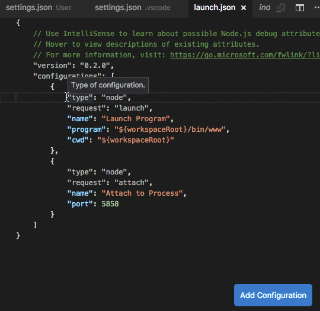

VSCode также поддерживает [составные конфигурации](https://code.visualstudio.com/docs/editor/debugging#_compound-launch-configurations) для одновременного запуска нескольких конфигураций.

Чтобы начать сеанс отладки, сначала выберите конфигурацию с именем Launch Program в раскрывающемся списке Configuration dropdown в представлении un and Debug. После того, как вы установили конфигурацию запуска, запустите сеанс отладки с помощью F5.

Кроме того, вы можете запустить свою конфигурацию через палитру команд ( `Ctrl + Shift + P` ), `Debug: Select and Start Debugging`.

Как только начинается сеанс отладки, отображается панель КОНСОЛИ ОТЛАДКИ и отображаются выходные данные отладки, а строка состояния меняет цвет (оранжевый для цветовых тем по умолчанию):

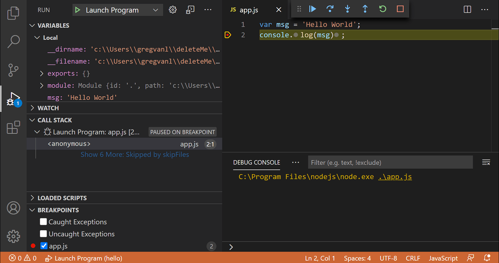

Кроме того, статус отладки отображается в строке состояния, показывающей активную конфигурацию отладки. Выбрав статус отладки, пользователь может изменить активную конфигурацию запуска и начать отладку, не открывая представление `Run and Debug`

## Дебаггинг


- продолжить до следующей точки / пауза выполнить текущую строку и приостановить
- переступить - выполнить следующий объект кода целиком не проверяя и не следуя его строкам
- шаг вверх/вниз выполнить шаг и отследить построчно
- выйти - выйти в более ранний контекст выполнения, если внутри метода или сабмодуля
- перезапустить - завершить выполнение отладки и снова запустить отладку
- прекратить выполнение

### Брейепоинты

- Точки останова на полях редактора обычно отображаются в виде красных закрашенных кружков.
- Отключенные точки останова отмечены серым кружком.
- Когда начинается сеанс отладки, точки останова, которые не могут быть зарегистрированы отладчиком, становятся серыми полыми кружками. То же самое может произойти, если исходный код редактируется во время сеанса отладки без поддержки редактирования в реальном времени.

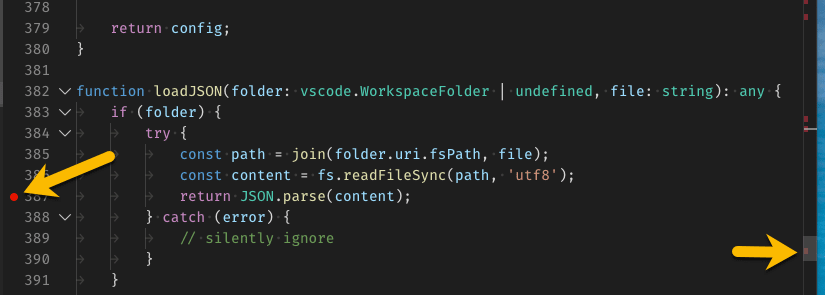

### Логпоинты

Логпойнт — это вариант точки останова, которая не входит в отладчик, а вместо этого выводит сообщение на консоль. Точки журналирования особенно полезны для вывода журналов при отладке рабочих серверов, которые нельзя приостановить или остановить.

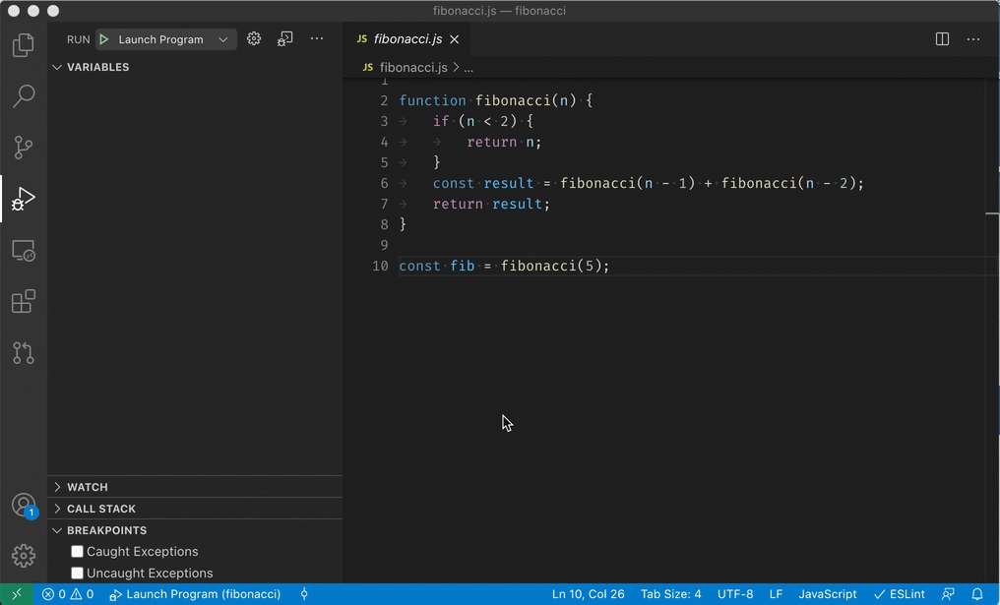

### Проверка данных

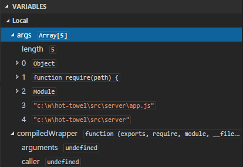

Значения переменных можно изменить с помощью действия «Установить значение» в контекстном меню переменной. Кроме того, вы можете использовать действие «Копировать значение» , чтобы скопировать значение переменной, или действие «Копировать как выражение» , чтобы скопировать выражение для доступа к переменной.

Переменные и выражения также можно оценивать и отслеживать в разделе WATCH представления Run and Debug .

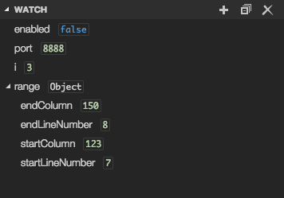

### Атрибуты launch.json

- type - the type of debugger to use for this launch configuration. Every installed debug extension introduces a type: node for the built-in Node debugger, for example, or php and go for the PHP and Go extensions.
- request - the request type of this launch configuration. Currently, launch and attach are supported.
- name - the reader-friendly name to appear in the Debug launch configuration dropdown.
- presentation - using the order, group, and hidden attributes in the presentation object, you can sort, group, and hide configurations and compounds in the Debug configuration dropdown and in the Debug quick pick.
- preLaunchTask - to launch a task before the start of a debug session, set this attribute to the label of a task specified in tasks.json (in the workspace's .vscode folder). Or, this can be set to ${defaultBuildTask} to use your default build task.
- postDebugTask - to launch a task at the very end of a debug session, set this attribute to the name of a task specified in tasks.json (in the workspace's .vscode folder).
- internalConsoleOptions - this attribute controls the visibility of the Debug Console panel during a debugging session.
- debugServer - for debug extension authors only: this attribute allows you to connect to a specified port instead of launching the debug adapter.
- serverReadyAction - if you want to open a URL in a web browser whenever the program under debugging outputs a specific message to the debug console or integrated terminal. For details see section Automatically open a URI when debugging a server program below.
- program - executable or file to run when launching the debugger
- args - arguments passed to the program to debug
- env - environment variables (the value null can be used to "undefine" a variable)
- envFile - path to dotenv file with environment variables
- cwd - current working directory for finding dependencies and other files
- port - port when attaching to a running process
- stopOnEntry - break immediately when the program launches
- console - what kind of console to use, for example, internalConsole, integratedTerminal, or externalTerminal

[Больше опций по настройки отладки смотри тут](https://code.visualstudio.com/docs/editor/debugging#_variable-substitution)

## [Python debugging](https://code.visualstudio.com/docs/python/debugging)

Если вы хотите отлаживать веб-приложение с помощью Flask, Django или [[fastapi]], расширение Python предоставляет динамически создаваемые конфигурации отладки на основе структуры вашего проекта в разделе «Показать все конфигурации автоматической отладки» в представлении «Выполнение и отладка».

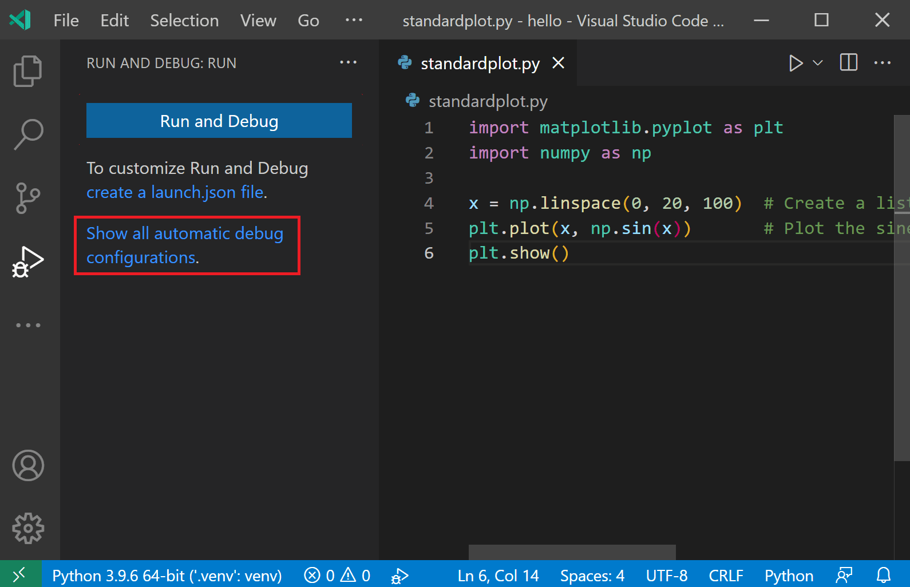

[Подробнее тут](https://fastapi.tiangolo.com/tutorial/debugging/)

[Пример дебага flask](https://code.visualstudio.com/docs/python/debugging#_debugging-specific-app-types)

Два распространенных варианта: использовать конфигурацию файла Python для запуска открытого в данный момент файла Python или использовать конфигурацию «Присоединить с помощью идентификатора процесса» для присоединения отладчика к уже запущенному процессу.

Отладчик также можно запустить из командной строки. Синтаксис командной строки отладчика следующий:

```sh
python -m debugpy
    --listen | --connect
    [<host>:]<port>
    [--wait-for-client]
    [--configure-<name> <value>]...
    [--log-to <path>] [--log-to-stderr]
    <filename> | -m <module> | -c <code> | --pid <pid>
    [<arg>]...
```

Например, из командной строки вы можете запустить отладчик, используя указанный порт (5678) и сценарий, используя следующий синтаксис. В этом примере предполагается, что сценарий выполняется в течение длительного времени, и `--wait-for-client` флаг снят, что означает, что сценарий не будет ждать подключения клиента.

```sh
python -m debugpy --listen 5678 ./myscript.py
```

Конфигурация в launch.json будет выглядеть так:

```json
{
  "name": "Python: Attach",
  "type": "python",
  "request": "attach",
  "connect": {
    "host": "localhost",
    "port": 5678
  }
}
```

[Подробнее тут](https://code.visualstudio.com/docs/python/debugging#_command-line-debugging)

Доступна отладка на сервере и отлатка по SSH.

Про конфигурирование launch.json для отладки python [читай тут](https://code.visualstudio.com/docs/python/debugging#_set-configuration-options).

[//begin]: # "Autogenerated link references for markdown compatibility"1[vscode]: ../lists/vscode "Vscode"1[pdb-python-debugger]: pdb-python-debugger "Pdb python debugger"1[devtools]: devtools "Python devtools"1[//end]: # "Autogenerated link references"
- [[pdb-python-debugger]]
- [[devtools]]
- [ipdb](https://github.com/gotcha/ipdb)


[//begin]: # "Autogenerated link references for markdown compatibility"
[fastapi]: fastapi "Fastapi"
[pdb-python-debugger]: pdb-python-debugger "Pdb python debugger"
[devtools]: devtools "Python devtools"
[//end]: # "Autogenerated link references"