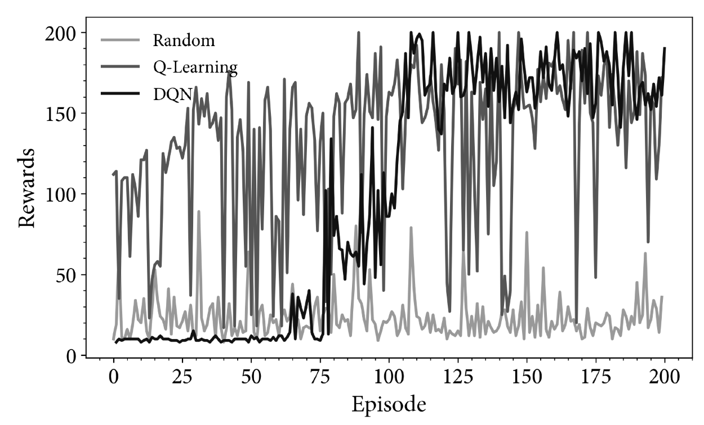

В глубоком Q-обучении в качестве аппроксиматоров используются нелинейное приближение. Используются глубокие Q-сети (deep Q-networks, DQN).

Главная проблема DQN - высокая корреляция данных  в связи с использованием [[mppr]]в задачах RL. Последующие наблюдения зависят от предыдущих. Один из ранних подходов для разрешения корреляций в DQN - воспроизведение опыта, для чего применялся буфер наблюдений, действий, вознаграждений и последующих наблюдений. В дальнейшем был предложен поход "клонов" DQN - одна сеть занимается исследованием, а вторая обучается.

Сама архитектура сети зависит от обучаемой проблемы. Для экспериментов с Atary Games, очевидно, подходили CNN. Пример DQN для среды [CartPole](https://rl-book.com/learn/drl/cartpole_coach/)

Варианты улучшения DQN:

- [rainbow DQN](https://rl-book.com/learn/drl/atari_coach/)
- буфер DQN с приоритетным воспроизведением опыта - выборка по значениям с вероятностью, пропорциональной абсолютной ошибке обновления с учетом [[temporal-difference]]
- зашумленные сети (для улучшения $$\varepsilon$$-жадного поиска в сеть добавляется шум)
- дуэльные сети - одна сеть отвечает за оценку функции ценности состония (среднее значение по всем действиям для этого состояния), другая за функцию преимущества (представляет отдельные действия относительно функции ценности состояния), затем это комбинируется для вывода требуемой функции ценности действия.
- BDQN - бустрапированная DQN
- обучение на основе автономных данных ([batch-constrained deep Q-learning](https://rl-book.com/learn/drl/bcq_coach/))

Смотри еще:

- [[reinforcement-learning]]
- [[temporal-difference]]
- [[policy-gradient-methods]]
- [[another-and-nonstandart-methods-of-reinforcement-learning]]

[//begin]: # "Autogenerated link references for markdown compatibility"
[mppr]: mppr "MPPR"
[temporal-difference]: temporal-difference "Temporal difference methods and n-steps methods"
[reinforcement-learning]: ..%2Flists%2Freinforcement-learning "Reinforcement learning"
[policy-gradient-methods]: policy-gradient-methods "Policy Gradient Methods"
[another-and-nonstandart-methods-of-reinforcement-learning]: another-and-nonstandart-methods-of-reinforcement-learning "Another and nonstandart methods of reinforcemebt learning"
[//end]: # "Autogenerated link references"