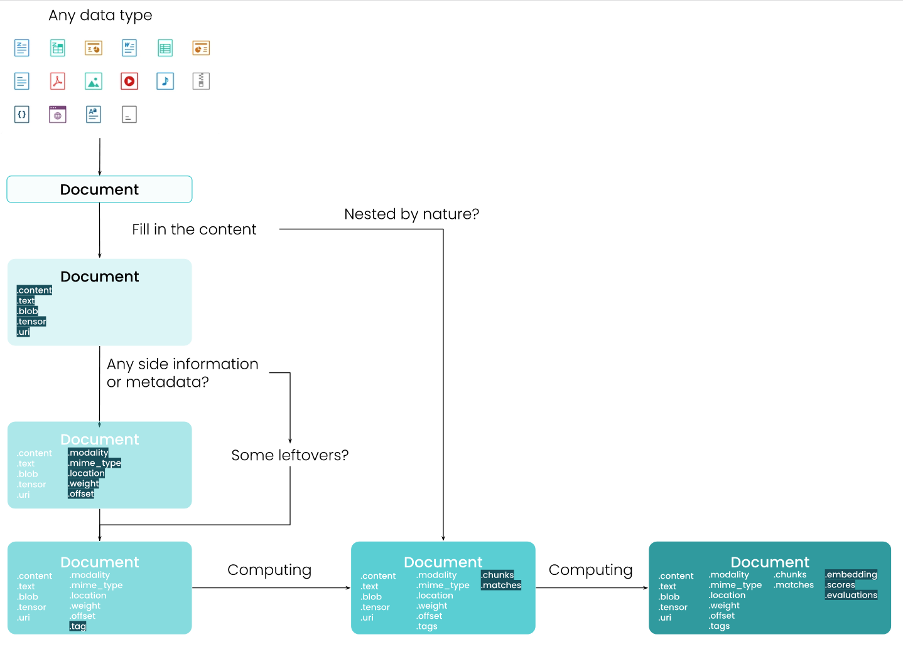
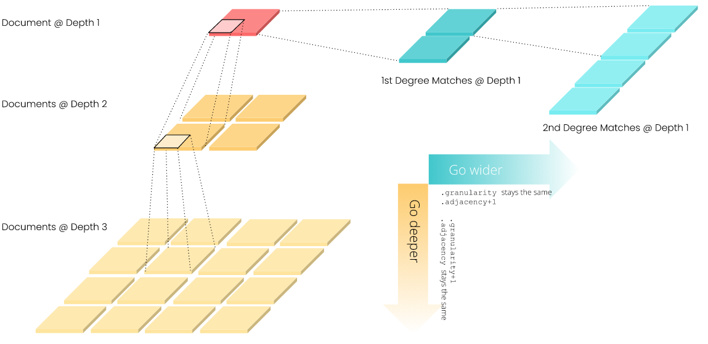
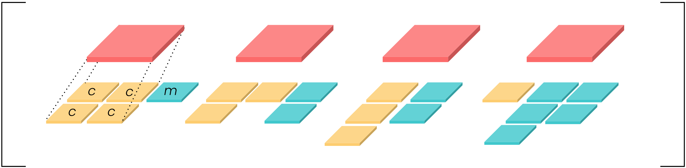

DocArray — это библиотека для вложенных, неструктурированных данных, включая текст, изображения, аудио, видео, 3в и т. д. Она позволяет инженерам глубокого обучения эффективно обрабатывать, внедрять, искать, рекомендовать, хранить и передавать данные с помощью python API.

`pip install docarray`

```python
>>> import docarray
>>> docarray.__version__
'0.1.0'
>>> from docarray import Document, DocumentArray
```

Зависимости:

- `protobuf` advanced serialization
- `lz4` compression in seralization
- [[requests]] push/pull to Jina Cloud
- [[matplotlibe]] visualizing image sprites
- [[PIL]] data-related IO
- [[fastapi]] used in embedding projector of DocumentArray
- [[uvicorn]] used in embedding projector of DocumentArray
- [[scipy]] for sparse embedding, tensors
- `av` for video processing and IO
- `trimesh` for 3D mesh processing and IO
- `weaviate-client` for using Weaviate-based document store
- `annlite` for using Annlite-based document store
- `qdrant-client` for using Qdrant-based document store
- `strawberry-graphql` for [[graphql]] support

DocArray состоит из трех простых понятий:

- `Document`: структура данных для удобного представления вложенных, неструктурированных данных.
- `DocumentArray`: контейнер для эффективного доступа, обработки и понимания нескольких документов.
- `Dataclass`: высокоуровневый API для интуитивно понятного представления мультимодальных данных.

DocArray спроектирован так, чтобы быть чрезвычайно интуитивно понятным для пользователей Python, не требует изучения нового синтаксиса. DocArray предназначен для максимального использования локального опыта с требованием готовности к облаку в любое время. DocArray предназначен для интуитивного представления мультимодальных данных.

## Document

Document — это основной тип данных в DocArray. Независимо от того, работаете ли вы с текстом, изображением, видео, аудио, 3D-сетками или вложенными или объединенными из них, вы всегда можете представить их как документ.



Дата-схема документа.

| Attribute | Type | Description |
|-|-|-|
| id| string| A hexdigest that represents a unique document ID |
| blob| bytes| the raw binary content of this document, which often represents the original document |
| tensor| ndarray-like| the ndarray of the image/audio/video document |
| text| string| a text document |
| granularity| int| the depth of the recursive chunk structure |
| adjacency| int| the width of the recursive match structure |
| parent_id| string| the parent id from the previous granularity |
| weight| float| The weight of this document |
| uri| string| a uri of the document could be: a local file path, a remote url starts with http or https or data URI scheme |
| modality| string | modality, an identifier to the modality this document belongs to. In the scope of multi/cross modal search |
| mime_type| string| mime type of this document, for blob content, this is required; for other contents, this can be guessed |
| offset| float| the offset of the doc |
| location| float| the position of the doc, could be start and end index of a string; could be x,y (top, left) coordinate of an image crop; could be timestamp of an audio clip |
| chunks| DocumentArray |
| list of the sub-documents of this document (recursive structure) |
| matches| DocumentArray| the matched documents on the same level (recursive structure) |
| embedding| ndarray-like| the embedding of this document |
| tags| dict| a structured data value, consisting of field which map to dynamically typed values. |
| scores| NamedScore| Scores performed on the document, each element corresponds to a metric |
| evaluations| NamedScore| Evaluations performed on the document, each element corresponds to a metric |

- связано с контентом: uri, text, tensor, blob;
- связано с вложенными структурами: chunks, matches, granularity, adjacency, parent_id;
- метаданные: id, modality, mime_type, offset, location, weight;
  - доп.информация: tags;
- связано с вычислениями: scores, evaluations, embedding.

### Конструирование Document

Пустой документ

```python
from docarray import Document

d = Document()

<Document ('id',) at 5dd542406d3f11eca3241e008a366d49>

# get id
import uuid
str(uuid.UUID(d.id))
```

Документ с атрибутами (при выводе объекта печатаются только непустые атрибуты)

```python
from docarray import Document
import numpy

d1 = Document(text='hello')
d2 = Document(blob=b'\f1')
d3 = Document(tensor=numpy.array([1, 2, 3]))
d4 = Document(uri='https://jina.ai',
              mime_type='text/plain',
              granularity=1,
              adjacency=3,
              tags={'foo': 'bar'})

<Document ('id', 'mime_type', 'text') at a14effee6d3e11ec8bde1e008a366d49>
<Document ('id', 'blob') at a14f00986d3e11ec8bde1e008a366d49>
<Document ('id', 'tensor') at a14f01a66d3e11ec8bde1e008a366d49>
<Document ('id', 'granularity', 'adjacency', 'mime_type', 'uri', 'tags') at a14f023c6d3e11ec8bde1e008a366d49>
```

Варианты инициализации:

```python
d1 = Document(uri='https://jina.ai',
              mime_type='text/plain',
              granularity=1,
              adjacency=3)

d2 = Document(dict(uri='https://jina.ai',
                   mime_type='text/plain',
                   granularity=1,
                   adjacency=3))

d3 = Document({'uri': 'https://jina.ai',
               'mime_type': 'text/plain',
               'granularity': 1,
               'adjacency': 3})
```

Вложенный документ (можно вкладывать внутри chunks и matches)

```python
from docarray import Document

d = Document(
    id='d0',
    chunks=[Document(id='d1', chunks=Document(id='d2'))],
    matches=[Document(id='d3')],
)

print(d)
<Document ('id', 'chunks', 'matches') at d0>

d

<Document ('id', 'chunks', 'matches') at d0>
└─ matches
        └─ <Document ('id',) at d3>
└─ chunks
        └─ <Document ('id', 'chunks') at d1>
            └─ chunks
                └─ <Document ('id', 'parent_id', 'granularity') at d2>
```

Все неизвестные атрибуты автоматически переносятся в теги. Это имзененеие можно извенить чтобы дропать неизвестные атрибуты или поднимать атрибутеррор. Кроме того можно задавать правила разрешения таких атрибутов.

```python
from docarray import Document

d = Document(hello='world')

print(d, d.tags)
<Document ('id', 'tags') at f957e84a6d4311ecbea21e008a366d49>
{'hello': 'world'}
```

Копирование из другого документа

```python
from docarray import Document

d = Document(text='hello')
d1 = Document(d, copy=True)

print(d==d1, id(d)==id(d1))
True False
```

### Сериализация

DocArray спроектирован так, чтобы быть «готовым к подключению»: предполагается, что вы всегда хотите отправлять/получать Document по сети через микросервисы. Следовательно сериализация имеет значение.

- From/to JSON

    ```python
    from docarray import Document
    import numpy as np

    d_as_json = Document(text='hello, world', embedding=np.array([1, 2, 3])).to_json()

    d = Document.from_json(d_as_json)

    print(d_as_json, d)
    {"id": "641032d677b311ecb67a1e008a366d49", "parent_id": null, "granularity": null, "adjacency": null, "blob": null, "tensor": null, "mime_type": "text/plain", "text": "hello, world", "weight": null, "uri": null, "tags": null, "offset": null, "location": null, "embedding": [1, 2, 3], "modality": null, "evaluations": null, "scores": null, "chunks": null, "matches": null}

    <Document ('id', 'mime_type', 'text', 'embedding') at 641032d677b311ecb67a1e008a366d49>
    ```

    Используется [[pydantic]] схема по дефолту. Можно переключиться на Protobuf. Кроме того, можно вносить измененеия на лету, к примеру скипать None, пропускать другие поля или менять прописные буквы на строчные и наоборот. Кроме того, можно использовать json без схемы

- From/to bytes

    ```python
    from docarray import Document
    import numpy as np

    d = Document(text='hello, world', embedding=np.array([1, 2, 3]))
    d_bytes = d.to_bytes()

    d_r = Document.from_bytes(d_bytes)

    print(d_bytes, d_r)
    b'\x80\x03cdocarray.document\nDocument\nq\x00)\x81q\x01}q\x02X\x05\x00\x00\x00_dataq\x03cdocarray.document.data\nDocumentData\nq\x04)\x81q\x05}q\x06(X\x0e\x00\x00\x00_reference_docq\x07h\x01X\x02\x00\x00\x00idq\x08X \x00\x00\x005d29a9f26d5911ec88d51e008a366d49q\tX\t\x00\x00\x00parent_...

    <Document ('id', 'mime_type', 'text', 'embedding') at 3644c0fa6d5a11ecbb081e008a366d49>
    ```

- From/to base64
- From/to Protobuf
- From/to dict

    ```python
    from docarray import Document
    import numpy as np

    d_as_dict = Document(text='hello, world', embedding=np.array([1, 2, 3])).to_dict()

    d = Document.from_dict(d_as_dict)

    print(d_as_dict, d)
    {'id': '5596c84c77b711ecafed1e008a366d49', 'parent_id': None, 'granularity': None, 'adjacency': None, 'blob': None, 'tensor': None, 'mime_type': 'text/plain', 'text': 'hello, world', 'weight': None, 'uri': None, 'tags': None, 'offset': None, 'location': None, 'embedding': [1, 2, 3], 'modality': None, 'evaluations': None, 'scores': None, 'chunks': None, 'matches': None}

    <Document ('id', 'mime_type', 'text', 'embedding') at 5596c84c77b711ecafed1e008a366d49>
    ```

### Доступ к атрибутам

Можно так

```python
from docarray import Document

d = Document()
d.text = 'hello world'

print(d.text)
'hello world'

d.text = None

# or
d.pop('text')

# or multiple
d.pop('text', 'id', 'mime_type')
```

Контентные атрибуты:

| Attribute | Accept type | Use case |
|-|-|-|
| doc.text | Python string | Contain text |
| doc.tensor | A Python (nested) list/tuple of numbers, Numpy ndarray, SciPy sparse matrix (spmatrix), TensorFlow dense & sparse tensor, PyTorch dense & sparse tensor, PaddlePaddle dense tensor | Contain image/video/audio |
| doc.blob | Binary string | Contain intermediate IO buffer |

**Каждый документ может содержать только один тип контента**. Чтобы получить документ с мульти-содержимым (к примеру моделирующий PDF-файл), надо использовать вложенные документы.

Существует также геттер/сеттер `.content` для полей контента. Контент будет автоматически захвачен или назначен текстовому, BLOB-объекту или тензорному полю в зависимости от типа объекта, котоырй помещается в документ.

```python
from docarray import Document

d = Document(content='hello')
print(d)
<Document ('id', 'mime_type', 'text') at b4d675466d6211ecae8d1e008a366d49>

d.content = [1, 2, 3]
print(d)
<Document ('id', 'tensor', 'mime_type') at 2808eeb86d6311ecaddb1e008a366d49>
```

Контент можно загрузить из URIю Доступно несколько методов загрузки

```python
from docarray import Document

d1 = Document(uri='apple.png').load_uri_to_image_tensor()
print(d1.content_type, d1.content)
tensor [[[255 255 255]
  [255 255 255]
  [255 255 255]
  ...
```

Пример такой загрузки [для изображений](https://docarray.jina.ai/datatypes/image/#image-type) - можно получать данные по uri, конвертировать, сохранять в файлы, получать спрайты и сегменты.

### Эмбединги

Как и `.tensor`, вы можете назначить эмбеддинг с помощью Python(вложенного) List/Tuple, Numpy ndarray, разреженной матрицы SciPy (spmatrix), плотного и разреженного тензора TensorFlow, плотного и разреженного тензора PyTorch или плотного тензора PaddlePaddle.

```python
import numpy as np
import scipy.sparse as sp
import torch
import tensorflow as tf

from docarray import Document

d0 = Document(embedding=[1, 2, 3])
d1 = Document(embedding=np.array([1, 2, 3]))
d2 = Document(embedding=np.array([[1, 2, 3], [4, 5, 6]]))
d3 = Document(embedding=sp.coo_matrix([0, 0, 0, 1, 0]))
d4 = Document(embedding=torch.tensor([1, 2, 3]))
d5 = Document(embedding=tf.sparse.from_dense(np.array([[1, 2, 3], [4, 5, 6]])))
```

Как только в документе установлено поле контента, вы можете использовать глубокую нейронную сеть для `embeded()`, что означает заполнение `.embedding`.

```python
q = (Document(uri='/Users/hanxiao/Downloads/left/00003.jpg')
     .load_uri_to_image_tensor()
     .set_image_tensor_normalization()
     .set_image_tensor_channel_axis(-1, 0))

import torchvision
model = torchvision.models.resnet50(pretrained=True)
q.embed(model)
```

Можно искать ближайших соседей

```python
from docarray import DocumentArray, Document
import numpy as np

da = DocumentArray.empty(10)
da.embeddings = np.random.random([10, 256])

q = Document(embedding=np.random.random([256]))
q.match(da)

q.summary()

<Document ('id', 'embedding', 'matches') at 63a39fa86d6911eca6fa1e008a366d49>
└─ matches
        ├─ <Document ('id', 'adjacency', 'embedding', 'scores') at 63a39aee6d6911eca6fa1e008a366d49>
        ├─ <Document ('id', 'adjacency', 'embedding', 'scores') at 63a399d66d6911eca6fa1e008a366d49>
        ├─ <Document ('id', 'adjacency', 'embedding', 'scores') at 63a39b346d6911eca6fa1e008a366d49>
        ├─ <Document ('id', 'adjacency', 'embedding', 'scores') at 63a3999a6d6911eca6fa1e008a366d49>
        ├─ <Document ('id', 'adjacency', 'embedding', 'scores') at 63a39a626d6911eca6fa1e008a366d49>
        ├─ <Document ('id', 'adjacency', 'embedding', 'scores') at 63a397ba6d6911eca6fa1e008a366d49>
        ├─ <Document ('id', 'adjacency', 'embedding', 'scores') at 63a39a1c6d6911eca6fa1e008a366d49>
        ├─ <Document ('id', 'adjacency', 'embedding', 'scores') at 63a39ab26d6911eca6fa1e008a366d49>
        ├─ <Document ('id', 'adjacency', 'embedding', 'scores') at 63a399046d6911eca6fa1e008a366d49>
        └─ <Document ('id', 'adjacency', 'embedding', 'scores') at 63a399546d6911eca6fa1e008a366d49>
```

### Вложенные структуры

Документ может быть вложен как горизонтально, так и вертикально с помощью .matches и .chunks. На рисунке ниже показана рекурсивная структура документа.



| Attribute | Description |
|-|-|
| doc.chunks | The list of sub-Documents of this Document. They have granularity + 1 but same adjacency |
| doc.matches| The list of matched Documents of this Document. They have adjacency + 1 but same granularity |
| doc.granularity | The "depth" of the nested chunks structure |
| doc.adjacency | The "width" of the nested match structure |

```python
# constructor
d = Document(chunks=[Document(), Document()], matches=[Document(), Document()])

# add to document
d = Document()
d.chunks = [Document(), Document()]
d.matches = [Document(), Document()]

# add to chunks and matches
d = Document()
d.chunks = [Document(), Document()]
d.matches = [Document(), Document()]

# stats
d.summary()
```

### Visuzlisation

`d.display()` [для изображений и uri изображений](https://docarray.jina.ai/api/docarray.document.mixins.plot/#module-docarray.document.mixins.plot) и `d.summary()` для вложенных структур.

### [Список методов и пример интерфейса](https://docarray.jina.ai/fundamentals/document/fluent-interface/)

## DocumentArray

DocumentArray — это похожий на список контейнер объектов Document. Это лучший способ при работе с несколькими документами. Короче говоря, вы можете просто рассматривать его как список Python, поскольку он реализует все интерфейсы списка. Он также эффективен, как Numpy ndarray и Pandas DataFrame, позволяя вам эффективно получать доступ к элементам и атрибутам содержащихся документов. Наконец, еслиданные слишком велики для размещения в памяти, можно просто переключиться на диск.



### Создание DocumentArray

Пустой

```python
from docarray import DocumentArray

da = DocumentArray()

<DocumentArray (length=0) at 4453362704>
```

Добавление документов

```python
da.append(Document(text='hello world!'))
da.extend([Document(text='hello'), Document(text='world!')])

<DocumentArray (length=3) at 4446140816>
```

Статистика

```python
da.summary()

                  Documents Summary

  Length                 3
  Homogenous Documents   True
  Common Attributes      ('id', 'mime_type', 'text')

                     Attributes Summary

  Attribute   Data type   #Unique values   Has empty value
 ──────────────────────────────────────────────────────────
  id          ('str',)    3                False
  mime_type   ('str',)    1                False
  text        ('str',)    3                False
```

Можно создавать плейсхолдеры:

```python
from docarray import DocumentArray

da = DocumentArray.empty(10)

<DocumentArray (length=10) at 4453362704>
```

Из спископодобных объектов, Document или даже из других объектов DocumentArray

```python
from docarray import DocumentArray, Document

da = DocumentArray([Document(text='hello'), Document(text='world')])

<DocumentArray (length=2) at 4866772176>
```

```python
from docarray import DocumentArray, Document

d1 = Document(text='hello')
da = DocumentArray(d1)

<DocumentArray (length=1) at 4452802192>
```

```python
from docarray import DocumentArray

da1 = DocumentArray.empty(3)
da2 = DocumentArray.empty(4)
da3 = DocumentArray.empty(5)
print(da1 + da2 + da3)

<DocumentArray (length=12) at 5024988176>

da1 += da2
print(da1)

<DocumentArray (length=7) at 4525853328>
```

Как и в списке Python, **добавление объекта Document в DocumentArray добавляет только его ссылку на память**. Исходный документ не копируется. Если вы впоследствии измените исходный документ, то документ внутри DocumentArray также изменится. Чтобы сделать глубокую копию, установите `DocumentArray(..., copy=True)`. Теперь все документы в этом DocumentArray являются совершенно новыми объектами с идентичным содержимым исходным.

```python
from docarray import DocumentArray, Document

d1 = Document(text='hello')
da = DocumentArray(d1, copy=True)

print(da[0].text)
'hello'

d1.text = 'world'
print(da[0].text)
'hello'
```

DocumentArray можно сконтсруирвоать непосредственно из локального файла. Этот метод конструирует документы на лету

```python
from docarray import DocumentArray

da_jpg = DocumentArray.from_files('images/*.jpg')
da_png = DocumentArray.from_files('images/*.png')
da_all = DocumentArray.from_files(['images/**/*.png', 'images/**/*.jpg', 'images/**/*.jpeg'])
```

### [Сериализация](https://docarray.jina.ai/fundamentals/documentarray/serialization/)

Так-же поддерживаются методы сериализации:

- JSON string: .from_json()/.to_json()
- Pydantic model: .from_pydantic_model()/.to_pydantic_model()
- Bytes (compressed): .from_bytes()/.to_bytes()
- Disk serialization: .save_binary()/.load_binary()
- Base64 (compressed): .from_base64()/.to_base64()
- Protobuf Message: .from_protobuf()/.to_protobuf()
- Python List: .from_list()/.to_list()
- Pandas Dataframe: .from_dataframe()/.to_dataframe()
- Cloud: .push()/.pull()

Можно сохранять бинарники на диск (и читать)

```python
from docarray import DocumentArray, Document

da = DocumentArray([Document(text='hello'), Document(text='world')])

da.save_binary('my_docarray.bin', protocol='protobuf', compress='lz4')
da_rec = DocumentArray.load_binary(
    'my_docarray.bin', protocol='protobuf', compress='lz4'
)
da_rec.summary()

                  Documents Summary

  Length                 2
  Homogenous Documents   True
  Common Attributes      ('id', 'mime_type', 'text')

                     Attributes Summary

  Attribute   Data type   #Unique values   Has empty value
 ──────────────────────────────────────────────────────────
  id          ('str',)    2                False
  mime_type   ('str',)    1                False
  text        ('str',)    2                False
```

Для больших данных предусмотрена потоковая сериализация.

### Доступ к документам

DocumentArray - это список и к нему можно получать доступ по индексу и срезам. Все способы доступа:

| Indexing routine | Example | Return |
|-|-|-|
| by integer | da[1], da[-1] | Document |
| by integers | da[1,2,3] | DocumentArray |
| by slice | da[1:10:2], da[5:] | DocumentArray |
| by id | da['a04633546e6211ec8ad31e008a366d49'] | Document |
| by ids | da['a04633546e6211ec8ad31e008a366d49', 'af7923406e6211ecbc811e008a366d49'] | DocumentArray |
| by boolean mask | da[True, False, True, False] | DocumentArray |
| by Ellipsis | da[...] | DocumentArray |
| by nested structure | da['@cm,m,c'], da['@c1:3m'], da['@r[1]m[2]'] | DocumentArray |
| by multimodal field | da['@.[banner]'], da['@.[banner].[image, summary]'] | DocumentArray |

[Подробнее](https://docarray.jina.ai/fundamentals/documentarray/access-elements/).

### Извлечение атрибутов документов

Можно использовать [селектор атрибутов](https://docarray.jina.ai/fundamentals/documentarray/access-attributes/#attribute-selector), чтобы извлекать значения атрибутов из содержащихся документов

| Example | Return |
|-|-|
| da[:, 'id'] | all .id in a List |
| da['@m', 'id'] | all .id from all Documents .matches |
| da[1:3, ('id', 'scores')] | a list of two list, first is all .id from the first three Documents, second is all .scores from the first three Documents |
| da[:, 'scores__cosine__value'] | all .scores['cosine'].value from the first three Documents |
| da[1:3, 'embedding'], da[1:3].embeddings | a NdArray-like object of the first three Documents embeddings |
| da[:, 'tensor'], da.tensors | a NdArray-like object of the all top-level Documents tensors |

```python
from docarray import DocumentArray

da = DocumentArray().empty(3)
for d in da:
    d.chunks = DocumentArray.empty(2)
    d.matches = DocumentArray.empty(2)

print(da[:, 'id'])
['8d41ce5c6f0d11eca2181e008a366d49', '8d41cfa66f0d11eca2181e008a366d49', '8d41cff66f0d11eca2181e008a366d49']
```

Реализован автоматический доступ к разным представления NdArray

```python
import numpy as np
import scipy.sparse
from docarray import DocumentArray

# build sparse matrix
sp_embed = np.random.random([3, 10])
sp_embed[sp_embed > 0.1] = 0
sp_embed = scipy.sparse.coo_matrix(sp_embed)

da = DocumentArray.empty(3)

da[:, 'embedding'] = sp_embed

print(type(da[:, 'embedding']), da[:, 'embedding'].shape)
for d in da:
    print(type(d.embedding), d.embedding.shape)

<class 'scipy.sparse.coo.coo_matrix'> (3, 10)
<class 'scipy.sparse.coo.coo_matrix'> (1, 10)
<class 'scipy.sparse.coo.coo_matrix'> (1, 10)
<class 'scipy.sparse.coo.coo_matrix'> (1, 10)
```

### [Запросы с условиями](https://docarray.jina.ai/fundamentals/documentarray/find/)

Мы можем использовать `find()` для выбора документов из DocumentArray на основе условий, указанных в объекте запроса. Можно использовать `da.find(query)` для фильтрации документов и получения ближайших соседей от da.

```python
from jina import Document, DocumentArray

da = DocumentArray(
    [
        Document(
            text='journal',
            weight=25,
            tags={'h': 14, 'w': 21, 'uom': 'cm'},
            modality='A',
        ),
        Document(
            text='notebook',
            weight=50,
            tags={'h': 8.5, 'w': 11, 'uom': 'in'},
            modality='A',
        ),
        Document(
            text='paper',
            weight=100,
            tags={'h': 8.5, 'w': 11, 'uom': 'in'},
            modality='D',
        ),
        Document(
            text='planner',
            weight=75,
            tags={'h': 22.85, 'w': 30, 'uom': 'cm'},
            modality='D',
        ),
        Document(
            text='postcard',
            weight=45,
            tags={'h': 10, 'w': 15.25, 'uom': 'cm'},
            modality='A',
        ),
    ]
)

da.summary()
```

### [Parallelization](https://docarray.jina.ai/fundamentals/documentarray/parallelization/)

- map(): для параллельной обработки Document by Document, возвращает элементов;
- map_batch(): для параллельной обработки мини-пакета DocumentArray, возвращает итератор DocumentArray;
- apply(): как и .map(), изменяет DocumentArray на месте;
- apply_batch(): как и .map_batch(), изменяет DocumentArray на месте.

### [Visualization](https://docarray.jina.ai/fundamentals/documentarray/visualization/)

### [Process via External Flow or Executor](https://docarray.jina.ai/fundamentals/documentarray/post-external/)

### [Embed via Neural Network](https://docarray.jina.ai/fundamentals/documentarray/embedding/)

### [Match Nearest Neighbours](https://docarray.jina.ai/fundamentals/documentarray/matching/)

### [Evaluate Matches](https://docarray.jina.ai/fundamentals/documentarray/evaluation/)

## [Dataclass](https://docarray.jina.ai/fundamentals/dataclass/)

Класс данных DocArray — это высокоуровневый API для представления мультимодального документа с использованием вложенной структуры документа. Он соответствует дизайну и идиоме стандартного класса данных Python, позволяя пользователям интуитивно представлять сложный мультимодальный документ и легко обрабатывать его с помощью Document/DocumentArray API

```python
from docarray import dataclass, Document
from docarray.typing import Image, Text, JSON


@dataclass
class WPArticle:
    banner: Image
    headline: Text
    meta: JSON

a = WPArticle(
    banner='dog-cat-flight.png',
    headline='Everything to know about flying with pets, from picking your seats to keeping your animal calm',
    meta={
        'author': 'Nathan Diller',
        'column': 'By the Way - A Post Travel Destination',
    },
)
```

```bash
📄 Document: cb25ccea837e8e2b33ef1e050bae1de2
└── 💠 Chunks
    ├── 📄 Document: df56a39e24f441108742b533c8710705
    │   ╭──────────────┬───────────────────────────────────────────────────────────────╮
    │   │ Attribute    │ Value                                                         │
    │   ├──────────────┼───────────────────────────────────────────────────────────────┤
    │   │ parent_id    │ cb25ccea837e8e2b33ef1e050bae1de2                              │
    │   │ granularity  │ 1                                                             │
    │   │ tensor       │ <class 'numpy.ndarray'> in shape (198, 254, 3), dtype: uint8  │
    │   │ mime_type    │ image/png                                                     │
    │   │ uri          │ dog-cat-flight.png                                            │
    │   │ modality     │ image                                                         │
    │   ╰──────────────┴───────────────────────────────────────────────────────────────╯
    ├── 📄 Document: 828f9c346a9f5862a55ea75188b1ae19
    │   ╭─────────────┬────────────────────────────────────────────────────────────────╮
    │   │ Attribute   │ Value                                                          │
    │   ├─────────────┼────────────────────────────────────────────────────────────────┤
    │   │ parent_id   │ cb25ccea837e8e2b33ef1e050bae1de2                               │
    │   │ granularity │ 1                                                              │
    │   │ text        │ Everything to know about flying with pets, from picking your   │
    │   │             │ seats to keeping your animal calm                              │
    │   │ modality    │ text                                                           │
    │   ╰─────────────┴────────────────────────────────────────────────────────────────╯
    └── 📄 Document: a76803e1bcddd0960e1a01d47132c064
        ╭─────────────┬────────────────────────────────────────────────────────────────╮
        │ Attribute   │ Value                                                          │
        ├─────────────┼────────────────────────────────────────────────────────────────┤
        │ parent_id   │ cb25ccea837e8e2b33ef1e050bae1de2                               │
        │ granularity │ 1                                                              │
        │ tags        │ {'meta': {'author': 'Nathan Diller', 'column': 'By the Way - A │
        │             │ Post Travel Destination'}}                                     │
        ╰─────────────┴────────────────────────────────────────────────────────────────╯
```

Смотри еще:

- [документация](https://docarray.jina.ai/)
- [примеры](https://docarray.jina.ai/datatypes/)
- [работа в Jupyter Notebook/Colab](https://docarray.jina.ai/fundamentals/notebook-support/)
- [работа в PyTorch/Deep Learning Frameworks](https://docarray.jina.ai/advanced/torch-support/)
- [использование FastAPI/Pydantic](https://docarray.jina.ai/fundamentals/fastapi-support/)
- [использование GraphQL](https://docarray.jina.ai/advanced/graphql-support/)
- [[jina]]
- [[machine-learning]]
- [[numpy]]

[//begin]: # "Autogenerated link references for markdown compatibility"
[requests]: requests "Requests"
[matplotlibe]: matplotlibe "Matplotlibe"
[PIL]: PIL "Pillow - обработка изображений"
[fastapi]: fastapi "Fastapi"
[uvicorn]: uvicorn "Uvicorn"
[scipy]: scipy "Scipy"
[graphql]: graphql "Язфк и система организации АПИ GraphQL"
[pydantic]: pydantic "Pydantic"
[jina]: jina "Jina"
[machine-learning]: ../lists/machine-learning "Алгоритмы машинного обучения"
[numpy]: numpy "Numpy"
[//end]: # "Autogenerated link references"