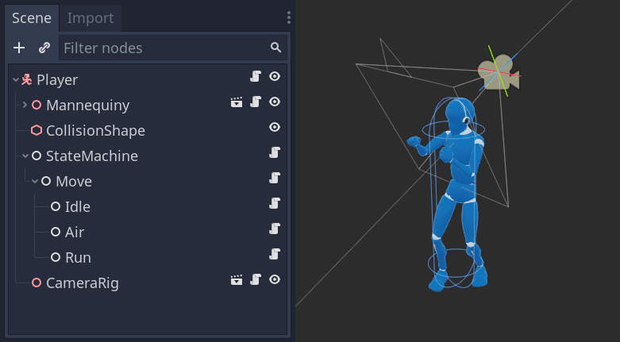
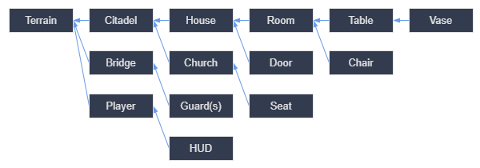
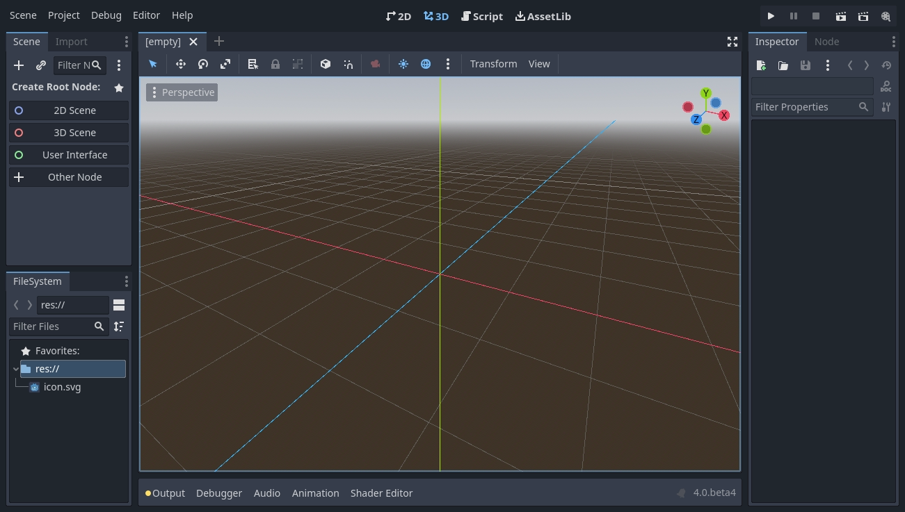
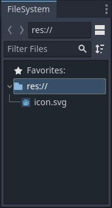
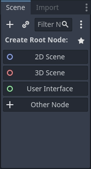
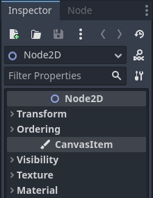

Кроссплатформенный опенсорсный движок, поддерживающий 2D и 3d разработку. Основные зяыки: GDScript и C#. Можно писать скрипты на [[c-plus-plus]] или C без рекомпиляции. [Документация](https://docs.godotengine.org/en/stable/index.html).

## Основные концепты

### Сцены

В Godot вы разбиваете свою игру на реюзабельные сцены. Сцена может быть персонажем, оружием, меню в пользовательском интерфейсе, отдельным домом, целым уровнем или чем угодно. Можно создавать иерархию сцен, вкладывая одну в другую.

### Ноды

Сцена состоит из одного или нескольких узлов (нод). Ноды — это наименьшие строительные блоки вашей игры, которые можно собирать в иерархические древоподобные структуры.

Имена узлов заканчиваются на «2D» для 2D-сцен. Их трехмерные аналоги имеют имена, оканчивающиеся на «3D». «Spatial» ноды называются «Node3D», начиная с Godot 4.

Godot предоставляет обширную библиотеку базовых типов нод, которые вы можете комбинировать и расширять для создания более мощных нод.

Все ноды имеют следующие характеристики:

- Имя.
- Редактируемые свойства.
- Они получают обратные вызовы для обновления каждого кадра.
- Вы можете расширить их новыми свойствами и функциями.
- Вы можете добавить их в другой узел как дочерний.

Последняя характеристика важна. Вместе узлы образуют дерево, которое является мощной функцией для организации проектов. Поскольку разные узлы имеют разные функции, их объединение приводит к более сложному поведению.

Дублируемые ноды могут как наследовать повдение своего класса, так ир еализовывать (переопределять) собственное повдение.

### Дерево сцены

Все сцены вашей игры собраны в дереве сцен. А поскольку сцены — это деревья нод, дерево сцен также является деревом нод.

После сохранения сцены работают как новые типы нод в редакторе, где вы можете добавить их как дочерние элементы существующей ноды. В этом случае экземпляр сцены отображается как единый узел со скрытыми внутренними элементами.

Сцены позволяют вам структурировать код вашей игры так, как вы хотите. Вы можете создавать ноды для создания пользовательских и сложных типов нод, таких как игровой персонаж, который бегает и прыгает, полоса жизни, сундук, с которым вы можете взаимодействовать, и многое другое.

Редактор Godot по сути является редактором сцен . Он имеет множество инструментов для редактирования 2D- и 3D-сцен, а также пользовательских интерфейсов. Проект Godot может содержать столько таких сцен, сколько вам нужно. Движку требуется только один объект в качестве основной сцены вашего приложения . Это сцена, которую Godot загрузит первой, когда вы или игрок запустите игру.

Сцены обладают следующими характеристиками:

- У них всегда есть один корневой узел/
- Вы можете сохранить их на свой локальный диск и загрузить позже.
- Вы можете создать столько экземпляров сцены, сколько захотите.

После того как вы сохранили сцену, она работает как план: вы можете воспроизвести ее в других сценах столько раз, сколько захотите. Репликация объекта из такого шаблона называется созданием экземпляров.

Экземпляры сцен ведут себя как ноды: редактор по умолчанию скрывает их содержимое. Каждый дубликат имеет уникальное имя.

Вот пример диаграммы сцены для игры с открытым миром с множеством ассетов и вложенных элементов:

Представьте, что мы начали с создания комнаты. Мы могли бы сделать пару разных комнатных сцен с уникальной расстановкой мебели в них. Позже мы могли бы создать сцену дома, в которой для интерьера использовалось бы несколько экземпляров комнаты. Мы создадим цитадель из множества инстансов домов и большого ландшафта, на котором мы разместим цитадель. Каждая из них будет сценой, создающей одну или несколько подсцен. Позже мы могли создать сцены, изображающие охранников, и добавить их в цитадель. Они будут косвенно добавлены в общий игровой мир.

### Сигналы

Узлы излучают сигналы, когда происходит какое-то событие. Эта функция позволяет вам заставить узлы обмениваться данными, не запрограммировав это жестко в коде. Это дает вам большую гибкость в том, как вы структурируете свои сцены. Сигнал реализует паттерн "наблюдатель"

## Редактор

Подробная информация в [руководстве по редактору](https://docs.godotengine.org/en/stable/tutorials/editor/index.html#toc-learn-editor)

Когда вы запускаете Godot, первое окно, которое вы видите, — это менеджер проектов. На вкладке «Локальные проекты» по умолчанию вы можете управлять существующими проектами, импортировать или создавать новые и т. д.

Когда вы открываете новый или существующий проект, появляется интерфейс редактора.

В центре находится окно просмотра с панелью инструментов вверху, где вы найдете инструменты для перемещения, масштабирования или блокировки нод сцены. По обеим сторонам окна просмотра находятся docks (доки). А внизу окна лежит нижняя панель. Содержимое панели инструментов меняется в зависимости от контекста и выбранной ноды.

В доке FileSystem перечислены файлы вашего проекта, включая сценарии, изображения, аудиосэмплы и многое другое.

В доке «Scene» перечислены ноды активной сцены.

Инспектор позволяет редактировать свойства выбранной ноды.

Нижняя панель, расположенная под окном просмотра, является хостом для консоли отладки, редактора анимации, аудиомикшера и многого другого.

В верхней части редактора расположены четыре кнопки основного экрана: 2D, 3D, Script и AssetLib.

Вы будете использовать 2D-экран для всех типов игр. Помимо 2D-игр, на 2D-экране вы будете создавать свои интерфейсы.

На 3D-экране вы можете работать с сетками, источниками света и уровнями дизайна для 3D-игр.

Экран «Script» — это полноценный редактор кода с отладчиком, расширенными возможностями линтинга и встроенным справочником по коду.

Наконец, AssetLib — это библиотека бесплатных надстроек, скриптов и ресурсов с открытым исходным кодом для использования в ваших проектах.

Встроенная справочная система:

- F1
- кнопка «Search Help»
- `ctrl` + клик на класс, метод и т.п.

Смотри еще:

- [сайт проекта](https://godotengine.org/)
- [docs](https://docs.godotengine.org/en/stable/index.html#), [github repo](https://github.com/godotengine/godot)
- [GDScripts](https://gdscript.com/) evolved as a custom scripting language to be used with the Godot computer (and mobile device) Game engine, and for those people who look beyond the real world, it also supports Virtual Reality.
- [Awesome Godot repo](https://github.com/godotengine/awesome-godot) A curated list of free/libre plugins, scripts and add-ons for Godot
- [Godot RL Agents](https://edbeeching.github.io/papers/gdrl) an open-source interface for developing [[reinforcement-learning]] environments and agents in the Godot Game Engine. [Tutorial](https://lupoglaz.github.io/GodotAIGym/tutorial_basic.html)
- [godot_rl_agents](https://github.com/edbeeching/godot_rl_agents) An Open Source package that allows video game creators, AI researchers and hobbyists the opportunity to learn complex behaviors for their Non Player Characters or agents
- [[gamedev]]

[//begin]: # "Autogenerated link references for markdown compatibility"
[c-plus-plus]: ../lists/c-plus-plus "Ресурсы по языку программирования С++"
[reinforcement-learning]: ../lists/reinforcement-learning "Reinforcement learning"
[gamedev]: ../lists/gamedev "Gamedev"
[//end]: # "Autogenerated link references"