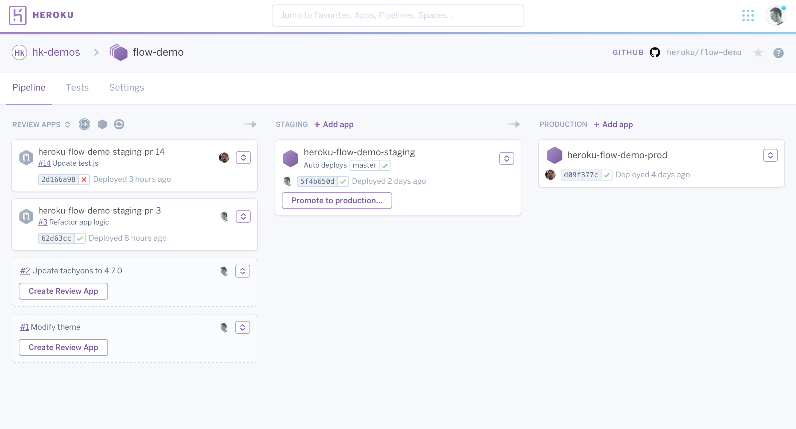

# heroku-piplines

[ССылка на статью](https://devcenter.heroku.com/articles/pipelines)

Pipline - это группа [[heroku]] приложений, объединенных общей кодовой базой для реализации воркфлоу:

- Development
- Review
- Staging
- Production

Приложения можно запихать в пайплайн из дашборда или через cli

[[heroku]]
