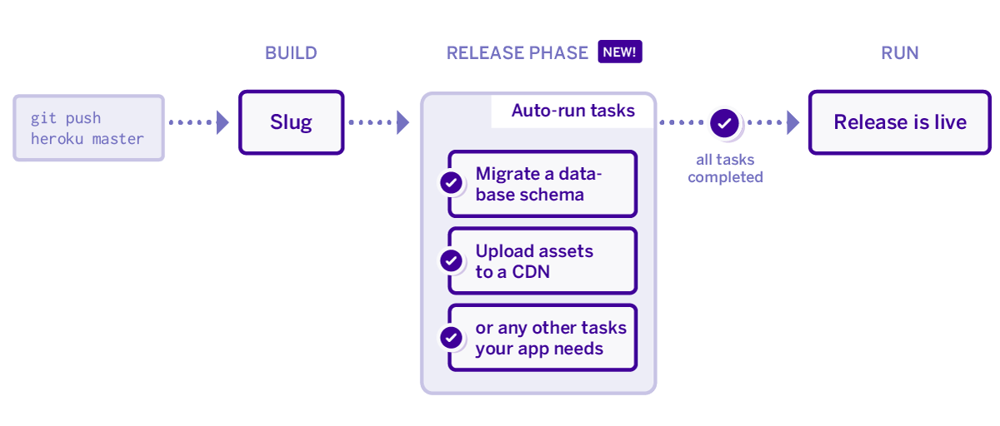

[Статья](https://devcenter.heroku.com/articles/release-phase)

```shell
release: ./release-tasks.sh
web: gunicorn myproject.wsgi
```

или

```shell
release: python manage.py migrate
web: gunicorn myproject.wsgi
```

Для [[alembic]]

```shell
release: alembic upgrade head
```

Релиз выполняется, когда:

- successful app build
- change to the value of a config var (unless the config var is associated with an add-on)
- pipeline promotion
- rollback
- release via the platform API
- Provisioning a new add-on



- [[heroku]]
- [[heroku-piplines]]
- [[requirements]]


[alembic]: alembic "Alembic"
[heroku]: ../lists/heroku "Heroku"
[heroku-piplines]: heroku-piplines "Heroku piplines"
[requirements]: requirements "Requirements.txt"
