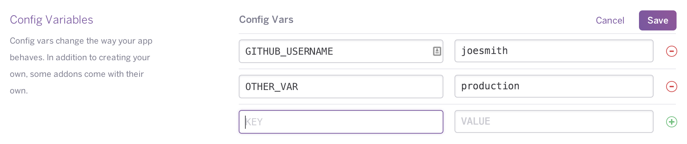

[Статья](https://devcenter.heroku.com/articles/config-vars)



Доступ к БД устанавливать через энвирон. Требуется `psycopq2` для постгреса.

```python
DATABASE_URL = os.environ.get('DATABASE_URL')
```

Для переменных локально использовать [[dot-env]]

- [[heroku]]
- [[requirements]]
- [[heroku-piplines]]
- [[heroku-release-phase]]

[//begin]: # "Autogenerated link references for markdown compatibility"
[dot-env]: dot-env "Dot-env"
[heroku]: ..%2Flists%2Fheroku "Heroku"
[requirements]: requirements "Requirements.txt"
[heroku-piplines]: heroku-piplines "Heroku piplines"
[heroku-release-phase]: heroku-release-phase "Heroku release phase"
[//end]: # "Autogenerated link references"