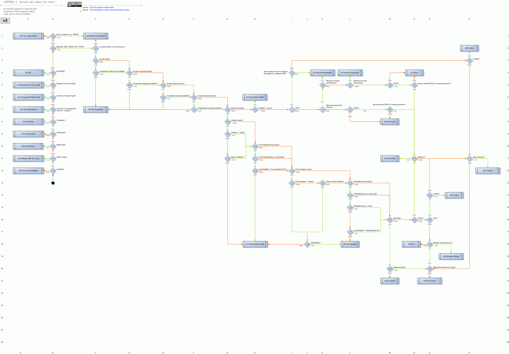

# Http-requests

Коды ошибок и когда их применять

[Статья в вики](https://ru.wikipedia.org/wiki/%D0%A1%D0%BF%D0%B8%D1%81%D0%BE%D0%BA_%D0%BA%D0%BE%D0%B4%D0%BE%D0%B2_%D1%81%D0%BE%D1%81%D1%82%D0%BE%D1%8F%D0%BD%D0%B8%D1%8F_HTTP)

- [[http]]
- [[requests]] библиотека python
- [[fastapi-requests-errors]]
- [[fastapi-change-error-meaasage]]
- [[starlete-список-кодов]]

[//begin]: # "Autogenerated link references for markdown compatibility"
[http]: ../lists/http "Http"
[requests]: requests "Requests"
[fastapi-requests-errors]: fastapi-requests-errors "Fastapi requests errors"
[fastapi-change-error-meaasage]: fastapi-change-error-meaasage "Fastapi change error meaasage"
[starlete-список-кодов]: starlete-список-кодов "Starlette список кодов"
[//end]: # "Autogenerated link references"