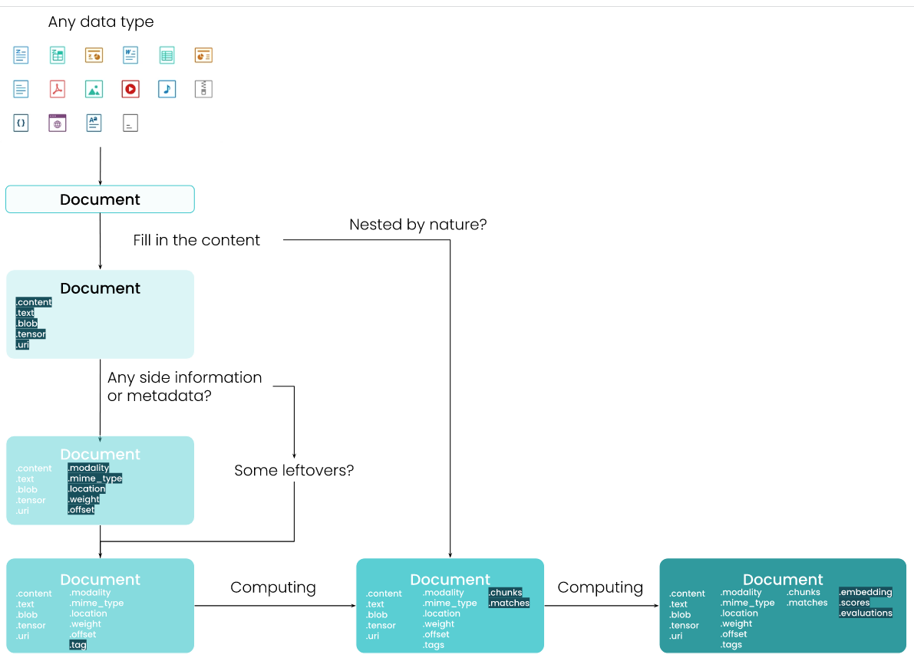
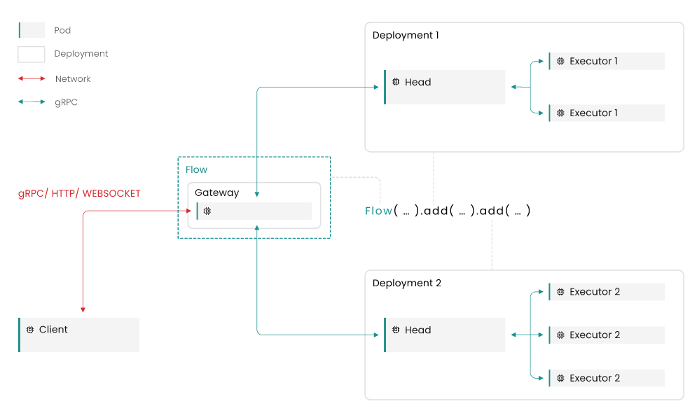
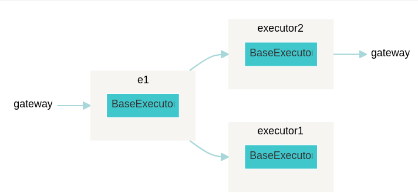
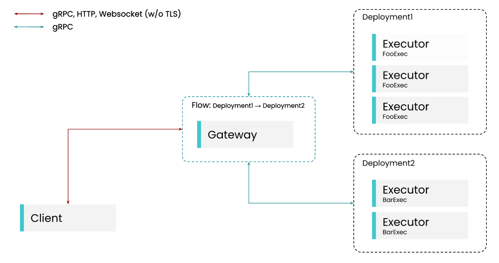

Jina — это платформа нейронного поиска, которая позволяет любому создавать SOTA и масштабируемые приложения нейронного поиска за считанные минуты.

Основная идея нейронного поиска заключается в использовании самых современных глубоких нейронных сетей для создания каждого компонента поисковой системы. Короче говоря, нейронный поиск — это глубокий поиск информации с помощью нейронной сети. Jina обеспечивает расширенный анализ всех видов неструктурированных данных, таких как изображения, аудио, видео, PDF, 3D.

Jina использует DocArray в качестве основной структуры данных; Jina Hub для совместного использования, контейнеризации и повторного использования компонентов поисковых конвейеров. Jina разработана как компактная и простая в использовании структура. Есть только две основные концепции, которые нужно изучить:

- Executor является самодостаточным компонентом и выполняет группу задач над документами.
- Flow объединяет исполнителей в конвейер обработки, обеспечивает масштабируемость и упрощает развертывание в облаке.

## Start project

`pip install -U jina`

`jina new hello-jina`

```python
hello-jina
|- app.py
|- executor1/
        |- config.yml
        |- executor.py
```

- `app.py` is the entrypoint of your Jina project. You can run it via python `app.py`
- `executor1/` is where we’ll write our Executor code
- `config.yml` is the config file for the Executor. It’s where you keep metadata for your Executor, as well as dependencies

[как создать проект гайд](https://docs.jina.ai/get-started/create-app/)

## DocArray

[DocArray](https://docarray.jina.ai/?utm_source=jina)

DocArray — это библиотека для вложенных, неструктурированных данных в пути, включая текст, изображения, аудио, видео и т. д. Он позволяет инженерам глубокого обучения эффективно обрабатывать, внедрять, искать, рекомендовать, хранить и передавать данные с помощью python API.

- сверхвыразительная структура данных для представления сложного/смешанного/вложенного текста, изображений, видео, аудио, данных 3D
- разработан так, чтобы быть таким же простым, как список Python
- оптимизирован для сетевой связи, готов к подключению в любое время благодаря быстрой и сжатой сериализации в Protobuf, байтах, base64, JSON, CSV, DataFrame
- работайте с данными, не занимающими память, с помощью хранилища документов на диске, сохраняя при этом тот же опыт работы с API. Поддержка классических баз данных и векторных баз данных для более быстрого поиска
- поддержка [[graphql]] делает ваш сервер универсальным по запросу и ответу; встроенная проверка данных и схема JSON (OpenAPI) помогают создавать надежные веб-сервисы
- интеграция с ИДЕ

### Document



Объект Document имеет [предопределенную схему данных](https://docarray.jina.ai/fundamentals/document). Как [работать с документом](https://docarray.jina.ai/fundamentals/document/construct/?utm_source=docarray).

### DocumentArray

DocumentArray представляет собой контейнер объектов, похожий на список. Это лучший способ при работе с несколькими документами. Он реализует все списковые интерфейсы. Он также мощный, как Numpy ndarray и Pandas DataFrame, позволяя вам эффективно получать доступ к элементам и атрибутам содержащихся документов. Кроме того доступны расширенные функции DocumentArray. Эти функции значительно ускоряют работу специалистов по обработке и анализу данных при доступе к вложенным элементам, оценке, визуализации, параллельных вычислениях, сериализации, сопоставлении и т. д. Если ваши данные слишком велики и не помещаются в память, вы можете просто переключиться на хранилище документов на диске или в удаленном хранилище . Все API и пользовательский интерфейс остаются прежними.

Смотри [[docarray]]

[Как работать](https://docarray.jina.ai/fundamentals/documentarray/construct/?utm_source=docarray)

### Dataclass

Предоставляет АПИ для работы с мультимодальными данными. Продолжает идиому python датаклассов. [Подробнее](https://docarray.jina.ai/fundamentals/dataclass/?utm_source=docarray).


[API](https://docarray.jina.ai/fundamentals/dataclass/construct)

### Примеры и интеграция

[Примеры](https://docarray.jina.ai/datatypes)

Интеграции:

- [[sqlite]] [и другие способы хранения]](https://docarray.jina.ai/advanced/document-store/)
- [jupyter notebook](https://docarray.jina.ai/fundamentals/notebook-support)
- [pytorch](https://docarray.jina.ai/advanced/torch-support)
- [[fastapi]]/[[pydantic]] [смотри тут](https://docarray.jina.ai/fundamentals/fastapi-support)
- [[graphql]] [смотри тут](https://docarray.jina.ai/advanced/graphql-support)

## Объекты Flow и Executor



**Gateway**: Шлюз — это служба, запускаемая потоком, который отвечает за предоставление клиенту конечных точек WebSocker или gRPC. Это сервис, с которым будут общаться клиенты приложения. Кроме того, он сохраняет информацию о топологии потока, чтобы гарантировать, что исполнители Documents обрабатывают их в правильном порядке. Он связывается с развертываниями через gRPC

**Deployment**: Развертывание — это абстракция вокруг Executor, которая позволяет Gateway взаимодействовать с Executors. Он инкапсулирует и абстрагирует детали внутренней репликации.

**Pod**: Pod — это простая абстракция над средой выполнения, которая запускает любой сервис Jina, будь то процесс, контейнер Docker или Kubernetes Pod.

**Head**: The Head — это служба, добавленная Jina в сегментированное развертывание. Она управляет связью с различными сегментами на основе настроенной стратегии опроса. Она общается с Executors через gRPC.

### Executors

- позволяют организовать функции на основе `DocumentArray` в логические объекты, которые могут совместно использовать состояние конфигурации в соответствии с ООП
- преобразуют локальные функции в функции, которые можно распределять внутри потока
- внутри потока могут одновременно обрабатывать несколько массивов `DocumentArray` и легко развертываться в облаке как часть приложения нейронного поиска
- могут быть легко контейнеризированы и разделены с коллегами с помощью `jina hub push/pull`

[API of executors](https://docs.jina.ai/fundamentals/executor/executor-api/)

Простейший пример:

```python
from jina import Executor, requests
import asyncio


class RequestExecutor(Executor):
    @requests(
        on=['/index', '/search']
    )  # foo will be bound to `/index` and `/search` endpoints
    def foo(self, **kwargs):
        print(f'Calling foo')

    @requests(on='/other')  # bar will be bound to `/other` endpoint
    async def bar(self, **kwargs):
        await asyncio.sleep(1.0)
        print(f'Calling bar')
from jina import Flow

f = Flow().add(uses=RequestExecutor)

with f:
    f.post(on='/index', inputs=[])
    f.post(on='/other', inputs=[])
    f.post(on='/search', inputs=[])
```

Executor является автономным компонентом и выполняет группу задач с DocumentArray. Он инкапсулирует функции, обрабатывающие DocumentArrays. Внутри Executor эти функции декорируются `@requests`. Чтобы создать Executor, вам нужно всего лишь следовать трем принципам:

- Executor должен быть подклассом непосредственно из класса `jina.Executor`.
- Класс Executor — это набор функций с общим состоянием или конфигурацией; он может содержать произвольное количество функций с произвольными именами.
- Функции, декорированные `@requests`, будут вызываться в соответствии с их эндпоинтом `on=` - во Flow ээто мапится в сетевые эндпоинты. Эти функции могут быть сопрограммами [[asyncio]] или обычными функциями.

#### \__init__

Если экзекьютор не содержит инициализируемого состояния - инт не нужен. Если содержит - необходимо вызвать кварги родителя:

```python
from jina import Executor


class MyExecutor(Executor):
    def __init__(self, foo: str, bar: int, **kwargs):
        super().__init__(**kwargs)
        self.bar = bar
        self.foo = foo
```

#### Endpoints

Эндпоитнты указывать не обязательно. Метод класса, декорированный `@requests` без on=, является обработчиком по умолчанию для всех конечных точек.

```python
from jina import Executor, requests
import asyncio


class MyExecutor(Executor):
    @requests
    def foo(self, **kwargs):
        print(kwargs)

    @requests(on='/index')
    async def bar(self, **kwargs):
        await asyncio.sleep(1.0)
        print(f'Calling bar')
```

Метод без привязки `@requests` не играет никакой роли в Flow. Все методы Executor, с `@requests`, должны следовать приведенной ниже сигнатуры аргументов, чтобы их можно было использовать во Flow.

```python
from typing import Dict, Union, List
from docarray import DocumentArray
from jina import Executor, requests


class MyExecutor(Executor):
    @requests
    async def foo(
        self,
        docs: DocumentArray,
        parameters: Dict,
        docs_matrix: List[DocumentArray]
    ) -> Union[DocumentArray, Dict, None]:
        pass
```

- docs: DocumentArray, являющийся частью запроса. Поскольку природа Executor заключается в том, чтобы обернуть функциональность, связанную с DocumentArray, он обычно является основным процессорным блоком внутри методов Executor. Важно отметить, что DocumentArray могут быть изменены на месте, точно так же, как это может произойти с любым другим спископодобным объектом в функции Python.
- parameters: объект Dict, который можно использовать для передачи дополнительных параметров функциям Executor.
- docs_matrix: это наименее распространенный параметр, используемый для Executor. Этот аргумент необходим, когда Executor используется внутри потока для объединения или модификации вывода более чем одного другого Executor. Как пользователь, вы редко будете касаться этого параметра.

Кажды экзекьютор может иметь ретурн трех типов:

- Если вы вернете объект DocumentArray, он будет отправлен следующему исполнителю.
- Если вы возвращаете None, то исходный объект DocumentArray (возможно, измененный вашей функцией) будет отправлен следующему исполнителю.
- Если вы вернете объект dict, то он будет считаться результатом и будет передан в `parameters['__results__']`. Исходный объект документа (возможно, измененный вашей функцией) будет отправлен следующему исполнителю.

#### Executors and Flow

Экзекьютор можно добваить во Flow [через питоний АПИ или через yaml](https://docs.jina.ai/fundamentals/executor/yaml-spec/). В этом учлае можно даже не декорировать методы через `@requests` - запрсоы можно прописат ьнепосредственно во Flow. Пример:

```python
from jina import Executor
from docarray import DocumentArray


class MyExecutor(Executor):
    def __init__(self, parameter_1, parameter_2, **kwargs):
        super().__init__(**kwargs)
        print(f'parameter_1 = {parameter_1}')
        print(f'parameter_2 = {parameter_2}')

    def my_index(self, docs: DocumentArray, **kwargs):
        print('in my_index, bound to /index')

    def my_search(self, docs: DocumentArray, **kwargs):
        print('in my_search, bound to /search')

    def foo(self, docs: DocumentArray, **kwargs):
        print('in foo, bound to /random')


with Flow().add(
    uses='MyExecutor',
    uses_with={"parameter_1": "foo", "parameter_2": "bar"},
    uses_metas={
        "name": "MyExecutor",
        "description": "MyExecutor does a thing to the stuff in your Documents",
        "py_modules": ["executor.py"],
    },
    uses_requests={"/index": "my_index", "/search": "my_search", "/random": "foo"},
    workspace="some_custom_path",
) as f:
    ...
```

- `use_with` — это словарь определяющий аргументы метода \__init__ экзекьютора.
- `uses_metas` — это словарь определяющий некоторые внутренние атрибуты экзекьютора. Он содержит следующие поля:
  - `name` — строка, определяющая имя исполнителя;
  - `description` — строка, определяющая описание этого исполнителя. Он будет использоваться в автодоках;
  - `py_modules` — это список строк, определяющих Python-зависимости исполнителя;
- `use_requests` — это словарь определяющий сопоставление эндпоинта с методом класса. Полезно, если нужно переопределить сопоставление эндпоинта и метода по умолчанию, определенное в реализации Executor.
- `workspace` — строковое значение, определяющее рабочее пространство.

Работа экзекютера в потоке завершается методом close(). Его можно переопределить.

Когда экзекьюто получает месседжы от нескольких других экзекьюторов в потоке, используется `docs_matrix`

#### [Executor File Structure](https://docs.jina.ai/fundamentals/executor/executor-files/) - лучшие практики организации структуры executor/flow приложения

#### [Share Executors via Jina Hub](https://docs.jina.ai/fundamentals/executor/hub/)

#### [Dockerize your Executor](https://docs.jina.ai/fundamentals/executor/containerize-executor/)

#### [Monitor Executor with Custom Metrics](https://docs.jina.ai/fundamentals/executor/monitoring-executor/)

Jina позволяет контролировать каждую часть потока, включая Executor, с помощью Grafana/[[prometeus]].

Пользовательские метрики полезны, когда вы хотите отслеживать каждую часть экзекьюторов. Jina предоставляет декоратор `@monitor()`, который позволяет легко отслеживать подметоды Executor.

Когда мониторинг включен, каждый исполнитель будет предоставлять свои собственные показатели. Это означает, что на практике каждый из исполнителей будет предоставлять конечную точку Prometheus с помощью клиента Prometheus.

По умолчанию каждый метод, оформленный декоратором `@request`, будет отслеживаться, он создаст сводку Prometheus, в которой будет отслеживаться время выполнения метода.

#### [YAML-specification](https://docs.jina.ai/fundamentals/executor/yaml-spec/)

### Flow

[API](https://docs.jina.ai/fundamentals/flow)

Flow объединяет Exeturos в конвейер обработки для создания приложения. Документы движутся по созданному конвейеру и обрабатываются Executors. Можно думать о Flow как об интерфейсе для настройки и запуска микросервисной архитектуры, в то время как тяжелая работа выполняется самими сервисами. В частности, каждый поток также запускает службу шлюза, которая может предоставлять доступ ко всем другим службам через определенный API.

- Потоки соединяют микрослужбы (исполнители) для создания службы с надлежащим интерфейсом в стиле клиент/сервер через HTTP, gRPC или Websocket
- Потоки позволяют независимо масштабировать этих исполнителей в соответствии с вашими требованиями
- Потоки позволяют легко использовать другие облачные оркестраторы, такие как Kubernetes, для управления вашим сервисом.

Простейший пример:

```python
from docarray import Document
from jina import Flow, Executor, requests


class MyExecutor(Executor):
    @requests(on='/bar')
    def foo(self, docs, **kwargs):
        print(docs)


f = Flow().add(name='myexec1', uses=MyExecutor)

with f:
    f.post(on='/bar', inputs=Document(), on_done=print)
```

Поток определяет микросервисную архитектуру экзекьюторов. Вначале его необходимо инициализировать. Запуск потока производится с помощью контекстного менеджера. Исполнение потока можно прекратить с помощью метода `block()` - это блокирует выполнение текущего процесса или потока, что дает возможность внешним клиентам обращатсья к потоку. В примере ниже запускается поток, котоырй будет постоянно ожидать запросы.

```python
from jina import Flow

f = Flow()
with f:
    f.block()
```

[Вариант блокировки через эвенты](https://docs.jina.ai/fundamentals/flow/create-flow/#start-and-stop-a-flow)

Экзекьюторы добавляются в потко через АПИ python или [с помощью yaml](https://docs.jina.ai/fundamentals/flow/yaml-spec/). В апи используйте метод `add()`

```python
from docarray import Document, DocumentArray
from jina import Executor, Flow, requests


class FooExecutor(Executor):
    @requests
    def foo(self, docs: DocumentArray, **kwargs):
        docs.append(Document(text='foo was here'))


class BarExecutor(Executor):
    @requests
    def bar(self, docs: DocumentArray, **kwargs):
        docs.append(Document(text='bar was here'))


f = (
    Flow()
    .add(uses=FooExecutor, name='fooExecutor')
    .add(uses=BarExecutor, name='barExecutor')
)  # Create the empty Flow
with f:  # Using it as a Context Manager will start the Flow
    response = f.post(
        on='/search'
    )  # This sends a request to the /search endpoint of the Flow
    print(response.texts)
```

Можно добавлять экзекьюторы из кода приложения, jina-хаба, докерезированные экзекьюторы и из ямл-спецификаций. Кроме того, можно опрашивать сетевые адреса.

При инициализации потока параметры экзекьютора можно переопределить. [Подробнее о добавлении экзекьюторов](https://docs.jina.ai/fundamentals/flow/add-executors/)

Можно определять тип данных, в которых нужно сконвертировать аутпут экзекьютора, перед передачей в следующий в потоке. Это делается непосредственно в определении пайпалйна потока

Топология потока задается в виде графа и может включать определение обязательных зависимостей, фильтров, репликации экзекьюторов и машин. [Подробнее здесь](https://docs.jina.ai/fundamentals/flow/topologies/)

Визуализировать граф потока можно так:

```python
from jina import Flow

f = Flow().add(name='e1').add(needs='e1').add(needs='e1')
f.plot('flow-2.svg')
```



## Gateway and Client

Сервер предоставляет эндпоинт, к которому можно обращаться клиентам.



Пример

```python
# Server
from jina import DocumentArray, Executor, Flow, requests


class FooExec(Executor):
    @requests
    async def add_text(self, docs: DocumentArray, **kwargs):
        for d in docs:
            d.text += 'hello, world!'


class BarExec(Executor):
    @requests
    async def add_text(self, docs: DocumentArray, **kwargs):
        for d in docs:
            d.text += 'goodbye!'


f = Flow(port=12345).add(uses=FooExec, replicas=3).add(uses=BarExec, replicas=2)

with f:
    f.block()
```

```python
# client
from jina import Client, DocumentArray

c = Client(port=12345)
r = c.post('/', DocumentArray.empty(2))
print(r.texts)
```

### [Gateway](https://docs.jina.ai/fundamentals/gateway/)

Каждый поток предоставляет шлюз API для приема запросов по сети. Поддерживаемые протоколы:

- gRPC
- [[http]]
- WebSocket

Пример с http (здесь использован [python client](https://docs.jina.ai/fundamentals/flow/client/))

```python
from docarray import Document, DocumentArray
from jina import Client, Executor, Flow, requests


class FooExecutor(Executor):
    @requests
    def foo(self, docs: DocumentArray, **kwargs):
        docs.append(Document(text='foo was called'))


f = Flow(protocol='http', port=12345).add(uses=FooExecutor)
with f:
    client = Client(port=12345, protocol='http')
    docs = client.post(on='/')
    print(docs.texts)

['foo was called']
```

Не каждый эндпоинт Executor будет автоматически доступен через внешний HTTP-интерфейс. По умолчанию любой поток предоставляет следующие эндпоинты CRUD и отладки HTTP: `/status`, `/post`, `/index`, `/search`, `/update` и `/delete`. Чтобы добавить кастомный эндпоинт в http-интерфейс, надо использовать `Flow.expose_endpoint`

```python
from jina import Executor, requests, Flow


class MyExec(Executor):
    @requests(on='/foo')
    def foo(self, docs, **kwargs):
        pass


f = Flow(protocol='http').add(uses=MyExec)
f.expose_endpoint('/foo', summary='my endpoint')
with f:
    f.block()
```

Эндпоинты можно скрыть для http или открыть для CORS. Кроме того, jina работает на [[uvicorn]] и параметры можно передачь во флоу.

```python
from jina import Flow

# hide default endpoints
f = Flow(protocol='http', no_debug_endpoints=True, no_crud_endpoints=True)

# enable cors
f = Flow(cors=True, protocol='http')

# advanced options
f = Flow(protocol='http', uvicorn_kwargs={'loop': 'asyncio', 'http': 'httptools'})
```

Для подключения TLS нужно задать серитфикаты

```python
f = Flow(
    port=PORT,
    ssl_certfile='path/to/certfile.crt',
    ssl_keyfile='path/to/keyfile.crt',
)
```

Дополнительно можно реализовать:

- [[graphql]]
- контроль числа запросов
- таймауты
- генерация спецификаций для деплоя, к примеру композ или кубернетис

### [Client](https://docs.jina.ai/fundamentals/flow/client/)

Предназначен для доступа к серверу.

```python
from jina import Flow

PORT = 1234
PROTOCOL = 'grpc'  # one of 'grpc', 'http', 'websocket'

with Flow(port=PORT, protocol=PROTOCOL) as f:
    f.block()

...

from jina import Client

Client(host='http://my.awesome.flow:1234')
Client(host='ws://my.awesome.flow:1234')
Client(host='grpc://my.awesome.flow:1234')
```

Через `client.post` можно отправить данные

```python
from docarray import Document, DocumentArray

d1 = Document(content='hello')
d2 = Document(content='world')


def doc_gen():
    for j in range(10):
        yield Document(content=f'hello {j}')

client = Client(port=PORT)

client.post('/endpoint', d1)  # Single Document

client.post('/endpoint', [d1, d2])  # List of Documents

client.post('/endpoint', doc_gen)  # Document generator

client.post('/endpoint', DocumentArray([d1, d2]))  # DocumentArray

client.post('/endpoint')  # Empty
```

или параметры

```python
from docarray import Document
from jina import Client, Executor, Flow, requests

class MyExecutor(Executor):

    @requests
    def foo(self, parameters, **kwargs):
        print(parameters['hello'])

f = Flow().add(uses=MyExecutor)

with f:
    client = Client(port=f.port)
    client.post('/', Document(), parameters={'hello': 'world'})
```

Можно отправлять асинхронно или бачами (во время индексации Сдшуте может отправить в поток до тысяч или миллионов документов. Эти документы внутренне объединяются в запрос, обеспечивая меньший объем памяти и более быстрое время отклика благодаря функциям обратного вызова. Размер этих пакетов можно контролировать с помощью ключевого слова request_size. Размер запроса по умолчанию — 100 документов. Оптимальный размер будет зависеть от вашего варианта использования.)

```python
# asyncio
import asyncio
from docarray import Document
from jina import Client, Flow

async def async_inputs():
    for _ in range(10):
        yield Document()
        await asyncio.sleep(0.1)

async def run_client(port):
    client = Client(port=port, asyncio=True)
    async for resp in client.post('/', async_inputs, request_size=1):
        print(resp)

with Flow() as f:  # Using it as a Context Manager will start the Flow
    asyncio.run(run_client(f.port))
```

```python
# batch
from docarray import Document, DocumentArray
from jina import Flow, Client

with Flow() as f:
    client = Client(port=f.port)
    client.post('/', DocumentArray(Document() for _ in range(100)), request_size=10)
```

Кроме того, можно отправить запрос отдельному экзекьютору из флоу

После выполнения `post()` можно реализовать колбеки. Доступны следующие опции:

- `on_done` is executed after successful completion of `post()`
- `on_error` is executed whenever an error occurs in `post()`
- `on_always` is always performed, no matter the success or failure of `post()`

```python
from jina import Flow, Client
from docarray import Document


def beep(*args):
    # make a beep sound
    import sys

    sys.stdout.write('\a')


with Flow().add() as f, open('output.txt', 'w') as fp:
    client = Client(port=f.port)
    client.post(
        '/',
        Document(),
        on_done=print,
        on_error=beep,
        on_always=lambda x: x.docs.save(fp),
    )
```

Можно создавать кастомные колбеки, в иом числе и связанные с определенными ошибками.

`client.post()` возвращает нормализованный `DocumentArray`, содержащий все документы всех запросов. Установив `client.post(return_responses=True)` можно сделать так, чтобы вместо этого возвращался список ответов `DataRequests`. Если предоставлен колбек, результаты не будут возвращены.

```python
from jina import Flow, Client
from docarray import Document

with Flow() as f:
    client = Client(port=f.port)
    docs = client.post(on='', inputs=Document(text='Hi there!'))
    print(docs)
    print(docs.texts)

<DocumentArray (length=1) at 140619524357664>
['Hi there!']
```

```python
from jina import Flow, Client
from docarray import Document

with Flow() as f:
    client = Client(port=f.port)
    resp = client.post(on='', inputs=Document(text='Hi there!'), return_responses=True)
    print(resp)
    print(resp[0].docs.texts)

[<jina.types.request.data.DataRequest ('header', 'parameters', 'routes', 'data') at 140619524354592>]
['Hi there!']
```

#### [Access Flow](https://docs.jina.ai/fundamentals/flow/access-flow-api/)

- [HTTP access](https://docs.jina.ai/fundamentals/flow/access-flow-api/#http-access). Потоки с открытым корс доступны через [[swagger]] ui
- [GraphQL Interface](https://docs.jina.ai/fundamentals/flow/access-flow-api/#graphql)
- gRPC
- Websocket

## Clouds

- [Hub](https://docs.jina.ai/fundamentals/executor/hub/) - jina hub хостинг для экзекьюторов
- [JCloud](https://docs.jina.ai/fundamentals/jcloud/) - хостинг для jina projects

## Аналоги

- [MLFlow](https://github.com/mlflow/mlflow/) Machine Learning Lifecycle Platform
- [KubeFlow](https://github.com/kubeflow/kubeflow) the cloud-native platform for machine learning operations - pipelines, training and deployment
- [RayWorkflow](https://github.com/ray-project/ray) provides a simple, universal API for building distributed applications, [дока](https://docs.ray.io/en/latest/workflows/concepts.html)
- [seldon-core](https://github.com/SeldonIO/seldon-core) converts your ML models (Tensorflow, Pytorch, H2o, etc.) or language wrappers (Python, Java, etc.) into production REST/GRPC microservices.

## Деплой с [[docker-compose]]

[ссылка](https://docs.jina.ai/how-to/docker-compose/)

## [cli](https://docs.jina.ai/cli)

Еще ссылки:

- [Документация jina](https://docs.jina.ai/)
- [Документация DocArray](https://docarray.jina.ai/) [[docarray]]
- [jina docker images](https://docs.jina.ai/get-started/install/docker/)
- [tutorials](https://docs.jina.ai/how-to/)
- [[docker]]
- [[machine-learning]]

[//begin]: # "Autogenerated link references for markdown compatibility"
[graphql]: graphql "GraphQL"
[docarray]: docarray "Docarray"
[sqlite]: sqlite "Sqlite"
[fastapi]: fastapi "Fastapi"
[pydantic]: pydantic "Pydantic"
[graphql]: graphql "GraphQL"
[asyncio]: asyncio "Asyncio"
[prometeus]: prometeus "Prometeus"
[http]: ../lists/http "Http"
[uvicorn]: uvicorn "Uvicorn"
[graphql]: graphql "GraphQL"
[swagger]: swagger "Swagger"
[docker-compose]: docker-compose "Docker compose"
[docarray]: docarray "Docarray"
[docker]: ../lists/docker "Docker"
[machine-learning]: ../lists/machine-learning "Алгоритмы машинного обучения"
[//end]: # "Autogenerated link references"
[//begin]: # "Autogenerated link references for markdown compatibility"
[graphql]: graphql "GraphQL"
[docarray]: docarray "Docarray"
[sqlite]: sqlite "Sqlite"
[fastapi]: fastapi "Fastapi"
[pydantic]: pydantic "Pydantic"
[graphql]: graphql "GraphQL"
[asyncio]: asyncio "Asyncio"
[prometeus]: prometeus "Prometeus"
[http]: ../lists/http "Http"
[uvicorn]: uvicorn "Uvicorn"
[graphql]: graphql "GraphQL"
[swagger]: swagger "Swagger"
[docker-compose]: docker-compose "Docker compose"
[docarray]: docarray "Docarray"
[docker]: ../lists/docker "Docker"
[machine-learning]: ../lists/machine-learning "Алгоритмы машинного обучения"
[//end]: # "Autogenerated link references"