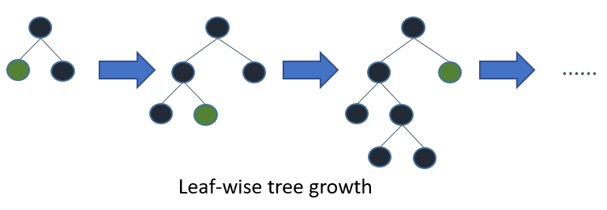

[Основная статья тут](https://lightgbm.readthedocs.io/en/latest/Parameters-Tuning.html)

## Tune Parameters for the Leaf-wise (Best-first) Tree

[[lightgbm]] использует [leaf-wise](https://lightgbm.readthedocs.io/en/latest/Features.html#leaf-wise-best-first-tree-growth) выращивание деревьев - деревья выращиваются по листьям, выбирается лист с максимальной дельта-лосс. Обычно такой алгоритм приводит к меньшим потерям, но склонен к переобучению, поэтому используется ограничение глубины дерева.

Наиболее важные параметры для получения результатов в такой  модели:

- `num_leaves` - основной параметр,у правляющий сложностью модели дерева. num_leaves = 2^(max_depth) дает такое-же количество листьев, как и у depth-wise дерева. На практике это не работает, т.к. leaf-wise модель обычно намного глубже, чем depth-wise c фиксированным кол-вом листьев. Неограниченная глубина вызывает переобучение. Поэтому параметр необходимо устанавливать меньше, чем 2^(max_depth)
- `min_data_in_leaf` позволяет предотвращать переобучение. Зависит от количества обучающихз выборок в `num_leaves`. Установка большого значения поможет избежать слишком глубокого роста дерева, но может привести к недостаточной подгонке. На практике установки сотен или тысяч достаточно для большого набора данных.
- `max_depth` регулирует максимальную глубину дерева

## For Faster Speed

### Add More Computational Resources 

### Use a [GPU-enabled version of LightGBM](https://lightgbm.readthedocs.io/en/latest/GPU-Tutorial.html)

### [Grow Shallower Trees ](https://lightgbm.readthedocs.io/en/latest/Parameters-Tuning.html#grow-shallower-trees)(для чего можно уменьшить `max_depth` или `num_leaves` или увеличить `min_gain_to_split`, `min_data_in_leaf` and `min_sum_hessian_in_leaf`

При добавлении нового узла дерева LightGBM выбирает точку разделения, которая дает наибольшее улучшение - уменьшение потерь при обучении в результате добавления точки разделения. По умолчанию LightGBM устанавливает `min_gain_to_split` равным `0,0`, что означает «не бывает улучшений, которые слишком малы, чтобы их игнорировать». Однако на практике вы можете обнаружить, что очень небольшие улучшения в потере обучения не имеют значимого влияния на ошибку обобщения модели. Увеличьте `min_gain_to_split,` чтобы сократить время обучения.

В зависимости от размера обучающих данных и распределения функций LightGBM может добавлять узлы дерева, которые описывают только небольшое количество наблюдений. В самом крайнем случае получаются узлы дерева, в которые попадает только одно наблюдение из обучающих данных. Маловероятно, что это удастся хорошо обобщить, и, вероятно, это признак переобучения. Это можно предотвратить косвенно с помощью таких параметров, как `max_depth` и `num_leaves,`, но возможно управлять этим и напрямую.

`min_data_in_leaf`: минимальное количество наблюдений, которые должны попасть в узел дерева, чтобы его можно было добавить.

`min_sum_hessian_in_leaf`: минимальная сумма гессиана (вторая производная целевой функции, оцениваемая для каждого наблюдения) для наблюдений в листе. Для некоторых целей регрессии это минимальное количество записей, которые должны попасть в каждый узел. Для целей классификации он представляет собой сумму по распределению вероятностей. [См. про значения этого параметра](https://stats.stackexchange.com/questions/317073/explanation-of-min-child-weight-in-xgboost-algorithm)

### [Grow Less Trees](https://lightgbm.readthedocs.io/en/latest/Parameters-Tuning.html#grow-less-trees)

Уменьшить `num_iterations` - контролирует количество выполняемых раундов бустинга. Поскольку LightGBM использует деревья решений в качестве обучающихся, это также можно рассматривать как «количество деревьев». Изменяя этот параметр необходимо так-же изменить `learning_rate` - это не влияет на время обучения, но повлияет на точность. Увеличивая первый параметр, уменьшайте второй и наоборот. Обычно потимальное соотношение находят через тюнинг гиперпараметров.

Использование ранней остановки так-же позволяет выращивать меньше деревьев. Ранняя остановка работает так: после каждого раунда бустинга точность обучения оценивается по валидационному сету. Затем точность сравнивается с точностю предыдущего раунда. Если точность не улучшается в течение некоторого заданного количествав раундов, обучение останавливается. `early_stopping_rounds` контроллирует число раундов перед остановкой.

### [Consider Fewer Splits](https://lightgbm.readthedocs.io/en/latest/Parameters-Tuning.html#consider-fewer-splits)

Enable Feature Pre-Filtering When Creating Datase. По умолчанию, когда создается объект набора данных LightGBM, некоторые фичи будут отфильтрованы на основе значения `min_data_in_leaf`. В качестве простого примера рассмотрим набор данных из 1000 наблюдений с фичей под названием feature_1. feature_1 принимает только два значения: 25,0 (995 наблюдений) и 50,0 (5 наблюдений). Если min_data_in_leaf = 10, для этой фичи нет разделения, что приведет к валидному разделению, по крайней мере, один из конечных узлов будет иметь только 5 наблюдений. Вместо того, чтобы пересматривать эту фичу и затем игнорировать ее на каждой итерации, LightGBM отфильтровывает ее перед обучением, когда создается набор данных. Установите feature_pre_filter = True, чтобы сократить время обучения.

Decrease `max_bin` or `max_bin_by_feature` When Creating Dataset. Traing buckets LightGBM перегоняют непрерывные фичи в в дискретные бины, чтобы повысить скорость обучения и снизить требования к памяти для обучения. Это объединение выполняется один раз во время построения набора данных. Количество разделений, учитываемых при добавлении узла, равно O(feature*bin), поэтому уменьшение количества бинов для каждой фичи может уменьшить количество разделений, которые необходимо оценить.

`max_bin` управляет максимальным количеством бинов, в которые будут помещены фичи. Также можно установить это максимальное значение для каждой фичи, передав `max_bin_by_feature`.

Increase `min_data_in_bin` When Creating Dataset. Некоторые бины могут содержать небольшое количество наблюдений, что может означать, что усилия по оценке границ этих бинов как возможных точек разделения вряд ли сильно повлияют на окончательную модель.

Decrease `feature_fraction`. По умолчанию LightGBM учитывает все фичи набора данных в процессе обучения. Это поведение можно изменить, установив для feature_fraction значение [> 0, <= 1.0]. Например, установка feature_fraction на 0,5 указывает LightGBM случайным образом выбирать 50% фичей в начале построения каждого дерева. Это уменьшает общее количество разбиений, которые необходимо оценить для добавления каждого узла дерева.

Decrease `max_cat_threshold`. LightGBM использует индивидуальный подход для поиска оптимального разделения для категориальных фичей. В этом процессе LightGBM исследует разбиения, которые разбивают категориальную функцию на две группы. Иногда это называют расщеплением «k-vs-rest». Более высокие значения `max_cat_threshold` соответствуют большему количеству точек разделения и большим возможным размерам групп для поиска.

### [Use Less Data](https://lightgbm.readthedocs.io/en/latest/Parameters-Tuning.html#use-less-data)

Use Bagging. По умолчанию LightGBM использует все наблюдения в обучающих данных для каждой итерации. Вместо этого можно указать LightGBM случайным образом выполнить выборку обучающих данных. Этот процесс обучения на множестве случайных выборок без замены называется беггингом. Установите для `bagging_fraction` значение > 0,0 и <1,0, чтобы контролировать размер выборки. Например, {"bagging_freq": 5, "bagging_fraction": 0.75} сообщает LightGBM «выполнять повторную выборку без замены каждые 5 итераций и реализовывать выборки из 75% обучающих данных».

Save Constructed Datasets with `save_binary`. Это относится только к интерфейсу командной строки LightGBM. Если вы передадите параметр save_binary, набор обучающих данных и все наборы проверок будут сохранены в двоичном формате, понятном LightGBM. Это может ускорить обучение в следующий раз, потому что биннинг и другую работу, выполняемую при построении набора данных, не нужно выполнять заново.

## [For Better Accuracy](https://lightgbm.readthedocs.io/en/latest/Parameters-Tuning.html#for-better-accuracy)

- Use large `max_bin` (may be slower)
- Use small `learning_rate` with large `num_iterations`
- Use large `num_leaves` (may cause over-fitting)
- Use bigger training data
- Try `dart`

## [Deal with Over-fitting](https://lightgbm.readthedocs.io/en/latest/Parameters-Tuning.html#deal-with-over-fitting)

- Use small `max_bin`
- Use small `num_leaves`
- Use `min_data_in_leaf` and `min_sum_hessian_in_leaf`
- Use bagging by set `bagging_fraction` and `bagging_freq`
- Use feature sub-sampling by set `feature_fraction`
- Use bigger training data
- Try `lambda_l1`, `lambda_l2` and `min_gain_to_split` for regularization
- Try `max_depth` to avoid growing deep tree
- Try `extra_trees`
- Try increasing `path_smooth`

[//begin]: # "Autogenerated link references for markdown compatibility"
[lightgbm]: lightgbm "Lightgbm"
[//end]: # "Autogenerated link references"