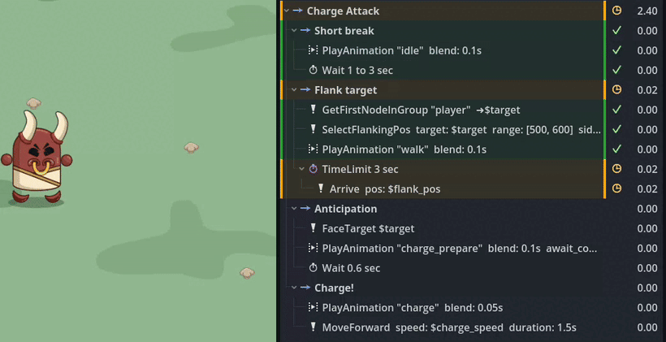

LimboAI — открытый C++ плагин для [[godot]] (ориентирован на Godot 4), который объединяет поведенческие деревья (Behavior Trees) и иерархические конечные автоматы (Hierarchical State Machines, HSM). Плагин поставляется с визуальным редактором деревьев, визуальным отладчиком, обширным демо‑проектом с туториалом и встроенной документацией. Несмотря на реализацию на C++, LimboAI полноценно поддерживает создание пользовательских задач и состояний на GDScript и других языках.

Статья написана с помощью gpt-5 mini.

## Ключевые возможности

- Behavior Trees (BT): создание, редактирование и сохранение ресурсов `BehaviorTree` в редакторе; исполнение деревьев через узел `BTPlayer`.
- Blackboard: централизованное хранилище данных для задач, с поддержкой планов (plans), скоупов и параметров, удобным редактором в инспекторе.
- Визуальный отладчик и визуализация выполнения деревьев (Editor Debugger + `BehaviorTreeView` для in-game визуализации).
- Hierarchical State Machines (HSM): `LimboHSM` и `LimboState` с поддержкой событийных переходов и вложенных машин состояний; возможность комбинировать HSM и BT (через `BTState`).
- Расширяемость: создавать кастомные задачи (tasks) и состояния, наследуя `BTAction`, `BTCondition`, `BTDecorator`, `BTComposite`, `LimboState` и прочие классы; есть документация по созданию пользовательских задач.
- Тестируемость: модуль покрыт unit‑тестами.
- Форматы использования: можно подключать как GDExtension (рекомендуемый способ) или как модуль/модульный код движка.
- Полные демо‑проекты и пошаговые туториалы внутри репозитория (`demo/`) и в релизах.

## Поддерживаемые версии Godot

LimboAI ориентирован на Godot 4 (поддержка 4.2 — 4.5 в зависимости от версии плагина); в README указаны соответствия версий плагина и версии движка.

## Лицензия

Исходный код LimboAI распространяется под лицензией MIT. Арт‑ассеты демо‑проекта лицензированы под CC‑BY‑4.0.

## Смотри еще

- [limboai](https://github.com/limbonaut/limboai)
- [Документация](https://limboai.readthedocs.io/)
- [[godot]]
- [[beehave]]
- [[gamedev]]

[godot]: godot "godot engine"
[beehave]: beehave "Beehave — дополнение Behavior Tree для Godot"
[gamedev]: ../lists/gamedev "Gamedev"