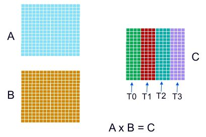

## llama.cpp

[llama.cpp](https://github.com/ggml-org/llama.cpp) — это проект для запуска больших языковых моделей локально, без зависимости от внешнего облачного API. По сути, это движок inference для LLM, написанный на C/C++, построенный поверх библиотеки [ggml](https://github.com/ggml-org/ggml). Основная идея проста: максимально уменьшить накладные расходы, сделать запуск на обычном ноутбуке/сервере возможным и поддержать широкий спектр железа — CPU, GPU, Apple Silicon, ARM, NVIDIA, AMD, Intel и т.д.

С точки зрения инженерной архитектуры, проект сочетает в себе:

- загрузку и парсинг моделей GGUF;
- токенизацию и генерацию текста;
- матричные вычисления через ggml;
- квантизацию моделей для уменьшения памяти и ускорения inference;
- бекэнды под разные типы ускорителей и архитектуры.

Это то, что делает llama.cpp удобным инструментом не только для экспериментов, но и для продакшн-сценариев вроде локального сервера, офлайн-чата, self-hosted API и интеграции с агентами.

## Почему это важно

Главная причина популярности llama.cpp — бюджетная доступность. Модель грузится в памяти и выполняется локально, а не через внешнее API. Это дает несколько плюсов:

- приватность и отсутствие зависимости от сторонних сервисов;
- возможность запускать модели на слабом железе после квантизации;
- быстрое локальное прототипирование и офлайн-разработка;
- работа в условиях ограниченных сетевых подключений.

Сам проект позиционируется как "LLM inference in C/C++" и заявляет поддержку широкого набора аппаратных платформ, включая ARM NEON, AVX/AVX2/AVX512, CUDA, HIP, Metal, Vulkan, SYCL, OpenCL, Hexagon и др. Для x86 и ARM это критично, потому что даже на CPU можно получить заметный прирост производительности за счёт специализированных SIMD-ядр.

## Основные компоненты

### 1. ggml

llama.cpp строится на ggml — низкоуровневой библиотеке вычислений для LLM. Она упаковывает в себе:

- операции над тензорами;
- буферы памяти и аллокацию;
- бэкенды для CPU/GPU;
- оптимизированные матричные операции и kernel-ы.

По сути, ggml является "ядром" вычисления модели, а llama.cpp добавляет слой для работы с архитектурами языковых моделей, токенизацией и генерацией.

### 2. GGUF

Модели в llama.cpp обычно представлены в формате GGUF. Это формат, специально заточенный под эффективную загрузку и инференс. Он хорош тем, что поддерживает квантизированные веса и легко работает с разными runtime и сериализациями. GGUF стал де-факто стандартом для локального запуска моделей через llama.cpp и совместимые инструменты.

### 3. K-варианты квантизации

llama.cpp поддерживает 1.5-bit, 2-bit, 3-bit, 4-bit, 5-bit, 6-bit и 8-bit integer quantization. Это не просто компромисс "меньше память"; это позволяет запускать модели гораздо большего размера на обычной RAM/VRAM, при этом сохраняя приемлемое качество генерации.

В практическом смысле:

- 4-bit / 5-bit часто дают хороший баланс между качеством и скоростью;
- 8-bit лучше для точности, но требует больше памяти;
- 2-bit / 3-bit используется там, где важнее компактность и скорость на ограниченном железе.

## Установка и запуск

Обычно проект устанавливается либо через готовые бинарники, либо сборкой из исходников. В README проекта есть простой путь:

```bash
curl -LsSf https://llama.app/install.sh | sh
```

После установки можно сразу запускать модель из Hugging Face:

```bash
llama-cli -hf ggml-org/Qwen3.5-0.8B-GGUF
```

Для API-сервера:

```bash
llama serve -hf ggml-org/Qwen3.5-0.8B-GGUF
```

Это очень удобно: можно быстро получить локальный OpenAI-compatible endpoint и подключать его в существующую инфраструктуру для приложений, агентов и UI.

## Бэкенды и аппаратная поддержка

llama.cpp поддерживает множество бекэндов:

- CPU: AVX, AVX2, AVX512, AMX, ARM NEON, RVV;
- GPU: CUDA, Metal, Vulkan, OpenCL, SYCL, HIP;
- специализированные решения: Hexagon, CANN, MUSA, OpenVINO.

То есть проект не привязан только к одной платформе. Для серверов это особенно важно: можно выбрать CPU-only, GPU-only или смешанный режим. В документации также есть упоминание CPU+GPU hybrid inference, когда модель частично ускоряется на GPU, а часть вычислений выполняется на CPU.

На ARM-серверах это особенно интересно, потому что архитектура CPU и выравнивание памяти сильно влияют на производительность. Arm Learning Path по profiling llama.cpp показывает, насколько важно понимать распределение вычислений между потоками и ядрами, чтобы не терять эффективность на многоядерных системах.

## Многопоточность в llama.cpp

llama.cpp создаёт thread pool и управляет распараллеливанием на уровне операторов. Число потоков задаётся через опцию `-t`, а привязка к ядрам процессора — через `-C`.

Например:

```bash
./llama-cli -m model.gguf -p "..." -t 2 -C 0x3
```

Здесь:

- `-t 2` — запускает 2 worker thread;
- `-C 0x3` — привязывает их к конкретным CPU-core (`core0` и `core1`);
- это позволяет делать профилирование более предсказуемым и анализировать нагрузку по ядрам.

Параллелизм в llama.cpp происходит не на "всей модели целиком", а на уровне отдельных tensor ops. Например, для `MUL_MAT` матрица результата может быть разделена между несколькими потоками, каждый из которых вычисляет свою часть выходной матрицы. Это типичный пример работы с big matrix multiplications, где большую вычислительную задачу раскладывают на независимые подзадачи.

Пример разделения операции `MUL_MAT` по потокам



На уровне профилирования это видно через:

- Core Map;
- Cluster Map;
- channel annotation views;
- анализ, кто именно выполняет конкретный node/op и насколько равномерно распределена нагрузка между потоками.

Arm Learning Path подчеркивает важность такого анализа: если один поток перегружен, а другие простаивают, то это не только проблема балансировки, но и прямой источник потери throughput и latency.

## Из чего складывается производительность

Для оптимальной работы с llama.cpp важно помнить про несколько вещей:

- размер модели и тип квантизации;
- число потоков (`-t`) и привязка потоков к ядрам (`-C`);
- выбор бекэнда — CPU, CUDA, Metal, Vulkan и т.п.;
- способность модели укладываться в доступную память;
- тип задач: prefill vs decode.

Меньше всего конфигурируется через "магические" параметры. В реальности производительность получается сочетанием архитектуры CPU/GPU и тем, насколько равномерно модель разбивается на вычислительные части.

## Практические рекомендации

- Сначала запускать модель в базовой конфигурации и понять, что работает.
- Затем тестировать квантизацию: 4-bit или 5-bit часто лучший компромисс.
- Если железо ARM/многоядерное, смотреть на `-t` и `-C` и профилировать thread affinity.
- Для локальных сервисов использовать `llama-server` и OpenAI-compatible API.
- Для офлайн-экспериментов удобно использовать CLI-режим `llama-cli`.

## Когда стоит использовать llama.cpp

llama.cpp особенно хорош, когда нужно:

- запускать LLM локально без стороннего API;
- работать с офлайн/приватными моделями;
- использовать разную аппаратную платформу и бекэнды;
- проводить низкоуровневую оптимизацию под CPU/GPU;
- собирать собственный LLM-сервис на базе локального inference.

Это один из ключевых инструментов современной локальной AI-экосистемы: он сочетает скорость, гибкость и практичность.

## Итого

llama.cpp — это не просто "обертка поверх модели". Это полноценный runtime для локального запуска LLM, который объединяет в одном проекте:

- матричные вычисления через ggml;
- поддержку нескольких архитектур и бекэндов;
- квантизацию веса модели;
- потоковую и многопоточную обработку;
- простой локальный API и CLI.

Его важность особенно заметна на ARM и серверных системах: там, где нужно понять, как именно LLM вычислительная нагрузка распределяется между ядрами и ускорителями, т.е. там, где производительность определяется не только моделью, но и архитектурой вычислений.

Для дальнейшего чтения полезно смотреть:

- [llama.cpp repository](https://github.com/ggml-org/llama.cpp)
- [Arm Learning Path: multi-threaded performance analysis](https://learn.arm.com/learning-paths/servers-and-cloud-computing/llama_cpp_streamline/6_multithread_analyze/)
- [ggml](https://github.com/ggml-org/ggml)
- [[lists/llm]]

## AI-warning

✨ Данная статья сгенерирована с помощью ChatGPT 5.0 mini. Текст проверен человеком.

[lists/llm]: ../lists/llm "Ресурсы LLM"
