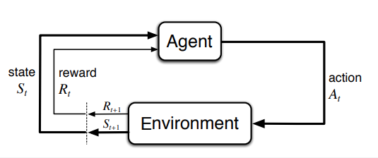
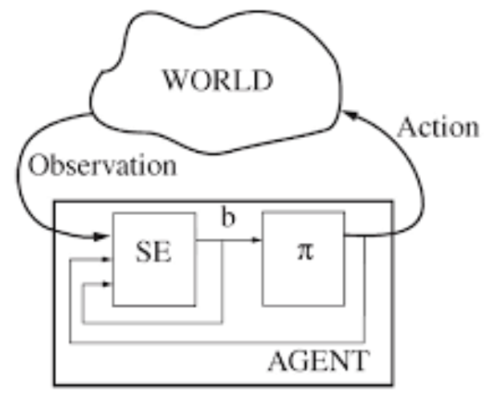

В отличае от [[multi-armed-bandit]], в конечных марковских процессах принятия решений (МППР, или Markov decision process, MDP), от дейстий зависят не только текущие состояния, но и ценность будущих состояний. Таким образом вводится отложенное вознаграждение и необходимость искать компромисс между немедленным вознаграждением и совокупным. Оценивается ценность $$q_*(s, a)$$ действия a в состоянии s или ценность $$v_*(s)$$ каждого состояния при условии оптимального выбора действий.

МППР - математически идеализированная форма задачи обучения с подкреплением и предназначены для прямолинейного формулирования задачи обучения в результате взаимодействия для достижения цели. Сторона, которая обучается и принимает решение, называется агентом. Сторона с которой агент взаимодействует и включающая в себя все, что находится вне агента - окружающей средой. Агент выбирает действия, среда реагирует на действия и передает агенту новые ситуации. Среда также генерирует вознаграждение, а агент их максимизирует. В дискретном случае агент и среда совместно порождают траекторию:

$$S_0, A_0, R_1, S_1, A_1, R_2, S_2, A_2,...$$

гле $$S_t$$ представление о состоянии окружающей среды на шаге t, исходля из действия $$A_t$$, а $$R_{t+1}$ - возникающее в итоге вознаграждение.

В задаче обучения мы стремимся максимизировать ожидаемый доход:

$$G_t \doteq R_{t+1} + R_{t+2} + R_{t+3} + ... + R_T$$

здесь T - последний временной шаг. Этот подход имеет смысл, когда взаимодействие агента со средой распадается на эпизоды и существует понятие последнего эпизода. В эпизодических задачах множество всех эпиздов без последнего - $$S$$, а включая последний - $$S^+$$.

Противоположн6ость этой задаче - непрерывная, когда невозможно разбить взаимодействие на эпизоды. В этом случае нам не известен момент T. Определить ожидаемый доход для таких задач проблематично. Для этого вводится понятие обесценивания. При таком подходе агент пытается выбрать действия, так чтобы сумма обесцененных вознаграждений, которые он получит в будущем, принимала бы максимальное значение.

$$G_t \doteq R_{t+1} + R_{t+2} + R_{t+3} + ... = \sum_{k=0}^\infty \gamma^k R_{t+k+1}$$

здесь параметр $$0 \leq \gamma \leq 1$$ - коэфициент обесценивания, который определяет ценность будущих вознаграждений с точки зрения настоящего. Вознаграждение, которое будет получено спустя k шагов будет стоить в $$\gamma^{k-1}$$ меньше, чем если бы оно было получено прямо сейчас. Чем меньше гамма, тем более близорук агент и тем больше его заботит текущее состояние, а не будущие.

Почти все алгоритмы [[reinforcement-learning]] включают функции ценности - это функции состояний (или пар состояние-действие), которые оценивают насколько хорошо для агента оказаться в данном состоянии (или насколько хорошо предпринять данное действие в данном состоянии). Т.к. вознаграждения, котоыре может ожидать агент в будущем, зависят от предпринимаемых им действий, то и функции ценности определены по отношению к конкретным способам действия - стратегиям. Формально статегия - это отображение состояния на вероятность выбора каждого возможного действия.

Функция ценности состояния s при стратегии $$\pi$$ - это ожидаемый доход, когда агент начинает в состоянии S и далее следует стратегии $$\pi$$:

$$v_{\pi}(s) \doteq \mathbb{E}_{\pi} [G_t|S_t=s]$$

для всех $$s \in S$$, где $$\mathbb{E}[.]$$ мат.ожидание случайной величины, при условии, что агент следует стратегии $$\pi$$, а t - произвольный временной шаг. Ценность заключимтельного состяония, если оно есть, всегда равна 0.

Ценность выполнения действия a в состоянии s при $$\pi$$:

$$q_{\pi}(s, a) \doteq \mathbb{E}[G_t|S_t=s, A_t=a]$$

Фундаментальное свойство функций ценности здесь в том, что они удовлетворяют рекурентному отношению, согласующему текущую ценность и ценностями возможных следующих состояний.

$$v_{\pi}(s) \doteq \mathbb{E}_{\pi} [G_t|S_t=s] = \mathbb{E}_{\pi} [R_{t+1} + \gamma G_{t+1}|S_t=s]$$

Откуда можно вывести [уравнение Беллмана](https://en.wikipedia.org/wiki/Bellman_equation) для $$V_{\pi}$$

Для конечных МППР можно определить оптимальную стратегию. - статегия $$\pi$$ лучше или равна стратегии $$\pi`$$, если ее ожидаемый доход больше чем ожидаемый доход штрих для любого состояния. Всегда существует хотя бы одна стратегия, которая лучше всех остальных. Это оптимальная стратегия. Оптимальная функция такой (таких) стратегии:

$$v_*(s) \doteq \max_{\pi} v_{\pi}(s)$$

Оптимальная функция ценности дейсчтвия для оптимальной стратегии:

$$q_*(s, a) \doteq \max_{\pi} q_{\pi}(s, a)$$

Имея $$v_*$$ относительно легко определить оптимальную стратегию. Зная $$Q_*$$ выбрать оптимальные действия еще проще. Однако на практике это малоприменимо, т.к. означает, что мы должны знать будущие возможности, вычислить их вероятности с точким зрения ожидаемого вознаграждения. Поэтому для подобных задач используются приближенные методы и аппроксимации.

## Частично наблюдаемые mppr

Частично наблюдаемый марковский процесс принятия решений (partially observable Markov decision process, POMDP), содержит дополнительные параметры - $$\Omega$$ и функцию наблюдения $$O$$, котоаря отображает состояние и действие в распределении вероятностей по действиям. В POMDP агент не может наблюдать текущее состояние непосредственно, вместо этого он использует наблюдение и информацию о предыдущем действии и состоянии для прогноза текущего состояния. Такое прогнозирование называется доверительным состоянием b, которое описывается как состояние, в котором предположительно находится среда. На схеме ниже SE - оценщик состояний, который получает наблюдения (O, observations), а так-же состояния и действия внутри агента, в результате чего порождает предположительное текущее состояние.

Смотри еще:

- [[reinforcement-learning]]
- [[multi-armed-bandit]]
- [Finite Markov Decision Processes](https://towardsdatascience.com/introduction-to-reinforcement-learning-rl-part-3-finite-markov-decision-processes-51e1f8d3ddb7)

[//begin]: # "Autogenerated link references for markdown compatibility"
[multi-armed-bandit]: multi-armed-bandit "Multy armed bandits"
[reinforcement-learning]: ../lists/reinforcement-learning "Reinforcement learning"
[//end]: # "Autogenerated link references"
[//begin]: # "Autogenerated link references for markdown compatibility"
[multi-armed-bandit]: multi-armed-bandit "Multy armed bandits"
[reinforcement-learning]: ../lists/reinforcement-learning "Reinforcement learning"
[reinforcement-learning]: ../lists/reinforcement-learning "Reinforcement learning"
[multi-armed-bandit]: multi-armed-bandit "Multy armed bandits"
[//end]: # "Autogenerated link references"