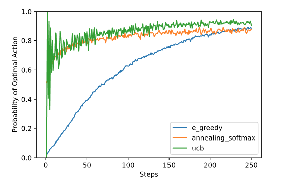

k-рукие бандиты решают следующую задачу: есть k вариантов действий, мы многократно стоим перед проблемой выбора из этих вариантов. После каждого выбора мы получаем численное вознаграждение, выбираемое из стационарного распределения вероятностей, которое зависит от выбранного действия. Цель - максимизировать ожидаемое полное вознаграждение за определенный период. Благодаря повторному выбору, мы стремимся максимизировать выбор только лучших решений. Ценность произвольного действия a:

$$q_*(a) \doteq \mathbb{E}[R_t|A_t = a]$$

где $$A_t$$ действие, выбранное на шаге t, а $$R_t$$ соответствующее ему вознаграждение. На практике ценность каждого действия мы не знаем, поэтому приходится применять методы оценивания ценности действий. Если мы совершаем действия и оцениваем их, тогда на любом временном отрезке мы будем иметь максимально ценное действие или "жадное". Когда мы выбираем жадное действие, то используем текущие знания о ценности действий, а когда выбираем какое-то другое - исследуем нежадные действия.

Истинная ценность действия - это среднее вознаграждение при условии выбора этого действия. Простейшее правило - выбирать одно из жадных действий:

$$A_t \doteq argmax_a Q_t(a)$$

где $$Q_t(a)$$ истинная ценность.

Альтернативный вариант - большую часть времени выбирать жадное действие, но иногда - исследовать. **Методы, которые используют данный подход, называются $$\varepsilon$$-жадными**. В пределе такие методы приводят к тому, что каждое действие (не только жадные), будут выбраны бесконечное число раз, что сведет истинную ценность к ценности $$q_*(a)$$.

Эпислон-жадные алгоритмы зависят от выбора параметра, т.е. от предпочтения разведывать или эксплуатировать. Можно опираться на текущую оценку распределения вознаграждений (softmax), чтобы исследовать не произвольное состояние, а состоянии в направлении максимизации вознаграждения. Еще используют стратегию "отжига" $$\varepsilon$$ - в начале $$\varepsilon$$ большой, что провоцирует больше исследований, но к концу обучения параметр постепенно снижается, что уменьшает разведывающую способность алгоритма. Другой вариант - поощрять исследования состояний, которые ранее не посещались (это методы с верхним доверительным интервалом, **upper-confidence bound, UCB**). UCB полезны, т.к. у них нет гиперпараметров. Ниже приведено сравнение для [простейшей задачи обучения с подкреплением](https://rl-book.com/learn/bandits/exploration_comparison/):

Смотри еще:

- [[reinforcement-learning]]
- [[mppr]]
- [Multi-arm Bandits](https://towardsdatascience.com/introduction-to-reinforcement-learning-rl-part-2-multi-arm-bandits-be5efb2e83ea)

[//begin]: # "Autogenerated link references for markdown compatibility"
[reinforcement-learning]: ../lists/reinforcement-learning "Reinforcement learning"
[mppr]: mppr "MPPR"
[//end]: # "Autogenerated link references"