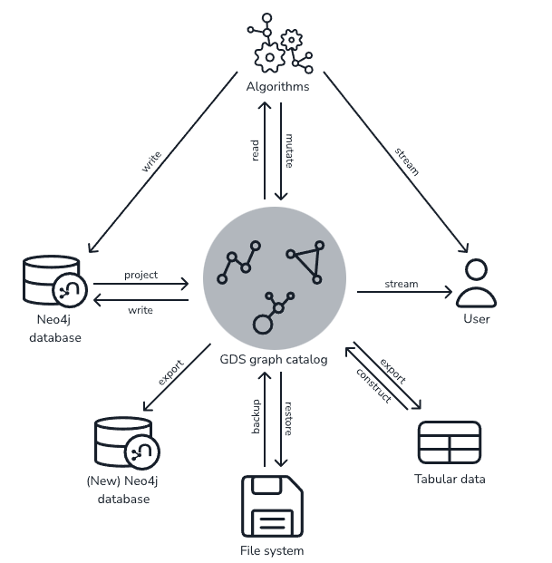
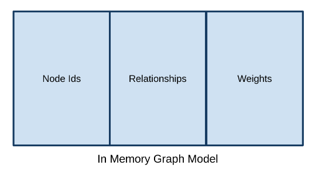
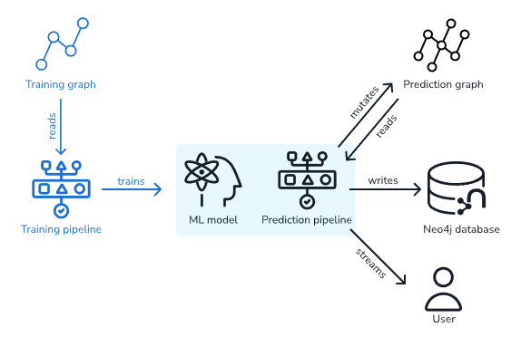

Для бесплтной версии:

- Maximum of 4 CPU cores
- максимум 4 проекции в каталоге GDS
- Open source

## Установка

- [docker instalation algorythm plugins](https://neo4j.com/docs/operations-manual/current/docker/)
- [run with docker](https://neo4j.com/labs/kafka/4.0/docker/)

example:

```yml
version: '3.8'

services:

  neo4j:

    image: neo4j:4.4.9-community
    hostname: neo4j
    container_name: neo4j
    volumes:
      - ./volume/plugins:/plugins
      - ./volume/data:/data
      - ./volume/import:/import
    env_file:
      - .env
    ports:
      - "7474:7474"
      - "7687:7687"
    environment:
      NEO4J_AUTH: neo4j/${PASS?Variable not set}
      NEO4J_dbms_security_procedures_unrestricted: apoc.*, algo.*, gds.*
      NEO4J_dbms_security_procedures_whitelist: apoc.*, algo.*, gds.*
      NEO4J_apoc_import_file_enabled: "true"
      NEO4J_dbms_shell_enabled: "true"
      NEO4JLABS_PLUGINS: '["apoc", "graph-data-science"]'
    networks:
      - neo4j-learn

networks:
  neo4j-learn:
```

## Использование

Схема использования библиотеки GDS обычно делится на две фазы: разработка и производство. На этапе разработки цель состоит в том, чтобы установить рабочий процесс полезных алгоритмов. Для этого необходимо настроить систему, определить проекции графа и выбрать алгоритмы. Обычно используются функции оценки памяти библиотеки. Это позволяет успешно настроить систему для обработки большого объема данных. Следует помнить о двух видах ресурсов: проекция графа и структуры данных алгоритма.

На этапе производства система будет настроена соответствующим образом для успешного запуска нужных алгоритмов. Последовательность операций обычно заключается в создании проекции графа, выполнении на нем одного или нескольких алгоритмов и использовании результатов.

На изображении ниже показан обзор стандартной работы GDS:



GDS жадно выполняет свои процедуры с точки зрения системных ресурсов. Это означает, что каждая процедура будет пытаться использовать:

- столько памяти, сколько нужно для выполнения
- столько ядер ЦП, сколько ему нужно (не превышая пределов concurrency)

Одновременно выполняемые процедуры совместно используют ресурсы системы, в которой размещена СУБД, и поэтому могут влиять на производительность друг друга. Чтобы получить обзор состояния системы, вы можете использовать [процедуру мониторинга](https://neo4j.com/docs/graph-data-science/current/common-usage/monitoring-system/).

Выполнение ожно разбить на несколько этапов:

- [Оценка памяти](https://neo4j.com/docs/graph-data-science/current/common-usage/memory-estimation/)
- [Построение проекций графов](https://neo4j.com/docs/graph-data-science/current/management-ops/graph-catalog-ops/) (используется [[neo4j-apoc]])
- [Запуск алгоритмов](https://neo4j.com/docs/graph-data-science/current/common-usage/running-algos/)
- логирование и мониторинг

Подробнее [читай в этом разделе](https://neo4j.com/docs/graph-data-science/current/common-usage/)

GDS полностью построена на куче, а это значит, что сервер Neo4j необходимо настроить с гораздо большим размером кучи, чем для транзакционных рабочих нагрузок. На приведенной ниже диаграмме показано, как память используется моделью проекции графа:



Модель содержит три типа данных:

- Идентификаторы узлов - до 2^45 ("35 триллионов")
- Отношения - пары идентификаторов узлов. Отношения сохраняются дважды, если граф "UNDIRECTED".
- Веса - хранятся как двоичные данные (8 байтов на узел) в структуре данных, подобной массиву, рядом с отношениями.

Конфигурация памяти зависит от используемой проекции графа.

Во многих случаях будет полезно оценить требуемую память для построения проекции графика и запуска алгоритма перед его запуском, чтобы убедиться, что рабочая нагрузка может работать на доступной свободной памяти. Для этого можно использовать режим estimate, который возвращает оценку объема памяти, необходимого для запуска графовых алгоритмов. Обратите внимание, что режим гарантированно есть только у алгоритмов уровня, готового к производству. Дополнительные сведения см. в разделе [Обзор синтаксиса](https://neo4j.com/docs/graph-data-science/current/algorithms/syntax/).

Синтаксис:

```sql
CALL gds[.<tier>].<algorithm>.<execution-mode>.estimate(
  graphNameOrConfig: String or Map,
  configuration: Map
) YIELD
  nodeCount: Integer,
  relationshipCount: Integer,
  requiredMemory: String,
  treeView: String,
  mapView: Map,
  bytesMin: Integer,
  bytesMax: Integer,
  heapPercentageMin: Float,
  heapPercentageMax: Float
```

Процедуры `gds.graph.project` также поддерживают estimate оценку использования памяти только для графика. Эти процедуры не принимают имя графа в качестве первого аргумента, поскольку фактически не строят проекцию.

```sql
CALL gds.graph.project.estimate(nodeProjection: String|List|Map, relationshipProjection: String|List|Map, configuration: Map)
YIELD requiredMemory, treeView, mapView, bytesMin, bytesMax, heapPercentageMin, heapPercentageMax, nodeCount, relationshipCount
```

Все процедуры в GDS, которые поддерживают оценку, включая создание графа, будут выполнять оценку в начале своего выполнения. Сюда входят все режимы выполнения, но не сама estimate процедура.

Если проверка оценки может определить, что текущего объема свободной памяти недостаточно для выполнения операции, операция будет прервана и будет сообщено об ошибке. Ошибка будет содержать сведения об оценке и свободной памяти во время оценки.

Эта логика управления кучей является ограничительной в том смысле, что она блокирует только выполнение, которое точно не помещается в память. Это не гарантирует, что выполнение, прошедшее проверку, будет успешным без истощения памяти. Таким образом, по-прежнему полезно сначала запустить режим оценки перед запуском алгоритма или создания графа для большого набора данных, чтобы просмотреть все детали оценки.

Объем свободной памяти можно увеличить, либо удалив неиспользуемые графы из каталога, либо увеличив максимальный размер кучи перед запуском экземпляра Neo4j.

[Подробнее](https://neo4j.com/docs/graph-data-science/current/common-usage/memory-estimation/)

Все алгоритмы представлены в виде процедур Neo4j. Их можно вызывать непосредственно из Cypher с помощью браузера Neo4j cypher-shell или из кода клиента с помощью драйвера Neo4j на выбранном языке. Алгоритмы запускаются с использованием одного из режимов выполнения stream, или stats. Выполнение любого алгоритма можно отменить, завершив транзакцию Cypher, выполняющую вызов процедуры.

### Stream

Режим stream вернет результаты вычисления алгоритма в виде строк результатов Cypher. Это похоже на то, как работают стандартные запросы чтения Cypher.

Возвращаемые данные могут быть идентификатором узла и вычисленным значением для узла (например, page rank или WCC componentid) или двумя идентификаторами узла и вычисленным значением для пары узлов (например, показателем сходства узла).

Если граф очень большой, результат stream вычисления моды также будет очень большим. Использование `ORDER BY` и `LIMIT` в запросе Cypher может быть полезно.

### Stats

stats режим возвращает статистические результаты вычисления алгоритма, такие как подсчеты или процентные распределения. Статистическая сводка вычислений возвращается в виде одной строки результата Cypher. Непосредственные результаты алгоритма недоступны при использовании stats режима. Этот режим формирует основу режимов выполнения mutate и write, но не пытается вносить какие-либо изменения или обновления где-либо.

### Mutate

Режим mutate запишет результаты вычисления алгоритма обратно в проекцию графа. Обратите внимание, что указанное mutateProperty значение не должно существовать в проекции заранее. Это позволяет запускать несколько алгоритмов на одной проекции без записи результатов в Neo4j в промежутках между выполнением алгоритма.

Этот режим выполнения особенно полезен в трех сценариях:

- Алгоритмы могут зависеть от результатов предыдущих алгоритмов без необходимости записи в Neo4j.
- Результаты алгоритма можно записать целиком.
- Результаты алгоритма можно запросить через Cypher без необходимости вообще писать в Neo4j.

Статистическая сводка вычислений возвращается аналогично stats режиму. Измененные данные могут быть свойствами узла (такими как page rank), новыми отношениями (такими как сходство узлов) или свойствами отношений.

### Write

Режим writeза пишет результаты расчета алгоритма обратно в базу данных Neo4j. Это похоже на то, как работают стандартные запросы на запись Cypher. Статистическая сводка вычислений возвращается аналогично stats режиму. Это единственный режим выполнения, который попытается внести изменения в базу данных Neo4j.

Записанные данные могут быть свойствами узла (такими как page rank), новыми отношениями (такими как сходство узлов) или свойствами отношений. write режим может быть очень полезен для случаев использования, когда результаты алгоритма будут проверяться несколько раз отдельными запросами, поскольку результаты вычислений полностью обрабатываются библиотекой.

Для того чтобы результаты write режима могли быть использованы другим алгоритмом, необходимо создавать новую проекуцию из из базы данных Neo4j с обновленным графом.

## Graph management

Центральным элементом библиотеки GDS является управление проекциями графов. [Смотри как](https://neo4j.com/docs/graph-data-science/current/management-ops/).

- Graph Catalog
- Node Properties
- Utility functions
- Cypher on GDS graph
- Administration
- Backup and Restore
- Defaults and Limits

Каталог графов — это концепция в библиотеке GDS, которая позволяет управлять несколькими проекциями графов по имени. [Тпипичные операции](https://neo4j.com/docs/graph-data-science/current/management-ops/graph-catalog-ops/): `gds.graph.list`, `gds.graph.project.cypher`, `gds.graph.drop`

## [Graph algorythms](https://neo4j.com/docs/graph-data-science/current/algorithms/)

[Обзор синтаксиса](https://neo4j.com/docs/graph-data-science/current/algorithms/syntax/)

Алгоритмы разделены на категории, которые представляют разные классы задач:

- Centrality
- Community detection
- Similarity
- Path finding
- Node embeddings
- Topological link prediction
- Auxiliary procedures
- Pregel API

- Path Finding - these algorithms help find the shortest path or evaluate the availability and quality of routes
  - Production-quality
    - Delta-Stepping Single-Source Shortest Path
    - Dijkstra Source-Target Shortest Path
    - Dijkstra Single-Source Shortest Path
    - A* Shortest Path
    - Yen’s Shortest Path
    - Breadth First Search
    - Depth First Search
    - Random Walk
  - Alpha
    - Minimum Weight Spanning Tree
    - All Pairs Shortest Path
- Centrality - these algorithms determine the importance of distinct nodes in a network
  - Production-quality
    - Page Rank
    - Article Rank
    - Eigenvector Centrality
    - Betweenness Centrality
    - Degree Centrality
  - Beta
    - Closeness Centrality
  - Alpha
    - Harmonic Centrality
    - HITS
    - Influence Maximization
- Community Detection - these algorithms evaluate how a group is clustered or partitioned, as well as its tendency to strengthen or break apart
  - Production-quality
    - Louvain
    - Label Propagation
    - Weakly Connected Components
    - Triangle Count
    - Local Clustering Coefficient
  - Beta
    - K-1 Coloring
    - Modularity Optimization
  - Alpha
    - Strongly Connected Components
    - Speaker-Listener Label Propagation
    - Approximate Maximum k-cut
    - Conductance metric
    - Modularity metric
    - K-Means Clustering
    - Leiden
- Similarity - these algorithms help calculate the similarity of nodes
  - Filtered Node Similarity
  - Filtered K-Nearest Neighbors
- Topological link prediction - these algorithms determine the closeness of pairs of nodes
  - Alpha
    - Adamic Adar
    - Common Neighbors
    - Preferential Attachment
    - Resource Allocation
    - Same Community
    - Total Neighbors
- Node Embeddings - these algorithms compute vector representations of nodes in a graph.
  - Production-quality
    - FastRP
  - Beta
    - GraphSAGE
    - Node2Vec
- Node Classification - this algorithm uses machine learning to predict the classification of nodes.
- Link prediction - these algorithms use machine learning to predict new links between pairs of nodes

### [Machine learning](https://neo4j.com/docs/graph-data-science/current/machine-learning/machine-learning/)

В GDS конвейеры предлагают сквозной рабочий процесс, от извлечения признаков до обучения и применения моделей машинного обучения.



GDS включает следующие конвейеры:

- Бета
  - Node Classification Pipelines
  - Link Prediction Pipelines
- Альфа
  - Node Regression Pipelines

Примеры:

- [graph embeddings](https://neo4j.com/developer/graph-data-science/applied-graph-embeddings/)
- [Knowledge Graph using NLP and Ontologies](https://neo4j.com/developer/graph-data-science/build-knowledge-graph-nlp-ontologies/)
- [Link Prediction with GDSL and scikit-learn](https://neo4j.com/developer/graph-data-science/link-prediction/scikit-learn/)

## Python client

[Neo4j Graph Data Science Client on pypi](https://pypi.org/project/graphdatascience/) работает с [[python-api-neo4j]]. [Мануал](https://neo4j.com/docs/graph-data-science-client/current/)

`pip install graphdatascience`

Примеры использования:

- [FastRP and kNN end-to-end example](https://github.com/neo4j/graph-data-science-client/blob/main/examples/fastrp-and-knn.ipynb)
- [Export and integration with PyG example](https://github.com/neo4j/graph-data-science-client/blob/main/examples/import-sample-export-gnn.ipynb)
- [Load data to a projected graph via graph construction](https://github.com/neo4j/graph-data-science-client/blob/main/examples/load-data-via-graph-construction.ipynb)

Смотир еще:

- [graph algorithms](https://neo4j.com/developer/graph-data-science/graph-algorithms/)
- [ml](https://neo4j.com/docs/graph-data-science/current/machine-learning/machine-learning/)
- [User Defined Procedures and Functions](https://neo4j.com/developer/cypher/procedures-functions/)
- [graph-data-science-client](https://github.com/neo4j/graph-data-science-client) A Python client for the Neo4j Graph Data Science (GDS) library.
- [[neo4j]]
- [[neosematics]]
- [[neo4j-apoc]]
- [[cypher]]
- [[graphs]]

[//begin]: # "Autogenerated link references for markdown compatibility"
[neo4j]: neo4j "Neo4j graph data base"
[neosematics]: neosematics "Neosematics"
[neo4j-apoc]: neo4j-apoc "Neo4j APOC библиотека"
[cypher]: cypher "Cypher query language"
[graphs]: ../lists/graphs "Machine learning with graphs"
[//end]: # "Autogenerated link references"