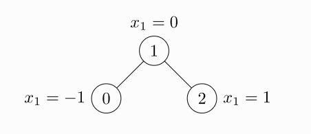
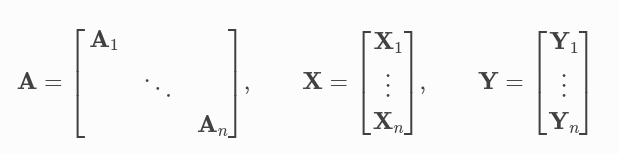

## Instalation

- [pytorch instalation](https://pytorch.org/get-started/locally/)
- [pyg instalation](https://pytorch-geometric.readthedocs.io/en/latest/notes/installation.html)

## Model

Граф используется для моделирования парных отношений (ребер) между объектами (узлами). Отдельный граф в pyg описывается экземпляром `torch_geometric.data.Data`, который по умолчанию содержит следующие атрибуты:

- `data.x`: матрица признаков узла с размернойстью `[num_nodes, num_node_features]`
- `data.edge_index`: связи графа в формате `COO` с размерностью `[2, num_edges]` и типом данных `torch.long`
- `data.edge_attr`: матрица фичей ребер с размерностью `[num_edges, num_edge_features]`
- `data.y`: Цель для обучения (может иметь произвольную размерность), например, размерность на уровне узла `[num_nodes, *]` или уровне графа `[1, *]`
- `data.pos`: матрица положения узла с размерностью `[num_nodes, num_dimensions]`

Ни один из этих объекто в не обязателен. Кроме того, можно создавать собственные аттрибуты произвольной размерности и типов.

Пример невзвешенного и неориентированного графа с тремя узлами и четырьмя ребрами. Каждый узел содержит ровно одну функцию:

```python
import torch
from torch_geometric.data import Data

edge_index = torch.tensor([[0, 1, 1, 2],
                           [1, 0, 2, 1]], dtype=torch.long)
x = torch.tensor([[-1], [0], [1]], dtype=torch.float)

data = Data(x=x, edge_index=edge_index)
>>> Data(edge_index=[2, 4], x=[3, 1])
```



edge_index, то есть тензор, определяющий исходные и целевые узлы всех ребер, не является списком кортежей. Если вы хотите записать свои индексы таким образом, вы должны транспонировать и вызывать contiguous() перед передачей их конструктору данных.

```python
import torch
from torch_geometric.data import Data

edge_index = torch.tensor([[0, 1],
                           [1, 0],
                           [1, 2],
                           [2, 1]], dtype=torch.long)
x = torch.tensor([[-1], [0], [1]], dtype=torch.float)

data = Data(x=x, edge_index=edge_index.t().contiguous())
>>> Data(edge_index=[2, 4], x=[3, 1])
```

Хотя граф имеет только два ребра, нам нужно определить четыре кортежа индексов, чтобы учесть оба направления ребра.

Помимо хранения ряда атрибутов уровня узла, уровня ребра или уровня графа, `Data` предоставляет ряд полезных служебных функций

```python
print(data.keys)
>>> ['x', 'edge_index']

print(data['x'])
>>> tensor([[-1.0],
            [0.0],
            [1.0]])

for key, item in data:
    print(f'{key} found in data')
>>> x found in data
>>> edge_index found in data

'edge_attr' in data
>>> False

data.num_nodes
>>> 3

data.num_edges
>>> 4

data.num_node_features
>>> 1

data.has_isolated_nodes()
>>> False

data.has_self_loops()
>>> False

data.is_directed()
>>> False

# Transfer data object to GPU.
device = torch.device('cuda')
data = data.to(device)
```

Весь функционал объекта data [смотри в документации](https://pytorch-geometric.readthedocs.io/en/latest/modules/data.html#torch_geometric.data.Data)

## Датасеты

pyg содержит большое количество общих эталонных наборов данных, например, все наборы данных Planetoid (Cora, Citeseer, Pubmed), все наборы данных для классификации графов с [chrsmrrs.github.io](https://chrsmrrs.github.io/datasets/) и их очищенные версии, QM7 и QM9. набор данных и несколько наборов данных 3D mesh/point датасетов, таких как FAUST, ModelNet10/40 и ShapeNet.

Инициализация набора данных проста. Инициализация набора данных автоматически загрузит необработанные файлы и обработает их в ранее описанном формате данных. Например, можно загрузить набор данных ENZYMES (состоящий из 600 графов в 6 классах).

```python
from torch_geometric.datasets import TUDataset

dataset = TUDataset(root='/tmp/ENZYMES', name='ENZYMES')
>>> ENZYMES(600)

len(dataset)
>>> 600

dataset.num_classes
>>> 6

dataset.num_node_features
>>> 3

data = dataset[0]
>>> Data(edge_index=[2, 168], x=[37, 3], y=[1])

data.is_undirected()
>>> True
```

Первый граф в наборе данных содержит 37 узлов, каждый из которых имеет 3 фичи. Имеется 168/2 = 84 неориентированных ребер, и граф относится ровно к одному классу. Кроме того, объект данных содержит ровно одну цель на уровне графа.

Можно использовать срезы, long или bool тензоры для разделения набора данных. Например, чтобы создать разделение екфшт/еуые 90/10:

```python
# shuffle
dataset = dataset.shuffle()

# or equal
perm = torch.randperm(len(dataset))
dataset = dataset[perm]

train_dataset = dataset[:540]
>>> ENZYMES(540)

test_dataset = dataset[540:]
>>> ENZYMES(60)
```

Ноды бенчмарков могут содержать следующие метки (пример для датасета cora):

- train_mask обозначает, на каких узлах тренироваться
- val_mask указывает, какие узлы использовать для проверки, например, для выполнения ранней остановки
- test_mask указывает, на каких узлах тестировать

```python
data.train_mask.sum().item()
>>> 140

data.val_mask.sum().item()
>>> 500

data.test_mask.sum().item()
```

## Mini-batch

Нейронные сети обычно обучаются в пакетном режиме. pyg обеспечивает распараллеливание мини-пакетов за счет создания разреженных блоков диагональных матриц смежности (определяемых параметром edge_index) и конкатенации фич и целевых матриц в измерении узла. Эта композиция позволяет различать различные узлы и ребры в отличии от одного пакета.



[torch_geometric.loader.DataLoader](https://pytorch-geometric.readthedocs.io/en/latest/modules/loader.html#torch_geometric.loader.DataLoader) занимается данным процессом конкатенации

```python
from torch_geometric.datasets import TUDataset
from torch_geometric.loader import DataLoader

dataset = TUDataset(root='/tmp/ENZYMES', name='ENZYMES', use_node_attr=True)
loader = DataLoader(dataset, batch_size=32, shuffle=True)

for batch in loader:
    batch
    >>> DataBatch(batch=[1082], edge_index=[2, 4066], x=[1082, 21], y=[32])

    batch.num_graphs
    >>> 32
```

В [torch_geometric.data.Batch](https://pytorch-geometric.readthedocs.io/en/latest/modules/data.html#torch_geometric.data.Batch) `batch` - вектор-колонка, который мапит каждую ноду в граф бача. Вы можете использовать его, например, для усреднения признаков узла в измерении узла для каждого графа отдельно

```python
from torch_scatter import scatter_mean
from torch_geometric.datasets import TUDataset
from torch_geometric.loader import DataLoader

dataset = TUDataset(root='/tmp/ENZYMES', name='ENZYMES', use_node_attr=True)
loader = DataLoader(dataset, batch_size=32, shuffle=True)

for data in loader:
    data
    >>> DataBatch(batch=[1082], edge_index=[2, 4066], x=[1082, 21], y=[32])

    data.num_graphs
    >>> 32

    x = scatter_mean(data.x, data.batch, dim=0)
    x.size()
    >>> torch.Size([32, 21])
```

Подробнее [про минибатчи в pyg](https://pytorch-geometric.readthedocs.io/en/latest/notes/batching.html). Подробнее про [pytorch scatter](https://pytorch-scatter.readthedocs.io/en/latest/)

## Data transformations

Преобразования — это распространенный способ в torchvision для преобразования изображений и выполнения аугментации. pyg поставляется со своими собственными преобразованиями, которые ожидают объект `data` в качестве входных данных и возвращают новый преобразованный объект `data`. Преобразования могут быть объединены в цепочку с помощью [torch_geometric.transforms.Compose](https://pytorch-geometric.readthedocs.io/en/latest/modules/transforms.html#torch_geometric.transforms.Compose) и применяются перед сохранением обработанного набора данных на диске (pre_transform) или перед доступом к графу в наборе данных (transform).

Пример преобразования к набору данных ShapeNet (содержащему 17000 3D облаков точек и метки для каждой точки из 16-размерной категории).

```python
from torch_geometric.datasets import ShapeNet

dataset = ShapeNet(root='/tmp/ShapeNet', categories=['Airplane'])

dataset[0]
>>> Data(pos=[2518, 3], y=[2518])

import torch_geometric.transforms as T
from torch_geometric.datasets import ShapeNet

dataset = ShapeNet(root='/tmp/ShapeNet', categories=['Airplane'],
                    pre_transform=T.KNNGraph(k=6))

dataset[0]
>>> Data(edge_index=[2, 15108], pos=[2518, 3], y=[2518])
```

Мы используем pre_transform для преобразования данных перед их сохранением на диск (что приводит к ускорению загрузки). Обратите внимание, что при следующей инициализации набора данных он уже будет содержать ребра графа, даже если вы не передадите никакого преобразования. Если pre_transform не совпадает с уже обработанным набором данных, вам будет выдано предупреждение.

Кроме того, мы можем использовать transform аргумент для случайного увеличения объекта данных, например, перемещая каждую позицию узла на небольшое число

```python
import torch_geometric.transforms as T
from torch_geometric.datasets import ShapeNet

dataset = ShapeNet(root='/tmp/ShapeNet', categories=['Airplane'],
                    pre_transform=T.KNNGraph(k=6),
                    transform=T.RandomJitter(0.01))

dataset[0]
>>> Data(edge_index=[2, 15108], pos=[2518, 3], y=[2518])
```

[Подробнее про трансформации](https://pytorch-geometric.readthedocs.io/en/latest/modules/transforms.html#module-torch_geometric.transforms)

## Learning

Пример с GCN

```python
from torch_geometric.datasets import Planetoid

dataset = Planetoid(root='/tmp/Cora', name='Cora')
>>> Cora()

import torch
import torch.nn.functional as F
from torch_geometric.nn import GCNConv

class GCN(torch.nn.Module):
    def __init__(self):
        super().__init__()
        self.conv1 = GCNConv(dataset.num_node_features, 16)
        self.conv2 = GCNConv(16, dataset.num_classes)

    def forward(self, data):
        x, edge_index = data.x, data.edge_index

        x = self.conv1(x, edge_index)
        x = F.relu(x)
        x = F.dropout(x, training=self.training)
        x = self.conv2(x, edge_index)

        return F.log_softmax(x, dim=1)
```

Обратите внимание, что нелинейность не интегрирована в вызовы conv и, следовательно, должна применяться впоследствии (это свойственно всем операциям в PyG). Здесь мы решили использовать ReLU в качестве промежуточной нелинейности и, наконец, вывели распределение softmax по количеству классов. Обучим эту модель на обучающих узлах в 200 эпох.

```python
device = torch.device('cuda' if torch.cuda.is_available() else 'cpu')
model = GCN().to(device)
data = dataset[0].to(device)
optimizer = torch.optim.Adam(model.parameters(), lr=0.01, weight_decay=5e-4)

model.train()

for epoch in range(200):
    optimizer.zero_grad()
    out = model(data)
    loss = F.nll_loss(out[data.train_mask], data.y[data.train_mask])
    loss.backward()
    optimizer.step()
```

Оценим модель на тестовых нодах

```python
model.eval()

pred = model(data).argmax(dim=1)
correct = (pred[data.test_mask] == data.y[data.test_mask]).sum()
acc = int(correct) / int(data.test_mask.sum())
print(f'Accuracy: {acc:.4f}')
>>> Accuracy: 0.8150
```

Подробнее о компонентах сеток: [TORCH_GEOMETRIC.NN](https://pytorch-geometric.readthedocs.io/en/latest/modules/nn.html#)

Смотри еще:

- [документация](https://pytorch-geometric.readthedocs.io/en/latest/)
- [[graphs]]
- [[knowledge-graphs]]
- [[machine-learning]]

[//begin]: # "Autogenerated link references for markdown compatibility"
[graphs]: ../lists/graphs "Machine learning with graphs"
[knowledge-graphs]: ../lists/knowledge-graphs "Knowledge graphs"
[machine-learning]: ../lists/machine-learning "Алгоритмы машинного обучения"
[//end]: # "Autogenerated link references"