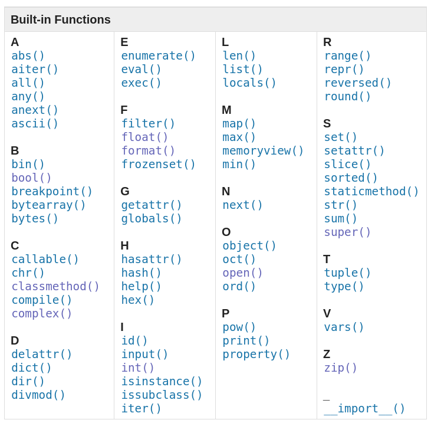

- `abs(x)` абсолютное значение, если объект реализует метод `__abs__()`
- `aiter(async_iterable)` возвращает асинхронный итератор для асинхронного итерируемого объекта. Аналог `x.__aiter__()`
- `all(iterable)` вернет `True`, если все эелементы итерируемого объекта `True`, иначе `False`
- `any(iterable)` вернет `True`, если любой (первый встречный) элемент итерируемого объекта `True`, иначе `False`
- awaitable  `anext(async_iterator[, default])` - когда вызывается в await, вернет следующее значение из асинхронного генератора. Вызывает `__anext__()` асинхронного итератора. default вернется, когда поднимется `StopAsyncIteration` (почвилось в 3.10)
- `ascii(object)` как и `repr()`, возвращает строку, содержащую человекочитаемое представление объекта, но экранирует не-ASCII-символы в строке
- `bin(x)` int -> bin
- class `bool()`
- `breakpoint(*args, **kws)` вызывает отладчик в точке определения
- class `bytearray([source[, encoding[, errors]]])` новый байтаррай объект
- class `bytes([source[, encoding[, errors]]])` новый байт объект
- `callable(object)` если объект вызываемый -> `True`, иначе 'False`
- `chr(i)` -> строковая репрезентация символа с Unicode-номером i
- `@classmethod` method -> classmwthod. Начиная с 3.9 может декорировать дескрипторы (тип `property()`). В 3.10 получил `__module__`, `__name__`, `__qualname__`, `__doc__`, `__annotations__`, `__wrapped__`
- `compile(source, filename, mode, flags=0, dont_inherit=False, optimize=- 1)`
- class `complex([real[, imag]])` string/number -> complex number
- `delattr(object, name)` name - это строкове имя атрибута object. Аналог `del x.foobr`
- `dir([object])` без аргументов ворзращает спиоск имен локального scope (смотри [[python-namespaces]]). С аргументом - возвращает список атрибутов обхекта. Если у объекта есть `__dir__()` будет вызван этот ментод (это позволяет определить `__getattr__()` или `__gettatribute__()` для переопределения способа возврата списка атрибутов). Если `__dir__()` не определен - функция пытается выдернуть имена из `__dict__`. Для разных объектов поведение отличается:
  - если объект Модуль - в список включены атрибуты
  - если type или класс - имена атрибутов и рекурсивно имена атрибутов унаследованных классов
- `divmod(a, b)` два некомплексных числа -> пара чисел, состоящая из их частного и остатка при использовании целочисленного деления. Для int аналог `(a // b, a % b)`. Для float аналог `(math.floor(a / b), a % b)`
- `enumerate(iterable, start=0)` -> enumerate объект, `__next__()` метод которого возвращает кортеж с порядковым номером и значением из последовательности (дефолтный номер старта 0). Аналог;

    ```python
    def enumerate(sequence, start=0):
    n = start
    for elem in sequence:
        yield n, elem
        n += 1
    ```

- `eval(expression[, globals[, locals]])`. Аргументы представляют собой строку и необязательные глобальные и локальные переменные. globals должен быть словарем. locals может быть любым отображением. Аргумент оценивается как выражение python с использованием отображений globals и locals в качестве глобального и локального пространства имен. Результатом функции будет выполнение оцененного выражения. [Подробнее](https://docs.python.org/3/library/functions.html#eval)
- `exec(object[, globals[, locals]])` реализует динамическое выполнение кода. Объект - это либо строка либо объек5т кода. Строка анализируется как набор операторов, которая будет выполнена, если не поднимается ошибка. Код просто выполняется. [Подробннее](https://docs.python.org/3/library/functions.html#exec)
- Отличие exec и eval [тут](https://stackoverflow.com/a/29456463/15966204). Вкратце - eval принимает только одно выражение, exec может принять целый блок кода. При этом eval возвращает результат вычислений, а exec всегда игнорирует.
- `filter(function, iterable)` - создает итератор из элементов итерируемого объекта, для которых функция возвращает `True`. аналог `(item for item in iterable if function(item))`
- class `float([x])` str(decimale number with string representation)/int -> float. Для строковой сигнатуры игнорирует пробелы с обоих концов и знаки перевода строки. [Подробнее](https://docs.python.org/3/library/functions.html#float)
- `format(value[, format_spec])`
- class `frozenset([iterable])`
- `getattr(object, name[, default])` -> значение атрибута по строковому имени. Аналогично `x.foobar`
- `hasattr(object, name)` -> bool для атрибута по его строковому имени, если exist
- `globals()` -> словарь имен текущего неймспейса уровня модуля. Смотри [[python-namespaces]]
- `hash(object)` -> int hash value
- `help([object])` вызов встреонной справки
- `hex(x)` int -> hex
- `id(object)` -> int id значение объекта. Смотри [[python-datamodel]] - в cpython это адрес памяти объекта
- `input([prompt])` читает инпут, конвертит в строку и возвращает. Параметр prompt устанавливает значение строки приглашения
- `int([x])` `class int(x, base=10)` num/str -> int. Если определенs `x.__int__()`, `x.__index__()`, `x.__trunc__()` - вернет из них. Про base [подробнее тут](https://docs.python.org/3/library/functions.html#int)
- `isinstance(object, classinfo)` -> bool
- `issubclass(class, classinfo)` -> bool
- `iter(object[, sentinel])` возвращает итератор объекта. Если не передан второй параметр, объект должен поддерживать протокол итератора (реализовать `__iter__()`) или протокол последовательности (`__getitem__()` начиная с 0). Если передан второй аргумент - объект должен быть вызываемым. В этом случае при каждом `__next__()` полученного итератора будет вызываться объект без аргументов, если возвращенное значение эквивалентно sentinel, будет поднят `StopIteration`

  ```python
  from functools import partial
  with open('mydata.db', 'rb') as f:
      for block in iter(partial(f.read, 64), b''):
          process_block(block)
  ```

- `len(s)`
- class `list([iterable])`
- `locals()` -> словарь имен локальной области (на уровне модуля тоже самое что и `globals()`). Смотри [[python-namespaces]]
- `map(function, iterable, ...)` -> итератор, в котором функция применяется к каждому элементу итерируемого объекта. Если жополнительные параметры переданы - они передаются как аргументы в функцию
- `max(iterable, *[, key, default])` `max(arg1, arg2, *args[, key])`. Если передан один объект - это должен быть итерируемый объект. key - одноаргументная функция, определяющая порядок определения максимума. default возвращается, если итерируемый объект пустой.

  ```python
  >>> d = {'aim':99, 'aid': 45, 'axe': 59, 'big': 9,
  ... 'short': 995, 'sin':12, 'sword':1, 'friend':1000,
  ... 'artwork':23}
  >>> max(d.keys(), key=lambda x: len(x))
  'artwork'
  >>> max(d.keys(), key=lambda x: d[x])
  'friend'
  ```

- class `memoryview(object)` [подробнее](https://docs.python.org/3/library/stdtypes.html#typememoryview)
- `min(iterable, *[, key, default])` `min(arg1, arg2, *args[, key])` см. max()
- `next(iterator[, default])` вызывает `__next__()` итератора
- `next(iterator[, default])` -> объект, базовый для всех классов
- `oct(x)` int -> oct
- `open(file, mode='r', buffering=- 1, encoding=None, errors=None, newline=None, closefd=True, opener=None)` открывает файл и возвращает связанный file-объект. Смотри подробнее в [[python-reading-and-writing-files]]
- `ord(c)` str one Unicode character-> int Unicode point
- `pow(base, exp[, mod])` -> base^exp с опциональным делением по модулю mod. Еквивалент: `base ** exp` или `base * exp% mod`
- `print(*objects, sep=' ', end='\n', file=sys.stdout, flush=False)`
- class `property(fget=None, fset=None, fdel=None, doc=None)` возвращает атрибут-свойство. fget функция которая возвращает значение атрибута, fset устанавливает, fdel удаляет, doc - строки документации.

  ```python
  class C:
    def __init__(self):
        self._x = None

    def getx(self):
        return self._x

    def setx(self, value):
        self._x = value

    def delx(self):
        del self._x

    x = property(getx, setx, delx, "I'm the 'x' property.")
    ```

    Можно и через декоратор `@property` - в примере ниже мы устанавливаем getter, setter и deleter (сам декоратор `@property` по дефолту устанавливает getter) - методы декоратора `@property`

  ```python
  class C:
    def __init__(self):
        self._x = None

    @property
    def x(self):
        """I'm the 'x' property."""
        return self._x

    @x.setter
    def x(self, value):
        self._x = value

    @x.deleter
    def x(self):
        del self._x
  ```

  Смотри подробнее [[python-datamodel]]

- class `range(stop)` class `range(start, stop[, step])` -> объект Range. [Подробнее](https://docs.python.org/3/library/stdtypes.html#typesseq-range)
- `repr(object)`
- `reversed(seq)` -> итератор с последовательностью в обратном порядке. У последовательности должен быть реализован `__reversed__()`
- `round(number[, ndigits])`
- class `set([iterable])`
- `setattr(object, name, value)` см. getattr()
- `class slice(stop)` class `slice(start, stop[, step])` -> [slice объект](https://docs.python.org/3/glossary.html#term-slice). `itertools.islice()` [вернет итератор](https://docs.python.org/3/library/itertools.html#itertools.islice)

  ```python
  s = slice(0, 5, 2)
  this = [1,2,3,4,5,6,7]
  print(this[s])
  ```

- `sorted(iterable, /, *, key=None, reverse=False)` -> sorted **list**. key определяет функцию, которая будет оценивать принцип сортировки. Алгоритм сортировки использует только сравнения между элементами. Хотя определения метода `__lt__()` будет достаточно для сортировки,  рекомендуется реализовать все шесть расширенных сравнений. Смотри [[python-datamodel]]. Смотри [[python-sorting]]
- `@staticmethod`

  ```python
  class C:
  @staticmethod
  def f(arg1, arg2, ...): ...
    ```

  Или так:

  ```python
  def regular_function():
    ...

  class C:
      method = staticmethod(regular_function)
  ```

  В 3.10 получил `__module__`, `__name__`, `__qualname__`, `__doc__`, `__annotations__`, `__wrapped__`. Смотри [[python-datamodel]]

- class `str(object='')` class `str(object=b'', encoding='utf-8', errors='strict')` -> str version of object
- `sum(iterable, /, start=0)` -> сумма слева направою Для флотов лучше `math.fsum()` [[mathematic-in-python]]
- class `super([type[, object-or-type]])` - возвращает прокси-объект, который делегирует вызовы методов родительскому или одноуровневому классу. Это полезно для доступа к унаследованным методам, которые были переопределены в классе. [Подробнее](https://docs.python.org/3/library/functions.html#super). Смотри [[python-super-guide]]

  ```python
  class C(B):
    def method(self, arg):
        super().method(arg)    # This does the same thing as:
                               # super(C, self).method(arg)
  ```

- class `tuple([iterable])`
- `class type(object)` `class type(name, bases, dict, **kwds)` с одним аргументов возвращает тип объекта (эквивалент `object.__class__`). С тремя аргументами возвращает новый объект `type`. Это идентично:

  ```python
  class X:
    a = 1

  X = type('X', (), dict(a=1))
  ```

- `vars([object])` -> `__dict__` атрибут, там где он определен. Без аргументов vars эквивалентен locals()
- `zip(*iterables, strict=False)` -> итератор, составленный из последовательностей. Длина - по наименьшей длине. Насиная с 3.10 `strict=True` поднимет ошибку, если длина последовательностей разная. [Подробнее](https://docs.python.org/3/library/functions.html#zip). Смотри [[itertools]] и [[more-itertools]] для большего функционала

  ```python
  >>> for item in zip([1, 2, 3], ['sugar', 'spice', 'everything nice']):
  ...     print(item)
  ...
  (1, 'sugar')
  (2, 'spice')
  (3, 'everything nice')
  ```

- `__import__(name, globals=None, locals=None, fromlist=(), level=0)` испорт модуля. Для рутинных задач не требуется. [Смотри подробнее](https://docs.python.org/3/library/functions.html#import__). Если нужно просто заимпортить модуль по имени - используй `importlib.import_module()` из [[python-import-tools]]

Смотри еще:

- [документация](https://docs.python.org/3/library/functions.html)
- [[python-datamodel]]
- [[python-glossary]]
- [[python-standart-library]]

[//begin]: # "Autogenerated link references for markdown compatibility"
[python-namespaces]: python-namespaces "Python namespaces"
[python-namespaces]: python-namespaces "Python namespaces"
[python-datamodel]: ../lists/python-datamodel "Python datamodel"
[python-namespaces]: python-namespaces "Python namespaces"
[python-reading-and-writing-files]: python-reading-and-writing-files "Режимы чтения и записи файлов"
[python-datamodel]: ../lists/python-datamodel "Python datamodel"
[python-datamodel]: ../lists/python-datamodel "Python datamodel"
[python-sorting]: python-sorting "Python sorting"
[python-datamodel]: ../lists/python-datamodel "Python datamodel"
[mathematic-in-python]: mathematic-in-python "Mathematic in python"
[python-super-guide]: python-super-guide "Python super guide"
[itertools]: itertools "Itertools"
[more-itertools]: more-itertools "More itertools"
[python-import-tools]: python-import-tools "Python import tools"
[python-datamodel]: ../lists/python-datamodel "Python datamodel"
[python-glossary]: python-glossary "Python glossary"
[python-standart-library]: ../lists/python-standart-library "Стандартная библиотека python и полезные ресурсы"
[//end]: # "Autogenerated link references"
[//begin]: # "Autogenerated link references for markdown compatibility"
[python-namespaces]: python-namespaces "Python namespaces"
[python-namespaces]: python-namespaces "Python namespaces"
[python-datamodel]: ../lists/python-datamodel "Python datamodel"
[python-namespaces]: python-namespaces "Python namespaces"
[python-reading-and-writing-files]: python-reading-and-writing-files "Режимы чтения и записи файлов"
[python-datamodel]: ../lists/python-datamodel "Python datamodel"
[python-datamodel]: ../lists/python-datamodel "Python datamodel"
[python-sorting]: python-sorting "Python sorting"
[python-datamodel]: ../lists/python-datamodel "Python datamodel"
[mathematic-in-python]: mathematic-in-python "Mathematic in python"
[python-super-guide]: python-super-guide "Python super guide"
[itertools]: itertools "Itertools"
[more-itertools]: more-itertools "More itertools"
[python-import-tools]: python-import-tools "Python import tools"
[python-datamodel]: ../lists/python-datamodel "Python datamodel"
[python-glossary]: python-glossary "Python glossary"
[python-standart-library]: ../lists/python-standart-library "Стандартная библиотека python и полезные ресурсы"
[//end]: # "Autogenerated link references"