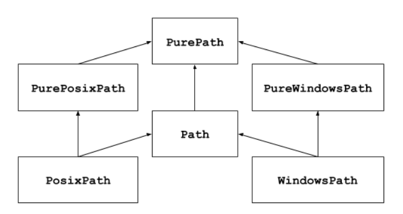

# Работа с файлами

Это короткая заметка об инструментах работы с файловой системой, предоставляемыми стандартной библиотекой python

## [os.path](https://docs.python.org/3/library/os.path.html)

Обеспечивает базовые манипуляции с путями файлов. Используется для разбора строк, представляющих пути и используется для повышения переносимости между платформами

[Подробнее про работу с файлами и директорими](https://docs.python.org/3/library/os.html#files-and-directories)

- `os.access` управление правами
- `os.chdir`, `os.chown`, `os.chroot`, `os.fchdir`, `os.getcwd()` смена текущих директорий (рабочей, рута) и получение строковго представления
- `os.listdir` список вложенных в директорию объектов
- `os.walk` создание списка содержимого каталога с обходом сверху вниз или снизу вверх, содержащего кортежи из пути к каталогу, названий сабдиректорий, названий содержащихся файлов
- `os.mkdir` создание директории, если путь к ней указан верно
- `os.makedirs` создание директории вместе со всем указанным путем
- `os.rmdir` удаление пустого каталога
- `os.removedirs` рекурсивное удаление каталога и всех пустых каталогов на пути к нему
- `os.rename` переименование файла или каталога
- `os.renames` рекурсивный вариант (создается путь, если его нет)
- `os.replace` перемещение файла или каталога
- `os.unlink` удаление пути к файлу (по сути удаление файла)

## [pathlib](https://docs.python.org/3/library/pathlib.html?highlight=pathlib#module-pathlib)

Предоставляет объектно-ориентированный АПИ для анализа, проверки, создания и других операций с путями. Реализовано несколько представлений - чистые (pure) классы, которые реализуют представление, но не взаимодействуют с файловой системой и конкретные (concrete), которые взаимодействуют с локальной системой. Реализованы как POSIX так и windows стандарты.

Можно создавать и производить синт.анализ:

- пути
- каталоги
- файлы
- символические ссылки

Можно получать и устанавливать свойства объектов, включая права доступа, а так-же удалять их.

## [glob](https://docs.python.org/3/library/glob.html?highlight=glob#module-glob)

Определение шаблонов имен файлов в unix-стиле

## [fnmatch](https://docs.python.org/3/library/fnmatch.html?highlight=fnmatch#module-fnmatch)

Реализует сравнение имен с шаблонами glob

## [linecache](https://docs.python.org/3/library/linecache.html?highlight=linecache#module-linecache)

Используется для сокращения издержек чтения файлов (к примеру при трассировке или при создании отчетов ошибок). Можно использовать для задач. в которых требуется многократное чтение одного и того же файла.

## [tempfile](https://docs.python.org/3/library/tempfile.html?highlight=tempfile#module-tempfile)

Создание временных файлов и директорий. Есть возможность создавать неименованные файлы (для случаев, когда не требуется совместное использование) и именованные файлы (когда требуется анализ создаваемых файлов). Доступен свой менеджер контекста.

Запись о создании файла удапляется сразу после его создания. Сам файл удаляется после его закрытия. Есть возможность создавать небольшие файлы в буфере вместо обращения к диску.

## [shutil](https://docs.python.org/3/library/shutil.html?highlight=shutil#module-shutil)

Предоставляет выскоуровневые операции с файлами и каталогами:

- копирование файлов
- частичное копирование метаданных
- работа с деревом каталогов - создание, перемещение и т.д.
- поиск файлов
- архивация (создание и распаковка архивов)
- измененеие владельца
- определение размера файловой системы

## [filecmp](https://docs.python.org/3/library/filecmp.html?highlight=filecmp#module-filecmp)

Реализует сравнение файлов и директорий. Смотри еще [difflib](https://docs.python.org/3/library/difflib.html?highlight=difflib#module-difflib) - сравнение последовательностей

## [mmap](https://docs.python.org/3/library/mmap.html?highlight=mmap#module-mmap)

Отображение файлов в память: чтение, запись, копирование.

## [codecs](https://docs.python.org/3/library/codecs.html?highlight=codecs#module-codecs)

Перекодировка текстовых данных.

## [io](https://docs.python.org/3/library/io.html)

Поставляет классы, реализующие `open()` в операциях ввода-вывода. Это позволяет работать с текстовыми, двоичными и необработанными данными в памяти с использованием файлового апи.

[[python-standart-library]]

[//begin]: # "Autogenerated link references for markdown compatibility"
[python-standart-library]: ../lists/python-standart-library "Стандартная библиотека python и полезные ресурсы"
[//end]: # "Autogenerated link references"