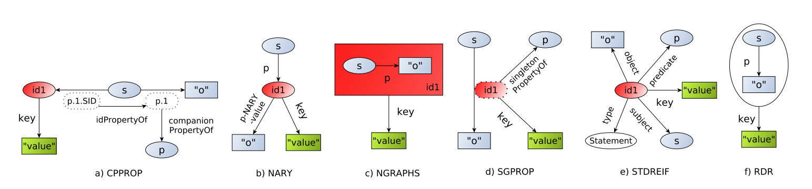

RDF - Resource Description Framework.

Основной элемент RDF - это триплет `сущность - атрибут - значение`, называемый утверждением. Это реализует гибкий подход, не зависящий от предметной области. Пользователям необходимо самостоятельно определять термины, на которых базируются утверждения. RDFs предоставляет "словарь", позволяющий определить термины однозначно.

Три основных компонента RDF:

- модель данных - непосредственно сам RDF
- схема - RDFs
- семантика - Turtle/RDFa/RDF-XML e.t.c.

## Модель данных RDF

### Ресурсы

Ресурсы в RDF - это объекты, сущности, предметы или вещи, о которых мы хотим сделат ьвысказывание. Каждый ресурс имеет URI(или IRI) который уникально идентифицирует данный ресурс. URI не обязательно обеспечивает доступ к ресурсу по URL. Ресурс может быть dereferencable - его разыменование в таком случае позволяет получить сам объект, к примеру изображение, или более подробное описание.

### Свойства или предикаты

Свойства - это особый вид ресурсов, который описывает отношения между ресурсами.

### Утверждения

Утверждения задают определенные свойства для определенных ресурсов и реализуюся в виде триплетов `сущность - атрибут - значение`. В качестве значений может выступать как ресурс, так и литерал (атомарные величины, к примеру строки или числа).

Часто можно встретить такое определение утверждения: `субъект - атрибут - объект`

### Графы

Утверждения представляются в виде графов, в которых связи направлены от объекта к субъекту. Субъекты сами могут выступать в роли объектов, связанных с другими субъектами.

RDF-граф может быть создан в распределенном режиме несколькими участниками за счет URI, а затем повторно использорван другими пользователями. Для этого рекомендуется следовать следующей концепции:

- URI в качестве имен сущностей
- предоставлять http КШ lkz j,hfotybz gjkmpjdfntktq r ceoyjcnzv
- предоставлять полезную информацию при обращении к URI
- включать ссылки в другие URI

### Неименованные вершины

blank nodes - анонимно заданные сущности без идентификатора или литерала, могут содержать другие отношения и значения. Используется в том числе для описания сложных предикатов и реификации

### Реификация

Иногда необходимо выделить конкретные утверждения и части графов, например чтобы указать источник утверждения. За это действие отвечает реификация (материализация) утверждений. При реификации вводится вспомогательный объект statement, который связывается с каждой из трех частей реифицируемого утверждения посрдством RDF-свойств subject, predicate, object.

Пример реификации на (рис.e). из статьи [Evaluation of Metadata Representations in RDF stores](http://www.semantic-web-journal.net/system/files/swj1791.pdf)

Такой подход необходим, так как RDF определяет только триплеты и нет возможности создать непосредственно идентификатор для триплетов. Чтобы разрешить вычислительные проблемы в RDF дополнительно введен именованный граф (рис.c)

### Предикаты с несколькими аргументами

Фактически с помощью RDF возможно записать только бинарные предикаты вида P(x, y), где P - бинарный предикат в триплете (x, P, y). В случе, когда требуется предикат с несколькими аргументами, он моделируется в виде последовательности бинарных предикатов: для P(X, Y, Z) мы можем ввести вспомогательный объект Q и тогда можно записать так P(Q, X), P(Q, Y), P(Q, Z) (рис.b)

Больше информации об остальных схемах с изображения см. [лекцию М.Галкина](https://migalkin.github.io/kgcourse2021/lectures/lecture4)

## Синтаксис RDF

Сериализация:

- [[turtle]] terse RDF triple language - машино-интерпретируемый синтаксис (.ttl), допускает определение литералов, сдание пространства имен (сокращения), определение именованных графов
- TriG - дополнение для Turtle для создания датасетов
- N-Triples - a very simple, easy-to-parse, line-based format that is not as compact as Turtle.
- N-Quads -  a superset of N-Triples, for serializing multiple RDF graphs.
- JSON-LD - a JSON-based serialization.
- N3 or Notation3 - a non-standard serialization that is very similar to Turtle, but has some additional features, such as the ability to define inference rules.
- RDF/XML - an XML-based syntax that was the first standard format for serializing RDF.
- RDF/JSON - an alternative syntax for expressing RDF triples using a simple JSON notation.

Связанные синтаксисы:

- RDFa - синтаксис для включения RDF-разметки в html документ
- [JSON-LD](https://en.wikipedia.org/wiki/JSON-LD) это метод кодирования связанных данных с использованием JSON

## Семантика на основе RDFs

Смотри еще:

- [статья на вики](https://en.wikipedia.org/wiki/Resource_Description_Framework)
- [ресуррсы на w3c](https://www.w3.org/RDF/)
- [standards and drafts](https://www.w3.org/TR/?tag=data)
- [[semantic-web]]
- [[owl]]
- [[turtle]]
- [[knowledge-graphs]]
- [[neosematics]]
- [[neo4j]]

[//begin]: # "Autogenerated link references for markdown compatibility"
[turtle]: turtle "Turtle for RDF"
[semantic-web]: semantic-web "Semantic web"
[owl]: owl "OWL ontology"
[turtle]: turtle "Turtle for RDF"
[knowledge-graphs]: ../lists/knowledge-graphs "Knowledge graphs"
[neosematics]: neosematics "Neosematics"
[neo4j]: neo4j "Neo4j graph data base"
[//end]: # "Autogenerated link references"