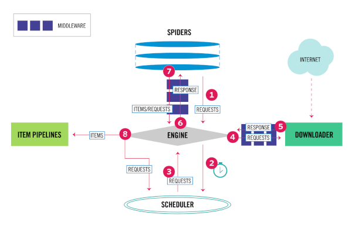

# Scrapy

Scrapy - это dысокоуровневый fcby[hjyysq фреймворк для web-скрапинга и краулинга на python

Создание проекта: `scrapy startproject proj_name`

Результат:

```shell
proj_name/
    scrapy.cfg            # deploy configuration file

    proj_name/            # project's Python module, you'll import your code from here
        __init__.py

        items.py          # project items definition file

        middlewares.py    # project middlewares file

        pipelines.py      # project pipelines file

        settings.py       # project settings file

        spiders/          # a directory where you'll later put your spiders
            __init__.py
```

Краулер можно создать, наслудуясь от класса `Spider` в spiders/

```python
from scrapy import Spider


class QuotesSpider(Spider):
    name = "quotes"
    start_urls = [
        'http://quotes.toscrape.com/page/1/',
        'http://quotes.toscrape.com/page/2/',
    ]

    def parse(self, response):
        page = response.url.split("/")[-2]
        filename = f'quotes-{page}.html'
        with open(filename, 'wb') as f:
            f.write(response.body)
```

АПИ scrapy активно использует колбеки (смотри [[python-glossary]]). `parse()` метод будет вызываться для обработки каждого запроса URL-адресов, даже если мы явно не указали Scrapy делать это. Это происходит потому, что `parse()` это колбек по умолчанию, который вызывается для запросов без явно назначенного обратного вызова.

`name` и `start_urls` это определенные в АПИ дефолтные атрибуты класса. `start_urls` это аналог вот этого:

```python
def start_requests(self):
    urls = [
        'http://quotes.toscrape.com/page/1/',
        'http://quotes.toscrape.com/page/2/',
    ]
    for url in urls:
        yield scrapy.Request(url=url, callback=self.parse)
```

В АПИ scrapy использщуются генераторы. За счет конструкции `yield` обеспечивается большинство операций извлечения контента из запросов, а за счет колбеков - вызов, в том числе рекурсивный, необходимых операций.

В библиотеке реализован [собственный шел](https://docs.scrapy.org/en/latest/topics/shell.html#topics-shell), с помощью которого можно попробовать запросы или извлечение данных из объектов запроса, а так-же можно выполнить дебагинг. Пример ниже:

```shell
scrapy shell 'http://quotes.toscrape.com/page/1/'

2022-01-16 01:35:35 [scrapy.utils.log] INFO: Scrapy 2.5.1 started (bot: scrapybot)
2022-01-16 01:35:35 [scrapy.utils.log] INFO: Versions: lxml 4.7.1.0, libxml2 2.9.12, cssselect 1.1.0, parsel 1.6.0, w3lib 1.22.0, Twisted 21.7.0, Python 3.8.10 (default, Jun  2 2021, 10:49:15) - [GCC 10.3.0], pyOpenSSL 21.0.0 (OpenSSL 1.1.1m  14 Dec 2021), cryptography 36.0.1, Platform Linux-5.8.0-7630-generic-x86_64-with-glibc2.32
2022-01-16 01:35:35 [scrapy.utils.log] DEBUG: Using reactor: twisted.internet.epollreactor.EPollReactor
2022-01-16 01:35:35 [scrapy.crawler] INFO: Overridden settings:
{'DUPEFILTER_CLASS': 'scrapy.dupefilters.BaseDupeFilter',
 'LOGSTATS_INTERVAL': 0}
2022-01-16 01:35:35 [scrapy.extensions.telnet] INFO: Telnet Password: a6f662f302955377
2022-01-16 01:35:35 [scrapy.middleware] INFO: Enabled extensions:
['scrapy.extensions.corestats.CoreStats',
 'scrapy.extensions.telnet.TelnetConsole',
 'scrapy.extensions.memusage.MemoryUsage']
2022-01-16 01:35:35 [scrapy.middleware] INFO: Enabled downloader middlewares:
['scrapy.downloadermiddlewares.httpauth.HttpAuthMiddleware',
 'scrapy.downloadermiddlewares.downloadtimeout.DownloadTimeoutMiddleware',
 'scrapy.downloadermiddlewares.defaultheaders.DefaultHeadersMiddleware',
 'scrapy.downloadermiddlewares.useragent.UserAgentMiddleware',
 'scrapy.downloadermiddlewares.retry.RetryMiddleware',
 'scrapy.downloadermiddlewares.redirect.MetaRefreshMiddleware',
 'scrapy.downloadermiddlewares.httpcompression.HttpCompressionMiddleware',
 'scrapy.downloadermiddlewares.redirect.RedirectMiddleware',
 'scrapy.downloadermiddlewares.cookies.CookiesMiddleware',
 'scrapy.downloadermiddlewares.httpproxy.HttpProxyMiddleware',
 'scrapy.downloadermiddlewares.stats.DownloaderStats']
2022-01-16 01:35:35 [scrapy.middleware] INFO: Enabled spider middlewares:
['scrapy.spidermiddlewares.httperror.HttpErrorMiddleware',
 'scrapy.spidermiddlewares.offsite.OffsiteMiddleware',
 'scrapy.spidermiddlewares.referer.RefererMiddleware',
 'scrapy.spidermiddlewares.urllength.UrlLengthMiddleware',
 'scrapy.spidermiddlewares.depth.DepthMiddleware']
2022-01-16 01:35:35 [scrapy.middleware] INFO: Enabled item pipelines:
[]
2022-01-16 01:35:35 [scrapy.extensions.telnet] INFO: Telnet console listening on 127.0.0.1:6023
2022-01-16 01:35:35 [scrapy.core.engine] INFO: Spider opened
2022-01-16 01:35:36 [scrapy.core.engine] DEBUG: Crawled (200) <GET http://quotes.toscrape.com/page/1/> (referer: None)
2022-01-16 01:35:36 [asyncio] DEBUG: Using selector: EpollSelector
[s] Available Scrapy objects:
[s]   scrapy     scrapy module (contains scrapy.Request, scrapy.Selector, etc)
[s]   crawler    <scrapy.crawler.Crawler object at 0x7ff2693c20a0>
[s]   item       {}
[s]   request    <GET http://quotes.toscrape.com/page/1/>
[s]   response   <200 http://quotes.toscrape.com/page/1/>
[s]   settings   <scrapy.settings.Settings object at 0x7ff2693c0d90>
[s]   spider     <DefaultSpider 'default' at 0x7ff269178dc0>
[s] Useful shortcuts:
[s]   fetch(url[, redirect=True]) Fetch URL and update local objects (by default, redirects are followed)
[s]   fetch(req)                  Fetch a scrapy.Request and update local objects 
[s]   shelp()           Shell help (print this help)
[s]   view(response)    View response in a browser
2022-01-16 01:35:36 [asyncio] DEBUG: Using selector: EpollSelector
In [1]: 
```

Для разбора html используются [[css-selectors]] и [[xpath]]. При этом CSS позволяет реализовать навигацию по html, а XPath более функциональный разбор ( а именно извлечение контента). Фактически CSS транслируется в XPath.

Пример извлечения данных с помощью селекторов:

```python
from scrapy import Spider


class QuotesSpider(Spider):
    name = "quotes"
    start_urls = [
        'http://quotes.toscrape.com/page/1/',
        'http://quotes.toscrape.com/page/2/',
    ]

    def parse(self, response):
        for quote in response.css('div.quote'):
            yield {
                'text': quote.css('span.text::text').get(),
                'author': quote.css('small.author::text').get(),
                'tags': quote.css('div.tags a.tag::text').getall(),
            }
```

Результат:

```shell
2016-09-19 18:57:19 [scrapy.core.scraper] DEBUG: Scraped from 
<200 http://quotes.toscrape.com/page/1/>
{'tags': ['life', 'love'], 'author': 'André Gide', 
'text': '“It is better to be hated for what you are than to be loved for what you are not.”'}
2016-09-19 18:57:19 [scrapy.core.scraper] DEBUG: Scraped from 
<200 http://quotes.toscrape.com/page/1/>
{'tags': ['edison', 'failure', 'inspirational', 'paraphrased'], 'author': 'Thomas A. Edison', 
'text': "“I have not failed. I've just found 10,000 ways that won't work.”"}
```

Сохранение данных реализовано через [Item Pipline](https://docs.scrapy.org/en/latest/topics/item-pipeline.html#topics-item-pipeline). Можно сохранять в `.json` или в базы данных, сохранять файлы или делать скриншоты. Особых огранисений нет, в основном используется для:

- очистка HTML-данных
- проверка очищенных данных (проверка того, что элементы содержат определенные поля)
- проверка на наличие дубликатов (и удаление их)
- сохранение очищенных элементов в базе данных или в виде файлов

Пример сохранения в MongoDB:

```python
import pymongo
from itemadapter import ItemAdapter

class MongoPipeline:

    collection_name = 'scrapy_items'

    def __init__(self, mongo_uri, mongo_db):
        self.mongo_uri = mongo_uri
        self.mongo_db = mongo_db

    @classmethod
    def from_crawler(cls, crawler):
        return cls(
            mongo_uri=crawler.settings.get('MONGO_URI'),
            mongo_db=crawler.settings.get('MONGO_DATABASE', 'items')
        )

    def open_spider(self, spider):
        self.client = pymongo.MongoClient(self.mongo_uri)
        self.db = self.client[self.mongo_db]

    def close_spider(self, spider):
        self.client.close()

    def process_item(self, item, spider):
        self.db[self.collection_name].insert_one(ItemAdapter(item).asdict())
        return item
```

Рекурсивный обход реализуется через колбеки. Пример:

```python
from scrapy import Spider


class AuthorSpider(Spider):
    name = 'author'

    start_urls = ['http://quotes.toscrape.com/']

    def parse(self, response):
        author_page_links = response.css('.author + a')
        yield from response.follow_all(author_page_links, self.parse_author)

        pagination_links = response.css('li.next a')
        yield from response.follow_all(pagination_links, self.parse)

    def parse_author(self, response):
        def extract_with_css(query):
            return response.css(query).get(default='').strip()

        yield {
            'name': extract_with_css('h3.author-title::text'),
            'birthdate': extract_with_css('.author-born-date::text'),
            'bio': extract_with_css('.author-description::text'),
        }
```

Этот паук запустится с главной страницы, он будет переходить по всем ссылкам на страницы авторов, вызывая `parse_author` для каждого из них, а также ссылки пагинации с `parse` рекурсивно. В данном примере реализован шаблон запроса по селектору `extract_with_css` а колбеки мы передаем в качестве аргументов в `response.follow_all()`.

Scrapy самостоятельно отфильтровывает повторяющиеся запросы к уже посещенным страницам (это можно настроить отдельно).

## Архитектура



1. Engine получает первоначальные запросы на сканирование от Spider
2. Engine планирует запросы в Scheduler и запрашивает следующие запросы для сканирования
3. Scheduler возвращает следующие запросы движку
4. Engine отправляет запросы Downloader, проходя через ПО промежуточного слоя Downloader
5. Как только страница завершает загрузку, Downloader генерирует ответ (с этой страницей) и отправляет его в Engine, проходя через промежуточный смлой Downloader
6. Engine получает ответ от Downloader и отправляет его Spider для обработки, проходя через промежуточное слой Spider
7. Spider обрабатывает ответ и возвращает очищенные элементы и новые запросы в Engine, проходя через промежуточный слой Spider
8. Engine отправляет обработанные элементы в Item Pipelines, затем отправляет обработанные запросы планировщику и запрашивает возможные следующие запросы для сканирования.
9. Процесс повторяется (с шага 1) до тех пор, пока не закончатся запросы от Scheduler

Engine отвечает за управление потоком данных между всеми компонентами системы и инициирование событий при выполнении определенных действий

Scheduler получает запросы от движка и ставит их в очередь для передачи позже (также в движок), когда движок их запрашивает

Downloader отвечает за получение веб-страниц и передачу их движку, который, в свою очередь, передает их в Spiders

Spiders — это настраиваемые классы, написанные пользователями Scrapy для анализа ответов и извлечения из них элементов или дополнительных запросов

Item Pipelines отвечает за обработку элементов после их извлечения (или очистки) пауками. Типичные задачи включают очистку, проверку и сохранение (например, сохранение элемента в базе данных)

Промежуточный слой Downloader — это специальные перехватчики, которые находятся между движком и загрузчиком и обрабатывают запросы, когда они передаются от движка к загрузчику, и ответы, которые передаются от загрузчика к движку. Их надо использовать для следующих задач:

- обрабатывать запрос непосредственно перед его отправкой загрузчику (т. е. прямо перед тем, как Scrapy отправит запрос на веб-сайт)
- изменить полученный ответ перед передачей его пауку
- отправить новый запрос вместо передачи полученного ответа пауку
- передать ответ пауку, не загружая веб-страницу
- отбрасывать некоторые запросы

Промежуточный слой Spider — это специальные хуки, которые находятся между движком и пауками и могут обрабатывать ввод (ответы) и вывод паука (элементы и запросы). Их надо использовать для следующих задач:

- постобработка колбеков паука - изменение/добавление/удаление запросов или элементов
- постобработка start_requests
- обрабатывать исключения пауков
- вызывать errback вместо обратного вызова для некоторых запросов на основе содержимого ответа

Network для скрапи написан на [Twisted](https://twistedmatrix.com/trac/), таким образом он является асинхронным (см. [[asyncio]])

Ссылки на оригинальный материал: [один](https://docs.scrapy.org/en/latest/intro/tutorial.html), [два](https://docs.scrapy.org/en/latest/topics/architecture.html)

[Документация](https://docs.scrapy.org/en/latest/index.html)

## Компоненты

### [Command line tool](https://docs.scrapy.org/en/latest/topics/commands.html)

Конфиг устанавливается в `scrapy.cfg` в ini стиле

`scrapy --info` - доступные опции

`scrapy -h` все доступные команды

[Глобальные](https://docs.scrapy.org/en/latest/topics/commands.html#available-tool-commands):

- [startproject](https://docs.scrapy.org/en/latest/topics/commands.html#startproject) создать новый проект
- [genspider](https://docs.scrapy.org/en/latest/topics/commands.html#genspider) создать нового спайдера (опционально из темплейта `scrapy genspider [-t template] <name> <domain>`)
- [settings](https://docs.scrapy.org/en/latest/topics/commands.html#settings)
- [runspider](https://docs.scrapy.org/en/latest/topics/commands.html#runspider) Запустите автономный паук в файле Python, не создавая проект.
- [shell](https://docs.scrapy.org/en/latest/topics/commands.html#shell) Запускает оболочку Scrapy для заданного URL-адреса (если он указан) или пуст, если URL-адрес не указан
- [fetch](https://docs.scrapy.org/en/latest/topics/commands.html#fetch) Загружает указанный URL-адрес с помощью загрузчика Scrapy и записывает содержимое в стандартный вывод.
- [view](https://docs.scrapy.org/en/latest/topics/commands.html#view) Запускает оболочку Scrapy для заданного URL-адреса (если он указан) или пустой, если URL-адрес не указан.
- [version](https://docs.scrapy.org/en/latest/topics/commands.html#version)

Локальные (только для проекта):

- [crawl](https://docs.scrapy.org/en/latest/topics/commands.html#crawl) запустить краулер
- [check](https://docs.scrapy.org/en/latest/topics/commands.html#check) запустить проверку контрактов
- [list](https://docs.scrapy.org/en/latest/topics/commands.html#list) список доступных спайдеров для проекта
- [edit](https://docs.scrapy.org/en/latest/topics/commands.html#edit) малополезный доступ к редактору
- [parse](https://docs.scrapy.org/en/latest/topics/commands.html#parse) Извлекает указанный URL-адрес и анализирует его с помощью паука, который его обрабатывает, используя метод, переданный с опцией `--callback`, или `parse`, если колбек не указан
- [bench](https://docs.scrapy.org/en/latest/topics/commands.html#bench) Быстрый бенчмарк-тест

### [Spiders](https://docs.scrapy.org/en/latest/topics/spiders.html)

Пауки — это классы, которые определяют, как будет исследоваться определенный сайт (или группа сайтов), в том числе как выполнять сканирование (т. е. переход по ссылкам) и как извлекать структурированные данные.

Для пауков цикл парсинга проходит примерно так: все начинается с создания начальных запросов для сканирования первых URL-адресов и указнияе функции обратного вызова, которая будет вызываться с ответом, полученным из этих запросов. Первые запросы для выполнения получаются путем вызова метода start_requests(), который (по умолчанию) генерирует запрос для URL-адресов, указанных в start_urls, и метода разбора в качестве функции обратного вызова.

В функции обратного вызова анализируется ответ (веб-страница) и возвращаются объекты. объекты запросмов или итераторы объектов. Объекты запросов также могут содержать обратные вызовы (возможно, рекурсивные).

При анализе содержимого страниц обычно используя селекторы (**но вы также можете использовать [[BeautifulSoup]], lxml или любой другой механизм, который вы предпочитаете**). Наконец, элементы, возвращаемые пауком, обычно сохраняются в базе данных (в каком-либо конвейере элементов) или записываются в файл с использованием Feed export. Несмотря на то, что этот цикл применим (более или менее) к любому типу пауков, существуют разные виды пауков по умолчанию, встроенные в Scrapy для разных целей

Основной класс [scrapy.Spider](https://docs.scrapy.org/en/latest/topics/spiders.html#scrapy-spider) Это самый простой паук, от которого наследуются все остальные пауки (включая пауков, поставляемых в комплекте с Scrapy). Никакого специального функционала он не предоставляет. Он просто предоставляет реализацию `start_requests()` по умолчанию, которая отправляет запросы из атрибута паука `start_urls` и вызывает анализ метода паука для каждого из полученных ответов.

Атрибуты, котоыре можно определить для паука:

- `name` - адишник, по которому scrapy находит паука
- `allowed_domains` - списко доменов, ограничивающих область поиска
- `start_urls` - список стартовых урлов краулера
- `custom_settings` - кастомные настройки краулера, переопределяющие настройки проекта. [Есть набор готовых настроек](https://docs.scrapy.org/en/latest/topics/settings.html#topics-settings-ref)
- `crawler` реализует связку с [АПИ scrapi](https://docs.scrapy.org/en/latest/topics/api.html#topics-api-crawler)
- `settings` настройки паука. Смотри [раздел настроек](https://docs.scrapy.org/en/latest/topics/settings.html#topics-settings)
- `logger` обычный python logger, который создается с атрибутом name. Смотри [про логирпование](https://docs.scrapy.org/en/latest/topics/logging.html#topics-logging-from-spiders) в scrapy и [[logging]]

Методы:

- `from_crawler(crawler, *args, **kwargs)` создает паука
- `start_requests()` Этот метод должен возвращать итерируемый объект с первым Requests для этого паука. Он вызывается Scrapy, когда паук запускается. Scrapy вызывает его только один раз, поэтому безопасно также реализовать `start_requests()` в качестве генератора через `yield`
- `parse(response)` Это колбек по умолчанию, используемый Scrapy для обработки загруженных ответов, когда в их запросах не указан обратный вызов.
- `log(message[, level, component])` Обертка, которая отправляет сообщение журнала через регистратор Spider, нужна для обратной совместимости.
- `closed(reason)` вызывается для закрытия спайдера

Пример:

```python
import scrapy

class MySpider(scrapy.Spider):
    name = 'example.com'
    allowed_domains = ['example.com']
    start_urls = [
        'http://www.example.com/1.html',
        'http://www.example.com/2.html',
        'http://www.example.com/3.html',
    ]

    def parse(self, response):
        for h3 in response.xpath('//h3').getall():
            yield {"title": h3}

        for href in response.xpath('//a/@href').getall():
            yield scrapy.Request(response.urljoin(href), self.parse)
```

Спайдер может получать аргументы командной строки. Это делается через переопределение `__init__`. [Смотри тут](https://docs.scrapy.org/en/latest/topics/spiders.html#spider-arguments)

Генерик спайдеры, реализованные в библиотеке:

- [CrawlSpider](https://docs.scrapy.org/en/latest/topics/spiders.html#crawlspider) Это наиболее часто используемый паук для сканирования обычных веб-сайтов, поскольку он обеспечивает удобный механизм перехода по ссылкам путем определения набора правил. Класс реализует атрибут `rules`. Как определять правила краулинга, так-же пример, [смотри тут](https://docs.scrapy.org/en/latest/topics/spiders.html#crawling-rules)
- [XMLFeedSpider](https://docs.scrapy.org/en/latest/topics/spiders.html#xmlfeedspider) Предназначен для разбора XML-каналов путем их итерации по определенному имени узла. Итератор можно выбрать из: `iternodes`, `xml` и `html`. Рекомендуется использовать итератор `iternodes` из соображений производительности, поскольку итераторы `xml` и `html` генерируют сразу весь DOM для его анализа.
- [CSVFeedSpider](https://docs.scrapy.org/en/latest/topics/spiders.html#csvfeedspider) Этот паук очень похож на XMLFeedSpider, за исключением того, что он перебирает строки, а не узлы
- [SitemapSpider](https://docs.scrapy.org/en/latest/topics/spiders.html#sitemapspider) Позволяет сканировать сайт, обнаруживая URL-адреса с помощью файлов Sitemap. Он поддерживает вложенные сайтмапы и обнаружение URL-адресов сайтмапов из robots.txt.

### [Selectors](https://docs.scrapy.org/en/latest/topics/selectors.html)

Собственный механизм извлечения структуры html-документа. Построен аокруг [parsel](https://parsel.readthedocs.io/en/latest/) это библиотека Python под лицензией BSD для извлечения и удаления данных из HTML и XML с использованием селекторов [[xpath]] и [[css-selectors]], в сочетании с регулярными выражениями.

Руководство по использованию см. [тут](https://docs.scrapy.org/en/latest/topics/selectors.html)

### [Items](https://docs.scrapy.org/en/latest/topics/items.html)

Основная цель скрейпинга — извлечь структурированные данные из неструктурированных источников, как правило, веб-страниц. Пауки могут возвращать извлеченные данные в виде элементов, объектов Python, которые определяют пары ключ-значение. Scrapy поддерживает несколько типов элементов, реализованных в [itemadapter](https://github.com/scrapy/itemadapter). Поддерживаются следующие типы:

- `scrapy.item.Item`
- `dict`
- `dataclass`-based classes
- `attrs`-based classes
- `pydantic`-based classes

Пример:

```python
>>> from dataclasses import dataclass
>>> from itemadapter import ItemAdapter, is_item
>>> @dataclass
... class InventoryItem:
...     name: str
...     price: float
...     stock: int
>>>
>>> obj = InventoryItem(name='foo', price=20.5, stock=10)
>>> is_item(obj)
True
>>> adapter = ItemAdapter(obj)
>>> len(adapter)
3
>>> adapter["name"]
'foo'
>>> adapter.get("price")
20.5
>>>
>>> adapter["name"] = "bar"
>>> adapter.update({"price": 12.7, "stock": 9})
>>> adapter.item
InventoryItem(name='bar', price=12.7, stock=9)
>>> adapter.item is obj
True
>>>
>>> adapter.asdict()
{'name': 'bar', 'price': 12.7, 'stock': 9}
>>>
```

### [Item Loaders](https://docs.scrapy.org/en/latest/topics/loaders.html)

Загрузчики айтемов предоставляют удобный механизм для заполнения айтемов извлеченными данными. Несмотря на то, что айтемы могут быть заполнены напрямую, загрузчики элементов предоставляют гораздо более удобный API для их заполнения из процесса очистки за счет автоматизации некоторых общих задач, таких как синтаксический анализ необработанных извлеченных данных перед их назначением. Другими словами, айтемы предоставляют контейнер очищенных данных, а загрузчики элементов предоставляют механизм для заполнения этого контейнера. Загрузчики элементов разработаны, чтобы обеспечить гибкий, эффективный и простой механизм для расширения и переопределения различных правил синтаксического анализа полей, либо с помощью паука, либо с помощью исходного формата (HTML, XML и т. д.).

Чтобы использовать загрузчик элементов, вы должны сначала создать его экземпляр. Вы можете создать его экземпляр с объектом айтема или без него, и в этом случае объект айтема автоматически создается в методе `__init__` загрузчика айтемов с использованием класса, указанного в атрибуте `ItemLoader.default_item_class`. Затем вы начинаете собирать значения в загрузчик, обычно используя селекторы. Вы можете добавить более одного значения в одно и то же поле; загрузчик айтемов знает, как «соединить» эти значения позже, используя соответствующую функцию обработки. Собранные данные хранятся внутри в виде списков, что позволяет добавлять несколько значений в одно и то же поле. Если аргумент айтема передается при создании загрузчика, каждое из значений айтема будет сохранено как есть, если оно уже является итерируемым, или заключено в список.

Пример

```python
from scrapy.loader import ItemLoader
from myproject.items import Product

def parse(self, response):
    l = ItemLoader(item=Product(), response=response)
    l.add_xpath('name', '//div[@class="product_name"]')
    l.add_xpath('name', '//div[@class="product_title"]')
    l.add_xpath('price', '//p[@id="price"]')
    l.add_css('stock', 'p#stock]')
    l.add_value('last_updated', 'today') # you can also use literal values
    return l.load_item()
```

Конструкция поддерживает определение инпута и аутпута, контексты, вложенные лоадеры и повторное использование. [Смотри подробнее](https://docs.scrapy.org/en/latest/topics/loaders.html#scrapy.loader.ItemLoader.add_xpath)

### [Item Pipeline](https://docs.scrapy.org/en/latest/topics/item-pipeline.html)

Конвеер айтемов обрабатывает айтем через несколько компонентов, которые выполняются последовательно. Каждый компонент конвейера эайтемов представляет собой класс Python, реализующий простой метод обработки. Пример приводился выше. Смотри доку и больше примеров [тут](https://docs.scrapy.org/en/latest/topics/item-pipeline.html)

### [Feed Exports](https://docs.scrapy.org/en/latest/topics/feed-exports.html)

Обеспечивает хранение очищенных данных. Вот форматы сериализации, которые поддерживает scrapy:

- JSON
- JSON lines
- CSV
- XML
- Pickle
- Marshal

Так-же реализован доступ к хранилищам в локальных файловых системах, с доступом по ftp S3, GSC и с передачей объектов через стандартный выход.

### [Requests and Responses](https://docs.scrapy.org/en/latest/topics/request-response.html)

Как правило, объекты Куйгуыеы генерируются в пауках и проходят через систему, пока не достигнут загрузчика, который выполняет запрос и возвращает объект ответа, который возвращается к пауку, выдавшему запрос. Оба класса Request и Response имеют подклассы, которые добавляют функциональность, не требуемую в базовых классах. Они описаны ниже в подклассах запроса и подклассах ответа.

В частности мы можем определять тело запроса, [[http-заголовки]], cookies, кодировки и другие параметры запроса, а так-же передавать дополнительтные данные в функцию колбека.

Пример:

```python
def parse_page1(self, response):
    return scrapy.Request("http://www.example.com/some_page.html",
                          callback=self.parse_page2)

def parse_page2(self, response):
    # this would log http://www.example.com/some_page.html
    self.logger.info("Visited %s", response.url)
```

Кроме того, реализованы:

- [обработчики ошибок](https://docs.scrapy.org/en/latest/topics/request-response.html#using-errbacks-to-catch-exceptions-in-request-processing), котоыре возникают в процессе запроса/ответа
- [параметры запроса](https://docs.scrapy.org/en/latest/topics/request-response.html#request-meta-special-keys), например таймаут запрсоа или прокси
- [операции остановки загрузки по запросу](https://docs.scrapy.org/en/latest/topics/request-response.html#stopping-the-download-of-a-response)

Реализовано несколько сабклассов запроса:

- scrapy.http.FormRequest
- scrapy.http.JsonRequest

Объект Response представляет собой HTTP-ответ, который обычно загружается загрузчиком и передается паукам для обработки. Реализует весь набор [[http]]. Кроме того, реализованы сабклассы:

- TextResponse для доп.кодирования и получения не только бинарных данных
- HtmlResponse
- XmlResponse

### [Link Extractors](https://docs.scrapy.org/en/latest/topics/link-extractors.html)

Реализует извлечение ссылок из ответов

### [Settings](https://docs.scrapy.org/en/latest/topics/settings.html)

### [Exceptions](https://docs.scrapy.org/en/latest/topics/exceptions.html)

## В дополнение библиотека поддердживает

- сбор статистики
- отправку сообщений
- извлечение данных из инструментов разработчика браузера
- [загрузку и фильтрацию файлов и изображений](https://docs.scrapy.org/en/latest/topics/media-pipeline.html) (в т.ч. отброс повторов. эффективное храниение и т.д.)

пример

```python
import scrapy
from itemadapter import ItemAdapter
from scrapy.exceptions import DropItem
from scrapy.pipelines.images import ImagesPipeline

class MyImagesPipeline(ImagesPipeline):

    def get_media_requests(self, item, info):
        for image_url in item['image_urls']:
            yield scrapy.Request(image_url)

    def item_completed(self, results, item, info):
        image_paths = [x['path'] for ok, x in results if ok]
        if not image_paths:
            raise DropItem("Item contains no images")
        adapter = ItemAdapter(item)
        adapter['image_paths'] = image_paths
        return item
```

- АПИ для деплоя на удаленный сервак
- [автоматическое управление временем задержки загрузки](https://docs.scrapy.org/en/latest/topics/autothrottle.html)
- [свой собственный шедалер](https://docs.scrapy.org/en/latest/topics/jobs.html)
- поддержку сопрограмм и [[asyncio]]
- имеет открытый [низкоуровневый АПИ](https://docs.scrapy.org/en/latest/topics/api.html#)

Смотри еще:

- [[crawlers]]
- [[selenium]]
- [Scrapyd - an application for deploying and running Scrapy spiders](https://scrapyd.readthedocs.io/en/stable/index.html)

[//begin]: # "Autogenerated link references for markdown compatibility"
[python-glossary]: python-glossary "Python glossary"
[css-selectors]: css-selectors "Css-selectors"
[xpath]: xpath "XPath в scrapy"
[asyncio]: asyncio "Asyncio"
[BeautifulSoup]: beautifulsoup "BeautifulSoup"
[logging]: logging "Logging - основные принципы"
[xpath]: xpath "XPath в scrapy"
[css-selectors]: css-selectors "Css-selectors"
[http-заголовки]: http-заголовки "Http заголовки"
[http]: ../lists/http "Http"
[asyncio]: asyncio "Asyncio"
[crawlers]: ../lists/crawlers "Crawlers"
[selenium]: selenium "Selenium"
[//end]: # "Autogenerated link references"
[//begin]: # "Autogenerated link references for markdown compatibility"
[python-glossary]: python-glossary "Python glossary"
[css-selectors]: css-selectors "Css-selectors"
[xpath]: xpath "XPath в scrapy"
[asyncio]: asyncio "Asyncio"
[BeautifulSoup]: beautifulsoup "BeautifulSoup"
[logging]: logging "Logging - основные принципы"
[xpath]: xpath "XPath в scrapy"
[css-selectors]: css-selectors "Css-selectors"
[http-заголовки]: http-заголовки "Http заголовки"
[http]: ../lists/http "Http"
[asyncio]: asyncio "Asyncio"
[crawlers]: ../lists/crawlers "Crawlers"
[selenium]: selenium "Selenium"
[//end]: # "Autogenerated link references"