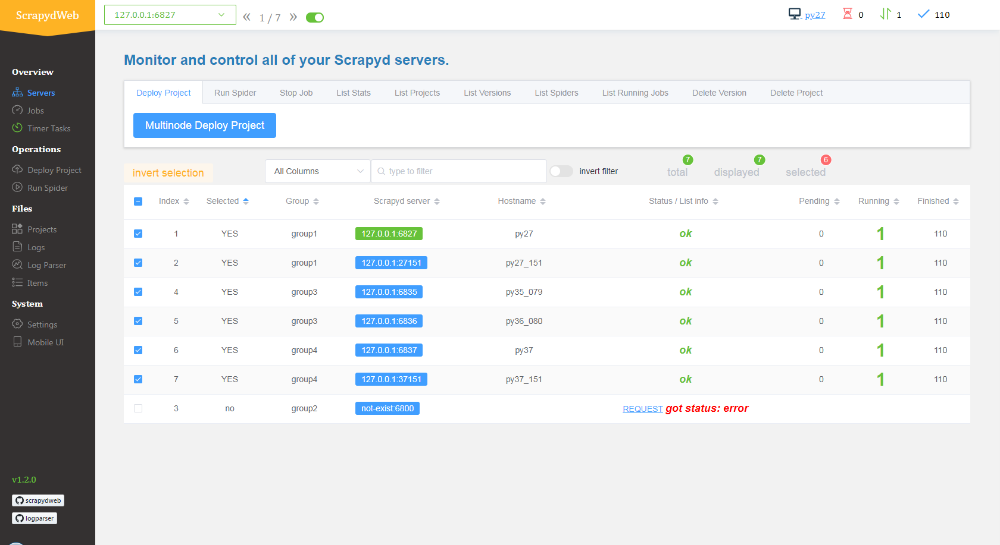

Scrapyd is an application for deploying and running Scrapy spiders. It enables you to deploy (upload) your projects and control their spiders using a JSON API

Scrapyd — это приложение (обычно работающее как демон), которое прослушивает запросы на запуск спайдеров и порождает процесс для каждого из них.

Scrapyd также запускает несколько процессов параллельно, размещая их в фиксированном количестве слотов, заданных параметрами `max_proc` и `max_proc_per_cpu`, запуская как можно больше процессов для обработки нагрузки. Помимо диспетчеризации процессов и управления ими, Scrapyd предоставляет веб-службу JSON для загрузки новых версий проекта и планирования спайдеров. Эта функция не является обязательной и может быть отключена, если вы хотите реализовать свой собственный Scrapyd. Компоненты являются подключаемыми и могут быть изменены, если вы знакомы с [[twisted-application-framework]], в которой реализован Scrapyd.

Инсталл `pip install scrapyd`

Запуск `scrapyd`

Запуск по графику

```shell
$ curl http://localhost:6800/schedule.json -d project=myproject -d spider=spider2
{"status": "ok", "jobid": "26d1b1a6d6f111e0be5c001e648c57f8"}
```

Web-интерфейс доступен тут: [localhost:6800](http://localhost:6800/)

## Deploy project

Использовать [scrapyd-client](https://github.com/scrapy/scrapyd-client)

- `scrapyd-deploy`, to deploy your project to a Scrapyd server
- `scrapyd-client`, to interact with your project once deployed

Развертывание вашего проекта на сервере Scrapyd обычно включает в себя два шага:

- Обобщение вашего проекта. Для этого потребуется установить [[setuptools]] и прописать setup.py
- Загрузка egg на сервер Scrapyd через конечную точку addversion.json

Сетап можно создать и через клиент, например так:

```shell
scrapyd-deploy --build-egg=/dev/null
```

После чего потребуется прописать `package_data` и привести файл к такому виду:

```python
from setuptools import setup, find_packages

setup(
    name         = 'project',
    version      = '1.0',
    packages     = find_packages(),
    entry_points = {'scrapy': ['settings = projectname.settings']},
    package_data = {'projectname': ['path/to/*.json']}
)
```

Деплой [делается так:](https://github.com/scrapy/scrapyd-client#deploying-a-project)

```shell
Deploying myproject-1287453519 to http://localhost:6800/addversion.json
Server response (200):
{"status": "ok", "spiders": ["spider1", "spider2"]}
```

[Подробнее тут](https://github.com/scrapy/scrapyd-client#deploying-a-project)

## [JSON-api](https://scrapyd.readthedocs.io/en/stable/api.html)

## [Config file](https://scrapyd.readthedocs.io/en/stable/config.html)

Пример

```conf
[scrapyd]
eggs_dir    = eggs
logs_dir    = logs
items_dir   =
jobs_to_keep = 5
dbs_dir     = dbs
max_proc    = 0
max_proc_per_cpu = 4
finished_to_keep = 100
poll_interval = 5.0
bind_address = 127.0.0.1
http_port   = 6800
username    =
password    =
debug       = off
runner      = scrapyd.runner
jobstorage  = scrapyd.jobstorage.MemoryJobStorage
application = scrapyd.app.application
launcher    = scrapyd.launcher.Launcher
webroot     = scrapyd.website.Root
eggstorage  = scrapyd.eggstorage.FilesystemEggStorage

[services]
schedule.json     = scrapyd.webservice.Schedule
cancel.json       = scrapyd.webservice.Cancel
addversion.json   = scrapyd.webservice.AddVersion
listprojects.json = scrapyd.webservice.ListProjects
listversions.json = scrapyd.webservice.ListVersions
listspiders.json  = scrapyd.webservice.ListSpiders
delproject.json   = scrapyd.webservice.DeleteProject
delversion.json   = scrapyd.webservice.DeleteVersion
listjobs.json     = scrapyd.webservice.ListJobs
daemonstatus.json = scrapyd.webservice.DaemonStatus
```

## Vicualization

[scrapydweb](https://github.com/my8100/scrapydweb) Web app for Scrapyd cluster management, with support for Scrapy log analysis & visualization

`pip install scrapydweb`

- Start ScrapydWeb via command `scrapydweb`. (a config file would be generated for customizing settings at the first startup.)
- Visit [127.0.0.1:5000](http://127.0.0.1:5000) (It's recommended to use Google Chrome for a better experience.)



## Python api

[python-scrapyd-api](https://github.com/djm/python-scrapyd-api) A Python wrapper for working with Scrapyd's API

Еще ссылки:

- [документация](https://scrapyd.readthedocs.io/en/stable/)
- [[scrapy]]
- [[crawlers]]
- [scrapydweb](https://github.com/my8100/scrapydweb)
- [примеры scrapydweb](https://github.com/my8100/files) [container1](https://hub.docker.com/r/chinaclark1203/scrapydweb) [container2](https://hub.docker.com/r/thecjw/scrapydweb)
- [scrapyd docker container](https://hub.docker.com/r/vimagick/scrapyd)
- [scrapyd local](https://youtu.be/PZKH5S0C8EI) youtube
- [The Complete Guide To Scrapyd: Deploy, Schedule & Run Your Scrapy Spiders](https://scrapeops.io/python-scrapy-playbook/extensions/scrapy-scrapyd-guide/)
- [The Complete Guide To ScrapydWeb, Get Setup In 3 Minutes!](https://scrapeops.io/python-scrapy-playbook/extensions/scrapydweb-guide/)
- [scrapyd-client](https://github.com/scrapy/scrapyd-client#deploying-a-project) Deploy spiders python api
- [logparser](https://github.com/my8100/logparser) A tool for parsing Scrapy log files periodically and incrementally, extending the HTTP JSON API of Scrapyd.

[//begin]: # "Autogenerated link references for markdown compatibility"
[twisted-application-framework]: twisted-application-framework "Twisted application framework"
[setuptools]: setuptools "Setuptools"
[scrapy]: scrapy "Scrapy"
[crawlers]: ../lists/crawlers "Crawlers"
[//end]: # "Autogenerated link references"