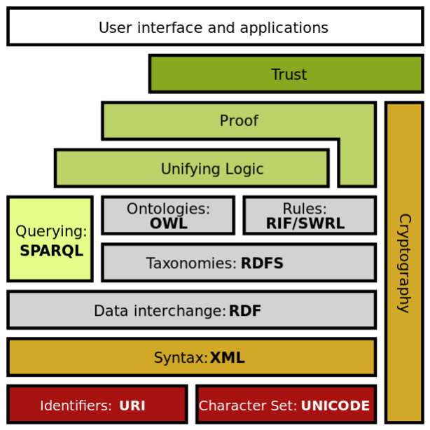

В настоящий момент концепцию семантического веба можно считать не взлетевшей, как новый всеобщий формат организации данных в интернете. Однако как компонент всемирной сети он отлично существует, примером является [[wikidata]].

Наиболее важные компоненты:

- [[rdf]] - язык, формализующий представление веба как направленного графа
- [URI](https://ru.wikipedia.org/wiki/URI) (uniform resource identiffier) или [IRI](https://ru.wikipedia.org/wiki/Internationalized_Resource_Identifier) (international resource identifier) для идентификации отдельных элементов или отношений между ними
- онтологии - RDFs (язык представления онтологий, позволяющий описывать свойства и классы RDF-ресурсов, иерархии классов и свойств, определять домены и диапазоны свойств) и [[OWL]] более выразительный язык онтологий, определяющий отношения между классами, ограничения, различные типы и характеристики свойств, а так-же задавать перечисления классов.
- [[sparql]] язык запросов
- логика и автоматические машины логического вывода (ризонеры)

Смотри еще:

- [статья на wiki](https://en.wikipedia.org/wiki/Semantic_Web)
- [небольшая презентация по КГ](https://docs.google.com/presentation/d/1Artsa47IV_dSZkz7smXyAVZQmn3xDeZRO9Z_hVklirs/edit?usp=sharing) (на основе материалов курса М.Галкина)
- [[rdf]]
- [[turtle]]
- [[owl]]
- [[knowledge-graphs]]
- [[neosematics]]
- [[neo4j]]

[//begin]: # "Autogenerated link references for markdown compatibility"
[rdf]: rdf "RDF"
[OWL]: owl "OWL ontology"
[sparql]: sparql "SPARQL"
[knowledge-graphs]: ../lists/knowledge-graphs "Knowledge graphs"
[neosematics]: neosematics "Neosematics"
[neo4j]: neo4j "Neo4j graph data base"
[//end]: # "Autogenerated link references"
[//begin]: # "Autogenerated link references for markdown compatibility"
[wikidata]: ../lists/wikidata "Wikidata"
[rdf]: rdf "RDF"
[OWL]: owl "OWL ontology"
[sparql]: sparql "SPARQL"
[rdf]: rdf "RDF"
[turtle]: turtle "Turtle for RDF"
[owl]: owl "OWL ontology"
[knowledge-graphs]: ../lists/knowledge-graphs "Knowledge graphs"
[neosematics]: neosematics "Neosematics"
[neo4j]: neo4j "Neo4j graph data base"
[//end]: # "Autogenerated link references"