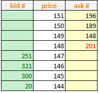
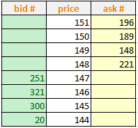

Базовые статистики [[market-stocks]]

## Order book

Двусторонний стек из заявок на покупку и продажу. Слева представлены биды (заявки на покупку), справа оферы (предложения на продажу)

Когда появляются совпадающие заявки, происходит гарантированная сделка

## Order book statistics

**bid/ask spread:**

$$BidAskSpread = BestOffer/BestBid -1$$

Например здесь:

BidAskSpread = 148/147 - 1 = 0.0068...

[другие типы спредов в wiki](https://en.wikipedia.org/wiki/Bid%E2%80%93ask_spread)

**Weighted averaged price:**

$P_{VWAP}$ Volume Weighted Average Price (средневзвешенная по объему цена);

$P_{j}P_{j}$ is price of trade $jj$ (цена сделки);

$Q_{j}Q_{j}$ is quantity of trade jj$ (количество лотов);

$jj$ это каждая отдельная сделка за выбранный период, исключая кросс-трейды и кросс-трейды корзины

В данном контексте $WAP$ опреден так:

$$ WAP = \frac{BidPrice_{1}*AskSize_{1} + AskPrice_{1}*BidSize_{1}}{BidSize_{1} + AskSize_{1}} $$

Если в двух стаканах есть предложения спроса и предложения на одном и том же уровне цен соответственно, у стакана с большим количеством предложений будет более низкая оценка акций, поскольку в стакане больше предполагаемых продавцов, а большее количество продавцов подразумевает факт увеличения предложения на рынке, что приводит к снижению стоимости акций.

В большинстве случаев в часы непрерывной торговли в книге заказов не должно быть сценария, когда заявка на покупку выше, чем предложение продажи. Другими словами, скорее всего, спрос и предложение никогда не должны **пересекаться.**

В примере выше:

$WAP$  = (177*251 + 148*251)/(251 + 221) = 156.875

## Log returns

**Как сравнить прайсы за вчера и сегодня?**

Простейший метод - посчитать разницу **price differences**. Однако простая разница не показывает степень изменеения цены. Эту проблему можнор решить, разделив разницу на стартовую цену за выбранный период - это называется **stock return**. Этот показатель демонстрирует процентное изменеение цены. Stock return всегда используется в финансах, а **log returns** предпочтителен в математическом моделировании.

$S_t$ это рыночная цена $S$ во время $t$, определенная между временем $t_1$ и $t_2$

$$
r_{t_1, t_2} = \log \left( \frac{S_{t_2}}{S_{t_1}} \right)
$$

Обычно kig return смотрится за фиксированный интервал, к примеру 10-тиминутный logreturn выглядит так $r_t = r_{t - 10 min, t}$.

Log returns предоставляет ряд преимуществ:

- адитивность через время $r_{t_1, t_2} + r_{t_2, t_3} = r_{t_1, t_3}$
- regular returns не может опускаться меньше -100%, в то время как log returns не ограничен

## Realized volatility

При торговле опционами неплохим показателем на входе модели является стандартное отклонение от log return. Стандартное отколнение будет разным для коротких и длинных интиервалов, по этой причине это значение обычно нормализируцется к годовому периоду - это называется волатильностью **volatility**.

Мы можем реализовать волатильность так: посчитать log returns последовательно через все обновления order book - это будет **realized volatility, $\sigma$,** рассчитнаая как  квадратный корень из суммы квадратов log returns.
$$
\sigma = \sqrt{\sum_{t}r_{t-1, t}^2}
$$

Здесь мы используем **WAP** как рыночную цену для расчета log returns.

В данном случае нормализация к годовому периоду не делается.

[Подробнее в wiki](https://en.wikipedia.org/wiki/Volatility_(finance))

В этом соревновании представлены 10-минутные book of data и необходимо предсказать волатильность в следующие 10 минут

[market-stocks]: market-stocks "Market stocks"
