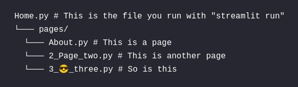

[API](https://docs.streamlit.io/en/stable/api.html)
[статья, в которой про heroku deployment](https://towardsdatascience.com/quickly-build-and-deploy-an-application-with-streamlit-988ca08c7e83)
[cheet-sheets](https://share.streamlit.io/daniellewisdl/streamlit-cheat-sheet/app.py)

## Multipage apps

`streamlit run <entrypoint file>`

Page labels in the sidebar UI are generated from filenames. They may differ from the page title set in st.set_page_config. Let's learn what constitutes a valid filename for a page, how pages are displayed in the sidebar, and how pages are sorted.

### Valid filenames for pages

- A number — if the file is prefixed with a number.
- A separator — could be _, -, space, or any combination thereof.
- A label — which is everything up to, but not including, .py.
- The extension — which is always .py.

#### How pages are displayed in the sidebar

- If there's no label, Streamlit uses the number as the label.
- In the UI, Streamlit beautifies the label by replacing _ with space.

### How pages are sorted in the sidebar

- Files that have a number appear before files without a number.
- Files are sorted based on the number (if any), followed by the title (if any).
- When files are sorted, Streamlit treats the number as an actual number rather than a string. So 03 is the same as 3.

[Подробнее](https://docs.streamlit.io/library/get-started/multipage-apps)

## RuntimeError: Data is outside [0.0, 1.0] and clamp is not set

В [st.image](https://docs.streamlit.io/library/api-reference/media/st.image) использовать `clamp=True` - фиксирует значения пикселей изображения в допустимом диапазоне ([0–255] на канал). Это имеет смысл только для изображений байтовых массивов; параметр игнорируется для URL-адресов изображений. Если это не установлено, а изображение имеет значение вне допустимого диапазона, будет выдана ошибка.

## Как создавать гриды из изображений (начиная с 1.10)

[Cсылка](https://blog.streamlit.io/introducing-new-layout-options-for-streamlit/)

Смотри еще:

- [[шаблонизаторы]]

[//begin]: # "Autogenerated link references for markdown compatibility"
[шаблонизаторы]: ../lists/шаблонизаторы "Шаблонизаторы"
[//end]: # "Autogenerated link references"