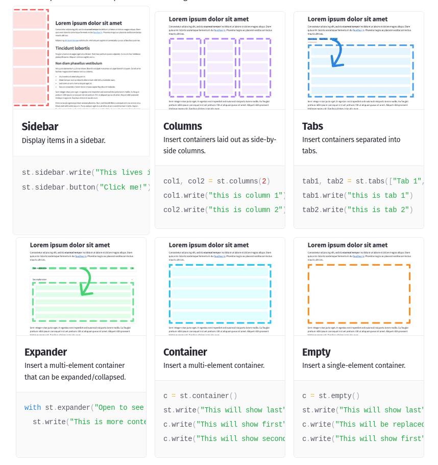

[API](https://docs.streamlit.io/en/stable/api.html)
[статья, в которой про heroku deployment](https://towardsdatascience.com/quickly-build-and-deploy-an-application-with-streamlit-988ca08c7e83)
[cheet-sheets](https://share.streamlit.io/daniellewisdl/streamlit-cheat-sheet/app.py)

## Multipage apps

`streamlit run <entrypoint file>`


Page labels in the sidebar UI are generated from filenames. They may differ from the page title set in st.set_page_config. Let's learn what constitutes a valid filename for a page, how pages are displayed in the sidebar, and how pages are sorted.

### Valid filenames for pages

- A number — if the file is prefixed with a number.
- A separator — could be _, -, space, or any combination thereof.
- A label — which is everything up to, but not including, .py.
- The extension — which is always .py.

#### How pages are displayed in the sidebar

- If there's no label, Streamlit uses the number as the label.
- In the UI, Streamlit beautifies the label by replacing _ with space.

### How pages are sorted in the sidebar

- Files that have a number appear before files without a number.
- Files are sorted based on the number (if any), followed by the title (if any).
- When files are sorted, Streamlit treats the number as an actual number rather than a string. So 03 is the same as 3.

[Подробнее](https://docs.streamlit.io/library/get-started/multipage-apps)

## RuntimeError: Data is outside [0.0, 1.0] and clamp is not set

В [st.image](https://docs.streamlit.io/library/api-reference/media/st.image) использовать `clamp=True` - фиксирует значения пикселей изображения в допустимом диапазоне ([0–255] на канал). Это имеет смысл только для изображений байтовых массивов; параметр игнорируется для URL-адресов изображений. Если это не установлено, а изображение имеет значение вне допустимого диапазона, будет выдана ошибка.

## Как создавать гриды из изображений (начиная с 1.10)

[Cсылка](https://blog.streamlit.io/introducing-new-layout-options-for-streamlit/)

## [Is it possible to create a button to reset/relaod the whole dashboard](https://discuss.streamlit.io/t/is-it-possible-to-create-a-button-to-reset-relaod-the-whole-dashboard/6615/3)

Можно использовать `st.empty`

[st.empty](https://docs.streamlit.io/library/api-reference/layout/st.empty)

## [Session State for Streamlit](https://blog.streamlit.io/session-state-for-streamlit/)

[Session State](https://docs.streamlit.io/library/api-reference/session-state)

## [Complex layouts](https://docs.streamlit.io/library/api-reference/layout)



## How to add extra lines space

```python
st.button("button 1")
st.text("")
st.button("button 2")
```

## Clear the cache for file uploder on streamlit

Очистить кеш аплоадера не получится. Засовывать в экспандер бесполезно. Экспандер запускает код даже если он свернут при рендеринге страницы. Доступа к состоянию экспандера нет. Поэтому лучшее решение - собсрать что-то на основе `st.empty()`. Загрузку же запускать обычной кнопкой.

```python
with st.form("my-form", clear_on_submit=True):
        file = st.file_uploader("FILE UPLOADER")
        submitted = st.form_submit_button("UPLOAD!")

    if submitted and file is not None:
        st.write("UPLOADED!")
        # do stuff with your uploaded file
```

[сурс](https://discuss.streamlit.io/t/clear-the-cache-for-file-uploder-on-streamlit/14304)

Смотри еще:

- [streamlit-nested-layout](https://github.com/joy13975/streamlit-nested-layout). An unofficial monkey patch that enables streamlit columns and expanders to be nested. Streamlit developers disallow this behavior by design, so you are on your own if you encounter issues using this package!
- [[python-web-apps]]
- [[plotly]]
- [[flet]]
- [[шаблонизаторы]]
- [Streamlit emoji shortcodes](https://streamlit-emoji-shortcodes-streamlit-app-gwckff.streamlit.app/)

[//begin]: # "Autogenerated link references for markdown compatibility"
[python-web-apps]: python-web-apps "Pyhon web app"
[plotly]: plotly "Plotly and dash"
[flet]: flet "Flet web apps"
[шаблонизаторы]: ../lists/шаблонизаторы "Шаблонизаторы"
[//end]: # "Autogenerated link references"