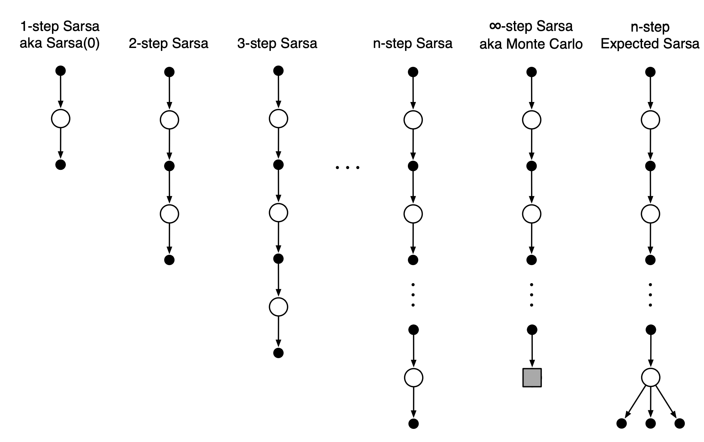
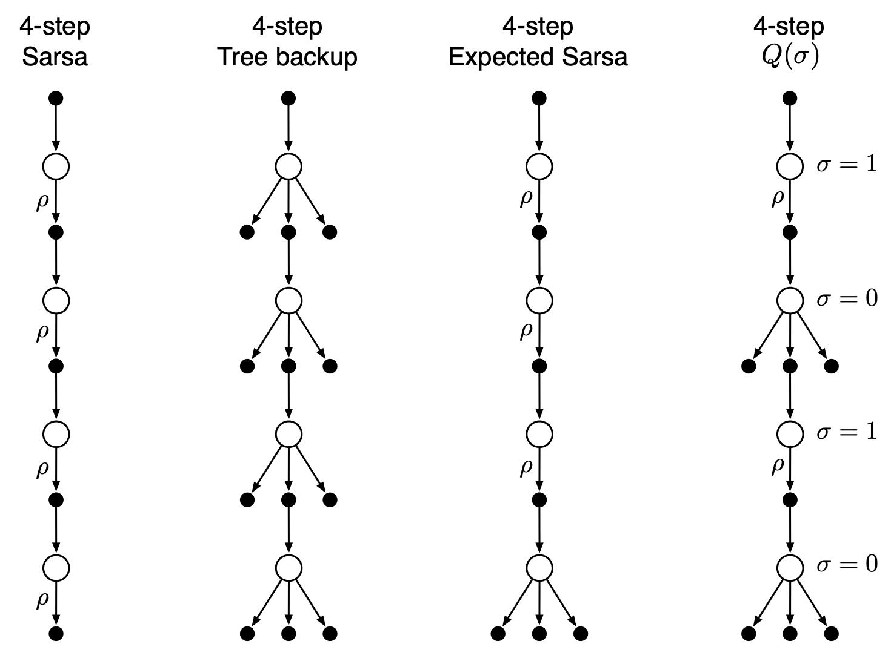

Temporal difference (TD) методы являются сочетанием [[monte-carlo]] методов и [[dynamic-programming]]. TD методы позволяют обучаться непосредственно на опыте, не требуя модели окружающей среды (как в методах Монте-Карло) и обновляют оценки, основываясь в т.ч. и на других оценках (бустрепинг) как в динамическом программировании.

Преимущества TD методов:

- не нужна модель среды
- онлайновый (полностью инкрементный) режим обучения (не нужно ждать конца эпизода)

Варианты реализации:

- SARSA - TD-управление с единой стратегией.
- Q-learning - TD-управление с разделенной стратегией - обученная функция ценности действий $$Q$$ непосредственно аппроксимирует истинную оптимальную функцию ценности, независимо от стратегии, которой следует агент. Стратегия в данном случае определяет какие пары состояние-действие посещаются и обновляются.
- Expected SARSA - TD-управление с единой стратегией, похож на Q-learning, но вместо того, чтобы максимизировать по парам состояние-действие вычисляется мат.ожидание с учетом вероятности выбора действия с учетом текущей стратегии. Алгоритм вычислительно сложнее SARSA, но устраняет дисперсию случайного выбора действия в следующий момент времени.

Данные методы чаще всего встречаются в общих случаях RL. Иногда их так-же называют одношаговыми табличными методами (смотрят на шаг вперед). Данные методы обобщаются на n-steps-bustraping.

n- шаговые методы заглядывают вперед на n вознаграждений, состоянияй и действий. В примерах ниже 4-шагоый TD (или SARSA) и 4-шаговый Q-learning. Во всех n-шаговых методах существует задержка на n временных шагов перед началом обновления, поскольку только после этого становятся известны все необходимые будущие состояния.

Недостаток увеличения числа шагов - рост числа вычислений и потребление памятим для запоминания состояний, действий, вознограждений и других переменных.

Смотри еще:

- [[reinforcement-learning]]
- [[monte-carlo]]
- [[dynamic-programming]]
- [Temporal-Difference (TD) Learning](https://towardsdatascience.com/introduction-to-reinforcement-learning-rl-part-6-temporal-difference-td-learning-2a12f0aba9f9)
- [N-step Bootstrapping](https://towardsdatascience.com/introduction-to-reinforcement-learning-rl-part-7-n-step-bootstrapping-6c3006a13265)

[//begin]: # "Autogenerated link references for markdown compatibility"
[monte-carlo]: monte-carlo "Monte-Carlo methods"
[dynamic-programming]: dynamic-programming "Dynamic programming for reinforcement-learning"
[reinforcement-learning]: ../lists/reinforcement-learning "Reinforcement learning"
[monte-carlo]: monte-carlo "Monte-Carlo methods"
[dynamic-programming]: dynamic-programming "Dynamic programming for reinforcement-learning"
[//end]: # "Autogenerated link references"
[//begin]: # "Autogenerated link references for markdown compatibility"
[monte-carlo]: monte-carlo "Monte-Carlo methods"
[dynamic-programming]: dynamic-programming "Dynamic programming for reinforcement-learning"
[reinforcement-learning]: ../lists/reinforcement-learning "Reinforcement learning"
[monte-carlo]: monte-carlo "Monte-Carlo methods"
[dynamic-programming]: dynamic-programming "Dynamic programming for reinforcement-learning"
[//end]: # "Autogenerated link references"