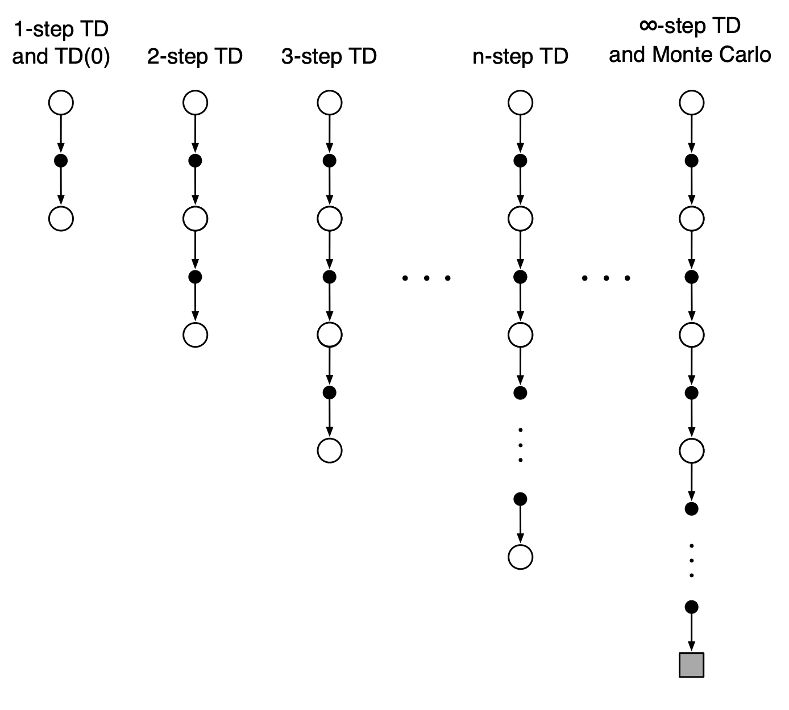

Temporal difference (TD) методы являются сочетанием [[monte-carlo]] методов и [[dynamic-programming]]. TD методы позволяют обучаться непосредственно на опыте, не требуя модели окружающей среды (как в методах Монте-Карло) и обновляют оценки, основываясь в т.ч. и на других оценках (бустрепинг) как в динамическом программировании.

Преимущества TD методов:

- не нужна модель среды
- онлайновый (полностью инкрементный) режим обучения (не нужно ждать конца эпизода)

## q-learning

- Q-learning - TD-управление с разделенной стратегией - обученная функция ценности действий $$Q$$ непосредственно аппроксимирует истинную оптимальную функцию ценности, независимо от стратегии, которой следует агент. Стратегия в данном случае определяет какие пары состояние-действие посещаются и обновляются.
- SARSA - в отличае от Q-learning sarsa усредняет ожидаемую доходность по всем прогонам (это более общий случай TD метода)
- Expected SARSA - вместо того, чтобы максимизировать по парам состояние-действие вычисляется мат.ожидание с учетом вероятности выбора действия с учетом текущей стратегии. Алгоритм вычислительно сложнее SARSA, но устраняет дисперсию случайного выбора действия в следующий момент времени.

Сравнение [на примере Gridworld](https://rl-book.com/learn/value_methods/q_learning_sarsa/):

Развитие q-learning:

- двойное Q-обучение решает проблему статистических аномалий, когда в начале обучения алгоритм разведал неоптимальное решение, но в силу его высокой ценности не может обучаться дальше.
- отложенное Q-обучение буферизирует  вознаграждение вместо обновления функции ценности при каждом посещении пары состояниедействие. После n посещений буфер освобождается, а функция ценности обновляется однократно. Это позволяет убрать шум в оценке ожидаемой доходности.

[Сравнение](https://rl-book.com/learn/value_methods/double_delayed_q_learning/):

Данные методы чаще всего встречаются в общих случаях RL. Иногда их так-же называют одношаговыми табличными методами (смотрят на шаг вперед). Данные методы обобщаются на n-steps-bustraping.

## n-steps-bustraping

n- шаговые методы заглядывают вперед на n вознаграждений, состоянияй и действий. В примерах ниже 4-шагоый TD (или SARSA) и 4-шаговый Q-learning. Во всех n-шаговых методах существует задержка на n временных шагов перед началом обновления, поскольку только после этого становятся известны все необходимые будущие состояния.

[Сравнение для SARSA](https://rl-book.com/learn/value_methods/n_step/):

Недостаток увеличения числа шагов - рост числа вычислений и потребление памяти для запоминания состояний, действий, вознограждений и других переменных. Кроме того, приходится ждать, когда будут выполнены все n шагов, прежде чем появится возможность обновления. Одно из решений этой проблемы - смотреть не в "будущее" (что и заставляет ожидать выполнения всех шагов), а в прошлое. Это реализуется в **алгоритмах с трассировкой соответствия**, к примеру в SARSA($$\lambda$$) - алгоритм запоминает какие пары состояние-действие были затронуты им при движении по тракетории в прошлом и учитывает этот вес при оценке TD-ошибки на каждой итерации. Иными словами, алгоритм не будет сильно обновлять пары, обследованные очень давно и отдаст предпочтение недавним посещениям.

Лямбда здесь - это гиперпараметр. высокие значения будут означать, что даже очень старые пары будут обновляться (даже если не имели большого значения), а низкие, что будут обновляться только самые недавние. [Сравнение](https://rl-book.com/learn/value_methods/eligibility_traces/):

Недостаток SARSA($$\lambda$$) - дополнительные вычислительные затраты и память (нужен еще один буфер для трассировки)

Развитие SARSA($$\lambda$$):

- алгоритм $$Q(\lambda)$$ реализует argmax при обновлении TD-ошибки - это сбрасывает трассировку, когда алгоритм натыкается на первое же нежелательное действие. В результате мы не наказываем алгоритм за предыдущие шаги как за неправильные
- нечеткий $$Q(\lambda)$$ применяет правила, на основе которых сбрасывается трассировка
- fast q-learning экспоненциально уменьшает сумму предыдущего и текущего обновлений TD, что приводит к усреднению по одношаговым TD.

Смотри еще:

- [[reinforcement-learning]]
- [[monte-carlo]]
- [[dynamic-programming]]
- [Temporal-Difference (TD) Learning](https://towardsdatascience.com/introduction-to-reinforcement-learning-rl-part-6-temporal-difference-td-learning-2a12f0aba9f9)
- [N-step Bootstrapping](https://towardsdatascience.com/introduction-to-reinforcement-learning-rl-part-7-n-step-bootstrapping-6c3006a13265)
- [[deep-q-learning]]
- [[another-and-nonstandart-methods-of-reinforcement-learning]]

[//begin]: # "Autogenerated link references for markdown compatibility"
[monte-carlo]: monte-carlo "Monte-Carlo methods"
[dynamic-programming]: dynamic-programming "Dynamic programming for reinforcement-learning"
[reinforcement-learning]: ../lists/reinforcement-learning "Reinforcement learning"
[monte-carlo]: monte-carlo "Monte-Carlo methods"
[dynamic-programming]: dynamic-programming "Dynamic programming for reinforcement-learning"
[deep-q-learning]: deep-q-learning "Deep Q-learning"
[another-and-nonstandart-methods-of-reinforcement-learning]: another-and-nonstandart-methods-of-reinforcement-learning "another and nonstandart methods of reinforcemebt learning"
[//end]: # "Autogenerated link references"
[//begin]: # "Autogenerated link references for markdown compatibility"
[monte-carlo]: monte-carlo "Monte-Carlo methods"
[dynamic-programming]: dynamic-programming "Dynamic programming for reinforcement-learning"
[reinforcement-learning]: ../lists/reinforcement-learning "Reinforcement learning"
[monte-carlo]: monte-carlo "Monte-Carlo methods"
[dynamic-programming]: dynamic-programming "Dynamic programming for reinforcement-learning"
[deep-q-learning]: deep-q-learning "Deep Q-learning"
[another-and-nonstandart-methods-of-reinforcement-learning]: another-and-nonstandart-methods-of-reinforcement-learning "another and nonstandart methods of reinforcemebt learning"
[//end]: # "Autogenerated link references"