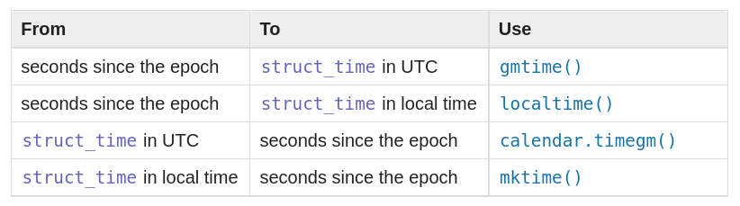

Обеспечивает доступ к нескольким типов часов.

- `time()` возвращает системное время
- `monotomic()` возвращает истекшее время вне зависимости от системного
- `perf_counter()` позволяет тестировать производительность
- `clock()` предоставляет процессорное время
- `process_time()` комбинирует системное и процессорное время

В python операции со значениями времени привязаны к реализации лежащих в оснвое библотек на C. Для `time()` используется понятие "эпохи", началом которой является для unix систем 1 января 1970 года

```python
>>> import time

>>> print(time.time())
1638713541.8427455
```

`ctime()` выводит человекочитаемый формат

```python
>>> import time

>>> print(time.ctime())
'Sun Dec  5 16:13:36 2021'
```

Время представляется в трех формиатах:

- seconds since the epoch
- struct_time in local time
- struct_time in UTC

Для перевода между форматами можно исаользовать эту таблицу:



Все компоненты struct формата времени доступны через объектное АПИ:

```python
>>> s = time.gmtime()
>>> print(s.tm_year)
>>> print(s.tm_mon)
>>> print(s.tm_mday)
>>> print(s.tm_hour)
>>> print(s.tm_min)
>>> print(s.tm_sec)
>>> print(s.tm_wday)
>>> print(s.tm_yday)
>>> print(s.tm_isdst)
```

Функция `tzet()` позволяет [работать с часовыми поясами](https://docs.python.org/3/library/time.html#time.tzset).

`strptime()` и `strftime()` обеспечивают преобразование [из стакт в строки](https://docs.python.org/3/library/time.html#time.strftime) и [наоборот](https://docs.python.org/3/library/time.html#time.strptime).

Полный набор методов и констант смотри в [Документации](https://docs.python.org/3/library/time.html)

- [[date-and-time-in-python]]
- [[datetime]]
- [[calendar]]
- [[dateutil]]
- [[pytz]]


[date-and-time-in-python]: date-and-time-in-python "Date and time in python"
[datetime]: datetime "Datetime"
[calendar]: calendar "Calendar"
[dateutil]: dateutil "Dateutil"
[pytz]: pytz "Pytz"
