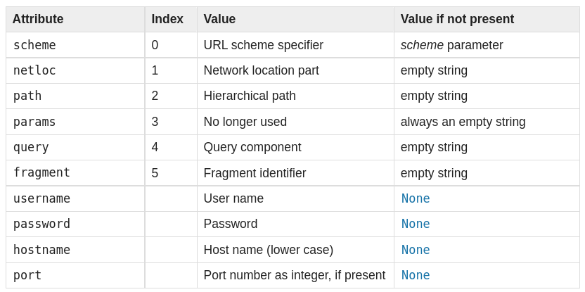

Модуль определяет стандартный интерфейс для разбиения строк URL на компоненты, для объединения компонентов обратно в строку URL и для преобразования «относительного URL» в абсолютный URL-адрес, заданный «базовым URL-адресом». Поддерживаются: file, ftp, gopher, hdl, http, https, imap, mailto, mms, news, nntp, prospero, rsync, rtsp, rtspu, sftp, shttp, sip, sips, snews, svn, svn+ssh, telnet, wais.wswss

## [Парсинг](https://docs.python.org/3/library/urllib.parse.html#url-parsing)

`urllib.parse.urlparse(urlstring, scheme='', allow_fragments=True)` - преобразует урл в именованный кортеж из  шести компонентов `scheme://netloc/path;parameters?query#fragment`. Каждый эелемент - строка (возможно пустая). Разделители в результат не добавляются (за исключением начального слешка в пути, если он есть). Компоненты не разбиваются на более мелкие части (например по `%`).

```python
>>> from urllib.parse import urlparse
>>> urlparse("scheme://netloc/path;parameters?query#fragment")
ParseResult(scheme='scheme', netloc='netloc', path='/path;parameters', params='',
            query='query', fragment='fragment')
>>> o = urlparse("http://docs.python.org:80/3/library/urllib.parse.html?"
...              "highlight=params#url-parsing")
>>> o
ParseResult(scheme='http', netloc='docs.python.org:80',
            path='/3/library/urllib.parse.html', params='',
            query='highlight=params', fragment='url-parsing')
>>> o.scheme
'http'
>>> o.netloc
'docs.python.org:80'
>>> o.hostname
'docs.python.org'
>>> o.port
80
>>> o._replace(fragment="").geturl()
'http://docs.python.org:80/3/library/urllib.parse.html?highlight=params'
```

Результат:



Строки query можно разобрать с помощью методов `urllib.parse.parse_qs` и `urllib.parse.parse_qsl`. [Смотри тут](https://docs.python.org/3/library/urllib.parse.html#urllib.parse.parse_qs)

`urllib.parse.urlunparse(parts)` возвращает строку, собранную из кортежа urlparse()

`urllib.parse.urlsplit( urlstring , схема = '' , allow_fragments = True )` - аналогично urlparse(), но параметры не отделяются от строки path. `urllib.parse.urlunsplit(parts)` работает аналогично urlunparse()

`urllib.parse.urljoin(base, url, allow_fragments=True)` - создает новый абсолютный адрес, объединяя url с частью base, отсутствующей в url. При этом, если изменяемый адрес уже является абсолютным - изменения внесены не будут.

```python
>>> from urllib.parse import urljoin

>>> urljoin('http://www.cwi.nl/%7Eguido/Python.html', 'FAQ.html')
'http://www.cwi.nl/%7Eguido/FAQ.html'
```

``rllib.parse.urldefrag(url)` - разделяет урл на основную строку и фрагмент.

`urllib.parse.unwrap(url)` извлекает урл из обернутого прдставления, например таких `<URL:scheme://host/path>', '<scheme://host/path>`, `URL:scheme://host/path`, `scheme://host/path`

## [Parsing ASCII Encoded Bytes](https://docs.python.org/3/library/urllib.parse.html#parsing-ascii-encoded-bytes)

## [Structured Parse Results](https://docs.python.org/3/library/urllib.parse.html#structured-parse-results)

urlparse предоставлет доп.методы для объектов именованных кортежей, полученных при парсинге.

`urllib.parse.SplitResult.geturl()` - возвращает строку урла, объединенную из кортежа. Он может отличаться от исходного (регистр и удаление пустых компонентов)

```python
>>> from urllib.parse import urlsplit
>>> url = 'HTTP://www.Python.org/doc/#'
>>> r1 = urlsplit(url)
>>> r1.geturl()
'http://www.Python.org/doc/'
>>> r2 = urlsplit(r1.geturl())
>>> r2.geturl()
'http://www.Python.org/doc/'
```

[смотри другие методы тут](https://docs.python.org/3/library/urllib.parse.html#structured-parse-results)

## [URL Quoting](https://docs.python.org/3/library/urllib.parse.html#url-quoting)

Предоставлет безопасное преобразование данных, которые планируется использовать в качестве компонентов урла, за счет размещения в кавычки специальнех символов или кодирования текста, отличного от ASCII. Кроме того предоставлены методы для реверса этоих операций

Смотри еще:

- [документация](https://docs.python.org/3/library/urllib.parse.html)
- [как получать данные из интернет-ресурсов с помощью urlib](https://docs.python.org/3/howto/urllib2.html#urllib-howto)
- [примеры обработки адресов и запросов](https://docs.python.org/3/library/urllib.request.html#examples)
- [[python-standart-library]]
- [[crawlers]]
- [[scrapy]]
- [[parsing-robots-txt-with-scrapy]]
- [[parsing-sitemap-with-scrapy]]

[//begin]: # "Autogenerated link references for markdown compatibility"
[python-standart-library]: ..%2Flists%2Fpython-standart-library "Стандартная библиотека python и полезные ресурсы"
[crawlers]: ..%2Flists%2Fcrawlers "Crawlers"
[scrapy]: scrapy "Scrapy"
[parsing-robots-txt-with-scrapy]: parsing-robots-txt-with-scrapy "Parsing robots txt with scrapy"
[parsing-sitemap-with-scrapy]: parsing-sitemap-with-scrapy "Parsing sitemap with scrapy"
[//end]: # "Autogenerated link references"