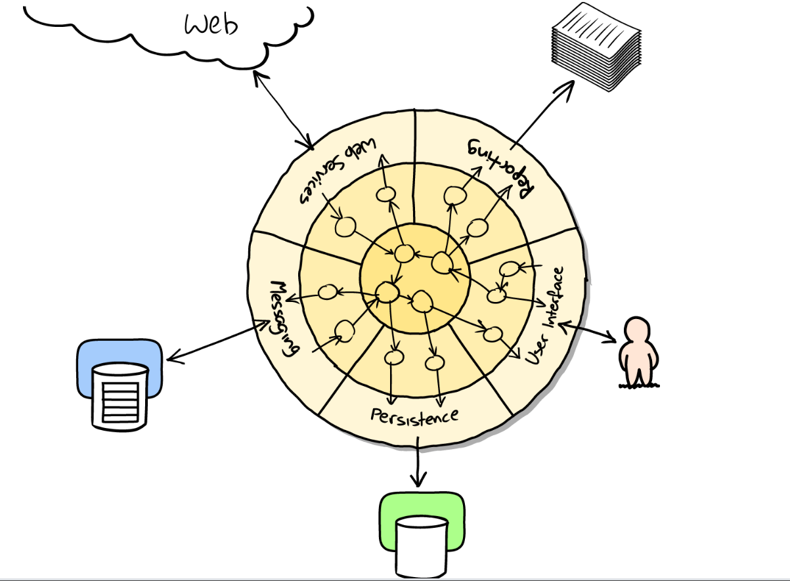

Интеграционные или комплексные тесты проверяют, что программный код, которым вы управляете, правильно интегрирован в некую внешнюю систему, которой вы не управляете. Это их отличие от [[изолированные-тесты]]

Интеграционный тест проверяет интеграцию в одну внешнюю систему. [[системные-тесты]] интеграцию с нескольикими.

Интеграционные тесты часто реализуются на уровне [[приемочные-тесты]]. Такие тесты медленные, их стараются выполнять реже, что может приводить к возникновению неожиданных дефектов.

Интеграционные тесты проявляют полезность на гарницах системы. Основная идея - сократить взаимодействие между несвязанными компонентами приложения. Ситема называется [[порты-и-адаптеры]] или чистая или шестиуголная система.

[изолированные-тесты]: %D0%B8%D0%B7%D0%BE%D0%BB%D0%B8%D1%80%D0%BE%D0%B2%D0%B0%D0%BD%D0%BD%D1%8B%D0%B5-%D1%82%D0%B5%D1%81%D1%82%D1%8B "Изолированные тесты"
[системные-тесты]: %D1%81%D0%B8%D1%81%D1%82%D0%B5%D0%BC%D0%BD%D1%8B%D0%B5-%D1%82%D0%B5%D1%81%D1%82%D1%8B "Системные тесты"
[приемочные-тесты]: %D0%BF%D1%80%D0%B8%D0%B5%D0%BC%D0%BE%D1%87%D0%BD%D1%8B%D0%B5-%D1%82%D0%B5%D1%81%D1%82%D1%8B "Приемочные тесты"
