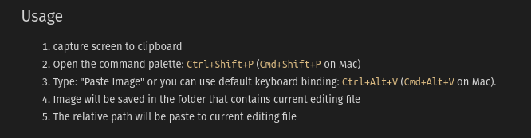

# Как работать с foam

[Рецепты](https://foambubble.github.io/foam/)

[[graph-visualization]] визуализация графов `Foam: Show Graph`. В статье рассказано про то, как кастомизирвоат ьвнешний вид визуализации.

[[daily-notes]] создание и работа с ежедневными заметками. `alt+d` создает заметку с текущей датой в папке journal. Другой вариант `Foam › Open Daily Note: On Startup` Там же про настройки выхода при создании.

[[note-properties]] устанавливают свойства карточки.

```markdown
---
title: заголовок
type: feature
keywords: hello world
---
```

`title` и то, как эта штука будет показана в графе. `type` позволяет задать стили для графа. `tags` - добавляет теги.

[[note-templates]] создание шаблонов `Foam: Create New Note from Template`

[[paste-images-from-clipboard]] добавлять картинки скринштом через `cmd+alt+v`. Будет размещено в /attachments



[[get-started-with-vscode]]

[[use-keyboard-shortcuts-for-editing]]

[//begin]: # "Autogenerated link references for markdown compatibility"
[graph-visualization]: ../docs/features/graph-visualization "Graph Visualization"
[daily-notes]: ../docs/features/daily-notes "Daily Notes"
[note-properties]: ../docs/features/note-properties "Note Properties"
[note-templates]: ../docs/features/note-templates "Note Templates"
[paste-images-from-clipboard]: paste-images-from-clipboard "Paste Images from Clipboard"
[get-started-with-vscode]: get-started-with-vscode "Getting started with VsCode"
[use-keyboard-shortcuts-for-editing]: use-keyboard-shortcuts-for-editing "Use Keyboard Shortcuts for Editing"
[//end]: # "Autogenerated link references"