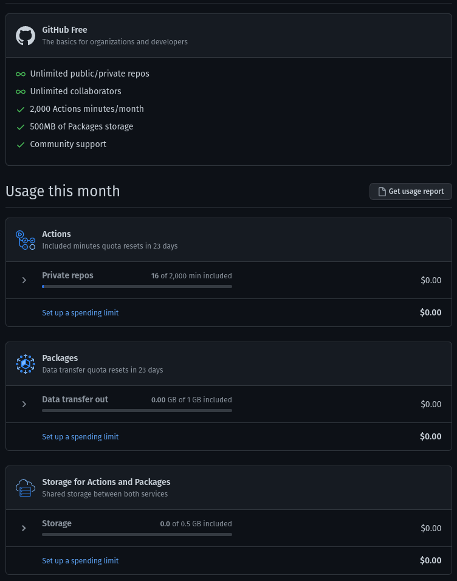

Все написанное в данной заметке относится к платным таривам github и [[digital-ocean]]

[[github-packages]] шарит серверное пространство с [[github-action]]. Это означает, что если мы пишем какие-то логи или создаем другие артефакты во время выполнения экшенов - это будет посчитано под исковму пространству пакетов. Частично решить это можно настроив удаление артефактов [для экшенов глобально](https://github.com/actions/upload-artifact/issues/161) или локально для каждого воркфлоу.

Есть проблема с определением размера самих пакетов. В админке на страницах пакетов это не выведено. По идее должно выводиться [здесь](https://docs.github.com/en/billing/managing-billing-for-github-packages/viewing-your-github-packages-usage) для проекта или пользователя:



Как видно на скриншоте, в данном случае у меня пусто, хотя на самом деле в проекте создано три пакета общим размером около 1GB. В чем проблема - пока не ясно.

Надо иметь ввиду, что помимо диского пространства отдельно выставляется лимит на трансфер даты за пределы гитхаба. И эти лимиты довольно скромные - для Team тарифа всего 50Gb. Если не выставлены лимиты на полату, по истечению месяца будет дончисляться дополнительная плата. Как выставлять лимиты - [тут](https://docs.github.com/en/billing/managing-billing-for-github-packages/viewing-your-github-packages-usage). Ы целом про биллинг пакетов [тут](https://docs.github.com/en/billing/managing-billing-for-github-packages/about-billing-for-github-packages).

У [[digital-ocean]] проблем с трансфером нет (по крайней мере тарифы пока позволяют [делать трансфер в интернет бесплатно](https://docs.digitalocean.com/products/container-registry/). Правда тут нет полной ясности - на лендинге регистри пишут, что [трансфер наружу залимичен](https://www.digitalocean.com/products/container-registry/) 5-ю гигами.

Если использовать [[digital-ocean]] как регистри для дроплетов DO, тор в принципе трансфера наружу не будет. Если источником пакетов использовать github, то расходы будут только на сборку в [[github-action]], соответствнно получается, что github для небольшого проекта можно сделать бесплатный, на DO использовать Basic [[digital-ocean-container-registry]] без трансфера наружу. Данные из регистри поставлять на дроплет DO.

Как устроен Bandwidth Billing на [[digital-ocean]] можно прочитать [тут](https://docs.digitalocean.com/products/billing/bandwidth/)

## Size of github repositories

Еще одно ограничение - размер репозиториев. Maximum file size is 100MB. Maximum repository size is 10GB. Это на текущий момент. Размер каждого репозитория для аккаунта можно [посмотреть так](https://github.com/settings/repositories). Подробнее о лимитах в этом контексте читай на этом [оверфло](https://stackoverflow.com/questions/38768454/repository-size-limits-for-github-com)

## Про build и push на github pacjages

Несколько готовых экшенов:

- [build-push-action](https://github.com/docker/build-push-action)
- [push-to-registry](https://github.com/redhat-actions/push-to-registry)

Оба решения подходят для пуша в регистри, не только на гитхаб.

[Publishing and installing a package with GitHub Actions](https://docs.github.com/en/packages/managing-github-packages-using-github-actions-workflows/publishing-and-installing-a-package-with-github-actions) дока самого гитхаба.

[Publishing Docker images](https://docs.github.com/en/actions/guides/publishing-docker-images) - еще описание.

[Working with the Container registry](https://docs.github.com/en/packages/working-with-a-github-packages-registry/working-with-the-container-registry) - описание того, как работать с [[github-packages]]. [Пример проблемы с объяснением как надо написать экшен](https://github.com/docker/build-push-action/issues/127).

[login-action](https://github.com/docker/login-action) - экшен, который логинит к докер регистри (сейчасgithub packages)

```yml
- name: Log in to the Github Package registry
uses: docker/login-action@v1
with:
    registry: ${{ env.REGISTRY }}
    username: ${{ github.actor }}
    password: ${{ secrets.GITHUB_TOKEN }}
```

[Подробнее примеры аутентификации в воркфло](https://docs.github.com/en/actions/reference/authentication-in-a-workflow)

[Тут как законнектить пакеты к репозиторию](https://docs.github.com/en/packages/learn-github-packages/connecting-a-repository-to-a-package)

[github-action для деплоя с github packages на do](https://www.digitalocean.com/community/questions/github-action-to-deploy-docker-image-from-github-packages)

## Docker error: invalid reference format: repository name must be lowercase

Это можно словить, к примеру, в [[docker-compose]]. Часто такая ошибка возникает, когда используются недоспусчтимые символы, неверный реигстр или команда собрана некорректно, что мешает ее парсингу. Проблема объясянется [тут](https://stackoverflow.com/questions/48522615/docker-error-invalid-reference-format-repository-name-must-be-lowercase).

[//begin]: # "Autogenerated link references for markdown compatibility"
[digital-ocean]: ..%2Flists%2Fdigital-ocean "Digital ocean"
[github-packages]: ..%2Fnotes%2Fgithub-packages "Github packages"
[github-action]: ..%2Fnotes%2Fgithub-action "Githunb action"
[digital-ocean-container-registry]: ..%2Fnotes%2Fdigital-ocean-container-registry "Digital ocean container registry"
[docker-compose]: ..%2Fnotes%2Fdocker-compose "Docker compose"
[//end]: # "Autogenerated link references"