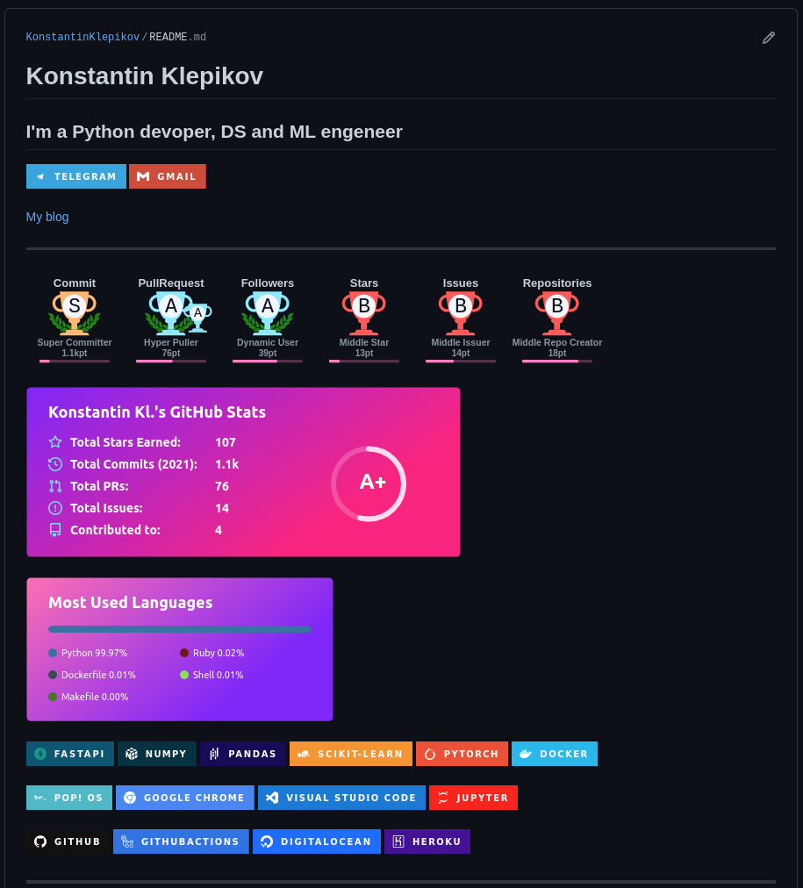

Все очень просто - для начала необходимо создать репозиторий с таким-же именем. как и персональная страница. Репозиторий необходимо сделать публичным - тогда README.md данного репозитория отобразится на морде персональной гитхаб-страницы.

Кастомные виджеты можно подвесить благодаря разным умельцам. Например так:

- [github-readme-stats](https://github.com/anuraghazra/github-readme-stats)
- [github-profile-trophy](https://github.com/ryo-ma/github-profile-trophy)

Можно использовать беджики, например вот такие: [markdown-badges](https://github.com/Ileriayo/markdown-badges). Или [вот список](https://gist.github.com/rxaviers/7360908) поддерживаэмых эмоджи.

Примеры разных реализаций в readme можно [посмотреть тут](https://github.com/abhisheknaiidu/awesome-github-profile-readme). Некоторые штуки можно реализовать через workflow и [[github-action]]

Пример моей страницы

[//begin]: # "Autogenerated link references for markdown compatibility"
[github-action]: ../notes/github-action "Githunb action"
[//end]: # "Autogenerated link references"