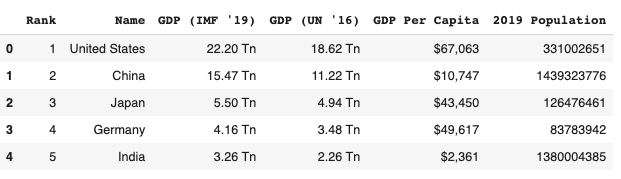

# Немного трюков с python: работа с csv, парсинг html и другое

В этой заметке:

1. Как проверить, что выбранная папка пустая
2. Релятивный импорт в jupoyter notebook
3. Как найти разницу между двумя датафреймами pandas (один фрейм явлется сабсетом другого)
4. Удаление строк в .csv
5. Как сконкатенировать два csv файла
6. Менеджер контекста для webdriver selenium
7. Как изменить порядок колонок датафрейма pandas
8. Как спарсить таблицы из html-документа
9. Как обрезать пробелы и переносы строк с двух коноцов строки
10. Как в BeautifulSoup проверить, что выбранная строка является определенным тегом

## Как проверить, что выбранная папка пустая

```python
import os
if not os.listdir('/your/path'):
    print("Directory is empty")
else:    
    print("Directory is not empty")
```

Папка так-же может отсутствовать, есть смысл проверять и это. Ссылка [на стаковерфло](https://stackoverflow.com/a/59050548/15966204)

Обычно проверка бывает актуальна для удаления контента папки перед установкой нового содержимого (напирмем для успешного теста нам надо, что-бы нан начало теста папка была пустой). Удалять можно так:

```python
import os, shutil
folder = '/path/to/folder'
for filename in os.listdir(folder):
    file_path = os.path.join(folder, filename)
    try:
        if os.path.isfile(file_path) or os.path.islink(file_path):
            os.unlink(file_path)
        elif os.path.isdir(file_path):
            shutil.rmtree(file_path)
    except Exception as e:
        print('Failed to delete %s. Reason: %s' % (file_path, e))
```

В данном примере мы делаем дополнительные проверки на случай, если в папке подпапки. В простом варианте достаточно пройти по всем файлам. [Ссылка на стаковерфло](https://stackoverflow.com/a/185941/15966204)

## Релятивный импорт в jupyter notebook

В блокнотах jupyter наблюдаются проблемы с ипортом. Импорты можно прописать в `sys.path`. Пример

```shell
 dir_1
 ├── functions.py
 └── dir_2
     └── code.ipynb
```

```python
import os, sys
dir2 = os.path.abspath('')
dir1 = os.path.dirname(dir2)
if not dir1 in sys.path: sys.path.append(dir1)
from functions import some_function
```

[ссылка на стакоферфло](https://stackoverflow.com/q/61058798/15966204)

## Как найти разницу между двумя датафреймами [[pandas]] (один фрейм явлется сабсетом другого)

Это бывает полезно, когда мы получили выборку из фрейма, произвели манипуляции над ней и, если все прошло учпешно, теперь хотим отбросить эти данные из сходного фрейма.

```python
pd.concat([df1,df2]).drop_duplicates(keep=False)
```

Могут возникнуть ситуации, когда в каждом фрейме есть дубликаты. Тогда этот метод может показать неожиданные результаты. [Читай дальше](https://stackoverflow.com/a/48647840/15966204)

## Как изменить порядок колонок датафрейма [[pandas]]

Все просто - получаем список названий колонок, меняем порядок как нужно, передаем датафрейму

```python
cols = df.columns.tolist()

# do something with cols

df = df[cols]
```

## Удаление строк в .csv

```python
import csv
with open('first.csv', 'rb') as inp, open('first_edit.csv', 'wb') as out:
    writer = csv.writer(out)
    for row in csv.reader(inp):
        if row[2] != "0":
            writer.writerow(row)
```

Если нужно добавлять новые строки к уже заполненному файлу, можно открыть в режиме `a`. [Сслыка](https://stackoverflow.com/a/29725946/15966204)

## Как сконкатенировать два .csv файла

```python
file1 = open("sample1.csv", "a")
file2 = open("sample2.csv", "r")

for line in file2:
   file1.write(line)

file1.close()
file2.close()
```

Ествтественно это лучше сделать через менеджер контекста

## Менеджер контекста для webdriver selenium

Задача ни чем не отличается от стандарта

```python
from selenium import webdriver

class WebDriver:
    def __init__(self, driver):
        self.driver = driver

    def __enter__(self):
        return self.driver

    def __exit__(self, exc_type, exc_val, exc_tb):
        self.driver.quit()


with WebDriver(webdriver.Chrome()) as wd:
    wd.get('https://stackoverflow.com/questions/')
    print(wd.page_source)
```

[ссылка](https://stackoverflow.com/a/48630668/15966204)

## Как спарсить таблицы из html-документа

Можно попробовать написать свой парсер, а можно воспользоваться готовым `pandas.read_html`

```python
import pandas as pd
import requests

url = "https://worldpopulationreview.com/countries/countries-by-gdp/#worldCountries"

r = requests.get(url)
df_list = pd.read_html(r.text) # this parses all the tables in webpages to a list
df = df_list[0]
df.head()
```



[ссылка](https://stackoverflow.com/questions/23377533/python-beautifulsoup-parsing-table)

## Как обрезать пробелы и переносы строк с двух коноцов строки

```python
s = s.strip(' \t\n\r').lstrip(' \t\n\r')
```

Еще [немного полезных примеров](https://stackoverflow.com/a/1185529/15966204)

## Как в BeautifulSoup проверить, что выбранная строка является определенным тегом

На самом деле методов встроенных нет, поэтому так:

```python
if element.name == 'div':
    ...
```

[[python-standart-library]]

Смотри так-же:

- [[python-filesystem]]
- [[selenium]]

[//begin]: # "Autogenerated link references for markdown compatibility"
[pandas]: ../notes/pandas "Pandas"
[pandas]: ../notes/pandas "Pandas"
[python-standart-library]: ../lists/python-standart-library "Стандартная библиотека python и полезные ресурсы"
[python-filesystem]: ../notes/python-filesystem "Работа с файлами"
[selenium]: ../notes/selenium "Selenium"
[//end]: # "Autogenerated link references"