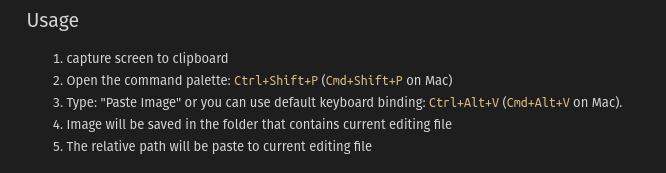

# Моя база знаний

```vscode
Foam: Show Graph
```

```vscode
Foam: Create New Note from Template
```

`alt+d` создает ежедневную заметку

`alt+с` пометить флажок как прочитанный или снять флаг

`ctrl+b` сделать болдом

`ctrl+i` италик

`ctrl+alt+v` вставка картинок из буфера

Создание ссылок:

1. copy the following text: https://google.com
2. select me and paste
3. [select me and paste](https://google.com)


